# Hardware candidate diagrams

Generated deterministically from the request YAML. This is a structural view, not a hardware correctness or performance verdict.

**ILLUSTRATIVE: not an evaluated hardware design.**

```yaml
contract_version: draft-0.2
record_kind: illustrative
kernel_id: sparta-sort-peter-example-1
input_ref: examples/sparta-sort.input.yaml
input_revision: peter-clarification-2026-09-22
catalog_ref: null
catalog_revision: null
source_file: sparta-sort.hardware-request.yaml
source_sha256: f8aae49cb96dfa97ed5341ce5944ced6ff63e1e414c48b1864fc477c10b722b5
```

## Workload context

```yaml
benchmark: Sparta
function: sort()
reported_pattern: A.B[A.C[i]]
reported_update: a[i]++
reported_data: OnePart struct; B and C are integer arrays
reported_iterations_per_call: 19471976073
reported_iteration_set_repetitions: 50
bottleneck: memory_bound_reported_not_measured_here
source_bindings: unresolved
```

## Interpretation notes

```yaml
- Peter supplied the workload facts; the candidate sketches were authored locally
  for the diagram demo.
- The sketches elaborate the two conditional families in examples/sparta-sort.output.yaml.
- Block partitions and port names are illustrative, not recovered from hardware papers
  or implementations.
- CPU execution retains the increment; neither sketch claims to execute RMW in an
  accelerator.
- Types, widths, physical placement, completion protocols, and legal parameter ranges
  need catalog/source evidence.
- Only listed signal connections are drawn; behavior within blocks is described, not
  inferred as extra wiring.
- These diagrams make no speedup, correctness, or implementation-readiness claim.
```

Blue ports face the host; green ports face memory; gray ports are internal; amber ports have an unknown role. Dashed boxes are explanatory annotations, not additional hardware components. Only connections explicitly present in the YAML are drawn. Unconnected ports remain visible.

Open values remain OPEN. Read the candidate details for constraints, behavior, and unresolved conditions.

## Candidate 1

[Mermaid source](candidate-01.mmd)



### Full candidate details

```yaml
id: sparta-sort-prefetch-1
status: conditional
target_statement_ids: []
target_access_ids:
- indirect-rmw-1
rationale: Explore indirect prefetching while the CPU keeps executing the original
  increments. Whether the access stream is predictable enough remains unknown.
evidence_refs:
- peter-example
- peter-clarification-2026-09-22
applicability_conditions:
- A concrete prefetch design must recognize the actual access/index relationship.
- Speculation and memory behavior must preserve the original CPU update semantics.
unresolved_requirements:
- Actual source bindings, dependencies, and index behavior.
- Compatible catalog components, placement, and performance evidence.
hardware:
  blocks:
  - id: indirect-pattern-observer
    component_ref: null
    function: Observe the access stream and propose target addresses.
    inputs:
    - id: observed-accesses
      payload: Observed address/index traffic; exact signals TBD
      type: null
      element_bytes: null
      endpoint_role: host-facing
    outputs:
    - id: predicted-addresses
      payload: Predicted target addresses
      type: address
      element_bytes: null
      endpoint_role: internal
    behavior:
      ordering: Does not authorize reordering the CPU increments.
      completion: null
    parameters: []
  - id: prefetch-request-issuer
    component_ref: null
    function: Issue speculative requests into the cache hierarchy.
    inputs:
    - id: predicted-addresses
      payload: Predicted target addresses
      type: address
      element_bytes: null
      endpoint_role: internal
    outputs:
    - id: prefetch-requests
      payload: Speculative prefetch requests; cache interface TBD
      type: null
      element_bytes: null
      endpoint_role: memory-facing
    behavior:
      memory_effects: Fetch/cache behavior requires a concrete implementation.
      completion: No program-visible completion API is assumed.
    parameters:
    - name: request_window_entries
      state: open
      value: null
      unit: entries
      allowed_values_or_range: null
      constraint_evidence_refs: []
  connections:
  - from_block: indirect-pattern-observer
    from_port: predicted-addresses
    to_block: prefetch-request-issuer
    to_port: predicted-addresses
    label: predicted addresses
software_handoff:
  intrinsic_spec_owner: Peter
  boundary_notes: A passive design may need no intrinsic. The host-facing observation
    port is conceptual hardware traffic, not a proposed software call. The CPU retains
    the RMW operation.
parameter_tuning_owner: arch_evolve
```

## Candidate 2

[Mermaid source](candidate-02.mmd)



### Full candidate details

```yaml
id: sparta-sort-declared-fetch-1
status: conditional
target_statement_ids: []
target_access_ids:
- indirect-rmw-1
rationale: Explore software-declared indirect fetching if the address stream can be
  exposed and a concrete design preserves the required RMW behavior.
evidence_refs:
- peter-example
- peter-clarification-2026-09-22
applicability_conditions:
- Index read-ahead must be legal for the actual loop.
- Returned/buffered values must not become stale across repeated-target increments.
- Ordering, visibility, and completion semantics must support CPU consumption.
unresolved_requirements:
- Source bindings, duplicate indices, index stability, and update ordering.
- Concrete fetch/storage components, coherence, interface, and legal ranges.
hardware:
  blocks:
  - id: stream-description-front-end
    component_ref: null
    function: Accept a description of the indirect access work.
    inputs:
    - id: work-description
      payload: Source/index references and bounds; exact contract TBD
      type: null
      element_bytes: null
      endpoint_role: host-facing
    outputs:
    - id: declared-stream
      payload: Declared access-stream information
      type: null
      element_bytes: null
      endpoint_role: internal
    behavior:
      address_interpretation: Must be defined from actual code bindings and the chosen
        template.
      completion: null
    parameters: []
  - id: indirect-fetch-engine
    component_ref: null
    function: Form indirect addresses and request their data.
    inputs:
    - id: declared-stream
      payload: Declared access-stream information
      type: null
      element_bytes: null
      endpoint_role: internal
    - id: memory-responses
      payload: Returned target values; freshness requirements unresolved
      type: integer
      element_bytes: null
      endpoint_role: memory-facing
    outputs:
    - id: memory-requests
      payload: Indirect memory requests
      type: null
      element_bytes: null
      endpoint_role: memory-facing
    - id: fetched-values
      payload: Fetched integer values
      type: integer
      element_bytes: null
      endpoint_role: internal
    behavior:
      memory_effects: Read/fetch only in this sketch; CPU performs increments.
      ordering: Data freshness and update ordering remain unresolved.
      completion: null
    parameters:
    - name: request_window_entries
      state: open
      value: null
      unit: entries
      allowed_values_or_range: null
      constraint_evidence_refs: []
  - id: return-storage
    component_ref: null
    function: Hold fetched values for CPU consumption.
    inputs:
    - id: fetched-values
      payload: Fetched integer values
      type: integer
      element_bytes: null
      endpoint_role: internal
    outputs:
    - id: values-to-cpu
      payload: Values for the CPU; delivery order and synchronization TBD
      type: integer
      element_bytes: null
      endpoint_role: host-facing
    behavior:
      visibility: Unresolved; buffering cannot be assumed correct for repeated-target
        RMW.
      completion: null
    parameters:
    - name: storage_bytes
      state: open
      value: null
      unit: bytes
      allowed_values_or_range: null
      constraint_evidence_refs: []
  connections:
  - from_block: stream-description-front-end
    from_port: declared-stream
    to_block: indirect-fetch-engine
    to_port: declared-stream
    label: declared stream
  - from_block: indirect-fetch-engine
    from_port: fetched-values
    to_block: return-storage
    to_port: fetched-values
    label: fetched values
software_handoff:
  intrinsic_spec_owner: Peter
  boundary_notes: Peter can use this illustrative boundary to identify missing API
    semantics. It does not yet define a usable intrinsic or demonstrate a legal replacement
    for the SPARTA hotspot.
parameter_tuning_owner: arch_evolve
```

## Clarification requests

```yaml
- id: source-bindings
  question: How do the generalized access expression and increment map to the actual
    code?
- id: update-legality
  question: Do indices repeat, change, or require update ordering and shared access
    handling?
- id: catalog-components
  question: Which concrete components support the proposed interfaces and what constraints
    apply?
```
