# Architecture evolution and adaptive search prompts

**October 8 design proposal.** Build a hardware-design search loop with a separate, slower loop that proposes and tests changes to its search instructions. The current catalog matcher supplies seeds. Peter/Yan-Ru and the evaluator retain their existing responsibilities. This document specifies the next system; no live model or evaluator is connected by this change.

The first example is the [BFS MAPLE/DX100 sketch](../bfs-maple-dx100-hybrid/README.md). It supplies a human-understood composition for testing the proposal process. It is not a known performance winner.

**Prior-work correction:** self-modifying prompts are already described by AlphaEvolve and implemented/documented by other systems. OpenEvolve supports prompt optimization, and CodeEvolve explicitly co-evolves prompt and solution populations. Our contribution must be demonstrated in the hardware-specific search and evidence handling, not claimed from prompt adaptation alone. See [the pinned prior-art review](prior-art.md).

## Two linked loops

**Design loop:** choose a seed/parent → propose a bounded delta → check source semantics and composition obligations → send the candidate through the existing software/evaluator path → archive the result → update the eligible population and cost/performance frontier.

**Prompt loop:** periodically inspect a batch of feedback → propose a change to a versioned strategy layer → check that task/evaluation/core constraints are unchanged → run a matched prompt comparison → review/promote or reject the new strategy. One promising hardware child is insufficient evidence that its prompt is generally better.

The architecture-discovery phase changes placement, composition, scheduling or component organization. A subsequent parameter phase fixes a reviewed architecture and explores established parameter domains. Either phase can use evolutionary selection; implementing RL is not a requirement.

## What evolves

Use a proposal record with a parent content pin, explicit delta, target source-region IDs, component/source editions, dataflow, ownership, capacity, completion, remaining obligations and expected sources of benefit. Every change must explain what software-visible semantics it preserves. New components and behavior are proposals until reviewed; catalog membership does not prove that two components compose.

Initial mutation operators are:

| Operator | BFS example | Required check |
|---|---|---|
| Change access placement | Fetch row bounds through CPU/cache, DX100 or MAPLE. | Required values versus assistance, address/operand identity and new transfer costs. |
| Split/recombine stages | MAPLE supplies outer row bounds; DX100 handles inner neighbor reads. | Explicit adapter, batch identity, ownership, waits, source stability and common deployment. |
| Change overlap/scheduling | Serial submission versus one-batch lookahead. | Finite queues, producer/consumer progress, drain and contention. |
| Change component organization | Shared versus partitioned state for two independent access chains. | State/response identities, capacity, arbitration and legality; new model coverage may be required. |
| Tune an admitted parameter | Batch size, tile capacity or queue allocation within a proved domain. | Coupled legal bounds and cost/model applicability; reference values are not ranges. |
| Simplify a candidate | Remove an unhelpful stage or return a read to the CPU. | Preserve the program contract and account for the resulting CPU work. |

For the initial BFS pilot, parent reads, CAS, the retained store and queue insertion remain CPU responsibilities. Expanding that scope requires a new reviewed task contract. Arbitrary code edits, evaluator changes and inferred hardware atomics are outside the pilot mutation space.

## Candidate lifecycle and evidence

| State | Meaning / next action |
|---|---|
| `proposed` | A source-bound architectural delta exists; check it. |
| `needs_information` | A feature, interface, legal domain or model input is absent. Route a specific request to its owner. |
| `needs_mapping_review` | New composition/behavior or assumptions need review before executable work. |
| `ready_for_software` | The handoff is concrete enough for Peter's specification and Yan-Ru's bounded implementation. |
| `functional_precheck_passed` | Functional model and intended-path checks passed for the exact content pins; no target-performance claim. |
| `estimated_conditional` | A non-placeholder model supplied complete in-domain estimates under recorded assumptions. |
| `target_evaluated` | Exact-target correctness/witness and performance evidence exist. |
| `refuted` | A completed applicable check failed; retain the cause and pins. |
| `inconclusive` | Missing/unfinished run, infrastructure error or insufficient witness; no success inference. |

Archive **every** proposal, mutation, attempt, feedback and prompt version. Pruning means removing entries from active parent selection, not deleting their evidence. Keep hardware infeasibility, software-lowering failures, tool/environment failures and missing data separate. A build failure does not automatically refute an architecture, and a completed target refutation cannot be concealed by an older functional-model pass.

A new architecture/parameter/code version gets new content identity. Old correctness, timing or cost records are not silently carried forward. A changed catalog/model/baseline starts a new comparison cohort and triggers the appropriate revalidation.

Keep an **exploration pool** of reviewed seed descriptions and structurally useful unscored proposals separately from performance elites. If no scores are eligible, the loop can still explore that pool within its budget and request missing evidence; it must not manufacture a winner. Repeated attempts at an unresolved blocker stop until inputs change or a different proposal avoids the dependency. Pruned/refuted candidates remain available as attributed counterexamples, not successful parents.

## Evaluation and cost/performance selection

The evaluator interface returns separately identified correctness, intended-path evidence, latency and cost, plus the candidate/source/build/model pins, scope, assumptions, units and completion status. It must account for retained CPU work and added snapshot/submission/staging/wait/drain costs. Overlapping stages and memory contention require a stated model; do not simply sum concurrent device durations.

Scott's zero-device-time/zero-transfer-time scaffold may exercise the plumbing. Those results are **placeholder estimates** and cannot populate a performance frontier or justify a performance-driven prompt update. Unknown area also stays unknown. Structural review can continue while quantitative evaluation is unavailable.

Maintain two separate frontiers:

- **Analytical planning:** functional precheck and intended path pass, reviewed conditional legality, complete in-domain model estimates and a common assumption set. This frontier is provisional.
- **Target measured:** completed target correctness and intended-path checks, discharged mapping obligations and matched target measurements. Keep a compatible area estimate/measurement convention explicit.

Target execution can be a specified simulator or hardware. Record that distinction explicitly; a gem5 result does not become a silicon measurement. Native runtime of a functional C++ accelerator model is not target-accelerator latency.

Compare only a common workload/input/root bundle, ROI, CPU baseline, environment/thread policy, evaluator version, cost-model/process convention, evidence tier, assumptions and aggregation method. The candidate identity binds architecture, software/lowering and hardware configuration. Multiple trials must be aggregated under the same recorded rule; confidence/noise analysis is separate from point dominance.

Minimize latency and area within one cohort. Keep equal points and diverse nondominated candidates. Reference area measurements from different technology nodes/configurations must not be added or ranked as though directly comparable. Eric supplies parameterized cost and legal model domains; a storage-size change does not establish proportional total-chip area.

**The knee is a review preference, not an automatically unique winner.** Initially return the frontier and an explicit area-budget query: among feasible candidates within an agreed budget, compare latency and uncertainty. Later, a documented normalized knee heuristic can suggest candidates. Keep the fixed normalization/reference point and sensitivity visible. Do not select a knee when cost, comparability or uncertainty is unresolved.

## How prompts adapt

An assembled prompt has four parts:

1. **Fixed core:** task semantics, source/evidence rules, protected correctness/measurement boundaries and output requirements.
2. **Versioned strategy:** search focus, mutation preferences, reasoning guidance and approved example references.
3. **Dynamic context:** current parent, catalog/workload versions, selected comparisons, raw/structured feedback and unresolved questions.
4. **One proposal request:** a specified operator/budget and expected structured output.

Dynamic context changes every proposal even in the static-strategy baseline. Persistent prompt evolution changes part 2. Retrieval/sampling improvements and prompt-text improvements should be measured separately when attribution matters.

The reflection step reads a **batch** of outcomes, including failures and uncertainty. It proposes one interpretable strategy change and cites its motivating feedback. For example, repeated queue-capacity/adapter omissions could motivate requiring an explicit resource-lifetime sketch before proposing stage overlap. A single favorable placeholder score cannot motivate “always offload more.”

The reflector cannot change the core, task, allowed mutation scope, data/evaluation split, evaluator, correctness oracle, budgets, cost definition or promotion rules. Prompts only propose; external validators still check every candidate. A field whitelist cannot prove that natural-language strategy text is safe or useful, so semantic review and evaluation remain necessary.

Each proposed strategy has a parent ID, content hash, fixed core/task/policy pins, patch, feedback references and a predicted effect. Promotion requires a matched trial against its parent strategy on frozen development/validation tasks, adequate valid observations, no regression in mandatory checks and explicit initial team review. Keep rollback information. Final held-out tasks are not fed into reflection; reuse of results as training feedback requires retiring that holdout and choosing a new one.

## Concrete first pilot

1. Freeze the existing BFS source, two input descriptions and exact comparison/legality assumptions. The [feature audit](../../audits/peter-features-20261008/README.md) identifies currently missing quantitative input. Add separate synthetic cases for long rows, empty/tail batches, duplicates and two access chains; label them synthetic.
2. Seed CPU-only, DX100-read, MAPLE-read and the human BFS hybrid **descriptions**. Their runnable mappings are separate deliverables. The hybrid is a reference example for guided rediscovery, not an answer leaked into a claimed novel-discovery evaluation.
3. Start with one mutation family per proposal and a small budget, e.g. four proposals per epoch and three epochs. These are proposed search-control defaults, not hardware parameters. A prompt-reflection attempt and its validation generations consume the same total model/evaluator budget as the fixed-strategy control.
4. Initially measure structural validity, obligation coverage and useful new proposals. Leave performance/area null until the evaluator and cost inputs qualify.
5. Compare fixed versus adaptive strategy with the same candidate operators, parent/task sampling, feedback context, model settings and total budget. Repeat across several independent runs; a single run is not an effectiveness result.
6. Only after the interfaces and evidence gates work should the loop automatically submit bounded proposals to the existing back path. Trusted catalog admission stays an explicit reviewed process.

The [BFS walkthrough](bfs-walkthrough.yaml) is a hand-authored, unscored example of candidate and prompt changes. The [experiment plan](experiment-plan.md) defines the ablations. [Prompt drafts](../../../prompts/evolution/core.md) and [ordinary YAML record templates](records.template.yaml) make the design concrete without a new DSL.

## Integration and what is implemented now

- Josh's coordinator chooses parents/mutations, assembles prompt context, records lineage, consumes feedback and presents frontiers/prompt revisions.
- Peter supplies features/source/IR placement and derives concrete intrinsic specifications.
- Eric supplies mechanism/capability evidence, legal parameter domains and cost/model assumptions; new components need review.
- Yan-Ru supplies bounded implementation, correctness and execution evidence through the existing rewrite-feedback boundary.
- The evaluator owner supplies scoped estimates/measurements. The evolving agent does not grade its own performance.

Storage can begin as append-only versioned files plus an index, behind an adapter to the team's eventual database. Preserve candidate, operation, requirement and source-region IDs and content pins. This is a local hardware-search coordinator design, not an assertion of ownership over the project-wide controller.

This change adds the design, prompt drafts, a worked iteration, diagrams and small **offline reference-policy functions** in `archevolve/evolution_policy.py`. They check comparison cohorts, exclude placeholder/invalid records, compute point Pareto membership and validate the editable prompt envelope. They do not resolve evidence files, authenticate evaluator claims, generate candidates, run LLMs, rewrite software, execute benchmarks, update a database or promote prompts. The existing forward pipeline remains independent.
