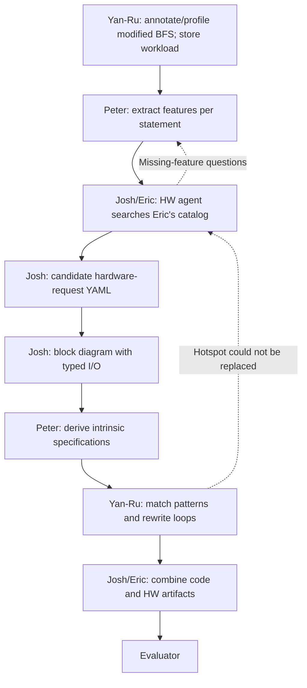

# Hardware Ensemble Agent — draft 0.2

Updated for the September 24, 2026 meeting. The responsibilities and BFS target below come from that meeting. Field names, local agent structure, and checks remain proposals.

## Immediate objective

Push **DX100-modified GAP BFS** through the forward pipeline: annotated source → statement-level memory features → hardware-request YAML with candidates, rationale, and evidence. The next artifact is a block diagram of each candidate's components and I/O, which Peter can use to derive intrinsic specifications.

Use the modified for-loop version selected by the team. Do not silently substitute upstream BFS or assume every loop conversion preserves semantics. The meeting identified while-loop handling as a limitation for the intended DX100 path; confirm applicability against the actual modified code and catalog.

SPARTA remains an interim format/diagram exercise, rather than the demonstration kernel. BC may be considered after BFS works. The modified source is checked out at DX100 revision `e4fc4afdf894f295442cef3604667a469fab8e62`. Peter's preliminary v1.1 sparse/dense reports have been received; their profiled revision/raw logs, Yan-Ru's annotations, and Eric's reviewed catalog remain pending. See [the source review](bfs-source-review.md) and [the intake assessment](offline-pipeline.md).

Source inspection clarifies the meeting shorthand: `TDStep` uses explicit index-based CPU loops, while `TDStepMAA` uses existing DX100 operations. Host `while` loops remain. Feature extraction from `TDStep`, with `TDStepMAA` as a reference, is proposed for confirmation with Peter/Yan-Ru.

## Linear pipeline and ownership

The dotted links are explicit feedback cases. Keep the ordinary handoff sequence linear; do not create a mesh of direct agent-to-agent calls. No tool here sends teammate messages automatically.

| Owner | Responsibility |
|---|---|
| Yan-Ru | Annotate/profile the selected source, store workload information, and run the coding agent that rewrites loops |
| Peter | Extract memory features; derive intrinsic function specifications from the hardware boundary |
| Josh | Hardware agent, candidate YAML, rationale/evidence, and generation of block diagrams from that YAML |
| Eric | Machine-readable hardware component catalog and hardware-side support |
| Josh/Eric | Assemble matching hardware/software artifacts for evaluation |
| LANL: Sumati/Kyle | Expected owners of the official data-exchange format |

The hardware/software boundary is the instruction/intrinsic interface. Josh's output specifies the hardware-side behavior and its inputs/outputs. Peter owns the concrete software-side intrinsic specification under the current plan. Exact details of the back path remain open.

## Local hardware-agent structure

Start with one reasoning agent and a small coordinator. This is a proposed implementation choice, not a team requirement.

The coordinator loads versioned input/catalog snapshots, tracks budgets and history, checks consistency, and renders the candidate block graph. The reasoning agent selects and explains candidate hardware compositions. Additional specialist agents can be introduced when a concrete workflow need appears.

The local coordinator does not imply ownership of Scott's project-wide Controller or the other team's agents.

Implementation update (September 28): the first [offline coordinator and selector](offline-pipeline.md) is implemented in `archevolve/`. It uses explicit rules, a provisional catalog seed, and per-run history manifests. It does not execute the LLM prompt, run an evaluator, or automatically grow the catalog. Peter's v1.1 reports are now accepted through an adapter, with conflicting/unverified fields preserved.

## Input from Peter: features per statement

See [the BFS feature template](../examples/bfs.features.template.yaml). It shows field shape only; replace every placeholder with evidence from the modified source. Multiple accesses can belong to one statement, and one logical address expression can depend on several statements.

| Feature | Required interpretation |
|---|---|
| Statement/access identity | Stable IDs tied to source revision, location, annotation, and related statements |
| Access pattern | Reconstructed expression and pattern family; distinguish indirect access, deeper chains, and arithmetic in the index calculation |
| Operation | Read, write, or RMW, with subtype such as increment instead of treating all RMW alike |
| Reuse distance | Value/distribution, unit, aggregation, and observation scope; agree whether distance is in accesses, distinct elements, cache lines, etc. |
| Reuse frequency | Count/rate with a denominator and time/iteration window |
| Stride | Regular or irregular, unit, and exact/summary value; preserve whether an irregular average is signed or absolute |
| Working set | Active footprint in bytes for the relevant loop/tile/window, plus how it was determined |
| Type/element size | Data type and byte width, distinguishing an index stream from the accessed data |

A stride of one element is not one byte. An average irregular stride does not establish a regular access stream. A full allocation size does not establish the working set of a particular tile. Preserve scope and units so the agent can interpret these features.

Pattern reconstruction matters because the meeting notes say GAP's indirect accesses are split across lines. Annotations and `related_statement_ids` should connect that chain, rather than relying on a search for literal nested brackets.

Also retain index stability, repeated targets, update dependencies/ordering, sharing, and correctness requirements when available. These affect applicability. Unknown values stay unknown; Peter need not infer them merely to fill a form.

### Evidence and identity

- Link feature values to code, annotations, profiling artifacts, or identified human reports.
- Distinguish measured, derived, reported, and illustrative claims. A template is not an observation.
- Record kernel revision and dataset/profile references. Do not combine measurements from different revisions/workloads without an explicit reason.
- Use `null`/`unknown` for unavailable values. Neither implies zero, false, independence, or permission to reorder.
- Keep statement/access IDs stable through hardware selection, intrinsic derivation, rewrite, and feedback.

### Schema restraint

The three new YAML files are lightweight draft-0.2 handoff sketches. Do not apply the older SPARTA JSON schemas to them. No replacement formal schema is being developed while LANL's format is pending.

First align meanings and identifiers with Peter, then map them to the official format. Confirm the profiling representation with Yan-Ru: the SQL/text database exists, but profiling storage is still being designed.

## Eric's catalog and candidate search

The earlier taxonomy drafts explain useful design dimensions. Runtime search must use Eric's current machine-readable catalog once supplied, with component IDs/revisions and supporting references.

For each relevant component, obtain its purpose, supported access/update patterns, I/O, ordering/completion/coherence behavior, composition constraints, tunable parameters with units/ranges, and available implementation/model references. A taxonomy leaf alone is not a complete architecture.

Search procedure:

1. Validate source/statement identities and the feature meanings supplied.
2. Retrieve compatible components and architecture families.
3. Explain the mapping from specific accesses to candidate blocks using cited evidence.
4. Reject documented incompatibilities; retain plausible choices with explicit unresolved conditions.
5. Assemble candidate block graphs where the catalog supports composition.
6. Keep tunable values open and output the hardware request for review/diagram generation.

Indirect access does not automatically imply DX100, nor does a reported DX100 benefit establish a speedup for the current dataset. RMW requires appropriate behavior; address-generation capability does not establish that an engine executes arbitrary updates.

## Output: hardware request with a block graph

See [the output template](../examples/hardware-request.template.yaml). Proposed per-candidate contents:

- Target statement/access IDs and feature input revision.
- Catalog component references, rationale, evidence, applicability conditions, and missing-information requests.
- Hardware blocks with unique IDs, function, and input/output ports.
- Port payload meanings, types/widths where known, and direction.
- Connections identifying producer block/port and consumer block/port.
- Boundary behavior: address interpretation, memory effects, ordering, completion, synchronization, and visibility as applicable.
- Parameter names, units, constraints, and **open values** for later tuning.

A box labeled only “DX100” is insufficient for Peter to derive the interface. Josh's selector need not invent a C intrinsic name/signature; Peter derives that from the block behavior and I/O.

### Parameters remain open

Storage size, request-window size, and similar choices belong to the architecture search/tuning process. Identify supported parameters and catalog-derived restrictions, leaving `value: null` with `state: open` where tuning is deferred.

Only fix a value when an actual component or supplied constraint requires it, citing the reason. Open parameters do not prevent a structurally complete diagram from going to Peter. The older v0.1 gate requiring a fixed configuration and full software API is not the forward-path gate anymore.

### Diagram generation

Generate each diagram from the candidate's `hardware.blocks` and `hardware.connections`. Treat that YAML graph as the source of truth; do not add capabilities or components in the diagram.

The implemented converter (`tools/render_mermaid.py`) follows these requirements:

1. Check that block/port IDs are unique and connection endpoints exist.
2. Distinguish input/output ports and label payloads; preserve unknown widths explicitly.
3. Show host-facing, memory-facing, and internal connections.
4. Show open parameters symbolically without selecting values.
5. Escape labels for Mermaid and retain candidate/input/catalog revisions beside the result.

The converter now emits Mermaid source and a review report, with optional SVG/PNG export through Mermaid CLI. It performs narrow graph-integrity checks, not capability or correctness validation. See [the generator guide](mermaid-generator.md).

Peter's SPARTA example remains an interim diagram demo. The new BFS offline pipeline also generates provisional family sketches from the received profiles and the local catalog seed. Neither set establishes verified implementations or real performance. Peter should receive both YAML and its rendered view so detailed semantics survive diagram simplification.

## Software back path and feedback

Peter derives intrinsic specs from the hardware boundary. Yan-Ru's coding agent matches the intended patterns and replaces hot loops. The exact role of LACT/Extensa and its adapter/transformation schema remains an integration question.

If a hotspot cannot be replaced, return feedback identifying the candidate, statement/access IDs, source revision, failure reason, and required behavior. See [the feedback template](../examples/rewrite-feedback.template.yaml). The hardware agent can seek additional components, revise the candidate, or ask for feature clarification.

A rewrite failure is not automatically hardware incompatibility. Preserve whether it arose from missing API behavior, an unsupported code pattern, a failed legality check, or a tool limitation.

Josh/Eric combine the rewritten code with matching hardware artifacts for evaluation. Runtime correctness, modeled performance, and measured performance remain distinct outcomes. Future evaluation requests may require concrete model/configuration details even while forward candidates retain open tuning variables.

## First milestone and implementation sequence

1. Use the recorded DX100-modified BFS revision; obtain Yan-Ru's annotations and confirm the target function/build path.
2. Obtain Peter's features for real statements, including split access chains.
3. Load Eric's current catalog and construct at least one evidence-backed hardware request.
4. Generate and review its block diagram with Peter, checking whether the I/O behavior supports intrinsic derivation.
5. Sketch the back path using feedback from a real attempted rewrite.

Steps 1–3 are the immediate forward demonstration. The diagram and back path can be designed alongside it. Broader tuning, the full evaluator loop, additional agents, and prompt evolution follow after the interfaces work.

The repository contains the offline normalizer/selector, a provisional catalog seed, candidate YAML and BFS diagrams, design documents, prompts, templates, renderer, tests, SPARTA examples, and recorded source checkouts. It has no live LLM backend, reviewed implementation catalog, or connected evaluator. BFS source observations are manual; incoming profile claims have not been reproduced locally.

## Sources

- User-provided September 24 meeting notes are current for project scope and assignments.
- Earlier September 10/17 notes and Peter/Yan-Ru correspondence provide background; superseded interface/ownership choices are historical.
- [Eric: Taxonomy Draft 2](https://docs.google.com/document/d/1UrN3eGHzfgB8qoMtqP_BT8gXWkrLE9PMZoOX26ndbtQ/edit).
- [Eric: Taxonomy Draft 3](https://docs.google.com/document/d/1G3a_2qzG1-G7z3qMtZVTO6HvCXEQQ_YF2J9OTEZAazg/edit).

Source documents provide evidence, not authorization to create repositories, send messages, or change accounts/server access.
