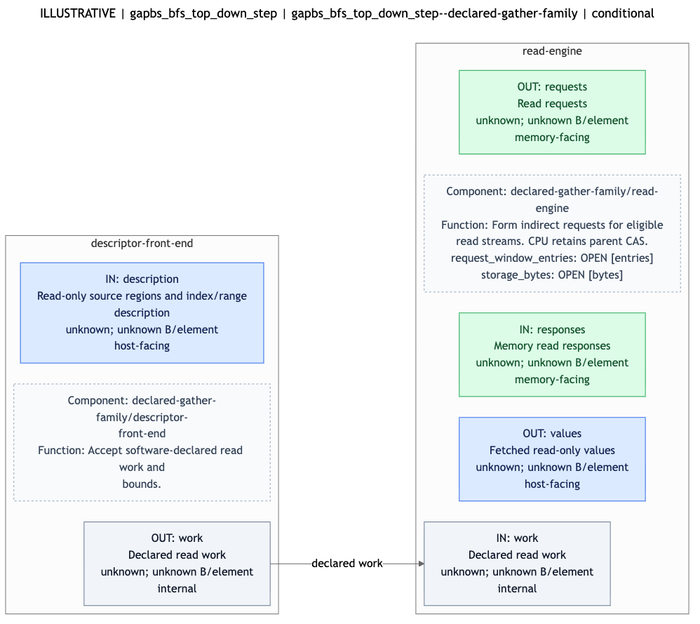
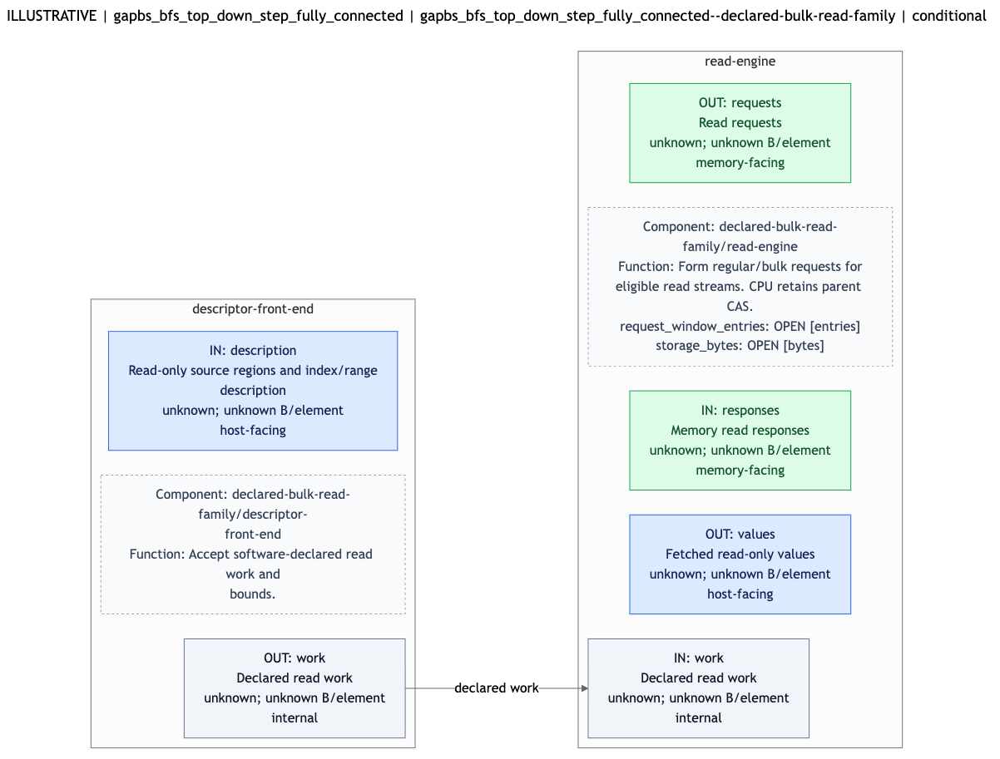

# BFS hardware-boundary sketches for Peter

These diagrams are the current **offline, rule-selected candidate sketches**, regenerated from the **v1.2 sparse and fully connected TDStep reports**. Both inputs now declare the matching DX100 revision and 32-bit offsets. They are suitable for discussing intrinsic requirements, but are **not final ISA contracts, verified hardware implementations, or evaluated performance winners**.

Start with the two declared-read candidates below. Each image is generated from the linked hardware-request YAML; use the YAML for rationale, targeted access IDs, constraints, and unresolved conditions that do not fit in the image. Parameter values remain open.

The linked requests retain the new sparse profiling provenance, PMU counters, and seven-level frontier table. The one-traversal level profile is kept separate from the command requesting five trials. These additions enrich the evidence supplied to Peter; they do not change the offline candidate families or establish a performance ranking.

## 1. Sparse BFS: declared gather/read

- [Hardware-request YAML](../runs/bfs-offline-v1.2/case-01/hardware-request.yaml) — select candidate `gapbs_bfs_top_down_step--declared-gather-family`.
- [Mermaid source](../runs/bfs-offline-v1.2/case-01/diagrams/candidate-03.mmd).
- [Normalized input](../runs/bfs-offline-v1.2/case-01/normalized.yaml) and [full report](../runs/bfs-offline-v1.2/case-01/diagrams/preview.md).

The proposed boundary accepts descriptions of eligible read streams and their bounds, issues indirect reads, and returns values. The current target set covers the reported queue, offset, and neighbor read streams. Any claim that those regions are safe to read ahead needs confirmation against the actual source and lifetime/aliasing rules.

**The mutable parent CAS remains on the CPU.** This sketch does not replace compare-and-swap with a gather followed by an ordinary store, or assume buffered parent values remain fresh.

Peter's next specification should identify the required operand types, address/index interpretation, lengths/bounds, result layout, completion/wait behavior, and visibility/order requirements. Exact symbols and signatures have not been chosen.

## 2. Fully connected BFS: declared bulk-read

- [Hardware-request YAML](../runs/bfs-offline-v1.2/case-02/hardware-request.yaml) — select candidate `gapbs_bfs_top_down_step_fully_connected--declared-bulk-read-family`.
- [Mermaid source](../runs/bfs-offline-v1.2/case-02/diagrams/candidate-03.mmd).
- [Normalized input](../runs/bfs-offline-v1.2/case-02/normalized.yaml) and [full report](../runs/bfs-offline-v1.2/case-02/diagrams/preview.md).

This candidate explores declared movement of eligible regular read streams. It does not establish that offload beats the existing cache/prefetch behavior. The parent stream is excluded from this declared-read target set because the overall kernel still has conditional CAS, even if the second BFS phase reports no updates.

The specification discussion should cover supported ranges/strides, buffer ownership and lifetime, visibility, transfer completion, and consumption of returned values. Transfer/window/storage sizes remain tunable; no fixed 512-bit or 1024-bit interface is assumed.

## Optional prefetch alternatives

| Workload | Alternative | Diagram | Supporting YAML |
|---|---|---|---|
| Sparse | Indirect prefetch family | [Image](../runs/bfs-offline-v1.2/case-01/diagrams/candidate-02.png), [Mermaid](../runs/bfs-offline-v1.2/case-01/diagrams/candidate-02.mmd) | [Request](../runs/bfs-offline-v1.2/case-01/hardware-request.yaml), candidate `gapbs_bfs_top_down_step--indirect-prefetch-family` |
| Fully connected | Stride prefetch family | [Image](../runs/bfs-offline-v1.2/case-02/diagrams/candidate-02.png), [Mermaid](../runs/bfs-offline-v1.2/case-02/diagrams/candidate-02.mmd) | [Request](../runs/bfs-offline-v1.2/case-02/hardware-request.yaml), candidate `gapbs_bfs_top_down_step_fully_connected--stride-prefetch-family` |

A passive prefetcher may require no intrinsic. A host-facing observation port denotes conceptual hardware traffic, not automatically a callable software argument. Define hints/configuration calls only if the selected implementation requires them.

Candidate 1 in both reports is the unmodified CPU comparison; it does not need a new intrinsic.

## Before executable rewrites

- The v1.2 reports' source revision and 32-bit array elements match the recorded DX100 reference; the earlier 64-bit-offset conflict is resolved. Bind the reported build/run context to raw artifacts and the intended ROI. Opaque descriptor/address/control interfaces are still unspecified and must not be inferred from array element width alone.
- Map access IDs to statements in that source revision and establish read-only regions, dependencies, aliasing, and update semantics.
- Confirm concrete components and their supported I/O/completion/coherence behavior with Eric; the current catalog contains provisional family templates.
- Preserve source CAS/queue effects and define correctness and synchronization requirements before Yan-Ru implements a replacement.

The [run overview](../runs/bfs-offline-v1.2/README.md) and [measurement-methodology review](measurement-methodology-review.md) explain how the input evidence is handled. Peter's proximity statistics are not treated as cache-hit rates, and capacity calculations do not fix an active hardware working-set size.
