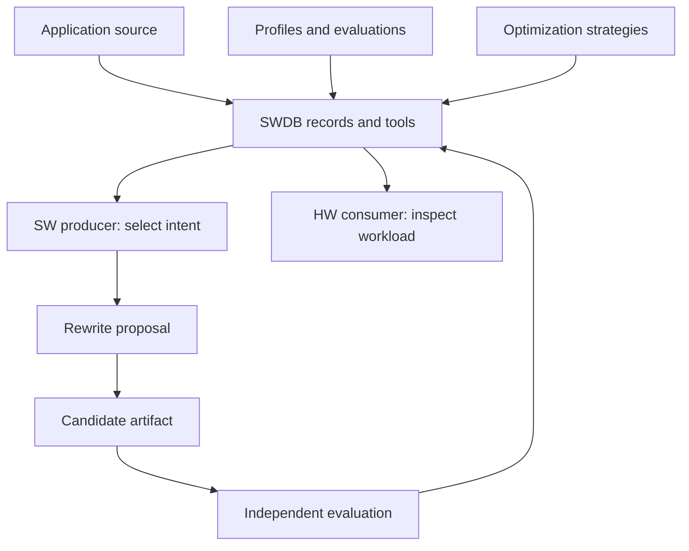
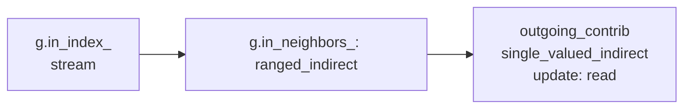
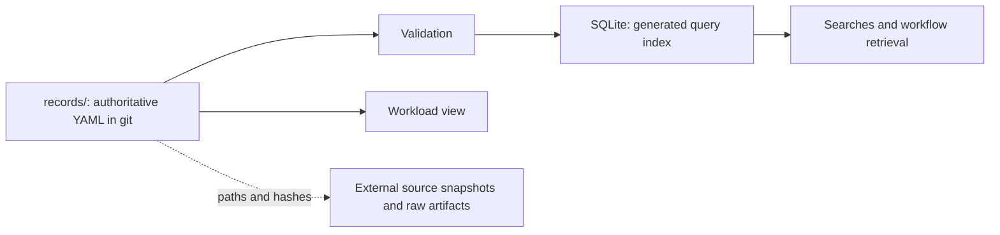

# 1. Understand EvolveSWDB in 10 minutes

Updated: 2026-09-28 (Eastern Time).

[Tutorial](README.md) · Next: [Records and queries](02-records-and-queries.md)

## The problem it solves

Suppose you want to improve PageRank's memory behavior. Before changing code,
you need to know which implementation you have, which arrays it touches, whether
iterations depend on one another, which input was measured, and whether a
proposed change still computes the right result. A timing number alone cannot
answer those questions.

**EvolveSWDB is ArchEvolve's Software Database.** It connects application source,
computations, implementations, memory behavior, reusable optimization strategies,
and evaluation evidence. Its Python command-line tool, `swdb`, validates and
queries that information. For breadth-first search (BFS), it also supports a
workflow that retains rewrite requests, exact candidate source, evaluations, and
comparisons.



The arrows show information flow. SWDB provides records and interfaces for SW/HW
participants; the checked-in handoff examples use representative test clients.
They do not demonstrate a live, integrated ensemble. An operator or producer
selects optimization intent; the rewrite worker applies that intent within its
declared scope.

## Five ideas to learn first

| Idea | Meaning | Example |
|---|---|---|
| **Application** | A program from a specific source version | The pinned GAPBS source |
| **Kernel** | A computation identified by what it computes and its correctness check | PageRank, `gapbs-pr` |
| **Implementation** | Code that realizes a kernel | `gapbs-pr-gs` and `gapbs-pr-jacobi` |
| **Access pattern** | A chain of array-access steps, ending at the array read or updated | Reading neighbors' PageRank contributions |
| **Optimization strategy** | A reusable change described by its target and effect | Packing indirect reads into a contiguous array |

A kernel can have several implementations with different memory behavior. The
correctness check defines what results are acceptable; implementations need not
produce bitwise-identical outputs. A strategy holds no executable code. A
**candidate artifact** is proposed source that still needs evaluation before it
can be treated as a correct implementation in that evaluation's scope.

## Follow one access through real code

The Jacobi PageRank implementation contains this loop, reproduced from
[`pr_spmv.cc`](../../records/implementations/gapbs-pr-jacobi/pr_spmv.cc):

```cpp
for (NodeID v : g.in_neigh(u))
  incoming_total += outgoing_contrib[v];
```

To read `outgoing_contrib[v]`, the program first finds vertex `u`'s neighbor
range, walks its neighbor IDs, then uses each ID to read a contribution:



This is one access pattern with three **steps**. Its pattern class is
`stream > ranged_indirect > single_valued_indirect : read`. The final array is
read; the local sum does not turn that array access into an add-update.

Why record all this? Packing may replace the final indirect read with a stream,
but it also introduces a pass that gathers and stores the packed values. The
change needs both suitable semantics and enough reuse to repay that work. The
database can check recorded preconditions and expose remaining questions; an
evaluation must establish the outcome on a particular workload.

## Try the first queries

Use Python 3.12+ with PyYAML 6+ and jsonschema 4.10+. If dependencies are already
available, use the commands below directly. For a fresh local environment:

```sh
python3 -m venv .venv
source .venv/bin/activate
python3 -m pip install -e .
```

Then inspect the current repository:

```sh
# Check record structure, references, source excerpts, and domain rules.
python3 -B -m swdb validate

# Find indirect reads in PageRank implementations.
python3 -B -m swdb find --kernel gapbs-pr --shape ranged_indirect --update read

# Ask which strategies fit the Jacobi gather.
python3 -B -m swdb strategies --pattern gapbs-pr-jacobi/gather-contrib

# Assemble the HW-facing view of a stored implementation/input/machine triple.
python3 -B -m swdb view gapbs-pr-gs kron-g16-k16 mbit10
```

The strategy query includes `packing` with `outcome: legal` in the inspected
records. Read the accompanying `check_by_hand`: gathered values must remain
unchanged while the packed copy is used, and reuse must justify the extra work.
Here, `legal` means the encoded checks passed. It is not a speed prediction or
a completed correctness check of newly written code.

The workload view joins source, access patterns, input sizes, machine details,
and an available profile. It retains the basis of observations and explicit
unknowns. Running `view` on your Mac reads stored mbit10 metadata; it does not run
PageRank on either machine.

## Where the information lives



Edit and review YAML, then regenerate the index. The default index is
`build/swdb.sqlite`; query commands refresh it when stale. The `view` command
validates and reads YAML directly. Large build outputs, graphs, and raw run data
stay outside git on their producing host; records retain their identities and
locations.

Use [`records/`](../../records/) to inspect facts,
[`swdb/`](../../swdb/) to inspect behavior, and
[`schemas/`](../../schemas/) plus [`vocab/`](../../vocab/) to see accepted fields
and terms. [`apps/`](../../apps/) holds pinned application sources;
[`tools/`](../../tools/) holds C++ analysis and instrumentation support.

## Read results without losing their meaning

Every fact has a **basis**: measured, simulated, read from code, reported,
inferred, or unknown. Unknown stays `null`, never silently becomes false.
Cachegrind cache counts are simulated even when collected from a real process.

For BFS, a performance comparison additionally needs an explicit **comparison
baseline**, matching workload and hardware identities, a declared **region of
interest (ROI)**, passed correctness, and a frozen comparison policy. The source
you rewrote does not automatically select the baseline you compare against.
Compiling successfully and collecting a complete package are intermediate
outcomes, each with a narrower meaning than a qualified gain.

**Checkpoint:** You should now be able to explain why two implementations can
share a kernel, why an access pattern is a chain, and why `packing: legal` does
not mean “packing made this program faster.” Continue for the internal details.

**[Next: records, evidence, and queries →](02-records-and-queries.md)**
