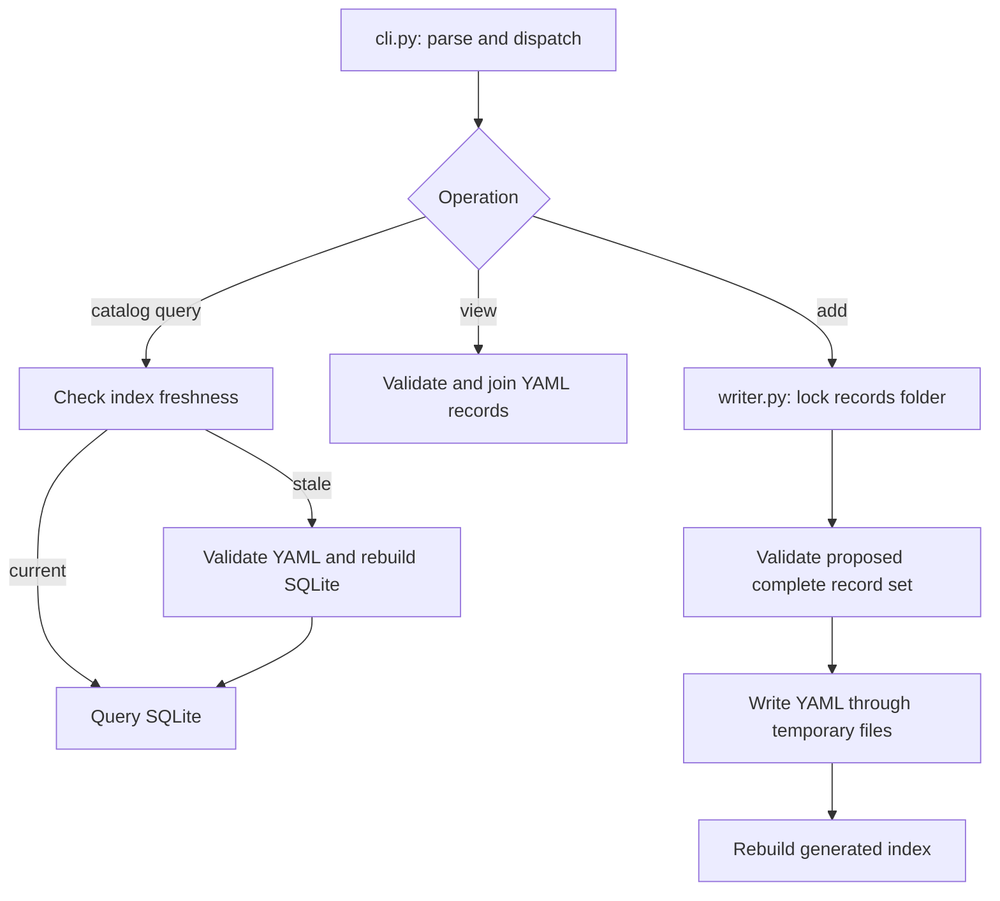

# 3. Find your way through the components

Updated: 2026-09-28 (Eastern Time). Reading budget: 7 minutes.

[Tutorial](README.md) · [Previous](02-records-and-queries.md) · [Next](04-bfs-workflow.md)

EvolveSWDB is a repository and a Python CLI package. A catalog query needs no
database server. External compilers, profiling tools, rewrite providers, and
simulators enter through specific execution paths.

## Follow a query and a write

For `find`, `strategies`, and `implementations`, the CLI checks whether the
generated database matches the records directory, file fingerprint, and builder
code. A stale index triggers validation and rebuilding. Workflow retrieval uses
`db.query_store()` to load one indexed snapshot. `view` instead validates and
loads YAML directly to assemble the HW workload view.

The writer validates the resulting record set before writing and replaces each
file through a temporary file. This is not a multi-file database transaction.
Workflow persistence commits metadata before indexing; if index generation
fails, it reports that the durable record survived. Rebuild the index after
fixing the cause rather than resubmitting an already-used record ID.

## Catalog components

These links point to the code to read when behavior is unclear:

| Component | Responsibility and entry points |
|---|---|
| [CLI](../../swdb/cli.py), [module entry](../../swdb/__main__.py) | Argument parsing, command dispatch, YAML/JSON output, exit codes; package metadata is in [pyproject.toml](../../pyproject.toml) and [__init__.py](../../swdb/__init__.py) |
| [Paths](../../swdb/paths.py), [YAML I/O](../../swdb/yamlio.py), [store](../../swdb/store.py) | Locate resources, reject duplicate YAML keys, keep dates as text, index IDs, resolve application/source context |
| [Validation](../../swdb/validate.py), [schemas](../../swdb/schemas.py), [vocabularies](../../swdb/vocab.py), [rules](../../swdb/rules.py), [problems](../../swdb/problems.py) | Combine the envelope/kind schemas with vocabularies, then check cross-record and source constraints; report file/field/reason |
| [Database](../../swdb/db.py), [writer](../../swdb/writer.py) | Build/query SQLite; lock and validate record additions; preserve agent authorship |
| [Strategy](../../swdb/strategy.py), [ISA](../../swdb/isa.py) | Target/effect identity, three-state legality, intrinsic requirements, compiler flags, machine support |
| [Formulas](../../swdb/formula.py), [view](../../swdb/view.py), [profile comparison](../../swdb/comparison.py) | Evaluate array-size formulas, join HW output, compare exact ordinary profile pairs |
| [Machine capture](../../swdb/machine.py), [ordinary profiler](../../swdb/profile.py) | Capture host facts; build/check/time code, collect footprints/index features/Cachegrind, retain profile outcomes |

Validation has layers. JSON Schema handles field shape and types; vocabulary
expansion controls terms; Python rules enforce relationships, formulas, source
excerpts, strategy identity, and other constraints a schema alone cannot express.
[`schemas/`](../../schemas/) and [`vocab/`](../../vocab/) are executable model
definitions rather than a prose-only specification.

## Source, rewrite, and native BFS components

| Component | Responsibility |
|---|---|
| [Artifacts](../../swdb/artifacts.py), [workflow](../../swdb/workflow.py) | Hash/copy/verify source, protect evaluator inputs, retain submissions and candidates, expose linked history |
| [Rewrite](../../swdb/rewrite.py), [capabilities](../../swdb/capabilities.py) | Interpret selected intent through bounded providers; check target operation requirements before accepting edits |
| [Native evaluator](../../swdb/bfs_native.py), [paired collector](../../swdb/bfs_native_pair.py) | Build exact candidates, own ROI/result checking, execute trials, retain prospective A/A or A/B schedules and receipts |
| [Discovery](../../swdb/bfs_discovery.py), [profiling](../../swdb/bfs_profiling.py) | Discover functions/loops from compiler information, instrument regions, collect timing and modeled memory observations |
| [Protocol](../../swdb/bfs_protocol.py), [SG reader](../../swdb/sg_stream.py) | Register canonical graph identity, freeze policies, validate bindings, aggregate/compare evaluations, inspect large serialized graphs |
| [Packages](../../swdb/profile_package.py), [region comparison](../../swdb/bfs_region_comparison.py) | Assemble exact-context handoffs, match strategies in both directions, compare diagnostic region observations |
| [Acceptance report](../../swdb/bfs_coverage.py), [handoff](../../swdb/handoff.py) | Reconstruct required evidence cells; render versioned messages from retained records |
| [Host observations](../../swdb/host_observation.py), [processes](../../swdb/processes.py) | Capture bounded host-condition receipts; terminate evaluator-owned process groups |

The C++ support is in [`tools/bfs_native/`](../../tools/bfs_native/) and
[`tools/bfs_profile/`](../../tools/bfs_profile/). The former supplies the trusted
driver template and serialized-graph identity helper; the latter supplies native
and gem5 instrumentation runtimes.

## DX100 components

DX100 adds a simulated hardware target. The physical execution host and simulated
machine remain separate identities. A working model build is one stage of a
larger evidence chain.

| Component | Responsibility |
|---|---|
| [DX100 orchestration](../../swdb/dx100.py), [candidate adapter](../../swdb/dx100_candidate.py), [author adapter](../../swdb/dx100_author.py) | Bounded backend stages, candidate compilation, and preservation of the pinned author's ROI |
| [Checkpoint](../../swdb/dx100_checkpoint.py), [inputs](../../swdb/dx100_inputs.py) | Bind checkpoint compatibility and verified serialized-input aliases |
| [Profile](../../swdb/dx100_profile.py), [diagnostics](../../swdb/dx100_diagnostic.py) | Read exact statistics intervals/clocks and collect source-region observations |
| [Coverage](../../swdb/dx100_coverage.py), [witness](../../swdb/dx100_witness.py) | Check observed accelerator traces and bounded completion/correctness evidence |
| [Resources](../../swdb/dx100_resources.py) | Observe owned process-group resident memory during bounded jobs |

`dx100_witness` evidence is not itself a normal-process-termination oracle.
Accelerator coverage needs observations from execution; source support alone
cannot establish that the accelerator ran.

## Supporting repository areas

[`apps/gapbs/`](../../apps/gapbs/) and [`apps/dx100/`](../../apps/dx100/)
retain application source and provenance. Read their `PROVENANCE.md` files before
assuming which parts of an upstream project were copied. A local source excerpt
does not imply a full simulator/toolchain installation.

[`tools/index_features/`](../../tools/index_features/) computes graph index-stream
features in a declared visit order. Its compiler/standard library must match the
kernel for generator-dependent ordering. [`scripts/`](../../scripts/) contains
campaign drivers, pilots, fixture checks, diagnostic/recovery helpers, and lane
wrappers. Read a script's request and host prerequisites before using it; dated
drivers encode particular campaigns.

[`tests/`](../../tests/) covers validation, queries, persistence, providers,
native/simulator contracts, accounting, and failure paths. Test fixtures check
software behavior; they do not constitute workload performance evidence.
[`.scratch/`](../../.scratch/) holds local specs, tickets, requests, and campaign
checkpoints. [`docs/reference/`](../reference/) holds contracts;
[`docs/archive/`](../archive/) holds historical investigations.

## CLI map

| Task | Commands |
|---|---|
| Inspect/store catalog | `validate`, `build`, `sql`, `find`, `implementations`, `strategies`, `get`, `view`, `add` |
| Ordinary profiling | `capture-machine`, `profile`, `recompute-cachegrind`, `compare` |
| Prepare/rewrite source | `source-snapshot`, `baseline-candidate`, `fixture-package`, `submit`, `repair`, `capabilities` |
| Bind/evaluate BFS | `register-workload`, `freeze-protocol`, `evaluate`, `evaluate-pair`, `dx100-build`, `dx100-compile`, `dx100-execute` |
| Profile/package BFS | `bfs-profile`, `bfs-hotspots`, `dx100-profile`, `profile-package`, `profile-strategies`, `strategy-regions` |
| Assess/communicate | `aggregate-evaluations`, `compare-evaluations`, `bfs-coverage`, `handoff-message` |

Use `python3 -B -m swdb COMMAND --help` for arguments. Exit codes are 0 for
command success, 1 for a failed check/command, and 2 for usage errors. A
successful reporting command still requires reading the reported outcome.

**[Next: walk through BFS from source to comparison →](04-bfs-workflow.md)**
