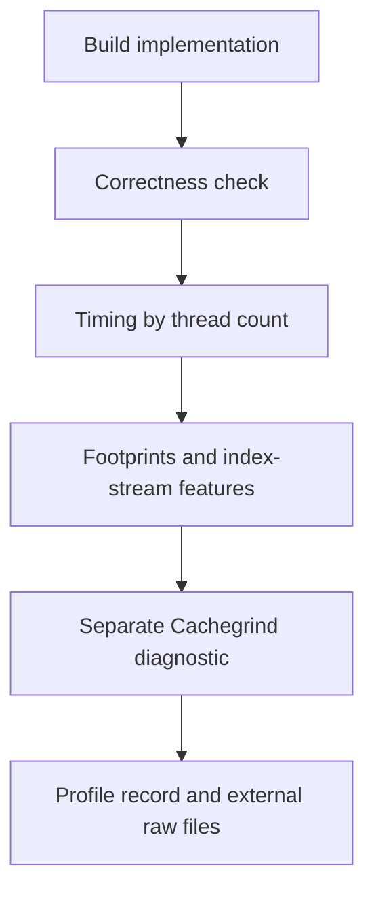

# 5. Contribute records and understand profiling

Updated: 2026-09-28 (Eastern Time). Reading budget: 7 minutes.

[Tutorial](README.md) · [Previous](04-bfs-workflow.md)

## Add a catalog record in a temporary workspace

This optional exercise uses the repository's tiny graph input fixture. It shows
the full write path without changing the project's records or running a
benchmark. Run from the repository root with the dependencies from chapter 1.

```sh
python3 -B - <<'PY'
from pathlib import Path
from tempfile import TemporaryDirectory
import subprocess

def swdb(*args):
    subprocess.run(["python3", "-B", "-m", "swdb", *map(str, args)], check=True)

with TemporaryDirectory(prefix="swdb-tutorial-") as work:
    root = Path(work)
    records = root / "records"
    records.mkdir()
    index = root / "index.sqlite"
    swdb("add", "tests/fixtures/profile/tiny-input.yaml",
         "--records", records, "--db", index,
         "--agent", "--agent-name", "tutorial")
    swdb("validate", "--records", records)
    swdb("get", "tiny-sym", "--records", records,
         "--db", index, "--format", "json")
PY
```

The fixture is a complete `input` record referring to a checked-in edge-list
file and its hash. Its node count comes from code reading; edge counts remain
unknown until measured. `add --agent` retains draft status and adds agent-run
provenance. The canonical destination is `inputs/tiny-sym.yaml`; `get` retrieves
the same identity through the generated index. The temporary directory is
removed when the block exits.

## Extend the catalog deliberately

For a new application, work through these dependencies:

1. **Application:** pin the source revision, license, language, and build context.
   Small unchanged source copies can live under `apps/NAME/` with dated
   provenance. Larger sources need a pinned fetch/checksum procedure.
2. **Kernel and baseline implementation:** define the computation and executable
   correctness check, then describe actual code, build/run templates, loops,
   and access patterns. Assemble both records before validating their mutual
   references. A format `0.4` implementation also names application,
   source baseline, evaluator, and scoped verification explicitly.
3. **Input:** provide either a generator or a file/hash, with every property
   needed by array-size and loop formulas. Use `null` with `basis: unknown` for
   facts not yet established.
4. **Profile:** let the profiling tool retain correctness outcomes, measurements,
   environment, and raw-output locations. Review the evidence before treating
   the record as reviewed.

Copy a structurally similar record, but re-establish its facts for the new code.
Each implementation's seven semantic fields cover duplicate indices, index
modification, loop-carried dependencies, shared targets, required atomic updates,
ordering, and numerical requirements. A compare-and-swap retry loop keeps
`compare_and_swap` as its update kind even if the algorithm implements a minimum.
Array aliases matter when computing footprints.

For a new strategy, first check whether its **target plus typed effect** already
exists. Tile sizes and prefetch distances are parameters, not new identities.
Record machine-checkable preconditions, remaining `unchecked` requirements, and
reported benefits with sources. Intrinsic records retain the exact wrapper name,
header, ISA requirements, lane/element widths, and memory behavior. Derived
implementations name the strategies they apply and intrinsics they call.

Use the [application checklist](../reference/adding-an-application.md) and
[strategy checklist](../reference/adding-a-strategy.md) when authoring. Keep IDs
stable; replacements receive new IDs, while old records remain deprecated with
`deprecated_by` links. Record statuses (`draft`, `reviewed`, `deprecated`) differ
from ticket statuses.

Sealed workloads and protocols use `register-workload` and `freeze-protocol`;
assembled packages use `profile-package`. `add` is not the creation interface for
those records. Experimental fields belong under `extensions` where supported.

## Understand what ordinary profiling collects



The ordinary profiler defaults to five trials at each of 1, 2, 4, 8, and 16
threads. It checks correctness before timing. An explicitly permitted unfinished
check remains unverified/incomplete. Cachegrind is a separate single-threaded
diagnostic; its cache metrics have `basis: simulated`. Index-stream features
describe properties such as repetition and locality in the declared visit order.
BFS uses the separate evaluator/protocol machinery from chapter 4.

For mbit10, enter measurements through the current socket-lane wrapper, after
checking both socket leases and the legacy lease. There are at most two
measurement jobs, one per socket. Verify the exact checkout and current disk,
load, and counter availability. Builds/sources belong under `/data1/yanruj/`;
raw output stays outside git on the producing host. Sync code through git and
avoid updating a checkout while it is measuring.

The local Mac is ARM and mbit10 is x86_64. Local catalog exercises need neither
OpenMP nor a simulator; running native or simulated workloads has additional
toolchain and host prerequisites. Read the [profiling guide](../mbit10-profiling.md),
[host rules](../../.claude/rules/remote_server.md), and
[mbit10 procedure](../../.claude/skills/mbit10-runs/SKILL.md) before remote work.

## Troubleshoot by the failing boundary

| Symptom | First action |
|---|---|
| Unknown key or value | Read the named schema/vocabulary; check whether an extension field is appropriate |
| Dangling ID or source excerpt mismatch | Check the referenced record, source root, pinned revision, and exact lines |
| Strategy is `undetermined` | Inspect `unknown_fields` and `check_by_hand`; gather the missing facts |
| Indexing failed after metadata persisted | Inspect the retained record, fix the cause, then run `build` |
| Missing metrics or incomplete package | Read collection parts, correctness, scope, and explicit incompleteness reasons |
| Remote artifacts are unverified | Verify on their producing host when needed; metadata alone cannot refresh them |
| Build passes but comparison is rejected | Inspect exact protocol, source, workload, ROI, target, and repetition bindings |

For code changes, follow [`AGENTS.md`](../../AGENTS.md), the
[local ticket workflow](../agents/issue-tracker.md), and existing ADRs. Claim a
ticket before its work; resolve it with an answer and a context pointer in its
map. Use focused tests for the component you changed and record validation for
catalog changes. The general test command is `python3 -B -m pytest`; development
test dependencies can be installed with `python3 -m pip install -e '.[test]'`.

You have finished the reading path. Use the [component map](03-components.md)
to find code and the [reference index](../reference/README.md) for exact contracts.
