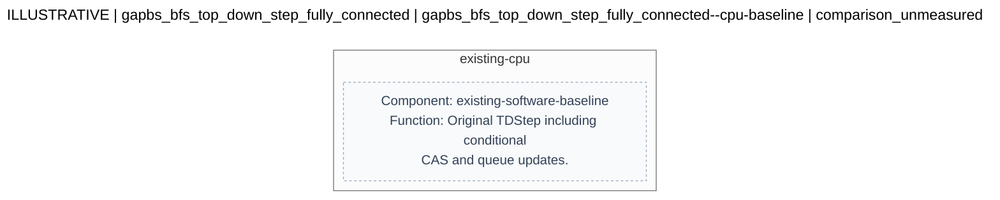
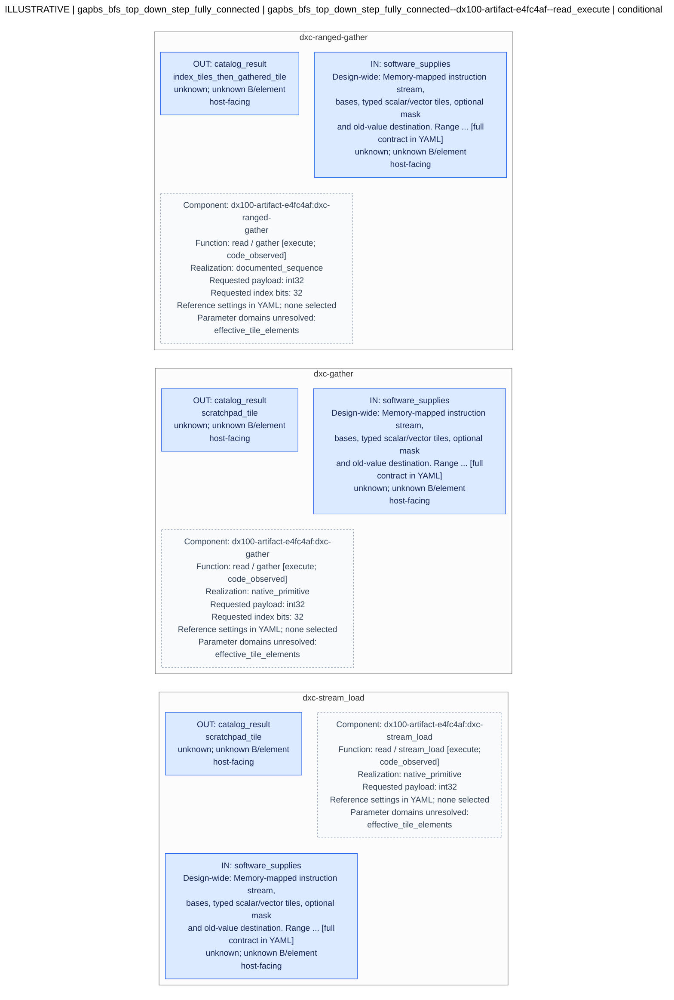
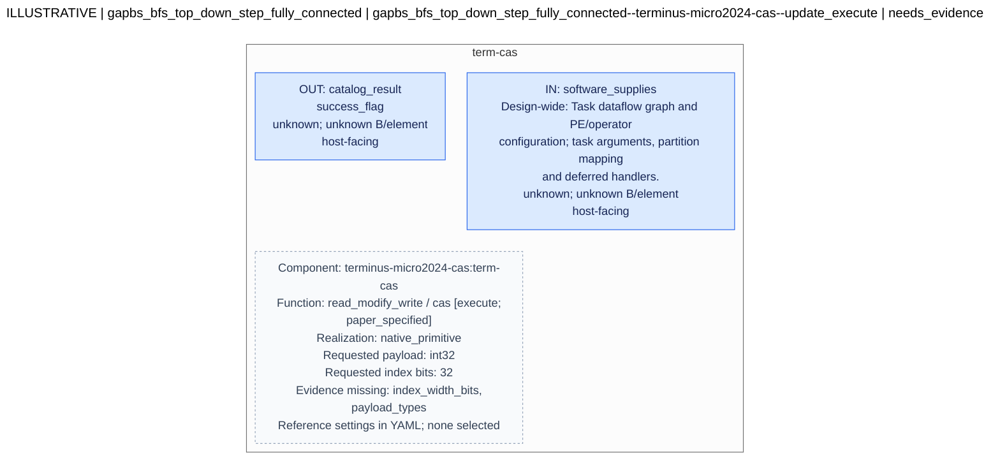
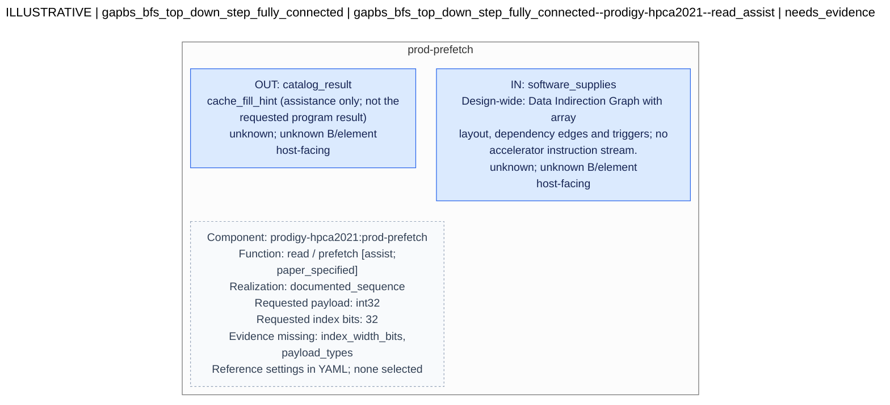

# Hardware candidate diagrams

Generated deterministically from the request YAML. This is a structural view, not a hardware correctness or performance verdict.

**ILLUSTRATIVE: not an evaluated hardware design.**

```yaml
contract_version: draft-0.2
record_kind: illustrative
kernel_id: gapbs_bfs_top_down_step_fully_connected
input_ref: examples/received/bfs-fully-connected.features.v1.2.yaml
input_revision: e4fc4afdf894f295442cef3604667a469fab8e62
catalog_ref: catalog/hardware-v0.1.yaml
catalog_revision: 0.1.2
source_file: hardware-request.yaml
source_sha256: bf35c45ec9ea799d2e02019d789fd299ce9ccf825df788c24c01b7d9bb1f1955
```

## Workload context

```yaml
kernel:
  name: gapbs_bfs_top_down_step_fully_connected
  benchmark: gapbs
  algorithm: Breadth-First Search (Top-Down Push Traversal)
  source_file: benchmarks/gapbs/src/bfs.cc
  source_revision: e4fc4afdf894f295442cef3604667a469fab8e62
  function: TDStep
  graph_topology: fully_connected_graph (K_N, complete clique without self-loops)
  archetype: dense_consecutive_streaming_read_heavy
source_binding:
  status: revision_reported_matching
  reported_revision: e4fc4afdf894f295442cef3604667a469fab8e62
  reference_revision: e4fc4afdf894f295442cef3604667a469fab8e62
evidence_status: reported_not_reproduced
rmw:
  kind: conditional_compare_and_swap
  reported_details:
    subtype: read_predominated_conditional_cas
    primitive: CAS(addr=&parent[v], expected=curr_val, new_val=u)
    execution_frequency:
      level_1: N - 1 executions (100% commit rate)
      level_2: 0 executions (bypassed entirely by if (curr_val < 0) filter)
    contention: zero lock contention across Level 2
  must_preserve: true
  phase_execution:
    level_1: N - 1 executions (100% commit rate)
    level_2: 0 executions (bypassed entirely by if (curr_val < 0) filter)
profiling_provenance: null
frontier_evolution_profile: null
profiling_context:
  evidence_status: reported_not_reproduced
  reported_command_line: null
  counter_measurement_scope: null
  frontier_measurement_scope: null
  cross_section_trial_binding: not_established
  aggregation_policy: retain_sections_separately_no_level_weighting_or_counter_join
  frontier_level_observations: []
reported_counters:
  measurement_platform: Intel Xeon Gold 6226R (16 threads, 2.90 GHz)
  comparison_vs_sparse_kronecker:
    instructions_per_cycle_ipc:
      sparse_kronecker: 0.39
      fully_connected: 2.68
    branch_miss_rate:
      sparse_kronecker: 11.07%
      fully_connected: 0.01%
    l1_dcache_miss_rate:
      sparse_kronecker: 15.14%
      fully_connected: 2.14%
    atomic_cas_overhead_cycles:
      sparse_kronecker: 15.97% (lock cmpxchg)
      fully_connected: 0.00% (lock cmpxchg)
methodology:
  status: reported_method_bound_to_input
  record_sha256: c1dc5b86c68c5bd0c16eab522b57690ba3131af70d3f5ed78c6f909fe0ac2d9a
  source_ref: examples/received/peter-measurement-methodology.v1.2.txt
  source_sha256: 0f8d421aed3aa68e85e258c8f7eb844a6d8f5c5f98d4a1d6f39f9e4e1e3ba385
  verification: instrumentation_not_reproduced
```

## Interpretation notes

```yaml
- Offline evidence retrieval and explicit exploration ordering; no LLM or evaluator
  calls.
- Each box is a catalog operation interface, not an inferred physical component. Unconnected
  operation options are not a proved composition.
- Reference sizes are preserved as references, not chosen tuning values. Unknown domains
  stay unknown.
- Mutable read targets are not assumed immutable. CAS support is queried separately;
  assistance and fetch-old behavior do not establish CAS execution.
- One slot each for reads, update execution and read assistance is considered before
  remaining alternatives, subject to budget. Within scopes, evidence completeness/code
  support precede stable IDs; none is a performance rank.
```

Blue ports face the host; green ports face memory; gray ports are internal; amber ports have an unknown role. Dashed boxes are explanatory annotations, not additional hardware components. Only connections explicitly present in the YAML are drawn. Unconnected ports remain visible.

Open values remain OPEN. Read the candidate details for constraints, behavior, and unresolved conditions.

**Operation-interface view:** boxes represent catalog operation contracts, including documented sequences. They are not physical components or a proof that the displayed operations compose. Reference settings are recorded separately from chosen values; unknown ABI details remain unknown.

## Candidate 1

[Mermaid source](candidate-01.mmd)



### Full candidate details

```yaml
id: gapbs_bfs_top_down_step_fully_connected--cpu-baseline
catalog_entry: cpu-baseline
status: comparison_unmeasured
rationale: Keep unchanged TDStep as the comparison. This does not assert that an accelerator
  is better.
target_access_ids:
- access-01
- access-02
- access-03
- access-04
target_statement_ids: []
hardware:
  blocks:
  - id: existing-cpu
    component_ref: existing-software-baseline
    function: Original TDStep including conditional CAS and queue updates.
    inputs: []
    outputs: []
    parameters: []
  connections: []
software_handoff:
  intrinsic_spec_owner: Peter
  boundary_notes: No new intrinsic for the unchanged baseline.
```

## Candidate 2

[Mermaid source](candidate-02.mmd)



### Full candidate details

```yaml
id: gapbs_bfs_top_down_step_fully_connected--dx100-artifact-e4fc4af--read_execute
catalog_entry: dx100-artifact-e4fc4af:read_execute
status: conditional
catalog_design_id: dx100-artifact-e4fc4af
catalog_design_revision: e4fc4afdf894f295442cef3604667a469fab8e62
catalog_record_kind: design_version
candidate_scope: read_execute
rationale: Source-scoped operation matches for this workload. This is an interface
  exploration option, not a composed accelerator, legal rewrite, or performance winner.
target_access_ids:
- access-01
- access-02
- access-03
- access-04
target_statement_ids: []
operation_options:
- operation:
    id: dxc-stream_load
    operation: read
    subtype: stream_load
    execution_role: execute
    address_patterns:
    - sequential
    - constant_stride
    support: code_observed
    claim_refs:
    - dxc-stream
    - dxc-mask
    result:
      form: scratchpad_tile
      old_value: not_applicable
      validity: Only active lanes below produced tile size have fresh payloads; masked
        finished slots retain prior storage.
      claim_refs:
      - dxc-stream
      - dxc-mask
    ordering:
      scope: stream instruction and result-slot association
      description: Page/line requests may overlap; response words are placed in iteration-indexed
        destination slots. Indirect duplicate-list behavior is not claimed for this
        read operation.
      claim_refs:
      - dxc-stream
      - dxc-region
    completion:
      event: Stream Response/Finish path calls finishInstructionCompute after its
        own request and latency checks; ready read responds when counter clears.
      visibility: Scratchpad payload is written before tile ready; end-to-end CPU
        read visibility still requires integration proof.
      claim_refs:
      - dxc-stream
      - dxc-ready-response
    datatype_notes: 32/64-bit payload paths; indirect indices are uint32; stream min/max/stride
      use int.
    limitations: []
    realization:
      kind: native_primitive
      description: STREAM_LD implementation consumes min/max/stride registers and
        optional mask.
      claim_refs:
      - dxc-stream
      - dxc-mask
    type_constraints:
      payload_types:
      - uint32
      - int32
      - float32
      - uint64
      - int64
      - float64
      index_width_bits: []
      claim_refs:
      - dxc-payload-types
      - dxc-stream
      notes: Observed API and execution type domain only. Index width is 32 for indirect
        operations, independent of payload width. Conditions read uint32; stream min/max/stride
        use int. Numerical equivalence, layout, signedness/range safety and tile allocation
        still need proof. Empty index_width_bits means not applicable to this direct
        stream primitive, not arbitrary-width indirect indexing.
  catalog_status: conditional_executor
  missing_capability_evidence: []
  matched_requests:
  - id: access-01-read
    access_id: access-01
    array: queue.shared
    purpose: read
    operation: read
    subtype: stream_load
    address_pattern: sequential
    payload_type: int32
    index_width_bits: null
    require_old_value: false
    mapping_basis: Reported sequential stream; actual bounds/stride and source binding
      remain requirements.
    mapping_status: proposed_from_reported_pattern
    missing_workload_evidence: []
    mutable_target: false
- operation:
    id: dxc-gather
    operation: read
    subtype: gather
    execution_role: execute
    address_patterns:
    - indirect
    support: code_observed
    claim_refs:
    - dxc-gather
    - dxc-mask
    result:
      form: scratchpad_tile
      old_value: not_applicable
      validity: Only active lanes below produced tile size have fresh payloads; masked
        finished slots retain prior storage.
      claim_refs:
      - dxc-gather
      - dxc-mask
    ordering:
      scope: inspected instruction path
      description: Iteration slots retain result association. Local duplicate-list
        processing and pending-line forwarding are observed; full inter-instruction/alias/global
        order remains unproved.
      claim_refs:
      - dxc-local-order
      - dxc-region
    completion:
      event: Instruction finish after pending-count/accounting and modeled latency
        checks; destination tiles become ready.
      visibility: Scratchpad payload is written before tile ready; end-to-end CPU
        read visibility still requires integration proof.
      claim_refs:
      - dxc-completion
      - dxc-ready-response
    datatype_notes: 32/64-bit payload paths; indirect indices are uint32; stream min/max/stride
      use int.
    limitations:
    - Byte-offset product representability is required (dxc-byte-offset-domain); index_width_bits
      does not promise the entire unsigned index domain.
    realization:
      kind: native_primitive
      description: INDIR_LD with a supplied index tile; offset multiplication uses
        the payload word size and uint32 index.
      claim_refs:
      - dxc-gather
      - dxc-mask
    type_constraints:
      payload_types:
      - uint32
      - int32
      - float32
      - uint64
      - int64
      - float64
      index_width_bits:
      - 32
      claim_refs:
      - dxc-payload-types
      - dxc-gather
      - dxc-byte-offset-domain
      notes: Observed API and execution type domain only. Index width is 32 for indirect
        operations, independent of payload width. Conditions read uint32; stream min/max/stride
        use int. Numerical equivalence, layout, signedness/range safety and tile allocation
        still need proof. For indirect addressing on the examined ABI, word_size *
        index is a 32-bit unsigned product; prove it does not wrap before wider base
        addition.
  catalog_status: conditional_executor
  missing_capability_evidence: []
  matched_requests:
  - id: access-02-read
    access_id: access-02
    array: VertexOffsets
    purpose: read
    operation: read
    subtype: gather
    address_pattern: indirect
    payload_type: int32
    index_width_bits: 32
    require_old_value: false
    mapping_basis: Reported loaded-index expression; near-unit measured distance does
      not turn this into a proven stream.
    mapping_status: proposed_from_reported_pattern
    missing_workload_evidence: []
    mutable_target: false
  - id: access-04-read
    access_id: access-04
    array: parent
    purpose: read
    operation: read
    subtype: gather
    address_pattern: indirect
    payload_type: int32
    index_width_bits: 32
    require_old_value: false
    mapping_basis: Reported loaded-index expression; near-unit measured distance does
      not turn this into a proven stream.
    mapping_status: proposed_from_reported_pattern
    missing_workload_evidence: []
    mutable_target: true
- operation:
    id: dxc-ranged-gather
    operation: read
    subtype: gather
    execution_role: execute
    address_patterns:
    - ranged_indirect
    support: code_observed
    claim_refs:
    - dxc-range
    - dxc-gather
    result:
      form: index_tiles_then_gathered_tile
      old_value: not_applicable
      validity: Range output is densely emitted only for active outer ranges; consume
        produced size and preserve continuation.
      claim_refs:
      - dxc-range
      - dxc-gather
    ordering:
      scope: range instruction followed by dependent gather
      description: Range loop emits outer/inner index pairs; subsequent gather uses
        result-slot association.
      claim_refs:
      - dxc-range
      - dxc-gather
    completion:
      event: Range Finish records continuation registers and both output sizes; the
        dependent gather completes separately; wait on the actual producer/consumer
        tile.
      visibility: 'unknown: CPU-visible completion needs integration proof.'
      claim_refs:
      - dxc-range
      - dxc-completion
      - dxc-ready-response
    datatype_notes: Range bounds uint32, continuation and stride int; payload datatype
      does not widen this path.
    limitations:
    - Composed operation, not a native gather-range opcode.
    - Negative or overflowing range/stride values not established as legal.
    - Byte-offset product representability is required (dxc-byte-offset-domain); index_width_bits
      does not promise the entire unsigned index domain.
    realization:
      kind: documented_sequence
      description: RangeFuser emits bounded outer/inner index tiles and continuation
        state; a dependent indirect-load instruction consumes indices.
      claim_refs:
      - dxc-range
      - dxc-gather
    type_constraints:
      payload_types:
      - int32
      index_width_bits:
      - 32
      claim_refs:
      - dxc-payload-types
      - dxc-bfs-composition
      - dxc-gather
      - dxc-range
      - dxc-byte-offset-domain
      notes: Only the inspected TDStepMAA sequence payload is listed. Primitive payload
        domains do not certify arbitrary composed sequences. Indices/masks and range
        bounds read as uint32; range continuation and stride use int. Positive representable
        stride/ranges and correct tile sizes required. For indirect addressing on
        the examined ABI, word_size * index is a 32-bit unsigned product; prove it
        does not wrap before wider base addition.
  catalog_status: conditional_executor
  missing_capability_evidence: []
  matched_requests:
  - id: access-03-read
    access_id: access-03
    array: g.out_neighbors_
    purpose: read
    operation: read
    subtype: gather
    address_pattern: ranged_indirect
    payload_type: int32
    index_width_bits: 32
    require_old_value: false
    mapping_basis: Reported CSR row bounds plus segmented neighbor traversal; range
      realization/continuation still needs mapping proof.
    mapping_status: proposed_from_reported_pattern
    missing_workload_evidence: []
    mutable_target: false
missing_evidence: []
source_evidence:
  claims:
    dxc-bfs-composition:
      source_refs:
      - dx100-bfs
      - dx100-api
      - dx100-range
      - dx100-indirect
      locator: bfs.cc L146–183 and L201–220; MAA_gem5.hpp L270–383; RangeFuser.cc
        L186–239; IndirectAccess.cc L491–527 and L898–924
      statement: TDStepMAA composes frontier loads, gathered bounds, range generation
        and dependent neighbor/parent gathers. Its accelerated parent-update sequence
        is enclosed in an OpenMP critical region and uses masked store with old results;
        a separate small-frontier fallback uses CPU CAS.
      evidence_kind: code_inspection
      limitations:
      - This is a source example of instruction composition, not an equivalence proof
        or a supplied mapping for the received profiles.
      - Do not relabel the masked store as engine CAS or silently transfer its synchronization
        to arbitrary callers.
    dxc-byte-offset-domain:
      source_refs:
      - dx100-indirect-header
      - dx100-indirect
      locator: IndirectAccess.hh L113–116; IndirectAccess.cc L491–495
      statement: my_word_size is int and idx is uint32_t. On the examined ABI with
        32-bit int and uint32_t as unsigned int, their product is 32-bit unsigned
        before addition to the wider base address. A 32-bit index representation therefore
        does not imply the full uint32 index domain produces the intended byte offset.
      evidence_kind: research_inference
      limitations:
      - Source-expression inference under the stated ABI, supported by an isolated
        C++ expression example; no gem5 or accelerator execution was performed.
      - 'Require word_size * index to be representable before base addition: for positive
        4/8-byte elements on this ABI, index must be at most floor((2^32-1)/word_size),
        plus normal base/range/alias obligations.'
      - This is an unresolved mapping limitation, not a runtime-validated hardware
        bug or proposed code fix.
      - The range check applies after address computation; it does not by itself prove
        that a wrapped product still denotes the intended element.
    dxc-completion:
      source_refs:
      - dx100-port
      - dx100-indirect
      - dx100-maa
      - dx100-api
      - dx100-cpuport
      - dx100-spd-code
      locator: Port.cc L313–328 and L387–402; IndirectAccess.cc L742–791 and L843–866;
        MAA.cc L605–623; MAA_gem5.hpp L98–101; CpuSidePort.cc L295–315; SPD.cc L120–138;
        MAA.cc L652–676
      statement: No-response write acceptance/replacement feeds write accounting.
        Pending packet counts, response counts and modeled latency gate finish; finishInstructionCompute
        updates tile readiness. wait_ready performs a mapped load held until its ready
        counter clears, then mfence.
      evidence_kind: code_inspection
      limitations:
      - Accounting callbacks are not global visibility acknowledgements. Direct Ramulator2
        backing mutation is separately scoped in dxc-direct-backing.
      - The held status-read path is established; end-to-end CPU/compiler/coherence
        sequencing and safe reuse remain separate obligations.
    dxc-config:
      source_refs:
      - dx100-config
      - dx100-spd
      - dx100-spd-code
      - dx100-api
      locator: MAA.py L13–25; SPD.hh L30–34 and L93–94; SPD.cc L188–197; MAA_gem5.hpp
        L102–107
      statement: The pinned SimObject declares 16384 elements per tile, 64 row-table
        rows per slice, 8 entries per subslice row, 128 request-table addresses and
        16 entries per address; booleans permit no_reorder and force_cache_access.
        Configuration capacity is separate from uint16 tile-size storage, getSize/setSize
        arguments, and the API size read.
      evidence_kind: code_inspection
      limitations:
      - Defaults are not the effective configuration of every run; declaration alone
        does not establish a supported tuning domain.
      - An Unsigned configuration declaration does not establish arbitrary legal tile
        capacities; produced sizes must be representable in the independent bookkeeping
        paths.
    dxc-float-order:
      source_refs:
      - dx100-indirect
      locator: IndirectAccess.cc L975–984, L1019–1029, L1071–1081 and L1116–1126
      statement: The floating MIN/MAX comparison-and-select branches choose the incoming
        operand when the comparison is false. Operand order can therefore affect NaN
        and signed-zero results, so operator names alone do not prove bitwise commutative
        reductions.
      evidence_kind: research_inference
      limitations:
      - Inference from the inspected C++ expressions; no hardware execution or language-wide
        numerical contract is claimed.
      - Finite addition also requires an application-appropriate reordering tolerance.
    dxc-gather:
      source_refs:
      - dx100-api
      - dx100-indirect
      locator: MAA_gem5.hpp L270–287; IndirectAccess.cc L491–527 and L898–924
      statement: Indirect load API supplies array base, index tile, result tile and
        optional mask. Execution reads uint32 indices, calculates base + word_size
        * index, range-checks addresses and writes response words into original iteration
        slots.
      evidence_kind: code_inspection
      limitations:
      - 'Element width and index width are different: 64-bit payloads do not establish
        64-bit indices.'
    dxc-local-order:
      source_refs:
      - dx100-tables
      - dx100-indirect
      - dx100-port
      locator: Tables.cc L156–184; IndirectAccess.cc L898–1165; Port.cc L29–66
      statement: Offset entries append to a linked list and are consumed in that list
        order against a mutable line copy. Same-unit/same-MAA pending writeback data
        can be forwarded to a subsequent exclusive read, and pending write payloads
        can be replaced.
      evidence_kind: code_inspection
      limitations:
      - Scope is a collected response group and the specific pending same-line path.
        Not a global duplicate-index or inter-core order proof.
    dxc-mask:
      source_refs:
      - dx100-indirect
      - dx100-spd
      - dx100-stream
      locator: IndirectAccess.cc L491–527; SPD.hh L73–78; StreamAccess.cc L242–280
      statement: An inactive condition bypasses target access. setFakeData marks element
        completion without changing its stored payload; a ready/finished masked slot
        is not a valid newly returned value.
      evidence_kind: code_inspection
      limitations: []
    dxc-old:
      source_refs:
      - dx100-api
      - dx100-indirect
      locator: MAA_gem5.hpp L289–362; IndirectAccess.cc L898–1165
      statement: Scalar/vector indirect stores and RMW APIs accept an optional destination
        tile. recvData copies the current word to that tile before assignment or arithmetic;
        RMW execution has ADD/MIN/MAX branches for uint32, int32, float, uint64, int64
        and double.
      evidence_kind: code_inspection
      limitations:
      - No CAS comparison-and-update branch exists in the inspected indirect operation
        path.
      - No independent runtime correctness or CPU-interoperable atomicity is established.
      - Floating NaNs, signed zero, overflow and reordering require explicit workload
        numerical contracts.
    dxc-payload-types:
      source_refs:
      - dx100-api
      - dx100-indirect
      - dx100-stream
      locator: MAA_gem5.hpp L164–172 and L232–362; IndirectAccess.cc L491–527 and
        L898–1150; StreamAccess.cc L139–161 and L394–415
      statement: API get_data_type maps uint32_t, int32_t, float, uint64_t, int64_t
        and double. Read/store execution moves 32/64-bit words; RMW has six corresponding
        typed branches. Indirect index and condition reads remain uint32.
      evidence_kind: code_inspection
      limitations:
      - This supports type encodings and inspected execution paths, not a certified
        numerical or compiler ABI contract.
      - A supported 64-bit payload does not widen index, mask, range or continuation
        operands.
    dxc-range:
      source_refs:
      - dx100-api
      - dx100-range
      locator: MAA_gem5.hpp L364–383; RangeFuser.cc L86–94, L159–239
      statement: Range execution reads uint32 lower/upper bounds and mask, uses signed
        int continuation/stride registers, emits outer and inner indices while j <
        upper, and resumes after filling a finite tile.
      evidence_kind: code_inspection
      limitations:
      - The API template does not widen the implementation range-bound path.
      - Callers must establish positive stride, representable continuation values,
        matching tile lengths and bounded output consumption.
    dxc-ready-response:
      source_refs:
      - dx100-cpuport
      - dx100-maa
      - dx100-spd-code
      - dx100-api
      locator: CpuSidePort.cc L295–315; MAA.cc L652–676; SPD.cc L120–138; MAA_gem5.hpp
        L98–101
      statement: The artifact ready-range read returns constant 1 only when the tile-ready
        counter is zero; otherwise the response is retained. setTileReady later releases
        retained responses. The API performs one mapped read followed by mfence.
      evidence_kind: code_inspection
      limitations:
      - Core-0 status interface in this inspected path; no instruction generation
        tag is returned.
      - This is a held-read implementation, distinct from the paper polling description.
      - This local status-response chain does not prove the entire CPU/compiler/cache
        visibility composition.
    dxc-region:
      source_refs:
      - dx100-if
      - dx100-invalidator
      locator: IF.cc L185–219 and L280–296; Invalidator.cc L133–195 and L249–264
      statement: Issue checks conflicting accesses to the same region within an MAA
        ID; multi-MAA admission consults region ownership states and modeled transitions.
      evidence_kind: code_inspection
      limitations:
      - Declared-region checks do not prove coverage of physical aliases, arbitrary
        overlapping registrations or CPU atomics.
    dxc-reuse-scope:
      source_refs:
      - dx100-maa
      - dx100-spd
      - dx100-spd-code
      - dx100-if
      locator: MAA.cc L556–582 and L605–623; SPD.hh L30–34; SPD.cc L120–138; IF.cc
        L193–220
      statement: Dispatch/completion update ready counts for dst1/dst2/src1/src2 tile
        operands. condSpdID participates in scoreboard conflicts but is absent from
        those ready-count updates; ready is equality to zero in uint8 storage.
      evidence_kind: code_inspection
      limitations:
      - A condition-only tile wait is not established as a safe host reuse barrier.
      - 'No reachable counter-overflow defect is alleged: actual instruction admission
        and dependency bounds must be checked.'
      disposition: research_only_unresolved_mapping_obligation
    dxc-stream:
      source_refs:
      - dx100-api
      - dx100-stream
      locator: MAA_gem5.hpp L232–249; StreamAccess.cc L139–170, L222–280, L321–343
        and L394–403
      statement: Stream load uses min/max/stride registers and optional condition
        tile. Execution emits bounded strided accesses and writes fetched words to
        result slots; false conditions use setFakeData.
      evidence_kind: code_inspection
      limitations:
      - Nonpositive strides and overflow are not validated by this study.
  sources:
    dx100-abstract-memory:
      title: src/mem/abstract_mem.cc
      edition: e4fc4afdf894f295442cef3604667a469fab8e62
      url: https://github.com/arkhadem/DX100/blob/e4fc4afdf894f295442cef3604667a469fab8e62/src/mem/abstract_mem.cc
      locator_basis: One-based pinned source lines and named functions.
      sha256: 0f105226269e9dbda75db47bc1735c87ef40bd681ec9d14c981f74e5d00b7b7a
      document_type: source_code
      reviewed_on: '2026-09-29'
      retrieval_date: 2026-09-29 review/reuse; original acquisition unknown unless
        noted
    dx100-api:
      title: benchmarks/API/MAA_gem5.hpp
      edition: e4fc4afdf894f295442cef3604667a469fab8e62
      url: https://github.com/arkhadem/DX100/blob/e4fc4afdf894f295442cef3604667a469fab8e62/benchmarks/API/MAA_gem5.hpp
      locator_basis: One-based source lines and named functions at pinned commit.
      sha256: 5102335292a6ef1c3a7d7638d6d0791eb4bfd8c4cc8befe61afcd267f203c174
      document_type: source_code
      reviewed_on: '2026-09-29'
      retrieval_date: 2026-09-29 review/reuse; original acquisition unknown unless
        noted
    dx100-bfs:
      title: benchmarks/gapbs/src/bfs.cc
      edition: e4fc4afdf894f295442cef3604667a469fab8e62
      url: https://github.com/arkhadem/DX100/blob/e4fc4afdf894f295442cef3604667a469fab8e62/benchmarks/gapbs/src/bfs.cc
      locator_basis: One-based source lines and named functions at pinned commit.
      sha256: 6835fc42dfadcb60c1c3fae543f736903977f135fd7c55cd495c0e481b572465
      document_type: source_code
      reviewed_on: '2026-09-29'
      retrieval_date: 2026-09-29 review/reuse; original acquisition unknown unless
        noted
    dx100-config:
      title: src/mem/MAA/MAA.py
      edition: e4fc4afdf894f295442cef3604667a469fab8e62
      url: https://github.com/arkhadem/DX100/blob/e4fc4afdf894f295442cef3604667a469fab8e62/src/mem/MAA/MAA.py
      locator_basis: One-based source lines and named functions at pinned commit.
      sha256: 347f0e08124bf9d951fb3ee24654074b5d681b71bc6168538c82dbd0b35856f2
      document_type: source_code
      reviewed_on: '2026-09-29'
      retrieval_date: 2026-09-29 review/reuse; original acquisition unknown unless
        noted
    dx100-cpuport:
      title: src/mem/MAA/CpuSidePort.cc
      edition: e4fc4afdf894f295442cef3604667a469fab8e62
      url: https://github.com/arkhadem/DX100/blob/e4fc4afdf894f295442cef3604667a469fab8e62/src/mem/MAA/CpuSidePort.cc
      locator_basis: One-based pinned source lines and named functions.
      sha256: 886a0c1bbd437916d2fac62a2aa194e01f6996fae65dc56241fad601c5f0103b
      document_type: source_code
      reviewed_on: '2026-09-29'
      retrieval_date: 2026-09-29 review/reuse; original acquisition unknown unless
        noted
    dx100-if:
      title: src/mem/MAA/IF.cc
      edition: e4fc4afdf894f295442cef3604667a469fab8e62
      url: https://github.com/arkhadem/DX100/blob/e4fc4afdf894f295442cef3604667a469fab8e62/src/mem/MAA/IF.cc
      locator_basis: One-based source lines and named functions at pinned commit.
      sha256: fd7dd67f35f63ff6ed9ef0b8ce36cb60cc6d63b20fe9c0796e648bff82da6561
      document_type: source_code
      reviewed_on: '2026-09-29'
      retrieval_date: 2026-09-29 review/reuse; original acquisition unknown unless
        noted
    dx100-indirect:
      title: src/mem/MAA/IndirectAccess.cc
      edition: e4fc4afdf894f295442cef3604667a469fab8e62
      url: https://github.com/arkhadem/DX100/blob/e4fc4afdf894f295442cef3604667a469fab8e62/src/mem/MAA/IndirectAccess.cc
      locator_basis: One-based source lines and named functions at pinned commit.
      sha256: 7e238a370f25ff5a7a1211548630a291d6358c32d8a199fc58bfacd37d1d35db
      document_type: source_code
      reviewed_on: '2026-09-29'
      retrieval_date: 2026-09-29 review/reuse; original acquisition unknown unless
        noted
    dx100-indirect-header:
      title: src/mem/MAA/IndirectAccess.hh
      edition: e4fc4afdf894f295442cef3604667a469fab8e62
      url: https://github.com/arkhadem/DX100/blob/e4fc4afdf894f295442cef3604667a469fab8e62/src/mem/MAA/IndirectAccess.hh
      locator_basis: One-based pinned source lines.
      sha256: 276bf31afe38c5877020ca706b4bce1922a1d6ae4cde387a1301a78d4c026249
      document_type: source_code
      reviewed_on: '2026-09-29'
      retrieval_date: 2026-09-29 review/reuse; original acquisition unknown unless
        noted
    dx100-invalidator:
      title: src/mem/MAA/Invalidator.cc
      edition: e4fc4afdf894f295442cef3604667a469fab8e62
      url: https://github.com/arkhadem/DX100/blob/e4fc4afdf894f295442cef3604667a469fab8e62/src/mem/MAA/Invalidator.cc
      locator_basis: One-based source lines and named functions at pinned commit.
      sha256: 9b93c3dda7a86aabc187b0e0215b18440eee3cb3739f1f51ab94c70a7a73484c
      document_type: source_code
      reviewed_on: '2026-09-29'
      retrieval_date: 2026-09-29 review/reuse; original acquisition unknown unless
        noted
    dx100-maa:
      title: src/mem/MAA/MAA.cc
      edition: e4fc4afdf894f295442cef3604667a469fab8e62
      url: https://github.com/arkhadem/DX100/blob/e4fc4afdf894f295442cef3604667a469fab8e62/src/mem/MAA/MAA.cc
      locator_basis: One-based source lines and named functions at pinned commit.
      sha256: 058395cbd171ccf3746fb524967d2d205cb8d622d4aa06e8eef530b00dc21299
      document_type: source_code
      reviewed_on: '2026-09-29'
      retrieval_date: 2026-09-29 review/reuse; original acquisition unknown unless
        noted
    dx100-port:
      title: src/mem/MAA/Port.cc
      edition: e4fc4afdf894f295442cef3604667a469fab8e62
      url: https://github.com/arkhadem/DX100/blob/e4fc4afdf894f295442cef3604667a469fab8e62/src/mem/MAA/Port.cc
      locator_basis: One-based source lines and named functions at pinned commit.
      sha256: 842f8bd8f0145c7711c09cdc2de331a66828c4e293e89772eb1870e6ef2b424f
      document_type: source_code
      reviewed_on: '2026-09-29'
      retrieval_date: 2026-09-29 review/reuse; original acquisition unknown unless
        noted
    dx100-ramulator:
      title: src/mem/ramulator2.cc
      edition: e4fc4afdf894f295442cef3604667a469fab8e62
      url: https://github.com/arkhadem/DX100/blob/e4fc4afdf894f295442cef3604667a469fab8e62/src/mem/ramulator2.cc
      locator_basis: One-based pinned source lines and named functions.
      sha256: 66ada813cea0c2391dae5561e67aa6449922af9ecbc1d1e883b21d56f0ce39e1
      document_type: source_code
      reviewed_on: '2026-09-29'
      retrieval_date: 2026-09-29 review/reuse; original acquisition unknown unless
        noted
    dx100-range:
      title: src/mem/MAA/RangeFuser.cc
      edition: e4fc4afdf894f295442cef3604667a469fab8e62
      url: https://github.com/arkhadem/DX100/blob/e4fc4afdf894f295442cef3604667a469fab8e62/src/mem/MAA/RangeFuser.cc
      locator_basis: One-based source lines and named functions at pinned commit.
      sha256: 27a3713469a44031829d638b3e865f714cd63a0423c493d78cbcc07dd9b7d42e
      document_type: source_code
      reviewed_on: '2026-09-29'
      retrieval_date: 2026-09-29 review/reuse; original acquisition unknown unless
        noted
    dx100-reference-script:
      title: scripts/sim.py
      edition: e4fc4afdf894f295442cef3604667a469fab8e62
      url: https://github.com/arkhadem/DX100/blob/e4fc4afdf894f295442cef3604667a469fab8e62/scripts/sim.py
      locator_basis: One-based pinned source lines and named functions.
      sha256: 82c8d78e4339f1be9249c0e92db8a8d5f9654310f1fe4dc91680da6a9e0f7681
      document_type: source_code
      reviewed_on: '2026-09-29'
      retrieval_date: 2026-09-29 review/reuse; original acquisition unknown unless
        noted
    dx100-spd:
      title: src/mem/MAA/SPD.hh
      edition: e4fc4afdf894f295442cef3604667a469fab8e62
      url: https://github.com/arkhadem/DX100/blob/e4fc4afdf894f295442cef3604667a469fab8e62/src/mem/MAA/SPD.hh
      locator_basis: One-based source lines and named functions at pinned commit.
      sha256: 70e02b0fea7693585fd9b8f318381c09e352df2fff58bb3f84021f4ea02e9737
      document_type: source_code
      reviewed_on: '2026-09-29'
      retrieval_date: 2026-09-29 review/reuse; original acquisition unknown unless
        noted
    dx100-spd-code:
      title: src/mem/MAA/SPD.cc
      edition: e4fc4afdf894f295442cef3604667a469fab8e62
      url: https://github.com/arkhadem/DX100/blob/e4fc4afdf894f295442cef3604667a469fab8e62/src/mem/MAA/SPD.cc
      locator_basis: One-based pinned source lines and named functions.
      sha256: 9e6bb3672be95954e8816c054b4032f95811a3085ca6df418aed90ad1e852b4a
      document_type: source_code
      reviewed_on: '2026-09-29'
      retrieval_date: 2026-09-29 review/reuse; original acquisition unknown unless
        noted
    dx100-stream:
      title: src/mem/MAA/StreamAccess.cc
      edition: e4fc4afdf894f295442cef3604667a469fab8e62
      url: https://github.com/arkhadem/DX100/blob/e4fc4afdf894f295442cef3604667a469fab8e62/src/mem/MAA/StreamAccess.cc
      locator_basis: One-based source lines and named functions at pinned commit.
      sha256: 5fe78a94f0d690396cdfbcdd9b0082e57cbdb4a6b445a7282b2533a33852d47b
      document_type: source_code
      reviewed_on: '2026-09-29'
      retrieval_date: 2026-09-29 review/reuse; original acquisition unknown unless
        noted
    dx100-tables:
      title: src/mem/MAA/Tables.cc
      edition: e4fc4afdf894f295442cef3604667a469fab8e62
      url: https://github.com/arkhadem/DX100/blob/e4fc4afdf894f295442cef3604667a469fab8e62/src/mem/MAA/Tables.cc
      locator_basis: One-based source lines and named functions at pinned commit.
      sha256: 9bd8aa4103fb6e7617fdd4c514a917329b8e7b8345738ed6e5d82f818df7dfa6
      document_type: source_code
      reviewed_on: '2026-09-29'
      retrieval_date: 2026-09-29 review/reuse; original acquisition unknown unless
        noted
requirements:
- id: dxc-region-binding
  description: Bind actual bases, registered regions, aliases and permitted writers
    before mapping.
  scope: Addresses touched by selected operations; not all CPU memory
  claim_refs:
  - dxc-gather
  - dxc-region
  - dxc-completion
  verification: required
- id: dxc-widths
  description: Prove payload, uint32 index and range bounds, signed continuation/stride
    and sizes fit without truncation.
  scope: Each mapped input tile and range composition
  claim_refs:
  - dxc-gather
  - dxc-range
  - dxc-stream
  verification: required
- id: dxc-validity
  description: Propagate masks and produced sizes; never consume inactive old-value
    slots as fresh values.
  scope: Output lanes of masked reads/stores/RMW
  claim_refs:
  - dxc-mask
  - dxc-old
  verification: required
- id: dxc-observer
  description: Establish required observer visibility and safe tile/region reuse separately
    from instruction finish.
  scope: CPU consumption, memory updates and storage reuse
  claim_refs:
  - dxc-completion
  verification: required
- id: dxc-numerical
  description: Check duplicates and numerical equivalence for the requested result
    contract.
  scope: RMW operator, datatype and returned old values
  claim_refs:
  - dxc-old
  - dxc-local-order
  - dxc-float-order
  verification: required
- id: dxc-reuse
  description: Before host overwrites tiles, establish which live operands consume
    them and a completion barrier covering those consumers; condition-only ready state
    is insufficient evidence.
  scope: Tile reuse, especially masks and aliased/wide tile storage
  claim_refs:
  - dxc-reuse-scope
  - dxc-ready-response
  verification: required
- id: dxc-old-destination
  description: When old values are required, allocate and supply the optional destination
    tile and preserve it until all active results are consumed.
  scope: Scalar/vector stores and RMW operations requesting old values
  claim_refs:
  - dxc-old
  - dxc-mask
  verification: required
- id: dxc-byte-offset
  description: Prove byte-offset product and base-address addition representability
    for every active indirect index. On the examined 32-bit int/uint32 ABI require
    word_size * index < 2^32 before adding the base; 32-bit index encoding alone is
    insufficient.
  scope: All selected indirect loads, scalar/vector stores and RMW, including generated
    indices in ranged/chained sequences
  claim_refs:
  - dxc-byte-offset-domain
  - dxc-gather
  verification: required
- id: dxc-capacity
  description: Bind effective simulator/API tile configuration and prove every produced
    tile size fits its bookkeeping, alongside index/offset arithmetic and storage
    allocation. Do not infer a broad legal capacity range from Unsigned knobs.
  scope: Configured tile capacity, produced lengths, uint16 size bookkeeping and callers
    consuming those lengths
  claim_refs:
  - dxc-config
  - dxc-range
  verification: required
requirement_status: not_discharged_by_retrieval
limitations:
- Static code observation, not a runtime test.
- Do not inherit paper guarantees or private/virtualized extensions into this pinned
  public artifact.
- Array range width is narrower than a generic 64-bit payload capability.
parameter_contract:
- id: tile_elements
  unit: elements
  state: fixed_reference
  value: 16384
  domain: null
  claim_refs:
  - dxc-config
  notes: Pinned SimObject default only; effective run settings can override. Size
    bookkeeping is uint16; legal effective capacity must be established separately,
    not inferred from the Unsigned parameter type.
- id: row_table_rows_per_slice
  unit: rows
  state: fixed_reference
  value: 64
  domain: null
  claim_refs:
  - dxc-config
  notes: Pinned default, not a calibrated recommendation.
- id: row_table_entries_per_subslice_row
  unit: entries
  state: fixed_reference
  value: 8
  domain: null
  claim_refs:
  - dxc-config
  notes: Pinned default; geometry legality not independently established.
- id: effective_tile_elements
  unit: elements
  state: unknown
  value: null
  domain: null
  claim_refs:
  - dxc-config
  notes: Must bind a concrete run/configuration before execution; source default is
    a separate field. Size bookkeeping is uint16; legal effective capacity must be
    established separately, not inferred from the Unsigned parameter type.
selected_configuration: {}
unresolved_requirements:
- Received values are reported; raw profiling logs, build flags, dataset identity
  and per-run scope have not been bound/verified by this prototype.
- Retain conditional CAS for the kernel. A reported zero-execution second phase does
  not remove the discovery-phase update.
- Array-level features are usable for exploratory retrieval; exact statement IDs and
  profiled-source locations are still absent.
- Establish workload mapping, ownership/aliasing, concurrency, numeric domains, result
  validity and completion/visibility; read labels do not imply immutable memory.
- The catalog is not a physical building-block library; these operation options have
  not been proved composable.
hardware:
  blocks:
  - id: dxc-stream_load
    component_ref: dx100-artifact-e4fc4af:dxc-stream_load
    component_revision: e4fc4afdf894f295442cef3604667a469fab8e62
    view_kind: software_operation_contract_not_physical_block
    function: read / stream_load [execute; code_observed]
    input_contract_scope: design_wide_catalog_interface_not_an_operand_signature
    inputs:
    - id: software_supplies
      payload: 'Design-wide: Memory-mapped instruction stream, bases, typed scalar/vector
        tiles, optional mask and old-value destination. Range ... [full contract in
        YAML]'
      full_payload_contract: Memory-mapped instruction stream, bases, typed scalar/vector
        tiles, optional mask and old-value destination. Range continuation registers
        and lower/upper bound tiles for range composition.
      type: null
      element_bytes: null
      endpoint_role: host-facing
    outputs:
    - id: catalog_result
      payload: scratchpad_tile
      type: null
      element_bytes: null
      endpoint_role: host-facing
    behavior:
      ordering: Page/line requests may overlap; response words are placed in iteration-indexed
        destination slots. Indirect duplicate-list behavior is not claimed for this
        read operation.
      completion: Stream Response/Finish path calls finishInstructionCompute after
        its own request and latency checks; ready read responds when counter clears.
      visibility: Scratchpad payload is written before tile ready; end-to-end CPU
        read visibility still requires integration proof.
      result_validity: Only active lanes below produced tile size have fresh payloads;
        masked finished slots retain prior storage.
    parameters: []
    reference_parameters:
    - id: tile_elements
      unit: elements
      state: fixed_reference
      value: 16384
      domain: null
      claim_refs:
      - dxc-config
      notes: Pinned SimObject default only; effective run settings can override. Size
        bookkeeping is uint16; legal effective capacity must be established separately,
        not inferred from the Unsigned parameter type.
    - id: row_table_rows_per_slice
      unit: rows
      state: fixed_reference
      value: 64
      domain: null
      claim_refs:
      - dxc-config
      notes: Pinned default, not a calibrated recommendation.
    - id: row_table_entries_per_subslice_row
      unit: entries
      state: fixed_reference
      value: 8
      domain: null
      claim_refs:
      - dxc-config
      notes: Pinned default; geometry legality not independently established.
    unknown_parameters:
    - id: effective_tile_elements
      unit: elements
      state: unknown
      value: null
      domain: null
      claim_refs:
      - dxc-config
      notes: Must bind a concrete run/configuration before execution; source default
        is a separate field. Size bookkeeping is uint16; legal effective capacity
        must be established separately, not inferred from the Unsigned parameter type.
    operation_contract:
      id: dxc-stream_load
      operation: read
      subtype: stream_load
      execution_role: execute
      address_patterns:
      - sequential
      - constant_stride
      support: code_observed
      claim_refs:
      - dxc-stream
      - dxc-mask
      result:
        form: scratchpad_tile
        old_value: not_applicable
        validity: Only active lanes below produced tile size have fresh payloads;
          masked finished slots retain prior storage.
        claim_refs:
        - dxc-stream
        - dxc-mask
      ordering:
        scope: stream instruction and result-slot association
        description: Page/line requests may overlap; response words are placed in
          iteration-indexed destination slots. Indirect duplicate-list behavior is
          not claimed for this read operation.
        claim_refs:
        - dxc-stream
        - dxc-region
      completion:
        event: Stream Response/Finish path calls finishInstructionCompute after its
          own request and latency checks; ready read responds when counter clears.
        visibility: Scratchpad payload is written before tile ready; end-to-end CPU
          read visibility still requires integration proof.
        claim_refs:
        - dxc-stream
        - dxc-ready-response
      datatype_notes: 32/64-bit payload paths; indirect indices are uint32; stream
        min/max/stride use int.
      limitations: []
      realization:
        kind: native_primitive
        description: STREAM_LD implementation consumes min/max/stride registers and
          optional mask.
        claim_refs:
        - dxc-stream
        - dxc-mask
      type_constraints:
        payload_types:
        - uint32
        - int32
        - float32
        - uint64
        - int64
        - float64
        index_width_bits: []
        claim_refs:
        - dxc-payload-types
        - dxc-stream
        notes: Observed API and execution type domain only. Index width is 32 for
          indirect operations, independent of payload width. Conditions read uint32;
          stream min/max/stride use int. Numerical equivalence, layout, signedness/range
          safety and tile allocation still need proof. Empty index_width_bits means
          not applicable to this direct stream primitive, not arbitrary-width indirect
          indexing.
    software_interface:
      software_supplies: Memory-mapped instruction stream, bases, typed scalar/vector
        tiles, optional mask and old-value destination. Range continuation registers
        and lower/upper bound tiles for range composition.
      invocation: Pinned MAA_gem5.hpp calls encode instructions and issue fences;
        wait_ready is a held mapped status read followed by mfence in the inspected
        core-0 interface.
      outputs: Input-associated fetched/old values in scratchpad tiles; range indices;
        memory writes.
      claim_refs:
      - dxc-gather
      - dxc-stream
      - dxc-range
      - dxc-old
      - dxc-completion
      - dxc-ready-response
    missing_capability_evidence: []
    requested_payload_types:
    - int32
    requested_index_width_bits: []
  - id: dxc-gather
    component_ref: dx100-artifact-e4fc4af:dxc-gather
    component_revision: e4fc4afdf894f295442cef3604667a469fab8e62
    view_kind: software_operation_contract_not_physical_block
    function: read / gather [execute; code_observed]
    input_contract_scope: design_wide_catalog_interface_not_an_operand_signature
    inputs:
    - id: software_supplies
      payload: 'Design-wide: Memory-mapped instruction stream, bases, typed scalar/vector
        tiles, optional mask and old-value destination. Range ... [full contract in
        YAML]'
      full_payload_contract: Memory-mapped instruction stream, bases, typed scalar/vector
        tiles, optional mask and old-value destination. Range continuation registers
        and lower/upper bound tiles for range composition.
      type: null
      element_bytes: null
      endpoint_role: host-facing
    outputs:
    - id: catalog_result
      payload: scratchpad_tile
      type: null
      element_bytes: null
      endpoint_role: host-facing
    behavior:
      ordering: Iteration slots retain result association. Local duplicate-list processing
        and pending-line forwarding are observed; full inter-instruction/alias/global
        order remains unproved.
      completion: Instruction finish after pending-count/accounting and modeled latency
        checks; destination tiles become ready.
      visibility: Scratchpad payload is written before tile ready; end-to-end CPU
        read visibility still requires integration proof.
      result_validity: Only active lanes below produced tile size have fresh payloads;
        masked finished slots retain prior storage.
    parameters: []
    reference_parameters:
    - id: tile_elements
      unit: elements
      state: fixed_reference
      value: 16384
      domain: null
      claim_refs:
      - dxc-config
      notes: Pinned SimObject default only; effective run settings can override. Size
        bookkeeping is uint16; legal effective capacity must be established separately,
        not inferred from the Unsigned parameter type.
    - id: row_table_rows_per_slice
      unit: rows
      state: fixed_reference
      value: 64
      domain: null
      claim_refs:
      - dxc-config
      notes: Pinned default, not a calibrated recommendation.
    - id: row_table_entries_per_subslice_row
      unit: entries
      state: fixed_reference
      value: 8
      domain: null
      claim_refs:
      - dxc-config
      notes: Pinned default; geometry legality not independently established.
    unknown_parameters:
    - id: effective_tile_elements
      unit: elements
      state: unknown
      value: null
      domain: null
      claim_refs:
      - dxc-config
      notes: Must bind a concrete run/configuration before execution; source default
        is a separate field. Size bookkeeping is uint16; legal effective capacity
        must be established separately, not inferred from the Unsigned parameter type.
    operation_contract:
      id: dxc-gather
      operation: read
      subtype: gather
      execution_role: execute
      address_patterns:
      - indirect
      support: code_observed
      claim_refs:
      - dxc-gather
      - dxc-mask
      result:
        form: scratchpad_tile
        old_value: not_applicable
        validity: Only active lanes below produced tile size have fresh payloads;
          masked finished slots retain prior storage.
        claim_refs:
        - dxc-gather
        - dxc-mask
      ordering:
        scope: inspected instruction path
        description: Iteration slots retain result association. Local duplicate-list
          processing and pending-line forwarding are observed; full inter-instruction/alias/global
          order remains unproved.
        claim_refs:
        - dxc-local-order
        - dxc-region
      completion:
        event: Instruction finish after pending-count/accounting and modeled latency
          checks; destination tiles become ready.
        visibility: Scratchpad payload is written before tile ready; end-to-end CPU
          read visibility still requires integration proof.
        claim_refs:
        - dxc-completion
        - dxc-ready-response
      datatype_notes: 32/64-bit payload paths; indirect indices are uint32; stream
        min/max/stride use int.
      limitations:
      - Byte-offset product representability is required (dxc-byte-offset-domain);
        index_width_bits does not promise the entire unsigned index domain.
      realization:
        kind: native_primitive
        description: INDIR_LD with a supplied index tile; offset multiplication uses
          the payload word size and uint32 index.
        claim_refs:
        - dxc-gather
        - dxc-mask
      type_constraints:
        payload_types:
        - uint32
        - int32
        - float32
        - uint64
        - int64
        - float64
        index_width_bits:
        - 32
        claim_refs:
        - dxc-payload-types
        - dxc-gather
        - dxc-byte-offset-domain
        notes: Observed API and execution type domain only. Index width is 32 for
          indirect operations, independent of payload width. Conditions read uint32;
          stream min/max/stride use int. Numerical equivalence, layout, signedness/range
          safety and tile allocation still need proof. For indirect addressing on
          the examined ABI, word_size * index is a 32-bit unsigned product; prove
          it does not wrap before wider base addition.
    software_interface:
      software_supplies: Memory-mapped instruction stream, bases, typed scalar/vector
        tiles, optional mask and old-value destination. Range continuation registers
        and lower/upper bound tiles for range composition.
      invocation: Pinned MAA_gem5.hpp calls encode instructions and issue fences;
        wait_ready is a held mapped status read followed by mfence in the inspected
        core-0 interface.
      outputs: Input-associated fetched/old values in scratchpad tiles; range indices;
        memory writes.
      claim_refs:
      - dxc-gather
      - dxc-stream
      - dxc-range
      - dxc-old
      - dxc-completion
      - dxc-ready-response
    missing_capability_evidence: []
    requested_payload_types:
    - int32
    requested_index_width_bits:
    - 32
  - id: dxc-ranged-gather
    component_ref: dx100-artifact-e4fc4af:dxc-ranged-gather
    component_revision: e4fc4afdf894f295442cef3604667a469fab8e62
    view_kind: software_operation_contract_not_physical_block
    function: read / gather [execute; code_observed]
    input_contract_scope: design_wide_catalog_interface_not_an_operand_signature
    inputs:
    - id: software_supplies
      payload: 'Design-wide: Memory-mapped instruction stream, bases, typed scalar/vector
        tiles, optional mask and old-value destination. Range ... [full contract in
        YAML]'
      full_payload_contract: Memory-mapped instruction stream, bases, typed scalar/vector
        tiles, optional mask and old-value destination. Range continuation registers
        and lower/upper bound tiles for range composition.
      type: null
      element_bytes: null
      endpoint_role: host-facing
    outputs:
    - id: catalog_result
      payload: index_tiles_then_gathered_tile
      type: null
      element_bytes: null
      endpoint_role: host-facing
    behavior:
      ordering: Range loop emits outer/inner index pairs; subsequent gather uses result-slot
        association.
      completion: Range Finish records continuation registers and both output sizes;
        the dependent gather completes separately; wait on the actual producer/consumer
        tile.
      visibility: 'unknown: CPU-visible completion needs integration proof.'
      result_validity: Range output is densely emitted only for active outer ranges;
        consume produced size and preserve continuation.
    parameters: []
    reference_parameters:
    - id: tile_elements
      unit: elements
      state: fixed_reference
      value: 16384
      domain: null
      claim_refs:
      - dxc-config
      notes: Pinned SimObject default only; effective run settings can override. Size
        bookkeeping is uint16; legal effective capacity must be established separately,
        not inferred from the Unsigned parameter type.
    - id: row_table_rows_per_slice
      unit: rows
      state: fixed_reference
      value: 64
      domain: null
      claim_refs:
      - dxc-config
      notes: Pinned default, not a calibrated recommendation.
    - id: row_table_entries_per_subslice_row
      unit: entries
      state: fixed_reference
      value: 8
      domain: null
      claim_refs:
      - dxc-config
      notes: Pinned default; geometry legality not independently established.
    unknown_parameters:
    - id: effective_tile_elements
      unit: elements
      state: unknown
      value: null
      domain: null
      claim_refs:
      - dxc-config
      notes: Must bind a concrete run/configuration before execution; source default
        is a separate field. Size bookkeeping is uint16; legal effective capacity
        must be established separately, not inferred from the Unsigned parameter type.
    operation_contract:
      id: dxc-ranged-gather
      operation: read
      subtype: gather
      execution_role: execute
      address_patterns:
      - ranged_indirect
      support: code_observed
      claim_refs:
      - dxc-range
      - dxc-gather
      result:
        form: index_tiles_then_gathered_tile
        old_value: not_applicable
        validity: Range output is densely emitted only for active outer ranges; consume
          produced size and preserve continuation.
        claim_refs:
        - dxc-range
        - dxc-gather
      ordering:
        scope: range instruction followed by dependent gather
        description: Range loop emits outer/inner index pairs; subsequent gather uses
          result-slot association.
        claim_refs:
        - dxc-range
        - dxc-gather
      completion:
        event: Range Finish records continuation registers and both output sizes;
          the dependent gather completes separately; wait on the actual producer/consumer
          tile.
        visibility: 'unknown: CPU-visible completion needs integration proof.'
        claim_refs:
        - dxc-range
        - dxc-completion
        - dxc-ready-response
      datatype_notes: Range bounds uint32, continuation and stride int; payload datatype
        does not widen this path.
      limitations:
      - Composed operation, not a native gather-range opcode.
      - Negative or overflowing range/stride values not established as legal.
      - Byte-offset product representability is required (dxc-byte-offset-domain);
        index_width_bits does not promise the entire unsigned index domain.
      realization:
        kind: documented_sequence
        description: RangeFuser emits bounded outer/inner index tiles and continuation
          state; a dependent indirect-load instruction consumes indices.
        claim_refs:
        - dxc-range
        - dxc-gather
      type_constraints:
        payload_types:
        - int32
        index_width_bits:
        - 32
        claim_refs:
        - dxc-payload-types
        - dxc-bfs-composition
        - dxc-gather
        - dxc-range
        - dxc-byte-offset-domain
        notes: Only the inspected TDStepMAA sequence payload is listed. Primitive
          payload domains do not certify arbitrary composed sequences. Indices/masks
          and range bounds read as uint32; range continuation and stride use int.
          Positive representable stride/ranges and correct tile sizes required. For
          indirect addressing on the examined ABI, word_size * index is a 32-bit unsigned
          product; prove it does not wrap before wider base addition.
    software_interface:
      software_supplies: Memory-mapped instruction stream, bases, typed scalar/vector
        tiles, optional mask and old-value destination. Range continuation registers
        and lower/upper bound tiles for range composition.
      invocation: Pinned MAA_gem5.hpp calls encode instructions and issue fences;
        wait_ready is a held mapped status read followed by mfence in the inspected
        core-0 interface.
      outputs: Input-associated fetched/old values in scratchpad tiles; range indices;
        memory writes.
      claim_refs:
      - dxc-gather
      - dxc-stream
      - dxc-range
      - dxc-old
      - dxc-completion
      - dxc-ready-response
    missing_capability_evidence: []
    requested_payload_types:
    - int32
    requested_index_width_bits:
    - 32
  connections: []
  view_notice: Independent catalog operation interfaces. No physical port widths,
    component composition or unlisted connections are established by this drawing.
execution_plan:
  rmw: retain_original_CPU_update
  source_unchanged: true
  queue_updates: Retain discovery and append semantics; no rewrite has been generated.
software_handoff:
  intrinsic_spec_owner: Peter
  interface:
    software_supplies: Memory-mapped instruction stream, bases, typed scalar/vector
      tiles, optional mask and old-value destination. Range continuation registers
      and lower/upper bound tiles for range composition.
    invocation: Pinned MAA_gem5.hpp calls encode instructions and issue fences; wait_ready
      is a held mapped status read followed by mfence in the inspected core-0 interface.
    outputs: Input-associated fetched/old values in scratchpad tiles; range indices;
      memory writes.
    claim_refs:
    - dxc-gather
    - dxc-stream
    - dxc-range
    - dxc-old
    - dxc-completion
    - dxc-ready-response
  boundary_notes: Use the exact operation result/validity/ordering/completion contracts
    and source requirements. Assist is not execute; old values are not CAS; type domains
    do not prove valid indices. No C signature is synthesized here.
```

## Candidate 3

[Mermaid source](candidate-03.mmd)



### Full candidate details

```yaml
id: gapbs_bfs_top_down_step_fully_connected--terminus-micro2024-cas--update_execute
catalog_entry: terminus-micro2024-cas:update_execute
status: needs_evidence
catalog_design_id: terminus-micro2024-cas
catalog_design_revision: MICRO2024-default
catalog_record_kind: configuration
candidate_scope: update_execute
rationale: Source-scoped operation matches for this workload. This is an interface
  exploration option, not a composed accelerator, legal rewrite, or performance winner.
target_access_ids:
- access-04
target_statement_ids: []
operation_options:
- operation:
    id: term-cas
    operation: read_modify_write
    subtype: cas
    execution_role: execute
    address_patterns:
    - indirect
    support: paper_specified
    claim_refs:
    - term-write
    result:
      form: success_flag
      old_value: unknown
      validity: Active inputs only.
      claim_refs:
      - term-write
    ordering:
      scope: CAS primitive; shared lock protocol in concurrent CLHT
      description: Local partition SWMR and partition queues protect conflicts; ROB
        preserves task enqueue result order. Shared-memory locks are additionally
        required across engines.
      claim_refs:
      - term-order
      - term-host
    completion:
      event: Task completion releases its partition; finished task waits for ROB turn
        before result dequeue.
      visibility: Task-level paper promise; precise CPU/cache write-visibility event
        beyond synchronization is unknown.
      claim_refs:
      - term-host
      - term-order
    datatype_notes: No universal datatype contract asserted.
    limitations:
    - Requires memory-unit/L2 atomic support. Not fetch-old.
    realization:
      kind: native_primitive
      description: Fig.4 CAS primitive implemented by optional atomic-capable memory
        unit/L2, with success output.
      claim_refs:
      - term-write
  catalog_status: needs_evidence
  missing_capability_evidence:
  - index_width_bits
  - payload_types
  matched_requests:
  - id: access-04-update
    access_id: access-04
    array: parent
    purpose: update
    operation: read_modify_write
    subtype: cas
    address_pattern: indirect
    payload_type: int32
    index_width_bits: 32
    require_old_value: false
    mapping_basis: Original conditional CAS requires comparison/update semantics and
      success handling; returned old values are not a substitute.
    mapping_status: proposed_from_reported_pattern
    missing_workload_evidence: []
    mutable_target: true
missing_evidence:
- index_width_bits
- payload_types
source_evidence:
  claims:
    term-config:
      source_refs:
      - terminus-paper
      locator: PDF p.10 Table II; p.9 §V-C
      statement: Reference Terminus has 4 by 8 PEs, 256 task ROB entries, 32 partitions
        and 16 entries per partition buffer. PEs use 64-bit datapaths.
      evidence_kind: paper_specification
      limitations:
      - Reference configuration does not establish general legality or performance
        for other sizes.
      - 64-bit PE datapath alone does not establish every memory datatype.
    term-deferred:
      source_refs:
      - terminus-paper
      locator: PDF p.12 §VII-E and Fig.22; p.9 §V-E
      statement: An evaluated variant removes atomics and multiplication primitives,
        deferring atomic and hash operations to the CPU.
      evidence_kind: paper_specification
      limitations:
      - This record cannot execute CAS in the engine.
      - The evaluated distinction is not a separate published version or an invented
        microarchitecture.
    term-host:
      source_refs:
      - terminus-paper
      locator: PDF pp.6–9 §§IV-D, V-C, V-E
      statement: Core enqueue/dequeue instructions exchange tasks/results. Acquire
        is asynchronous and notifies after running partition users drain. Deferred
        tasks retain partitions; handlers respond or complete/release. Concurrent
        CLHT uses shared node locks in addition to local serialization.
      evidence_kind: paper_specification
      limitations:
      - Issuing acquire is not immediate permission to modify data.
      - Exact cross-observer write visibility is not proved from task-result delivery
        alone.
    term-order:
      source_refs:
      - terminus-paper
      locator: PDF pp.6–9 §§IV-C–E, V-B–D; Figs.8,12,15
      statement: Partitions enforce single-writer/multiple-reader exclusion. Tasks
        may hold at most one partition and re-enqueue on partition changes. The ROB
        delivers task results in enqueue order even when tasks finish out of order.
      evidence_kind: paper_specification
      limitations:
      - Partition protection and result order are distinct. Local locks do not synchronize
        other cores without shared-memory synchronization.
    term-read:
      source_refs:
      - terminus-paper
      locator: PDF pp.4–7 §§IV-A–E; Figs.4–7, Listing 1
      statement: Read accepts an address, datatype, stride and count; ReadRange consumes
        start/end addresses. Composed tasks implement dependent hash-table lookup
        including linked-list traversal and B-tree traversal.
      evidence_kind: paper_specification
      limitations:
      - A verified general gather lowering for the received BFS source is not supplied
        by this paper.
    term-write:
      source_refs:
      - terminus-paper
      locator: PDF pp.5–6 Fig.4, Fig.7, Listing 2, §§IV-A–B
      statement: Write consumes addresses and values. The hash-table update task replaces
        the matching value and returns a success indication. CAS has address, expected
        and new inputs and a success output.
      evidence_kind: paper_specification
      limitations:
      - CAS is an engine primitive only in configurations with memory-unit/L2 atomic
        support.
      - Success output is not a returned old value. Generic fetch-add/min/max tasks
        are not verified here.
  sources:
    terminus-paper:
      title: 'Terminus: A Programmable Accelerator for Read and Update Operations
        on Sparse Data Structures'
      edition: Published IEEE PDF, pp.1233-1246
      url: https://doi.org/10.1109/MICRO61859.2024.00092
      locator_basis: One-based PDF pages; Terminus printed page = PDF page + 1232.
      sha256: ae7aeca3c4d4d03de54363036128f2852bd20828520051a4d51b7ac842996fad
      authors:
      - Hyun Ryong Lee
      - Daniel Sanchez
      venue: MICRO 2024
      year: 2024
      doi: 10.1109/MICRO61859.2024.00092
      document_type: conference_manuscript
      download_url: https://doi.org/10.1109/MICRO61859.2024.00092
      reviewed_on: '2026-09-29'
      provenance_notes:
      - Crossref published date 2024-11-02; author page still says October 2024 to
        appear, so author page is stale. Exact manuscript revision date unavailable.
        Licensed pre-existing institutional copy read locally; PDF not redistributed
        or copied into output. Guessed author-PDF path returned 404.
      retrieval_date: 2026-09-29 review/reuse; original acquisition unknown unless
        noted
requirements:
- id: term-graph
  description: Supply and map an actual task graph with return wiring and data-dependent
    traversal.
  scope: Specific task and sparse data structure
  claim_refs:
  - term-read
  - term-write
  verification: required
- id: term-partitions
  description: Ensure every conflicting task/host access obeys partition acquisition
    and release; wait for acquire notification.
  scope: Local engine and participating core
  claim_refs:
  - term-order
  - term-host
  verification: required
- id: term-global
  description: Use shared-memory synchronization for conflicts across cores/engines.
  scope: Shared writable data structures
  claim_refs:
  - term-host
  verification: required
- id: term-atomics
  description: Establish memory-unit and L2 CAS support.
  scope: CAS primitive in this configuration
  claim_refs:
  - term-write
  - term-deferred
  verification: required
requirement_status: not_discharged_by_retrieval
limitations:
- No generic fetch-add/min/max task promoted solely from ALU primitives.
- No inspected official source implementation or runtime validation.
parameter_contract:
- id: task_rob_entries
  unit: entries
  state: fixed_reference
  value: 256
  domain: null
  claim_refs:
  - term-config
  notes: Table II reference.
- id: partitions
  unit: partitions
  state: fixed_reference
  value: 32
  domain: null
  claim_refs:
  - term-config
  notes: Table II reference.
- id: partition_buffer_entries
  unit: entries
  state: fixed_reference
  value: 16
  domain: null
  claim_refs:
  - term-config
  notes: Per-partition reference capacity.
- id: fabric_rows
  unit: PE rows
  state: fixed_reference
  value: 4
  domain: null
  claim_refs:
  - term-config
  notes: Reference spatial fabric.
- id: fabric_columns
  unit: PE columns
  state: fixed_reference
  value: 8
  domain: null
  claim_refs:
  - term-config
  notes: Reference spatial fabric.
selected_configuration: {}
unresolved_requirements:
- Received values are reported; raw profiling logs, build flags, dataset identity
  and per-run scope have not been bound/verified by this prototype.
- Retain conditional CAS for the kernel. A reported zero-execution second phase does
  not remove the discovery-phase update.
- Array-level features are usable for exploratory retrieval; exact statement IDs and
  profiled-source locations are still absent.
- Establish workload mapping, ownership/aliasing, concurrency, numeric domains, result
  validity and completion/visibility; read labels do not imply immutable memory.
- The catalog is not a physical building-block library; these operation options have
  not been proved composable.
hardware:
  blocks:
  - id: term-cas
    component_ref: terminus-micro2024-cas:term-cas
    component_revision: MICRO2024-default
    view_kind: software_operation_contract_not_physical_block
    function: read_modify_write / cas [execute; paper_specified]
    input_contract_scope: design_wide_catalog_interface_not_an_operand_signature
    inputs:
    - id: software_supplies
      payload: 'Design-wide: Task dataflow graph and PE/operator configuration; task
        arguments, partition mapping and deferred handlers.'
      full_payload_contract: Task dataflow graph and PE/operator configuration; task
        arguments, partition mapping and deferred handlers.
      type: null
      element_bytes: null
      endpoint_role: host-facing
    outputs:
    - id: catalog_result
      payload: success_flag
      type: null
      element_bytes: null
      endpoint_role: host-facing
    behavior:
      ordering: Local partition SWMR and partition queues protect conflicts; ROB preserves
        task enqueue result order. Shared-memory locks are additionally required across
        engines.
      completion: Task completion releases its partition; finished task waits for
        ROB turn before result dequeue.
      visibility: Task-level paper promise; precise CPU/cache write-visibility event
        beyond synchronization is unknown.
      result_validity: Active inputs only.
    parameters: []
    reference_parameters:
    - id: task_rob_entries
      unit: entries
      state: fixed_reference
      value: 256
      domain: null
      claim_refs:
      - term-config
      notes: Table II reference.
    - id: partitions
      unit: partitions
      state: fixed_reference
      value: 32
      domain: null
      claim_refs:
      - term-config
      notes: Table II reference.
    - id: partition_buffer_entries
      unit: entries
      state: fixed_reference
      value: 16
      domain: null
      claim_refs:
      - term-config
      notes: Per-partition reference capacity.
    - id: fabric_rows
      unit: PE rows
      state: fixed_reference
      value: 4
      domain: null
      claim_refs:
      - term-config
      notes: Reference spatial fabric.
    - id: fabric_columns
      unit: PE columns
      state: fixed_reference
      value: 8
      domain: null
      claim_refs:
      - term-config
      notes: Reference spatial fabric.
    unknown_parameters: []
    operation_contract:
      id: term-cas
      operation: read_modify_write
      subtype: cas
      execution_role: execute
      address_patterns:
      - indirect
      support: paper_specified
      claim_refs:
      - term-write
      result:
        form: success_flag
        old_value: unknown
        validity: Active inputs only.
        claim_refs:
        - term-write
      ordering:
        scope: CAS primitive; shared lock protocol in concurrent CLHT
        description: Local partition SWMR and partition queues protect conflicts;
          ROB preserves task enqueue result order. Shared-memory locks are additionally
          required across engines.
        claim_refs:
        - term-order
        - term-host
      completion:
        event: Task completion releases its partition; finished task waits for ROB
          turn before result dequeue.
        visibility: Task-level paper promise; precise CPU/cache write-visibility event
          beyond synchronization is unknown.
        claim_refs:
        - term-host
        - term-order
      datatype_notes: No universal datatype contract asserted.
      limitations:
      - Requires memory-unit/L2 atomic support. Not fetch-old.
      realization:
        kind: native_primitive
        description: Fig.4 CAS primitive implemented by optional atomic-capable memory
          unit/L2, with success output.
        claim_refs:
        - term-write
    software_interface:
      software_supplies: Task dataflow graph and PE/operator configuration; task arguments,
        partition mapping and deferred handlers.
      invocation: Core instructions enqueue/dequeue tasks, acquire/release partitions
        and respond to deferred operations.
      outputs: Task values/streams or success flags; deferred requests to the CPU.
      claim_refs:
      - term-read
      - term-write
      - term-host
      - term-config
    missing_capability_evidence:
    - index_width_bits
    - payload_types
    requested_payload_types:
    - int32
    requested_index_width_bits:
    - 32
  connections: []
  view_notice: Independent catalog operation interfaces. No physical port widths,
    component composition or unlisted connections are established by this drawing.
execution_plan:
  rmw: potential_offload_only_after_CAS_mapping_proof
  source_unchanged: true
  queue_updates: Retain discovery and append semantics; no rewrite has been generated.
software_handoff:
  intrinsic_spec_owner: Peter
  interface:
    software_supplies: Task dataflow graph and PE/operator configuration; task arguments,
      partition mapping and deferred handlers.
    invocation: Core instructions enqueue/dequeue tasks, acquire/release partitions
      and respond to deferred operations.
    outputs: Task values/streams or success flags; deferred requests to the CPU.
    claim_refs:
    - term-read
    - term-write
    - term-host
    - term-config
  boundary_notes: Use the exact operation result/validity/ordering/completion contracts
    and source requirements. Assist is not execute; old values are not CAS; type domains
    do not prove valid indices. No C signature is synthesized here.
```

## Candidate 4

[Mermaid source](candidate-04.mmd)



### Full candidate details

```yaml
id: gapbs_bfs_top_down_step_fully_connected--prodigy-hpca2021--read_assist
catalog_entry: prodigy-hpca2021:read_assist
status: needs_evidence
catalog_design_id: prodigy-hpca2021
catalog_design_revision: HPCA2021-peer-reviewed-manuscript
catalog_record_kind: design_version
candidate_scope: read_assist
rationale: Source-scoped operation matches for this workload. This is an interface
  exploration option, not a composed accelerator, legal rewrite, or performance winner.
target_access_ids:
- access-02
- access-03
- access-04
target_statement_ids: []
operation_options:
- operation:
    id: prod-prefetch
    operation: read
    subtype: prefetch
    execution_role: assist
    address_patterns:
    - indirect
    - ranged_indirect
    - chained_indirect
    support: paper_specified
    claim_refs:
    - prod-dig
    - prod-prefetch
    result:
      form: cache_fill_hint
      old_value: not_applicable
      validity: CPU demand access remains authoritative; sequences may be dropped.
      claim_refs:
      - prod-dig
      - prod-prefetch
    ordering:
      scope: nonbinding cache requests
      description: No program-operation ordering or required-value delivery supplied
        by prefetch sequence order.
      claim_refs:
      - prod-dig
      - prod-prefetch
    completion:
      event: Prefetch fill may trigger another traversal; no software operation-completion
        event.
      visibility: Cache residency only; no update completion or immutable-memory guarantee.
      claim_refs:
      - prod-dig
      - prod-prefetch
    datatype_notes: Node data_size and address interpretation configured in DIG; no
      universal width domain asserted.
    limitations:
    - This cannot substitute for an architectural load executor or CPU CAS.
    realization:
      kind: documented_sequence
      description: Hardware follows software DIG edges over multiple nonbinding prefetch
        requests; this is a prefetch algorithm, not a demand-gather instruction.
      claim_refs:
      - prod-dig
      - prod-prefetch
  catalog_status: needs_evidence
  missing_capability_evidence:
  - index_width_bits
  - payload_types
  matched_requests:
  - id: access-02-read
    access_id: access-02
    array: VertexOffsets
    purpose: read
    operation: read
    subtype: gather
    address_pattern: indirect
    payload_type: int32
    index_width_bits: 32
    require_old_value: false
    mapping_basis: Reported loaded-index expression; near-unit measured distance does
      not turn this into a proven stream.
    mapping_status: proposed_from_reported_pattern
    missing_workload_evidence: []
    mutable_target: false
  - id: access-03-read
    access_id: access-03
    array: g.out_neighbors_
    purpose: read
    operation: read
    subtype: gather
    address_pattern: ranged_indirect
    payload_type: int32
    index_width_bits: 32
    require_old_value: false
    mapping_basis: Reported CSR row bounds plus segmented neighbor traversal; range
      realization/continuation still needs mapping proof.
    mapping_status: proposed_from_reported_pattern
    missing_workload_evidence: []
    mutable_target: false
  - id: access-04-read
    access_id: access-04
    array: parent
    purpose: read
    operation: read
    subtype: gather
    address_pattern: indirect
    payload_type: int32
    index_width_bits: 32
    require_old_value: false
    mapping_basis: Reported loaded-index expression; near-unit measured distance does
      not turn this into a proven stream.
    mapping_status: proposed_from_reported_pattern
    missing_workload_evidence: []
    mutable_target: true
missing_evidence:
- index_width_bits
- payload_types
source_evidence:
  claims:
    prod-config:
      source_refs:
      - prodigy-paper
      locator: PDF pp.9–10 §VI-A, Fig.12
      statement: The study sweeps 4, 8, 16 and 32 PFHRs and chooses 16 for its reference
        design.
      evidence_kind: paper_specification
      limitations:
      - Explored values are not a proven runtime tuning interface or legal range.
    prod-dig:
      source_refs:
      - prodigy-paper
      locator: PDF pp.5–7 §§III-A–B, Figs.5–9
      statement: Software registers node base/bounds/element size, traversal edges
        and trigger edges in a Data Indirection Graph. Runtime stores configure prefetcher
        tables; DIG describes data relationships rather than an offloaded instruction
        stream.
      evidence_kind: paper_specification
      limitations: []
    prod-prefetch:
      source_refs:
      - prodigy-paper
      locator: PDF p.3 introduction and pp.7–9 §§IV-B–G, Figs.10–11
      statement: Demand loads in trigger regions and prefetch fills advance nonbinding
        L1D prefetch sequences through single-valued and ranged indirections. PFHRs
        track sequences; lagging sequences may be discarded.
      evidence_kind: paper_specification
      limitations:
      - Cache fills are assistance, not architecturally returned load values or update
        completion.
      - The paper leaves a general prefetch throttling mechanism to future work.
  sources:
    prodigy-paper:
      title: 'Prodigy: Improving the Memory Latency of Data-Indirect Irregular Workloads
        Using Hardware-Software Co-Design'
      edition: Edinburgh peer reviewed manuscript with repository cover; HPCA 2021
      url: https://doi.org/10.1109/HPCA51647.2021.00061
      locator_basis: One-based downloaded PDF pages including repository cover; manuscript
        page = PDF page - 1.
      sha256: dc161d285a43029f7dbdcb2d6018527ab9ede4d7ae5bab56a1fa3178e239a084
      authors:
      - Nishil Talati
      - Kyle May
      - Armin Behroozi
      - Yifan Yang
      - Konstantinos Kaszyk
      - Christos Vasiladiotis
      - Tarun Verma
      - Lu Li
      - Brandon Nguyen
      - Jiawei Sun
      - John M. Morton
      - Amir Ahmadi
      - Todd Austin
      - Michael F. P. O’Boyle
      - Scott Mahlke
      - Trevor Mudge
      - Ronald Dreslinski
      venue: HPCA 2021
      year: 2021
      doi: 10.1109/HPCA51647.2021.00061
      document_type: peer_reviewed_manuscript
      download_url: https://www.pure.ed.ac.uk/ws/files/186129338/Prodigy_TALATI_DOA02122020_AFV.pdf
      reviewed_on: '2026-09-29'
      provenance_notes:
      - '15-page PDF: repository cover plus 14 manuscript pages. Cover generated for
        retrieval; hash binds this download, not all repository responses. Author
        Michigan download returned HTTP 403; alternate institutional copy retrieved
        lawfully.'
      retrieval_date: '2026-09-29'
requirements:
- id: prod-description
  description: Register valid nodes, bounds, sizes, traversal edges and trigger edges
    for the actual workload.
  scope: DIG and each participating array
  claim_refs:
  - prod-dig
  verification: required
- id: prod-context
  description: Preserve the correct per-thread prefetcher context; establish trigger
    partitioning for parallel use.
  scope: Private per-core prefetcher and context switches
  claim_refs:
  - prod-prefetch
  verification: required
requirement_status: not_discharged_by_retrieval
limitations:
- No performance ranking against other catalog records.
- No global ban on CPU writes is imposed on this read-assistance mechanism.
parameter_contract:
- id: pfhr_entries
  unit: entries
  state: fixed_reference
  value: 16
  domain: null
  claim_refs:
  - prod-config
  notes: Chosen reference; evaluated alternatives 4, 8 and 32 are sensitivity experiments,
    not a runtime knob domain.
selected_configuration: {}
unresolved_requirements:
- Received values are reported; raw profiling logs, build flags, dataset identity
  and per-run scope have not been bound/verified by this prototype.
- Retain conditional CAS for the kernel. A reported zero-execution second phase does
  not remove the discovery-phase update.
- Array-level features are usable for exploratory retrieval; exact statement IDs and
  profiled-source locations are still absent.
- Establish workload mapping, ownership/aliasing, concurrency, numeric domains, result
  validity and completion/visibility; read labels do not imply immutable memory.
- The catalog is not a physical building-block library; these operation options have
  not been proved composable.
hardware:
  blocks:
  - id: prod-prefetch
    component_ref: prodigy-hpca2021:prod-prefetch
    component_revision: HPCA2021-peer-reviewed-manuscript
    view_kind: software_operation_contract_not_physical_block
    function: read / prefetch [assist; paper_specified]
    input_contract_scope: design_wide_catalog_interface_not_an_operand_signature
    inputs:
    - id: software_supplies
      payload: 'Design-wide: Data Indirection Graph with array layout, dependency
        edges and triggers; no accelerator instruction stream.'
      full_payload_contract: Data Indirection Graph with array layout, dependency
        edges and triggers; no accelerator instruction stream.
      type: null
      element_bytes: null
      endpoint_role: host-facing
    outputs:
    - id: catalog_result
      payload: cache_fill_hint (assistance only; not the requested program result)
      type: null
      element_bytes: null
      endpoint_role: host-facing
    behavior:
      ordering: No program-operation ordering or required-value delivery supplied
        by prefetch sequence order.
      completion: Prefetch fill may trigger another traversal; no software operation-completion
        event.
      visibility: Cache residency only; no update completion or immutable-memory guarantee.
      result_validity: CPU demand access remains authoritative; sequences may be dropped.
    parameters: []
    reference_parameters:
    - id: pfhr_entries
      unit: entries
      state: fixed_reference
      value: 16
      domain: null
      claim_refs:
      - prod-config
      notes: Chosen reference; evaluated alternatives 4, 8 and 32 are sensitivity
        experiments, not a runtime knob domain.
    unknown_parameters: []
    operation_contract:
      id: prod-prefetch
      operation: read
      subtype: prefetch
      execution_role: assist
      address_patterns:
      - indirect
      - ranged_indirect
      - chained_indirect
      support: paper_specified
      claim_refs:
      - prod-dig
      - prod-prefetch
      result:
        form: cache_fill_hint
        old_value: not_applicable
        validity: CPU demand access remains authoritative; sequences may be dropped.
        claim_refs:
        - prod-dig
        - prod-prefetch
      ordering:
        scope: nonbinding cache requests
        description: No program-operation ordering or required-value delivery supplied
          by prefetch sequence order.
        claim_refs:
        - prod-dig
        - prod-prefetch
      completion:
        event: Prefetch fill may trigger another traversal; no software operation-completion
          event.
        visibility: Cache residency only; no update completion or immutable-memory
          guarantee.
        claim_refs:
        - prod-dig
        - prod-prefetch
      datatype_notes: Node data_size and address interpretation configured in DIG;
        no universal width domain asserted.
      limitations:
      - This cannot substitute for an architectural load executor or CPU CAS.
      realization:
        kind: documented_sequence
        description: Hardware follows software DIG edges over multiple nonbinding
          prefetch requests; this is a prefetch algorithm, not a demand-gather instruction.
        claim_refs:
        - prod-dig
        - prod-prefetch
    software_interface:
      software_supplies: Data Indirection Graph with array layout, dependency edges
        and triggers; no accelerator instruction stream.
      invocation: Runtime stores configure memory-mapped tables; demand accesses and
        fills drive prefetching.
      outputs: Nonbinding cache fills; CPU still executes the program and its updates.
      claim_refs:
      - prod-dig
      - prod-prefetch
    missing_capability_evidence:
    - index_width_bits
    - payload_types
    requested_payload_types:
    - int32
    requested_index_width_bits:
    - 32
  connections: []
  view_notice: Independent catalog operation interfaces. No physical port widths,
    component composition or unlisted connections are established by this drawing.
execution_plan:
  rmw: retain_original_CPU_update
  source_unchanged: true
  queue_updates: Retain discovery and append semantics; no rewrite has been generated.
software_handoff:
  intrinsic_spec_owner: Peter
  interface:
    software_supplies: Data Indirection Graph with array layout, dependency edges
      and triggers; no accelerator instruction stream.
    invocation: Runtime stores configure memory-mapped tables; demand accesses and
      fills drive prefetching.
    outputs: Nonbinding cache fills; CPU still executes the program and its updates.
    claim_refs:
    - prod-dig
    - prod-prefetch
  boundary_notes: Use the exact operation result/validity/ordering/completion contracts
    and source requirements. Assist is not execute; old values are not CAS; type domains
    do not prove valid indices. No C signature is synthesized here.
```

## Clarification requests

```yaml
- affects:
  - performance_claims
  fields:
  - profiling_provenance
  - hardware_performance_profile
  - indirect_access_distances
  id: raw-profile-missing
  message: Received values are reported; raw profiling logs, build flags, dataset
    identity and per-run scope have not been bound/verified by this prototype.
  severity: needs_clarification
- affects:
  - phase_specialization
  - correctness
  fields:
  - operations.rmw_operation.execution_frequency
  id: phase-specific-cas
  message: Retain conditional CAS for the kernel. A reported zero-execution second
    phase does not remove the discovery-phase update.
  severity: needs_clarification
- affects:
  - intrinsic_placement
  fields:
  - memory_streams
  - kernel.source_file
  id: statement-locations-missing
  message: Array-level features are usable for exploratory retrieval; exact statement
    IDs and profiled-source locations are still absent.
  severity: needs_clarification
```
