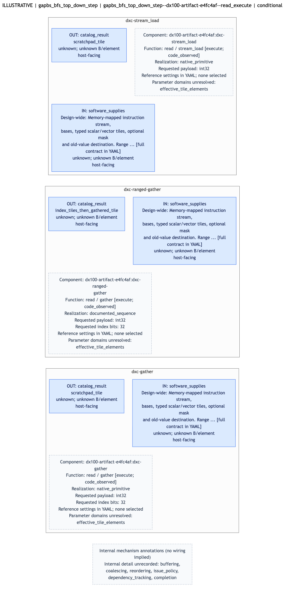

# Candidate diagram previews

[Intrinsic description](README.md) · [Draft YAML](intrinsic-draft.yaml) · [Full candidate evidence](candidate.yaml)

## Operation interfaces

## Source context

These are manual source-statement relations, not hardware wiring. Matched requests still need legality review; uncovered operations and side effects remain visible.

## Internal mechanisms

Located mechanism annotations are shown when supplied. The current checklist marks unrecorded internal details as unknown.

Mermaid sources: [interface](interface.mmd), [context](context.mmd), [mechanisms](mechanisms.mmd).
