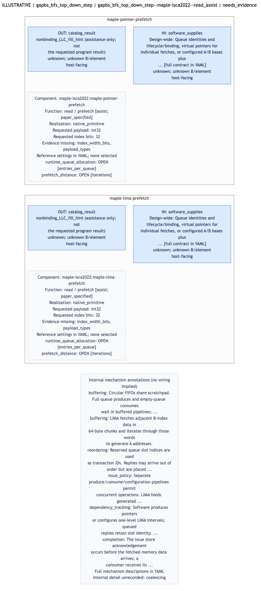
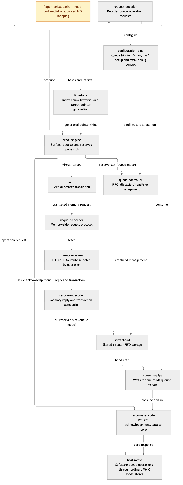

# Candidate diagram previews

[Intrinsic description](README.md) · [Draft YAML](intrinsic-draft.yaml) · [Full evidence](candidate.yaml)

## Operation interfaces

## Workload context

Manual statement relations with unmatched requests and retained side effects. These are not hardware wiring.

## Internal mechanisms

## Source-backed block paths

The paper logical paths distinguish queue-mode storage and early issue acknowledgement. No port widths, cycle schedule or complete BFS composition is inferred.

[Editable Mermaid](structure.mmd)

Mermaid sources: [interface](interface.mmd), [context](context.mmd), [mechanisms](mechanisms.mmd).
