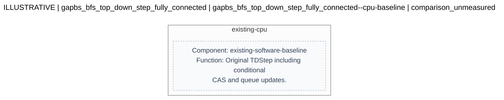
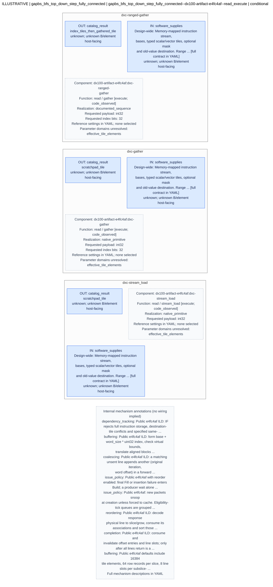

# Hardware candidate diagrams

Generated deterministically from the request YAML. This is a structural view, not a hardware correctness or performance verdict.

**ILLUSTRATIVE: not an evaluated hardware design.**

```yaml
contract_version: draft-0.2
record_kind: illustrative
kernel_id: gapbs_bfs_top_down_step_fully_connected
input_ref: examples/received/bfs-fully-connected.features.v1.2.yaml
input_revision: e4fc4afdf894f295442cef3604667a469fab8e62
catalog_ref: catalog/hardware-v0.1.yaml
catalog_revision: 0.1.9
source_file: hardware-request.yaml
source_sha256: bccb8aa5e05f40ccd746394519a79bc3c8f68d6d5881be29acd5ff513f4c9eed
```

## Workload context

```yaml
kernel:
  name: gapbs_bfs_top_down_step_fully_connected
  benchmark: gapbs
  algorithm: Breadth-First Search (Top-Down Push Traversal)
  source_file: benchmarks/gapbs/src/bfs.cc
  source_revision: e4fc4afdf894f295442cef3604667a469fab8e62
  function: TDStep
  graph_topology: fully_connected_graph (K_N, complete clique without self-loops)
  archetype: dense_consecutive_streaming_read_heavy
source_binding:
  status: revision_reported_matching
  reported_revision: e4fc4afdf894f295442cef3604667a469fab8e62
  reference_revision: e4fc4afdf894f295442cef3604667a469fab8e62
source_context:
  status: bound_manual_source_review
  ref: examples/bfs.source-observations.yaml
  sha256: 4abf18a26cb638f5243887cefcdf54fac45492ea9eeb4db5e2cbc5695560abac
  analysis_origin: Manual source review by Codex; not Peter feature extraction or
    profiling.
  mismatched_fields: []
  profile_statement_binding: not_confirmed_by_Peter
  record:
    contract_version: draft-0.2
    record_kind: source_analysis
    analysis_origin: Manual source review by Codex; not Peter feature extraction or
      profiling.
    kernel:
      id: gap-bfs-dx100
      repository: https://github.com/arkhadem/DX100
      revision: e4fc4afdf894f295442cef3604667a469fab8e62
      source_file: benchmarks/gapbs/src/bfs.cc
      local_source: sources/DX100/benchmarks/gapbs/src/bfs.cc
      feature_function_proposal: TDStep
      accelerated_reference_function: TDStepMAA
      selection_confirmed_by_team: false
      annotated_source_ref: null
    type_evidence:
    - file: benchmarks/gapbs/src/benchmark.h
      line: 29
      declaration: typedef int32_t NodeID;
    - file: benchmarks/gapbs/src/graph.h
      line: 90
      declaration: typedef int32_t SGOffset;
    statements:
    - id: bfs-td-frontier
      location:
        file: benchmarks/gapbs/src/bfs.cc
        start_line: 240
        end_line: 240
      code: NodeID u = queue.shared[i];
      operation: read
      access_expression: queue.shared[i]
      data_type: NodeID = int32_t
      array_element_bits: 32
      related_statement_ids: []
      interpretation: Sequential frontier read in logical i order; thread interleaving
        depends on execution.
    - id: bfs-td-row-bounds
      location:
        file: benchmarks/gapbs/src/bfs.cc
        start_line: 241
        end_line: 241
      code: for (int j = VertexOffsets[u]; j < VertexOffsets[u + 1]; j++) {
      operation: read
      access_expression: VertexOffsets[u] and VertexOffsets[u + 1]
      data_type: SGOffset = int32_t
      array_element_bits: 32
      related_statement_ids:
      - bfs-td-frontier
      interpretation: Two offset accesses indexed by a loaded vertex ID; the +1 is
        index arithmetic.
    - id: bfs-td-neighbor
      location:
        file: benchmarks/gapbs/src/bfs.cc
        start_line: 242
        end_line: 242
      code: NodeID v = g.out_neighbors_[j];
      operation: read
      access_expression: g.out_neighbors_[j]
      data_type: NodeID = int32_t
      array_element_bits: 32
      related_statement_ids:
      - bfs-td-row-bounds
      interpretation: Sequential within each adjacency segment; transitions between
        segments are data-dependent.
    - id: bfs-td-parent-read
      location:
        file: benchmarks/gapbs/src/bfs.cc
        start_line: 243
        end_line: 243
      code: NodeID curr_val = parent[v];
      operation: read
      access_expression: parent[v]
      data_type: NodeID = int32_t
      array_element_bits: 32
      related_statement_ids:
      - bfs-td-neighbor
      interpretation: Indirect read indexed by the loaded neighbor ID.
    - id: bfs-td-parent-cas
      location:
        file: benchmarks/gapbs/src/bfs.cc
        start_line: 247
        end_line: 247
      code: if (compare_and_swap(parent[v], curr_val, u)) {
      operation: read_modify_write
      access_expression: compare_and_swap(parent[v], curr_val, u)
      data_type: NodeID = int32_t
      array_element_bits: 32
      related_statement_ids:
      - bfs-td-frontier
      - bfs-td-neighbor
      - bfs-td-parent-read
      interpretation: Subtype is compare-and-swap, guarded by curr_val < 0; successful
        discovery controls queue insertion.
    - id: bfs-td-parent-store
      location:
        file: benchmarks/gapbs/src/bfs.cc
        start_line: 248
        end_line: 248
      code: parent[v] = u;
      operation: write
      access_expression: parent[v] = u
      data_type: NodeID = int32_t
      array_element_bits: 32
      related_statement_ids:
      - bfs-td-parent-cas
      interpretation: Explicit store inside the successful CAS branch; preserve in
        any analysis of side effects.
    - id: bfs-td-queue-append
      location:
        file: benchmarks/gapbs/src/bfs.cc
        start_line: 249
        end_line: 249
      code: lqueue.push_back(v);
      operation: call_with_side_effects
      access_expression: lqueue.push_back(v)
      data_type: NodeID = int32_t
      array_element_bits: 32
      related_statement_ids:
      - bfs-td-parent-cas
      interpretation: Thread-local queue buffering followed by lqueue.flush(); not
        a plain target-array access.
    unmeasured_features:
      reuse_distance: null
      reuse_frequency: null
      average_irregular_stride: null
      working_set_bytes: null
      runtime: null
      dataset: null
      profile_environment: null
    access_bindings:
    - array: queue.shared
      purpose: read
      statement_ids:
      - bfs-td-frontier
    - array: VertexOffsets
      purpose: read
      statement_ids:
      - bfs-td-row-bounds
    - array: g.out_neighbors_
      purpose: read
      statement_ids:
      - bfs-td-neighbor
    - array: parent
      purpose: read
      statement_ids:
      - bfs-td-parent-read
    - array: parent
      purpose: update
      statement_ids:
      - bfs-td-parent-cas
    request_groups:
    - id: bfs-td-traversal-and-discovery
      description: Source dependency chain from frontier load through row bounds and
        neighbor traversal to parent read and conditional CAS. The successful CAS
        also controls an explicit parent store and queue append. This context group
        is a manual proposal, not a proved single-accelerator mapping.
      statement_ids:
      - bfs-td-frontier
      - bfs-td-row-bounds
      - bfs-td-neighbor
      - bfs-td-parent-read
      - bfs-td-parent-cas
      - bfs-td-parent-store
      - bfs-td-queue-append
    notes:
    - These are source observations and proposed IDs for discussion, not measured
      features or the agreed Peter-to-Josh YAML.
    - Array elements are explicitly 32-bit types. A byte width of 4 applies to the
      artifact x86 build; no run was performed.
    - The exact graph and iteration/frontier determine reuse, irregular stride, duplicate
      destinations, and working set.
    - TDStep is proposed as feature input; TDStepMAA is existing accelerator code
      for reference. Confirm this choice with Peter/Yan-Ru.
    - Host while/do-while loops remain in the artifact. Do not model all loop control
      as accelerated.
evidence_status: reported_not_reproduced
rmw:
  kind: conditional_compare_and_swap
  reported_details:
    subtype: read_predominated_conditional_cas
    primitive: CAS(addr=&parent[v], expected=curr_val, new_val=u)
    execution_frequency:
      level_1: N - 1 executions (100% commit rate)
      level_2: 0 executions (bypassed entirely by if (curr_val < 0) filter)
    contention: zero lock contention across Level 2
  must_preserve: true
  phase_execution:
    level_1: N - 1 executions (100% commit rate)
    level_2: 0 executions (bypassed entirely by if (curr_val < 0) filter)
profiling_provenance: null
frontier_evolution_profile: null
profiling_context:
  evidence_status: reported_not_reproduced
  reported_command_line: null
  counter_measurement_scope: null
  frontier_measurement_scope: null
  cross_section_trial_binding: not_established
  aggregation_policy: retain_sections_separately_no_level_weighting_or_counter_join
  frontier_level_observations: []
reported_counters:
  measurement_platform: Intel Xeon Gold 6226R (16 threads, 2.90 GHz)
  comparison_vs_sparse_kronecker:
    instructions_per_cycle_ipc:
      sparse_kronecker: 0.39
      fully_connected: 2.68
    branch_miss_rate:
      sparse_kronecker: 11.07%
      fully_connected: 0.01%
    l1_dcache_miss_rate:
      sparse_kronecker: 15.14%
      fully_connected: 2.14%
    atomic_cas_overhead_cycles:
      sparse_kronecker: 15.97% (lock cmpxchg)
      fully_connected: 0.00% (lock cmpxchg)
methodology:
  status: reported_method_bound_to_input
  record_sha256: c1dc5b86c68c5bd0c16eab522b57690ba3131af70d3f5ed78c6f909fe0ac2d9a
  source_ref: examples/received/peter-measurement-methodology.v1.2.txt
  source_sha256: 0f8d421aed3aa68e85e258c8f7eb844a6d8f5c5f98d4a1d6f39f9e4e1e3ba385
  verification: instrumentation_not_reproduced
```

## Interpretation notes

```yaml
- Offline evidence retrieval and explicit exploration ordering; no LLM or evaluator
  calls.
- Each box is a catalog operation interface, not an inferred physical component. Unconnected
  operation options are not a proved composition.
- Reference sizes are preserved as references, not chosen tuning values. Unknown domains
  stay unknown.
- Mutable read targets are not assumed immutable. CAS support is queried separately;
  assistance and fetch-old behavior do not establish CAS execution.
- One slot each for reads, update execution and read assistance is considered before
  remaining alternatives, subject to budget. Within scopes, evidence completeness/code
  support precede stable IDs; none is a performance rank.
```

Blue ports face the host; green ports face memory; gray ports are internal; amber ports have an unknown role. Dashed boxes are explanatory annotations, not additional hardware components. Only connections explicitly present in the YAML are drawn. Unconnected ports remain visible.

Open values remain OPEN. Read the candidate details for constraints, behavior, and unresolved conditions.

**Operation-interface view:** boxes represent catalog operation contracts, including documented sequences. They are not physical components or a proof that the displayed operations compose. Reference settings are recorded separately from chosen values; unknown ABI details remain unknown.

## Candidate 1

[Mermaid source](candidate-01.mmd)



### Full candidate details

```yaml
id: gapbs_bfs_top_down_step_fully_connected--cpu-baseline
catalog_entry: cpu-baseline
status: comparison_unmeasured
rationale: Keep unchanged TDStep as the comparison. This does not assert that an accelerator
  is better.
target_access_ids:
- access-01
- access-02
- access-03
- access-04
target_statement_ids: []
hardware:
  blocks:
  - id: existing-cpu
    component_ref: existing-software-baseline
    function: Original TDStep including conditional CAS and queue updates.
    inputs: []
    outputs: []
    parameters: []
  connections: []
software_handoff:
  intrinsic_spec_owner: Peter
  boundary_notes: No new intrinsic for the unchanged baseline.
```

## Candidate 2

[Mermaid source](candidate-02.mmd)



### Full candidate details

```yaml
id: gapbs_bfs_top_down_step_fully_connected--dx100-artifact-e4fc4af--read_execute
catalog_entry: dx100-artifact-e4fc4af:read_execute
status: conditional
catalog_design_id: dx100-artifact-e4fc4af
catalog_design_revision: e4fc4afdf894f295442cef3604667a469fab8e62
catalog_record_kind: design_version
candidate_scope: read_execute
rationale: Source-scoped operation matches for this workload. This is an interface
  exploration option, not a composed accelerator, legal rewrite, or performance winner.
target_access_ids:
- access-01
- access-02
- access-03
- access-04
target_statement_ids:
- bfs-td-frontier
- bfs-td-neighbor
- bfs-td-parent-read
- bfs-td-row-bounds
request_groups:
- id: bfs-td-traversal-and-discovery
  description: Source dependency chain from frontier load through row bounds and neighbor
    traversal to parent read and conditional CAS. The successful CAS also controls
    an explicit parent store and queue append. This context group is a manual proposal,
    not a proved single-accelerator mapping.
  request_ids:
  - access-01-read
  - access-02-read
  - access-03-read
  - access-04-read
  - access-04-update
  statement_ids:
  - bfs-td-frontier
  - bfs-td-row-bounds
  - bfs-td-neighbor
  - bfs-td-parent-read
  - bfs-td-parent-cas
  - bfs-td-parent-store
  - bfs-td-queue-append
  dependencies:
  - from_statement: bfs-td-frontier
    to_statement: bfs-td-row-bounds
  - from_statement: bfs-td-row-bounds
    to_statement: bfs-td-neighbor
  - from_statement: bfs-td-neighbor
    to_statement: bfs-td-parent-read
  - from_statement: bfs-td-frontier
    to_statement: bfs-td-parent-cas
  - from_statement: bfs-td-neighbor
    to_statement: bfs-td-parent-cas
  - from_statement: bfs-td-parent-read
    to_statement: bfs-td-parent-cas
  - from_statement: bfs-td-parent-cas
    to_statement: bfs-td-parent-store
  - from_statement: bfs-td-parent-cas
    to_statement: bfs-td-queue-append
  context_statements:
  - id: bfs-td-frontier
    location:
      file: benchmarks/gapbs/src/bfs.cc
      start_line: 240
      end_line: 240
    code: NodeID u = queue.shared[i];
    operation: read
    access_expression: queue.shared[i]
    data_type: NodeID = int32_t
    array_element_bits: 32
    related_statement_ids: []
    interpretation: Sequential frontier read in logical i order; thread interleaving
      depends on execution.
  - id: bfs-td-row-bounds
    location:
      file: benchmarks/gapbs/src/bfs.cc
      start_line: 241
      end_line: 241
    code: for (int j = VertexOffsets[u]; j < VertexOffsets[u + 1]; j++) {
    operation: read
    access_expression: VertexOffsets[u] and VertexOffsets[u + 1]
    data_type: SGOffset = int32_t
    array_element_bits: 32
    related_statement_ids:
    - bfs-td-frontier
    interpretation: Two offset accesses indexed by a loaded vertex ID; the +1 is index
      arithmetic.
  - id: bfs-td-neighbor
    location:
      file: benchmarks/gapbs/src/bfs.cc
      start_line: 242
      end_line: 242
    code: NodeID v = g.out_neighbors_[j];
    operation: read
    access_expression: g.out_neighbors_[j]
    data_type: NodeID = int32_t
    array_element_bits: 32
    related_statement_ids:
    - bfs-td-row-bounds
    interpretation: Sequential within each adjacency segment; transitions between
      segments are data-dependent.
  - id: bfs-td-parent-read
    location:
      file: benchmarks/gapbs/src/bfs.cc
      start_line: 243
      end_line: 243
    code: NodeID curr_val = parent[v];
    operation: read
    access_expression: parent[v]
    data_type: NodeID = int32_t
    array_element_bits: 32
    related_statement_ids:
    - bfs-td-neighbor
    interpretation: Indirect read indexed by the loaded neighbor ID.
  - id: bfs-td-parent-cas
    location:
      file: benchmarks/gapbs/src/bfs.cc
      start_line: 247
      end_line: 247
    code: if (compare_and_swap(parent[v], curr_val, u)) {
    operation: read_modify_write
    access_expression: compare_and_swap(parent[v], curr_val, u)
    data_type: NodeID = int32_t
    array_element_bits: 32
    related_statement_ids:
    - bfs-td-frontier
    - bfs-td-neighbor
    - bfs-td-parent-read
    interpretation: Subtype is compare-and-swap, guarded by curr_val < 0; successful
      discovery controls queue insertion.
  - id: bfs-td-parent-store
    location:
      file: benchmarks/gapbs/src/bfs.cc
      start_line: 248
      end_line: 248
    code: parent[v] = u;
    operation: write
    access_expression: parent[v] = u
    data_type: NodeID = int32_t
    array_element_bits: 32
    related_statement_ids:
    - bfs-td-parent-cas
    interpretation: Explicit store inside the successful CAS branch; preserve in any
      analysis of side effects.
  - id: bfs-td-queue-append
    location:
      file: benchmarks/gapbs/src/bfs.cc
      start_line: 249
      end_line: 249
    code: lqueue.push_back(v);
    operation: call_with_side_effects
    access_expression: lqueue.push_back(v)
    data_type: NodeID = int32_t
    array_element_bits: 32
    related_statement_ids:
    - bfs-td-parent-cas
    interpretation: Thread-local queue buffering followed by lqueue.flush(); not a
      plain target-array access.
  basis: explicit_manual_source_group
  hardware_composition_status: not_established
  covered_request_ids:
  - access-01-read
  - access-02-read
  - access-03-read
  - access-04-read
  uncovered_request_ids:
  - access-04-update
  joint_execution_status: requires_mapping_and_composition_review
mechanism_context:
  annotations:
  - id: dx100-model-admission
    kind: dependency_tracking
    status: described
    description: 'Public e4fc4af ILD: IF rejects full instruction storage, destination-tile
      conflicts and specified same-range read/write conflicts within maa_id. Ready
      selection scans from a random offset and accepts Service/Finished source status;
      Fill still waits at unfinished condition/index elements in original iteration
      order. These checks do not establish all aliases or fairness.'
    claim_refs:
    - dx-internal-c13
    - dx-internal-c1
  - id: dx100-model-physical-grouping
    kind: buffering
    status: described
    description: 'Public e4fc4af ILD: form base + word_size * uint32 index, check
      virtual bounds, translate aligned blocks and decode configured Ramulator2 physical
      geometry into slice/grow keys. Unsent row records contain aligned physical lines;
      same-row overflow can use another record. Finite capacity failure retains the
      failed iteration. Geometry and merged-bank organization are configuration-dependent.'
    claim_refs:
    - dx-internal-c1
    - dx-internal-c3
    - dx-internal-c4
    - dx-internal-c5
  - id: dx100-model-duplicate-consumers
    kind: coalescing
    status: described
    description: 'Public e4fc4af ILD: a matching unsent line appends another (original
      iteration, word offset) in a forward next_itr list using first/last pointers
      without consuming another line slot. Duplicate words retain separate consumers.
      Compatible reads across units may also share a Port packet and waiter list;
      same-unit duplicate outstanding reads are rejected.'
    claim_refs:
    - dx-internal-c4
    - dx-internal-c5
    - dx-internal-c10
  - id: dx100-model-fixed-slice-cycle
    kind: issue_policy
    status: described
    description: 'Public e4fc4af with reorder enabled: final Fill or insertion failure
      enters Build; a producer wait alone does not. Each pass emits at most one line
      per active slice, channel fastest then rank, bank group, bank. Within a slice,
      scan row/line slots and other records of the same grow before another grow.
      Selection neither sorts addresses nor consults DRAM open-row state.'
    claim_refs:
    - dx-internal-c6
  - id: dx100-model-downstream-backpressure
    kind: issue_policy
    status: described
    description: 'Public e4fc4af: new packets snoop at creation unless forced to cache.
      Eligibility-tick queues are grouped by channel/cache bus; writes precede reads,
      and cache indirect classes precede stream classes. Failed sends retain queued
      work and block that channel/bus until retry or capacity release. Generator order
      does not guarantee downstream DRAM command order or fairness.'
    claim_refs:
    - dx-internal-c9
    - dx-internal-c10
  - id: dx100-model-result-placement
    kind: reordering
    status: described
    description: 'Public e4fc4af ILD: decode response physical line to slice/grow,
      consume its associations and sort those by itr, then write each returned word[wid]
      to TD[itr], including duplicate-word fanout. Sorting is within one response,
      not outgoing address sorting or global response ordering.'
    claim_refs:
    - dx-internal-c8
  - id: dx100-model-state-reuse
    kind: completion
    status: described
    description: 'Public e4fc4af ILD: consume and invalidate offset entries and line
      slots; only after all lines return is a row record reset/reusable. Sent records
      cannot accept additions. Request may fill released space, but batch transition
      waits for queued packets sent and received == expected; final Fill status is
      re-evaluated. Completion also checks producer readiness, modeled scratchpad/table
      latency and empty histories/tables before destination Finished/Ready and dependent-source
      publication. Host synchronization remains required.'
    claim_refs:
    - dx-internal-c7
    - dx-internal-c11
  - id: dx100-model-reference-choices
    kind: buffering
    status: described
    description: Public e4fc4af defaults include 16384 tile elements, 64 row records
      per slice, 8 line slots per subslice-row, 32 initial slices and 1-cycle row-table
      latency. Reorder is enabled; optional base-address/observed-row-count reconfiguration
      is disabled by default and is separate from fixed request selection. These are
      model defaults, not selected workload parameters or hardware timing evidence.
    claim_refs:
    - dx-internal-c12
  missing_kinds: []
  performance_hypotheses: []
  hardware_structure: null
  scope: Curated descriptions and explicit unknowns; no cycle model or inferred physical
    topology.
operation_options:
- operation:
    id: dxc-stream_load
    operation: read
    subtype: stream_load
    execution_role: execute
    address_patterns:
    - sequential
    - constant_stride
    support: code_observed
    claim_refs:
    - dxc-stream
    - dxc-mask
    result:
      form: scratchpad_tile
      old_value: not_applicable
      validity: Only active lanes below produced tile size have fresh payloads; masked
        finished slots retain prior storage.
      claim_refs:
      - dxc-stream
      - dxc-mask
    ordering:
      scope: stream instruction and result-slot association
      description: Page/line requests may overlap; response words are placed in iteration-indexed
        destination slots. Indirect duplicate-list behavior is not claimed for this
        read operation.
      claim_refs:
      - dxc-stream
      - dxc-region
    completion:
      event: Stream Response/Finish path calls finishInstructionCompute after its
        own request and latency checks; ready read responds when counter clears.
      visibility: Scratchpad payload is written before tile ready; end-to-end CPU
        read visibility still requires integration proof.
      claim_refs:
      - dxc-stream
      - dxc-ready-response
    datatype_notes: 32/64-bit payload paths; indirect indices are uint32; stream min/max/stride
      use int.
    limitations: []
    realization:
      kind: native_primitive
      description: STREAM_LD implementation consumes min/max/stride registers and
        optional mask.
      claim_refs:
      - dxc-stream
      - dxc-mask
    type_constraints:
      payload_types:
      - uint32
      - int32
      - float32
      - uint64
      - int64
      - float64
      index_width_bits: []
      claim_refs:
      - dxc-payload-types
      - dxc-stream
      notes: Observed API and execution type domain only. Index width is 32 for indirect
        operations, independent of payload width. Conditions read uint32; stream min/max/stride
        use int. Numerical equivalence, layout, signedness/range safety and tile allocation
        still need proof. Empty index_width_bits means not applicable to this direct
        stream primitive, not arbitrary-width indirect indexing.
  catalog_status: conditional_executor
  missing_capability_evidence: []
  matched_requests:
  - id: access-01-read
    access_id: access-01
    array: queue.shared
    purpose: read
    operation: read
    subtype: stream_load
    address_pattern: sequential
    payload_type: int32
    index_width_bits: null
    require_old_value: false
    mapping_basis: Reported sequential stream; actual bounds/stride and source binding
      remain requirements.
    mapping_status: proposed_from_reported_pattern
    missing_workload_evidence: []
    statement_ids:
    - bfs-td-frontier
    source_locations:
    - file: benchmarks/gapbs/src/bfs.cc
      start_line: 240
      end_line: 240
    statement_binding_status: manual_source_proposal
    mutable_target: false
- operation:
    id: dxc-gather
    operation: read
    subtype: gather
    execution_role: execute
    address_patterns:
    - indirect
    support: code_observed
    claim_refs:
    - dxc-gather
    - dxc-mask
    result:
      form: scratchpad_tile
      old_value: not_applicable
      validity: Only active lanes below produced tile size have fresh payloads; masked
        finished slots retain prior storage.
      claim_refs:
      - dxc-gather
      - dxc-mask
    ordering:
      scope: inspected instruction path
      description: Iteration slots retain result association. Local duplicate-list
        processing and pending-line forwarding are observed; full inter-instruction/alias/global
        order remains unproved.
      claim_refs:
      - dxc-local-order
      - dxc-region
    completion:
      event: Instruction finish after pending-count/accounting and modeled latency
        checks; destination tiles become ready.
      visibility: Scratchpad payload is written before tile ready; end-to-end CPU
        read visibility still requires integration proof.
      claim_refs:
      - dxc-completion
      - dxc-ready-response
    datatype_notes: 32/64-bit payload paths; indirect indices are uint32; stream min/max/stride
      use int.
    limitations:
    - Byte-offset product representability is required (dxc-byte-offset-domain); index_width_bits
      does not promise the entire unsigned index domain.
    realization:
      kind: native_primitive
      description: INDIR_LD with a supplied index tile; offset multiplication uses
        the payload word size and uint32 index.
      claim_refs:
      - dxc-gather
      - dxc-mask
    type_constraints:
      payload_types:
      - uint32
      - int32
      - float32
      - uint64
      - int64
      - float64
      index_width_bits:
      - 32
      claim_refs:
      - dxc-payload-types
      - dxc-gather
      - dxc-byte-offset-domain
      notes: Observed API and execution type domain only. Index width is 32 for indirect
        operations, independent of payload width. Conditions read uint32; stream min/max/stride
        use int. Numerical equivalence, layout, signedness/range safety and tile allocation
        still need proof. For indirect addressing on the examined ABI, word_size *
        index is a 32-bit unsigned product; prove it does not wrap before wider base
        addition.
  catalog_status: conditional_executor
  missing_capability_evidence: []
  matched_requests:
  - id: access-02-read
    access_id: access-02
    array: VertexOffsets
    purpose: read
    operation: read
    subtype: gather
    address_pattern: indirect
    payload_type: int32
    index_width_bits: 32
    require_old_value: false
    mapping_basis: Reported loaded-index expression; near-unit measured distance does
      not turn this into a proven stream.
    mapping_status: proposed_from_reported_pattern
    missing_workload_evidence: []
    statement_ids:
    - bfs-td-row-bounds
    source_locations:
    - file: benchmarks/gapbs/src/bfs.cc
      start_line: 241
      end_line: 241
    statement_binding_status: manual_source_proposal
    mutable_target: false
  - id: access-04-read
    access_id: access-04
    array: parent
    purpose: read
    operation: read
    subtype: gather
    address_pattern: indirect
    payload_type: int32
    index_width_bits: 32
    require_old_value: false
    mapping_basis: Reported loaded-index expression; near-unit measured distance does
      not turn this into a proven stream.
    mapping_status: proposed_from_reported_pattern
    missing_workload_evidence: []
    statement_ids:
    - bfs-td-parent-read
    source_locations:
    - file: benchmarks/gapbs/src/bfs.cc
      start_line: 243
      end_line: 243
    statement_binding_status: manual_source_proposal
    mutable_target: true
- operation:
    id: dxc-ranged-gather
    operation: read
    subtype: gather
    execution_role: execute
    address_patterns:
    - ranged_indirect
    support: code_observed
    claim_refs:
    - dxc-range
    - dxc-gather
    result:
      form: index_tiles_then_gathered_tile
      old_value: not_applicable
      validity: Range output is densely emitted only for active outer ranges; consume
        produced size and preserve continuation.
      claim_refs:
      - dxc-range
      - dxc-gather
    ordering:
      scope: range instruction followed by dependent gather
      description: Range loop emits outer/inner index pairs; subsequent gather uses
        result-slot association.
      claim_refs:
      - dxc-range
      - dxc-gather
    completion:
      event: Range Finish records continuation registers and both output sizes; the
        dependent gather completes separately; wait on the actual producer/consumer
        tile.
      visibility: 'unknown: CPU-visible completion needs integration proof.'
      claim_refs:
      - dxc-range
      - dxc-completion
      - dxc-ready-response
    datatype_notes: Range bounds uint32, continuation and stride int; payload datatype
      does not widen this path.
    limitations:
    - Composed operation, not a native gather-range opcode.
    - Negative or overflowing range/stride values not established as legal.
    - Byte-offset product representability is required (dxc-byte-offset-domain); index_width_bits
      does not promise the entire unsigned index domain.
    realization:
      kind: documented_sequence
      description: RangeFuser emits bounded outer/inner index tiles and continuation
        state; a dependent indirect-load instruction consumes indices.
      claim_refs:
      - dxc-range
      - dxc-gather
    type_constraints:
      payload_types:
      - int32
      index_width_bits:
      - 32
      claim_refs:
      - dxc-payload-types
      - dxc-bfs-composition
      - dxc-gather
      - dxc-range
      - dxc-byte-offset-domain
      notes: Only the inspected TDStepMAA sequence payload is listed. Primitive payload
        domains do not certify arbitrary composed sequences. Indices/masks and range
        bounds read as uint32; range continuation and stride use int. Positive representable
        stride/ranges and correct tile sizes required. For indirect addressing on
        the examined ABI, word_size * index is a 32-bit unsigned product; prove it
        does not wrap before wider base addition.
  catalog_status: conditional_executor
  missing_capability_evidence: []
  matched_requests:
  - id: access-03-read
    access_id: access-03
    array: g.out_neighbors_
    purpose: read
    operation: read
    subtype: gather
    address_pattern: ranged_indirect
    payload_type: int32
    index_width_bits: 32
    require_old_value: false
    mapping_basis: Reported CSR row bounds plus segmented neighbor traversal; range
      realization/continuation still needs mapping proof.
    mapping_status: proposed_from_reported_pattern
    missing_workload_evidence: []
    statement_ids:
    - bfs-td-neighbor
    source_locations:
    - file: benchmarks/gapbs/src/bfs.cc
      start_line: 242
      end_line: 242
    statement_binding_status: manual_source_proposal
    mutable_target: false
missing_evidence: []
source_evidence:
  claims:
    dx-internal-c1:
      source_refs:
      - dx100-indirect
      locator: 'dx100-indirect: 399–528 checkTileReady/checkElementReady/fillRowTable'
      statement: Fill advances my_i in original order only after success or a masked
        element; waits for condition/index element finish (4-byte accesses), reads
        uint32 index, forms base+word_size*idx, checks declared virtual range, aligns
        to block_size, translates aligned address, and stores word-index offset (vaddr-block_vaddr)/word_size.
        Masked ILD uses setFakeData, not an actual memory request; its exact value
        semantics are not established here.
      evidence_kind: code_inspection
      limitations:
      - Required-gather (ILD) mechanism scope; does not extend existing operation
        contracts, infer physical interfaces, or establish fairness, global coherence
        or performance.
      - Public e4fc4af model only; static inspection is not simulator execution or
        hardware validation.
    dx-internal-c10:
      source_refs:
      - dx100-port
      locator: 'dx100-port: 31–178 sendPacket; 562–581 recvTimingResp'
      statement: New Port packet snoops synchronously at packet creation unless global
        or per-instruction force-cache is set; isBlockCached selects LLC versus direct
        memory. Address-keyed outstanding packet map coalesces compatible reads across
        units with waiter unit IDs and response fanout; same-unit duplicate outstanding
        reads are rejected. This is separate from within-unit word-list coalescing.
        Write forwarding/replacement exists under same-unit assertions and is outside
        required-gather scope.
      evidence_kind: code_inspection
      limitations:
      - Required-gather (ILD) mechanism scope; does not extend existing operation
        contracts, infer physical interfaces, or establish fairness, global coherence
        or performance.
      - Public e4fc4af model only; static inspection is not simulator execution or
        hardware validation.
    dx-internal-c11:
      source_refs:
      - dx100-indirect
      - dx100-tables
      - dx100-maa
      - dx100-if
      locator: 'dx100-indirect: 330–398 checks/latency; 725–809 Request/Response;
        1158–1165 ILD receive; dx100-tables: 170–217 OffsetTable; 330–336 row all
        received; 472–495 slice recv; dx100-maa: 605–621 finishInstructionCompute;
        dx100-if: 303–336 finishInstructionCompute'
      statement: ILD completion needs all queued per-unit packets sent, all expected
        line responses received and modeled scratchpad/table latencies elapsed, with
        source tiles ready and histories empty. Responses invalidate OffsetTable entries
        and line slots; a row record becomes reusable only after all its lines return,
        resetting cursor/sent/valid. Final check_reset verifies table state; Decode
        resets for next instruction. MAA publishes destination Finished/Ready and
        IF clears instruction valid and updates dependent source status. Local completion
        is not proof of systemwide coherence, fences or liveness.
      evidence_kind: code_inspection
      limitations:
      - Required-gather (ILD) mechanism scope; does not extend existing operation
        contracts, infer physical interfaces, or establish fairness, global coherence
        or performance.
      - Public e4fc4af model only; static inspection is not simulator execution or
        hardware validation.
    dx-internal-c12:
      source_refs:
      - dx100-config
      - dx100-indirect
      locator: 'dx100-config: 13–39 parameters; dx100-indirect: 113–186 allocate;
        243–329 config selection'
      statement: 'Public defaults: tile 16384 elements; 64 row records/slice; 8 line
        slots/subslice-row; 32 initial slices; row-table latency 1 cycle; reorder
        enabled (no_reorder false); reconfigure false; force-cache false. Merged-bank
        configurations trade row-record totals against line slots per record. Optional
        enabled reconfiguration caches choice by base address and selects using previously
        observed unique row count; it is disabled by default and not invented adaptive
        intelligence. Config-cache replacement implementation is not assumed to be
        correct LRU.'
      evidence_kind: code_inspection
      limitations:
      - Required-gather (ILD) mechanism scope; does not extend existing operation
        contracts, infer physical interfaces, or establish fairness, global coherence
        or performance.
      - Public e4fc4af model only; static inspection is not simulator execution or
        hardware validation.
    dx-internal-c13:
      source_refs:
      - dx100-if
      locator: 'dx100-if: 185–231 pushInstruction; 250–300 getReady'
      statement: IF rejects admission on instruction-file full, destination tile conflicts
        with existing sources/destinations, and specified same-range read/write conflicts
        within maa_id; getReady begins scan at rand() offset, permits source Service/Finished
        with element-level checks downstream and optional region permit for multiple
        units. These local tests do not establish all writers/aliases or global ordering.
      evidence_kind: code_inspection
      limitations:
      - Required-gather (ILD) mechanism scope; does not extend existing operation
        contracts, infer physical interfaces, or establish fairness, global coherence
        or performance.
      - Public e4fc4af model only; static inspection is not simulator execution or
        hardware validation.
    dx-internal-c3:
      source_refs:
      - dx100-maa
      - dx100-indirect
      locator: 'dx100-maa: 257–337 addRamulator/map_addr; dx100-indirect: 113–241
        allocate/getRowTableIdx/getGrowAddr'
      statement: MAA obtains mapping geometry from Ramulator2; map_addr discards transaction
        offset bits, extracts channel bits, then column bits, then levels 1 through
        row (rank, bank-group, bank, row in this organization). Slice index is mixed-radix
        modulo CH/RA/BG/BA slice organization; grow key retains quotient BG/BA plus
        row for merged-bank configurations. Physical mapping is configuration-dependent;
        no fixed bit positions asserted.
      evidence_kind: code_inspection
      limitations:
      - Required-gather (ILD) mechanism scope; does not extend existing operation
        contracts, infer physical interfaces, or establish fairness, global coherence
        or performance.
      - Public e4fc4af model only; static inspection is not simulator execution or
        hardware validation.
    dx-internal-c4:
      source_refs:
      - dx100-tables-header
      - dx100-tables
      - dx100-port
      locator: 'dx100-tables-header: 44–169 OffsetTable/RowTableEntry/RowTableSlice;
        dx100-tables: 142–194 OffsetTable; 253–281 RowTableEntry::insert; dx100-port:
        102–147 sendPacket'
      statement: RowTableSlice has valid/sent row records; each RowTableEntry stores
        physical aligned line addr and first_itr/last_itr plus valid bits and send
        cursor. OffsetTable is tile-sized indexed by original iteration, with wid
        and next_itr. Code appends a forward list, whereas paper describes a backward
        Previous i list with a tail pointer. Code has no per-column H field; cache
        decision is in Port.cc.
      evidence_kind: code_inspection
      limitations:
      - Required-gather (ILD) mechanism scope; does not extend existing operation
        contracts, infer physical interfaces, or establish fairness, global coherence
        or performance.
      - Public e4fc4af model only; static inspection is not simulator execution or
        hardware validation.
    dx-internal-c5:
      source_refs:
      - dx100-tables
      locator: 'dx100-tables: 347–399 RowTableSlice::insert; 253–281 RowTableEntry::insert'
      statement: Insertion first matches an unsent row+line, then tries another unsent
        record with same grow key, then allocates first free row record. When one
        row record exhausts its line slots another record may represent the same DRAM
        row. Only absence of a usable/free row record causes insert=false. Matching
        line appends another original-element association without another line slot.
      evidence_kind: code_inspection
      limitations:
      - Required-gather (ILD) mechanism scope; does not extend existing operation
        contracts, infer physical interfaces, or establish fairness, global coherence
        or performance.
      - Public e4fc4af model only; static inspection is not simulator execution or
        hardware validation.
    dx-internal-c6:
      source_refs:
      - dx100-indirect
      - dx100-tables
      locator: 'dx100-indirect: 188–210 slice order; 621–724 Fill/Build; dx100-tables:
        433–470 find_next_grow_addr/get_send_grow_rowid/get_entry_send'
      statement: With reorder enabled, Fill enters Build on final fill or insertion
        failure; waits for producer element/tile readiness do not by themselves trigger
        Build. Build walks unique slice order constructed by bank outermost, bank-group,
        rank, channel innermost; repeatedly selects at most one line per active slice
        per pass until every slice exhausted. Slice selects first valid unsent record
        from cursor, emits line slots in allocated-slot order, then scans other records
        of same grow before another grow. No address sort or DRAM-open-row feedback
        drives selection. get_entry_send drain argument is unused.
      evidence_kind: code_inspection
      limitations:
      - Required-gather (ILD) mechanism scope; does not extend existing operation
        contracts, infer physical interfaces, or establish fairness, global coherence
        or performance.
      - Public e4fc4af model only; static inspection is not simulator execution or
        hardware validation.
    dx-internal-c7:
      source_refs:
      - dx100-indirect
      - dx100-tables
      locator: 'dx100-indirect: 506–514 failed insert; 725–764 Request; 1166–1173
        recvData; dx100-tables: 347–399 insert; 472–500 recv/is_full'
      statement: On failure my_i stays at failed element. Build generates currently
        admitted batch, marks exhausted row records sent; Request can continue fill
        as responses free records, but sent records cannot absorb additions. Request
        waits for all per-unit packets sent and cumulative received==expected, then
        returns Fill if fill not final, otherwise Response. Opportunistic fill flags
        in Request are local outputs not promoted to my_fill_finished; finalization
        is re-evaluated via Fill. Full-to-nonfull change of failed slice schedules
        execution. This is partial-batch progress, not proof of starvation freedom.
      evidence_kind: code_inspection
      limitations:
      - Required-gather (ILD) mechanism scope; does not extend existing operation
        contracts, infer physical interfaces, or establish fairness, global coherence
        or performance.
      - Public e4fc4af model only; static inspection is not simulator execution or
        hardware validation.
    dx-internal-c8:
      source_refs:
      - dx100-indirect
      - dx100-tables
      locator: 'dx100-indirect: 868–927 recvData; dx100-tables: 170–194 OffsetTable::get_entry_recv;
        313–336 RowTableEntry::recv; 472–498 RowTableSlice::recv'
      statement: Receive decodes physical line back to slice/grow, matches valid row
        and (when reorder enabled) sent row, consumes line association list, sorts
        returned entries by itr, copies response bytes and writes each ILD destination
        itr using wid. Duplicate words fan out to all recorded itr values. This sort
        restores within-response association order; it does not sort outgoing requests
        or impose global response order.
      evidence_kind: code_inspection
      limitations:
      - Required-gather (ILD) mechanism scope; does not extend existing operation
        contracts, infer physical interfaces, or establish fairness, global coherence
        or performance.
      - Public e4fc4af model only; static inspection is not simulator execution or
        hardware validation.
    dx-internal-c9:
      source_refs:
      - dx100-port
      - dx100-maa-header
      - dx100-cache-port
      - dx100-memory-port
      locator: 'dx100-port: 180–279 schedules; 301–560 send loops; dx100-maa-header:
        655–695 OutstandingPacket/CompareByTick; dx100-cache-port: 84–133 retry/send/capacity;
        dx100-memory-port: 80–92 retry/send'
      statement: Port queues are multisets compared only by eligibility tick, grouped
        by memory channel or cache bus. Memory sends eligible writes before reads
        per channel; cache does indirect writes, indirect reads, stream writes, stream
        reads, then stream misses only if indirect memory queues empty. A failed send
        blocks that channel/bus until retry/capacity release; unsent requests remain
        queued. Generated slice order is not a proof of final DRAM command order or
        fairness.
      evidence_kind: code_inspection
      limitations:
      - Required-gather (ILD) mechanism scope; does not extend existing operation
        contracts, infer physical interfaces, or establish fairness, global coherence
        or performance.
      - Public e4fc4af model only; static inspection is not simulator execution or
        hardware validation.
    dxc-bfs-composition:
      source_refs:
      - dx100-bfs
      - dx100-api
      - dx100-range
      - dx100-indirect
      locator: bfs.cc L146–183 and L201–220; MAA_gem5.hpp L270–383; RangeFuser.cc
        L186–239; IndirectAccess.cc L491–527 and L898–924
      statement: TDStepMAA composes frontier loads, gathered bounds, range generation
        and dependent neighbor/parent gathers. Its accelerated parent-update sequence
        is enclosed in an OpenMP critical region and uses masked store with old results;
        a separate small-frontier fallback uses CPU CAS.
      evidence_kind: code_inspection
      limitations:
      - This is a source example of instruction composition, not an equivalence proof
        or a supplied mapping for the received profiles.
      - Do not relabel the masked store as engine CAS or silently transfer its synchronization
        to arbitrary callers.
    dxc-byte-offset-domain:
      source_refs:
      - dx100-indirect-header
      - dx100-indirect
      locator: IndirectAccess.hh L113–116; IndirectAccess.cc L491–495
      statement: my_word_size is int and idx is uint32_t. On the examined ABI with
        32-bit int and uint32_t as unsigned int, their product is 32-bit unsigned
        before addition to the wider base address. A 32-bit index representation therefore
        does not imply the full uint32 index domain produces the intended byte offset.
      evidence_kind: research_inference
      limitations:
      - Source-expression inference under the stated ABI, supported by an isolated
        C++ expression example; no gem5 or accelerator execution was performed.
      - 'Require word_size * index to be representable before base addition: for positive
        4/8-byte elements on this ABI, index must be at most floor((2^32-1)/word_size),
        plus normal base/range/alias obligations.'
      - This is an unresolved mapping limitation, not a runtime-validated hardware
        bug or proposed code fix.
      - The range check applies after address computation; it does not by itself prove
        that a wrapped product still denotes the intended element.
    dxc-completion:
      source_refs:
      - dx100-port
      - dx100-indirect
      - dx100-maa
      - dx100-api
      - dx100-cpuport
      - dx100-spd-code
      locator: Port.cc L313–328 and L387–402; IndirectAccess.cc L742–791 and L843–866;
        MAA.cc L605–623; MAA_gem5.hpp L98–101; CpuSidePort.cc L295–315; SPD.cc L120–138;
        MAA.cc L652–676
      statement: No-response write acceptance/replacement feeds write accounting.
        Pending packet counts, response counts and modeled latency gate finish; finishInstructionCompute
        updates tile readiness. wait_ready performs a mapped load held until its ready
        counter clears, then mfence.
      evidence_kind: code_inspection
      limitations:
      - Accounting callbacks are not global visibility acknowledgements. Direct Ramulator2
        backing mutation is separately scoped in dxc-direct-backing.
      - The held status-read path is established; end-to-end CPU/compiler/coherence
        sequencing and safe reuse remain separate obligations.
    dxc-config:
      source_refs:
      - dx100-config
      - dx100-spd
      - dx100-spd-code
      - dx100-api
      locator: MAA.py L13–25; SPD.hh L30–34 and L93–94; SPD.cc L188–197; MAA_gem5.hpp
        L102–107
      statement: The pinned SimObject declares 16384 elements per tile, 64 row-table
        rows per slice, 8 entries per subslice row, 128 request-table addresses and
        16 entries per address; booleans permit no_reorder and force_cache_access.
        Configuration capacity is separate from uint16 tile-size storage, getSize/setSize
        arguments, and the API size read.
      evidence_kind: code_inspection
      limitations:
      - Defaults are not the effective configuration of every run; declaration alone
        does not establish a supported tuning domain.
      - An Unsigned configuration declaration does not establish arbitrary legal tile
        capacities; produced sizes must be representable in the independent bookkeeping
        paths.
    dxc-float-order:
      source_refs:
      - dx100-indirect
      locator: IndirectAccess.cc L975–984, L1019–1029, L1071–1081 and L1116–1126
      statement: The floating MIN/MAX comparison-and-select branches choose the incoming
        operand when the comparison is false. Operand order can therefore affect NaN
        and signed-zero results, so operator names alone do not prove bitwise commutative
        reductions.
      evidence_kind: research_inference
      limitations:
      - Inference from the inspected C++ expressions; no hardware execution or language-wide
        numerical contract is claimed.
      - Finite addition also requires an application-appropriate reordering tolerance.
    dxc-gather:
      source_refs:
      - dx100-api
      - dx100-indirect
      locator: MAA_gem5.hpp L270–287; IndirectAccess.cc L491–527 and L898–924
      statement: Indirect load API supplies array base, index tile, result tile and
        optional mask. Execution reads uint32 indices, calculates base + word_size
        * index, range-checks addresses and writes response words into original iteration
        slots.
      evidence_kind: code_inspection
      limitations:
      - 'Element width and index width are different: 64-bit payloads do not establish
        64-bit indices.'
    dxc-local-order:
      source_refs:
      - dx100-tables
      - dx100-indirect
      - dx100-port
      locator: Tables.cc L156–184; IndirectAccess.cc L898–1165; Port.cc L29–66
      statement: Offset entries append to a linked list and are consumed in that list
        order against a mutable line copy. Same-unit/same-MAA pending writeback data
        can be forwarded to a subsequent exclusive read, and pending write payloads
        can be replaced.
      evidence_kind: code_inspection
      limitations:
      - Scope is a collected response group and the specific pending same-line path.
        Not a global duplicate-index or inter-core order proof.
    dxc-mask:
      source_refs:
      - dx100-indirect
      - dx100-spd
      - dx100-stream
      locator: IndirectAccess.cc L491–527; SPD.hh L73–78; StreamAccess.cc L242–280
      statement: An inactive condition bypasses target access. setFakeData marks element
        completion without changing its stored payload; a ready/finished masked slot
        is not a valid newly returned value.
      evidence_kind: code_inspection
      limitations: []
    dxc-old:
      source_refs:
      - dx100-api
      - dx100-indirect
      locator: MAA_gem5.hpp L289–362; IndirectAccess.cc L898–1165
      statement: Scalar/vector indirect stores and RMW APIs accept an optional destination
        tile. recvData copies the current word to that tile before assignment or arithmetic;
        RMW execution has ADD/MIN/MAX branches for uint32, int32, float, uint64, int64
        and double.
      evidence_kind: code_inspection
      limitations:
      - No CAS comparison-and-update branch exists in the inspected indirect operation
        path.
      - No independent runtime correctness or CPU-interoperable atomicity is established.
      - Floating NaNs, signed zero, overflow and reordering require explicit workload
        numerical contracts.
    dxc-payload-types:
      source_refs:
      - dx100-api
      - dx100-indirect
      - dx100-stream
      locator: MAA_gem5.hpp L164–172 and L232–362; IndirectAccess.cc L491–527 and
        L898–1150; StreamAccess.cc L139–161 and L394–415
      statement: API get_data_type maps uint32_t, int32_t, float, uint64_t, int64_t
        and double. Read/store execution moves 32/64-bit words; RMW has six corresponding
        typed branches. Indirect index and condition reads remain uint32.
      evidence_kind: code_inspection
      limitations:
      - This supports type encodings and inspected execution paths, not a certified
        numerical or compiler ABI contract.
      - A supported 64-bit payload does not widen index, mask, range or continuation
        operands.
    dxc-range:
      source_refs:
      - dx100-api
      - dx100-range
      locator: MAA_gem5.hpp L364–383; RangeFuser.cc L86–94, L159–239
      statement: Range execution reads uint32 lower/upper bounds and mask, uses signed
        int continuation/stride registers, emits outer and inner indices while j <
        upper, and resumes after filling a finite tile.
      evidence_kind: code_inspection
      limitations:
      - The API template does not widen the implementation range-bound path.
      - Callers must establish positive stride, representable continuation values,
        matching tile lengths and bounded output consumption.
    dxc-ready-response:
      source_refs:
      - dx100-cpuport
      - dx100-maa
      - dx100-spd-code
      - dx100-api
      locator: CpuSidePort.cc L295–315; MAA.cc L652–676; SPD.cc L120–138; MAA_gem5.hpp
        L98–101
      statement: The artifact ready-range read returns constant 1 only when the tile-ready
        counter is zero; otherwise the response is retained. setTileReady later releases
        retained responses. The API performs one mapped read followed by mfence.
      evidence_kind: code_inspection
      limitations:
      - Core-0 status interface in this inspected path; no instruction generation
        tag is returned.
      - This is a held-read implementation, distinct from the paper polling description.
      - This local status-response chain does not prove the entire CPU/compiler/cache
        visibility composition.
    dxc-region:
      source_refs:
      - dx100-if
      - dx100-invalidator
      locator: IF.cc L185–219 and L280–296; Invalidator.cc L133–195 and L249–264
      statement: Issue checks conflicting accesses to the same region within an MAA
        ID; multi-MAA admission consults region ownership states and modeled transitions.
      evidence_kind: code_inspection
      limitations:
      - Declared-region checks do not prove coverage of physical aliases, arbitrary
        overlapping registrations or CPU atomics.
    dxc-reuse-scope:
      source_refs:
      - dx100-maa
      - dx100-spd
      - dx100-spd-code
      - dx100-if
      locator: MAA.cc L556–582 and L605–623; SPD.hh L30–34; SPD.cc L120–138; IF.cc
        L193–220
      statement: Dispatch/completion update ready counts for dst1/dst2/src1/src2 tile
        operands. condSpdID participates in scoreboard conflicts but is absent from
        those ready-count updates; ready is equality to zero in uint8 storage.
      evidence_kind: code_inspection
      limitations:
      - A condition-only tile wait is not established as a safe host reuse barrier.
      - 'No reachable counter-overflow defect is alleged: actual instruction admission
        and dependency bounds must be checked.'
      disposition: research_only_unresolved_mapping_obligation
    dxc-stream:
      source_refs:
      - dx100-api
      - dx100-stream
      locator: MAA_gem5.hpp L232–249; StreamAccess.cc L139–170, L222–280, L321–343
        and L394–403
      statement: Stream load uses min/max/stride registers and optional condition
        tile. Execution emits bounded strided accesses and writes fetched words to
        result slots; false conditions use setFakeData.
      evidence_kind: code_inspection
      limitations:
      - Nonpositive strides and overflow are not validated by this study.
  sources:
    dx100-abstract-memory:
      title: src/mem/abstract_mem.cc
      edition: e4fc4afdf894f295442cef3604667a469fab8e62
      url: https://github.com/arkhadem/DX100/blob/e4fc4afdf894f295442cef3604667a469fab8e62/src/mem/abstract_mem.cc
      locator_basis: One-based pinned source lines and named functions.
      sha256: 0f105226269e9dbda75db47bc1735c87ef40bd681ec9d14c981f74e5d00b7b7a
      document_type: source_code
      reviewed_on: '2026-09-29'
      retrieval_date: 2026-09-29 review/reuse; original acquisition unknown unless
        noted
    dx100-api:
      title: benchmarks/API/MAA_gem5.hpp
      edition: e4fc4afdf894f295442cef3604667a469fab8e62
      url: https://github.com/arkhadem/DX100/blob/e4fc4afdf894f295442cef3604667a469fab8e62/benchmarks/API/MAA_gem5.hpp
      locator_basis: One-based source lines and named functions at pinned commit.
      sha256: 5102335292a6ef1c3a7d7638d6d0791eb4bfd8c4cc8befe61afcd267f203c174
      document_type: source_code
      reviewed_on: '2026-09-29'
      retrieval_date: 2026-09-29 review/reuse; original acquisition unknown unless
        noted
    dx100-bfs:
      title: benchmarks/gapbs/src/bfs.cc
      edition: e4fc4afdf894f295442cef3604667a469fab8e62
      url: https://github.com/arkhadem/DX100/blob/e4fc4afdf894f295442cef3604667a469fab8e62/benchmarks/gapbs/src/bfs.cc
      locator_basis: One-based source lines and named functions at pinned commit.
      sha256: 6835fc42dfadcb60c1c3fae543f736903977f135fd7c55cd495c0e481b572465
      document_type: source_code
      reviewed_on: '2026-09-29'
      retrieval_date: 2026-09-29 review/reuse; original acquisition unknown unless
        noted
    dx100-cache-port:
      title: src/mem/MAA/CacheSidePort.cc
      edition: e4fc4afdf894f295442cef3604667a469fab8e62
      url: https://github.com/arkhadem/DX100/blob/e4fc4afdf894f295442cef3604667a469fab8e62/src/mem/MAA/CacheSidePort.cc
      locator_basis: One-based lines and named functions at pinned public commit;
        supplemental model evidence.
      sha256: 09d9df038ffde8b919b6ee3e0bfe7123f6d63e7ef38f058f4f22c2a4e1f92362
      document_type: source_code
      reviewed_on: '2026-10-02'
      retrieval_date: Preexisting corpus reused; original acquisition unknown
      provenance_notes:
      - Cached bytes independently hash-checked and exact mechanism locators inspected
        on 2026-10-02. Not authenticated to the paper evaluation or private/current
        virtualization.
    dx100-config:
      title: src/mem/MAA/MAA.py
      edition: e4fc4afdf894f295442cef3604667a469fab8e62
      url: https://github.com/arkhadem/DX100/blob/e4fc4afdf894f295442cef3604667a469fab8e62/src/mem/MAA/MAA.py
      locator_basis: One-based source lines and named functions at pinned commit.
      sha256: 347f0e08124bf9d951fb3ee24654074b5d681b71bc6168538c82dbd0b35856f2
      document_type: source_code
      reviewed_on: '2026-09-29'
      retrieval_date: 2026-09-29 review/reuse; original acquisition unknown unless
        noted
    dx100-cpuport:
      title: src/mem/MAA/CpuSidePort.cc
      edition: e4fc4afdf894f295442cef3604667a469fab8e62
      url: https://github.com/arkhadem/DX100/blob/e4fc4afdf894f295442cef3604667a469fab8e62/src/mem/MAA/CpuSidePort.cc
      locator_basis: One-based pinned source lines and named functions.
      sha256: 886a0c1bbd437916d2fac62a2aa194e01f6996fae65dc56241fad601c5f0103b
      document_type: source_code
      reviewed_on: '2026-09-29'
      retrieval_date: 2026-09-29 review/reuse; original acquisition unknown unless
        noted
    dx100-if:
      title: src/mem/MAA/IF.cc
      edition: e4fc4afdf894f295442cef3604667a469fab8e62
      url: https://github.com/arkhadem/DX100/blob/e4fc4afdf894f295442cef3604667a469fab8e62/src/mem/MAA/IF.cc
      locator_basis: One-based source lines and named functions at pinned commit.
      sha256: fd7dd67f35f63ff6ed9ef0b8ce36cb60cc6d63b20fe9c0796e648bff82da6561
      document_type: source_code
      reviewed_on: '2026-09-29'
      retrieval_date: 2026-09-29 review/reuse; original acquisition unknown unless
        noted
    dx100-indirect:
      title: src/mem/MAA/IndirectAccess.cc
      edition: e4fc4afdf894f295442cef3604667a469fab8e62
      url: https://github.com/arkhadem/DX100/blob/e4fc4afdf894f295442cef3604667a469fab8e62/src/mem/MAA/IndirectAccess.cc
      locator_basis: One-based source lines and named functions at pinned commit.
      sha256: 7e238a370f25ff5a7a1211548630a291d6358c32d8a199fc58bfacd37d1d35db
      document_type: source_code
      reviewed_on: '2026-09-29'
      retrieval_date: 2026-09-29 review/reuse; original acquisition unknown unless
        noted
    dx100-indirect-header:
      title: src/mem/MAA/IndirectAccess.hh
      edition: e4fc4afdf894f295442cef3604667a469fab8e62
      url: https://github.com/arkhadem/DX100/blob/e4fc4afdf894f295442cef3604667a469fab8e62/src/mem/MAA/IndirectAccess.hh
      locator_basis: One-based pinned source lines.
      sha256: 276bf31afe38c5877020ca706b4bce1922a1d6ae4cde387a1301a78d4c026249
      document_type: source_code
      reviewed_on: '2026-09-29'
      retrieval_date: 2026-09-29 review/reuse; original acquisition unknown unless
        noted
    dx100-invalidator:
      title: src/mem/MAA/Invalidator.cc
      edition: e4fc4afdf894f295442cef3604667a469fab8e62
      url: https://github.com/arkhadem/DX100/blob/e4fc4afdf894f295442cef3604667a469fab8e62/src/mem/MAA/Invalidator.cc
      locator_basis: One-based source lines and named functions at pinned commit.
      sha256: 9b93c3dda7a86aabc187b0e0215b18440eee3cb3739f1f51ab94c70a7a73484c
      document_type: source_code
      reviewed_on: '2026-09-29'
      retrieval_date: 2026-09-29 review/reuse; original acquisition unknown unless
        noted
    dx100-maa:
      title: src/mem/MAA/MAA.cc
      edition: e4fc4afdf894f295442cef3604667a469fab8e62
      url: https://github.com/arkhadem/DX100/blob/e4fc4afdf894f295442cef3604667a469fab8e62/src/mem/MAA/MAA.cc
      locator_basis: One-based source lines and named functions at pinned commit.
      sha256: 058395cbd171ccf3746fb524967d2d205cb8d622d4aa06e8eef530b00dc21299
      document_type: source_code
      reviewed_on: '2026-09-29'
      retrieval_date: 2026-09-29 review/reuse; original acquisition unknown unless
        noted
    dx100-maa-header:
      title: src/mem/MAA/MAA.hh
      edition: e4fc4afdf894f295442cef3604667a469fab8e62
      url: https://github.com/arkhadem/DX100/blob/e4fc4afdf894f295442cef3604667a469fab8e62/src/mem/MAA/MAA.hh
      locator_basis: One-based lines and named functions at pinned public commit;
        supplemental model evidence.
      sha256: fbf6a8bf8d9bc47b218afca6ea64d5ea1728bdac6754814aa83d4b7465366419
      document_type: source_code
      reviewed_on: '2026-10-02'
      retrieval_date: Preexisting corpus reused; original acquisition unknown
      provenance_notes:
      - Cached bytes independently hash-checked and exact mechanism locators inspected
        on 2026-10-02. Not authenticated to the paper evaluation or private/current
        virtualization.
    dx100-memory-port:
      title: src/mem/MAA/MemSidePort.cc
      edition: e4fc4afdf894f295442cef3604667a469fab8e62
      url: https://github.com/arkhadem/DX100/blob/e4fc4afdf894f295442cef3604667a469fab8e62/src/mem/MAA/MemSidePort.cc
      locator_basis: One-based lines and named functions at pinned public commit;
        supplemental model evidence.
      sha256: cb944fd310e4139fb94103810d1c46b13623b9cb08cdafb867d187d5c8b9efc3
      document_type: source_code
      reviewed_on: '2026-10-02'
      retrieval_date: Preexisting corpus reused; original acquisition unknown
      provenance_notes:
      - Cached bytes independently hash-checked and exact mechanism locators inspected
        on 2026-10-02. Not authenticated to the paper evaluation or private/current
        virtualization.
    dx100-port:
      title: src/mem/MAA/Port.cc
      edition: e4fc4afdf894f295442cef3604667a469fab8e62
      url: https://github.com/arkhadem/DX100/blob/e4fc4afdf894f295442cef3604667a469fab8e62/src/mem/MAA/Port.cc
      locator_basis: One-based source lines and named functions at pinned commit.
      sha256: 842f8bd8f0145c7711c09cdc2de331a66828c4e293e89772eb1870e6ef2b424f
      document_type: source_code
      reviewed_on: '2026-09-29'
      retrieval_date: 2026-09-29 review/reuse; original acquisition unknown unless
        noted
    dx100-ramulator:
      title: src/mem/ramulator2.cc
      edition: e4fc4afdf894f295442cef3604667a469fab8e62
      url: https://github.com/arkhadem/DX100/blob/e4fc4afdf894f295442cef3604667a469fab8e62/src/mem/ramulator2.cc
      locator_basis: One-based pinned source lines and named functions.
      sha256: 66ada813cea0c2391dae5561e67aa6449922af9ecbc1d1e883b21d56f0ce39e1
      document_type: source_code
      reviewed_on: '2026-09-29'
      retrieval_date: 2026-09-29 review/reuse; original acquisition unknown unless
        noted
    dx100-range:
      title: src/mem/MAA/RangeFuser.cc
      edition: e4fc4afdf894f295442cef3604667a469fab8e62
      url: https://github.com/arkhadem/DX100/blob/e4fc4afdf894f295442cef3604667a469fab8e62/src/mem/MAA/RangeFuser.cc
      locator_basis: One-based source lines and named functions at pinned commit.
      sha256: 27a3713469a44031829d638b3e865f714cd63a0423c493d78cbcc07dd9b7d42e
      document_type: source_code
      reviewed_on: '2026-09-29'
      retrieval_date: 2026-09-29 review/reuse; original acquisition unknown unless
        noted
    dx100-reference-script:
      title: scripts/sim.py
      edition: e4fc4afdf894f295442cef3604667a469fab8e62
      url: https://github.com/arkhadem/DX100/blob/e4fc4afdf894f295442cef3604667a469fab8e62/scripts/sim.py
      locator_basis: One-based pinned source lines and named functions.
      sha256: 82c8d78e4339f1be9249c0e92db8a8d5f9654310f1fe4dc91680da6a9e0f7681
      document_type: source_code
      reviewed_on: '2026-09-29'
      retrieval_date: 2026-09-29 review/reuse; original acquisition unknown unless
        noted
    dx100-spd:
      title: src/mem/MAA/SPD.hh
      edition: e4fc4afdf894f295442cef3604667a469fab8e62
      url: https://github.com/arkhadem/DX100/blob/e4fc4afdf894f295442cef3604667a469fab8e62/src/mem/MAA/SPD.hh
      locator_basis: One-based source lines and named functions at pinned commit.
      sha256: 70e02b0fea7693585fd9b8f318381c09e352df2fff58bb3f84021f4ea02e9737
      document_type: source_code
      reviewed_on: '2026-09-29'
      retrieval_date: 2026-09-29 review/reuse; original acquisition unknown unless
        noted
    dx100-spd-code:
      title: src/mem/MAA/SPD.cc
      edition: e4fc4afdf894f295442cef3604667a469fab8e62
      url: https://github.com/arkhadem/DX100/blob/e4fc4afdf894f295442cef3604667a469fab8e62/src/mem/MAA/SPD.cc
      locator_basis: One-based pinned source lines and named functions.
      sha256: 9e6bb3672be95954e8816c054b4032f95811a3085ca6df418aed90ad1e852b4a
      document_type: source_code
      reviewed_on: '2026-09-29'
      retrieval_date: 2026-09-29 review/reuse; original acquisition unknown unless
        noted
    dx100-stream:
      title: src/mem/MAA/StreamAccess.cc
      edition: e4fc4afdf894f295442cef3604667a469fab8e62
      url: https://github.com/arkhadem/DX100/blob/e4fc4afdf894f295442cef3604667a469fab8e62/src/mem/MAA/StreamAccess.cc
      locator_basis: One-based source lines and named functions at pinned commit.
      sha256: 5fe78a94f0d690396cdfbcdd9b0082e57cbdb4a6b445a7282b2533a33852d47b
      document_type: source_code
      reviewed_on: '2026-09-29'
      retrieval_date: 2026-09-29 review/reuse; original acquisition unknown unless
        noted
    dx100-tables:
      title: src/mem/MAA/Tables.cc
      edition: e4fc4afdf894f295442cef3604667a469fab8e62
      url: https://github.com/arkhadem/DX100/blob/e4fc4afdf894f295442cef3604667a469fab8e62/src/mem/MAA/Tables.cc
      locator_basis: One-based source lines and named functions at pinned commit.
      sha256: 9bd8aa4103fb6e7617fdd4c514a917329b8e7b8345738ed6e5d82f818df7dfa6
      document_type: source_code
      reviewed_on: '2026-09-29'
      retrieval_date: 2026-09-29 review/reuse; original acquisition unknown unless
        noted
    dx100-tables-header:
      title: src/mem/MAA/Tables.hh
      edition: e4fc4afdf894f295442cef3604667a469fab8e62
      url: https://github.com/arkhadem/DX100/blob/e4fc4afdf894f295442cef3604667a469fab8e62/src/mem/MAA/Tables.hh
      locator_basis: One-based lines and named functions at pinned public commit;
        supplemental model evidence.
      sha256: 5ea6a7caff7ca690aa9ce19096c0e686dfa52716e4dbf19d17348c9235011b43
      document_type: source_code
      reviewed_on: '2026-10-02'
      retrieval_date: Preexisting corpus reused; original acquisition unknown
      provenance_notes:
      - Cached bytes independently hash-checked and exact mechanism locators inspected
        on 2026-10-02. Not authenticated to the paper evaluation or private/current
        virtualization.
requirements:
- id: dxc-region-binding
  description: Bind actual bases, registered regions, aliases and permitted writers
    before mapping.
  scope: Addresses touched by selected operations; not all CPU memory
  claim_refs:
  - dxc-gather
  - dxc-region
  - dxc-completion
  verification: required
- id: dxc-widths
  description: Prove payload, uint32 index and range bounds, signed continuation/stride
    and sizes fit without truncation.
  scope: Each mapped input tile and range composition
  claim_refs:
  - dxc-gather
  - dxc-range
  - dxc-stream
  verification: required
- id: dxc-validity
  description: Propagate masks and produced sizes; never consume inactive old-value
    slots as fresh values.
  scope: Output lanes of masked reads/stores/RMW
  claim_refs:
  - dxc-mask
  - dxc-old
  verification: required
- id: dxc-observer
  description: Establish required observer visibility and safe tile/region reuse separately
    from instruction finish.
  scope: CPU consumption, memory updates and storage reuse
  claim_refs:
  - dxc-completion
  verification: required
- id: dxc-numerical
  description: Check duplicates and numerical equivalence for the requested result
    contract.
  scope: RMW operator, datatype and returned old values
  claim_refs:
  - dxc-old
  - dxc-local-order
  - dxc-float-order
  verification: required
- id: dxc-reuse
  description: Before host overwrites tiles, establish which live operands consume
    them and a completion barrier covering those consumers; condition-only ready state
    is insufficient evidence.
  scope: Tile reuse, especially masks and aliased/wide tile storage
  claim_refs:
  - dxc-reuse-scope
  - dxc-ready-response
  verification: required
- id: dxc-old-destination
  description: When old values are required, allocate and supply the optional destination
    tile and preserve it until all active results are consumed.
  scope: Scalar/vector stores and RMW operations requesting old values
  claim_refs:
  - dxc-old
  - dxc-mask
  verification: required
- id: dxc-byte-offset
  description: Prove byte-offset product and base-address addition representability
    for every active indirect index. On the examined 32-bit int/uint32 ABI require
    word_size * index < 2^32 before adding the base; 32-bit index encoding alone is
    insufficient.
  scope: All selected indirect loads, scalar/vector stores and RMW, including generated
    indices in ranged/chained sequences
  claim_refs:
  - dxc-byte-offset-domain
  - dxc-gather
  verification: required
- id: dxc-capacity
  description: Bind effective simulator/API tile configuration and prove every produced
    tile size fits its bookkeeping, alongside index/offset arithmetic and storage
    allocation. Do not infer a broad legal capacity range from Unsigned knobs.
  scope: Configured tile capacity, produced lengths, uint16 size bookkeeping and callers
    consuming those lengths
  claim_refs:
  - dxc-config
  - dxc-range
  verification: required
requirement_status: not_discharged_by_retrieval
limitations:
- Static code observation, not a runtime test.
- Do not inherit paper guarantees or private/virtualized extensions into this pinned
  public artifact.
- Array range width is narrower than a generic 64-bit payload capability.
parameter_contract:
- id: tile_elements
  unit: elements
  state: fixed_reference
  value: 16384
  domain: null
  claim_refs:
  - dxc-config
  notes: Pinned SimObject default only; effective run settings can override. Size
    bookkeeping is uint16; legal effective capacity must be established separately,
    not inferred from the Unsigned parameter type.
- id: row_table_rows_per_slice
  unit: rows
  state: fixed_reference
  value: 64
  domain: null
  claim_refs:
  - dxc-config
  notes: Pinned default, not a calibrated recommendation.
- id: row_table_entries_per_subslice_row
  unit: entries
  state: fixed_reference
  value: 8
  domain: null
  claim_refs:
  - dxc-config
  notes: Pinned default; geometry legality not independently established.
- id: effective_tile_elements
  unit: elements
  state: unknown
  value: null
  domain: null
  claim_refs:
  - dxc-config
  notes: Must bind a concrete run/configuration before execution; source default is
    a separate field. Size bookkeeping is uint16; legal effective capacity must be
    established separately, not inferred from the Unsigned parameter type.
selected_configuration: {}
unresolved_requirements:
- Received values are reported; raw profiling logs, build flags, dataset identity
  and per-run scope have not been bound/verified by this prototype.
- Retain conditional CAS for the kernel. A reported zero-execution second phase does
  not remove the discovery-phase update.
- Array-level features are usable for exploratory retrieval; exact statement IDs and
  profiled-source locations are still absent.
- Establish workload mapping, ownership/aliasing, concurrency, numeric domains, result
  validity and completion/visibility; read labels do not imply immutable memory.
- The catalog is not a physical building-block library; these operation options have
  not been proved composable.
hardware:
  blocks:
  - id: dxc-stream_load
    component_ref: dx100-artifact-e4fc4af:dxc-stream_load
    component_revision: e4fc4afdf894f295442cef3604667a469fab8e62
    view_kind: software_operation_contract_not_physical_block
    function: read / stream_load [execute; code_observed]
    input_contract_scope: design_wide_catalog_interface_not_an_operand_signature
    inputs:
    - id: software_supplies
      payload: 'Design-wide: Memory-mapped instruction stream, bases, typed scalar/vector
        tiles, optional mask and old-value destination. Range ... [full contract in
        YAML]'
      full_payload_contract: Memory-mapped instruction stream, bases, typed scalar/vector
        tiles, optional mask and old-value destination. Range continuation registers
        and lower/upper bound tiles for range composition.
      type: null
      element_bytes: null
      endpoint_role: host-facing
    outputs:
    - id: catalog_result
      payload: scratchpad_tile
      type: null
      element_bytes: null
      endpoint_role: host-facing
    behavior:
      ordering: Page/line requests may overlap; response words are placed in iteration-indexed
        destination slots. Indirect duplicate-list behavior is not claimed for this
        read operation.
      completion: Stream Response/Finish path calls finishInstructionCompute after
        its own request and latency checks; ready read responds when counter clears.
      visibility: Scratchpad payload is written before tile ready; end-to-end CPU
        read visibility still requires integration proof.
      result_validity: Only active lanes below produced tile size have fresh payloads;
        masked finished slots retain prior storage.
    parameters: []
    reference_parameters:
    - id: tile_elements
      unit: elements
      state: fixed_reference
      value: 16384
      domain: null
      claim_refs:
      - dxc-config
      notes: Pinned SimObject default only; effective run settings can override. Size
        bookkeeping is uint16; legal effective capacity must be established separately,
        not inferred from the Unsigned parameter type.
    - id: row_table_rows_per_slice
      unit: rows
      state: fixed_reference
      value: 64
      domain: null
      claim_refs:
      - dxc-config
      notes: Pinned default, not a calibrated recommendation.
    - id: row_table_entries_per_subslice_row
      unit: entries
      state: fixed_reference
      value: 8
      domain: null
      claim_refs:
      - dxc-config
      notes: Pinned default; geometry legality not independently established.
    unknown_parameters:
    - id: effective_tile_elements
      unit: elements
      state: unknown
      value: null
      domain: null
      claim_refs:
      - dxc-config
      notes: Must bind a concrete run/configuration before execution; source default
        is a separate field. Size bookkeeping is uint16; legal effective capacity
        must be established separately, not inferred from the Unsigned parameter type.
    operation_contract:
      id: dxc-stream_load
      operation: read
      subtype: stream_load
      execution_role: execute
      address_patterns:
      - sequential
      - constant_stride
      support: code_observed
      claim_refs:
      - dxc-stream
      - dxc-mask
      result:
        form: scratchpad_tile
        old_value: not_applicable
        validity: Only active lanes below produced tile size have fresh payloads;
          masked finished slots retain prior storage.
        claim_refs:
        - dxc-stream
        - dxc-mask
      ordering:
        scope: stream instruction and result-slot association
        description: Page/line requests may overlap; response words are placed in
          iteration-indexed destination slots. Indirect duplicate-list behavior is
          not claimed for this read operation.
        claim_refs:
        - dxc-stream
        - dxc-region
      completion:
        event: Stream Response/Finish path calls finishInstructionCompute after its
          own request and latency checks; ready read responds when counter clears.
        visibility: Scratchpad payload is written before tile ready; end-to-end CPU
          read visibility still requires integration proof.
        claim_refs:
        - dxc-stream
        - dxc-ready-response
      datatype_notes: 32/64-bit payload paths; indirect indices are uint32; stream
        min/max/stride use int.
      limitations: []
      realization:
        kind: native_primitive
        description: STREAM_LD implementation consumes min/max/stride registers and
          optional mask.
        claim_refs:
        - dxc-stream
        - dxc-mask
      type_constraints:
        payload_types:
        - uint32
        - int32
        - float32
        - uint64
        - int64
        - float64
        index_width_bits: []
        claim_refs:
        - dxc-payload-types
        - dxc-stream
        notes: Observed API and execution type domain only. Index width is 32 for
          indirect operations, independent of payload width. Conditions read uint32;
          stream min/max/stride use int. Numerical equivalence, layout, signedness/range
          safety and tile allocation still need proof. Empty index_width_bits means
          not applicable to this direct stream primitive, not arbitrary-width indirect
          indexing.
    software_interface:
      software_supplies: Memory-mapped instruction stream, bases, typed scalar/vector
        tiles, optional mask and old-value destination. Range continuation registers
        and lower/upper bound tiles for range composition.
      invocation: Pinned MAA_gem5.hpp calls encode instructions and issue fences;
        wait_ready is a held mapped status read followed by mfence in the inspected
        core-0 interface.
      outputs: Input-associated fetched/old values in scratchpad tiles; range indices;
        memory writes.
      claim_refs:
      - dxc-gather
      - dxc-stream
      - dxc-range
      - dxc-old
      - dxc-completion
      - dxc-ready-response
    missing_capability_evidence: []
    requested_payload_types:
    - int32
    requested_index_width_bits: []
  - id: dxc-gather
    component_ref: dx100-artifact-e4fc4af:dxc-gather
    component_revision: e4fc4afdf894f295442cef3604667a469fab8e62
    view_kind: software_operation_contract_not_physical_block
    function: read / gather [execute; code_observed]
    input_contract_scope: design_wide_catalog_interface_not_an_operand_signature
    inputs:
    - id: software_supplies
      payload: 'Design-wide: Memory-mapped instruction stream, bases, typed scalar/vector
        tiles, optional mask and old-value destination. Range ... [full contract in
        YAML]'
      full_payload_contract: Memory-mapped instruction stream, bases, typed scalar/vector
        tiles, optional mask and old-value destination. Range continuation registers
        and lower/upper bound tiles for range composition.
      type: null
      element_bytes: null
      endpoint_role: host-facing
    outputs:
    - id: catalog_result
      payload: scratchpad_tile
      type: null
      element_bytes: null
      endpoint_role: host-facing
    behavior:
      ordering: Iteration slots retain result association. Local duplicate-list processing
        and pending-line forwarding are observed; full inter-instruction/alias/global
        order remains unproved.
      completion: Instruction finish after pending-count/accounting and modeled latency
        checks; destination tiles become ready.
      visibility: Scratchpad payload is written before tile ready; end-to-end CPU
        read visibility still requires integration proof.
      result_validity: Only active lanes below produced tile size have fresh payloads;
        masked finished slots retain prior storage.
    parameters: []
    reference_parameters:
    - id: tile_elements
      unit: elements
      state: fixed_reference
      value: 16384
      domain: null
      claim_refs:
      - dxc-config
      notes: Pinned SimObject default only; effective run settings can override. Size
        bookkeeping is uint16; legal effective capacity must be established separately,
        not inferred from the Unsigned parameter type.
    - id: row_table_rows_per_slice
      unit: rows
      state: fixed_reference
      value: 64
      domain: null
      claim_refs:
      - dxc-config
      notes: Pinned default, not a calibrated recommendation.
    - id: row_table_entries_per_subslice_row
      unit: entries
      state: fixed_reference
      value: 8
      domain: null
      claim_refs:
      - dxc-config
      notes: Pinned default; geometry legality not independently established.
    unknown_parameters:
    - id: effective_tile_elements
      unit: elements
      state: unknown
      value: null
      domain: null
      claim_refs:
      - dxc-config
      notes: Must bind a concrete run/configuration before execution; source default
        is a separate field. Size bookkeeping is uint16; legal effective capacity
        must be established separately, not inferred from the Unsigned parameter type.
    operation_contract:
      id: dxc-gather
      operation: read
      subtype: gather
      execution_role: execute
      address_patterns:
      - indirect
      support: code_observed
      claim_refs:
      - dxc-gather
      - dxc-mask
      result:
        form: scratchpad_tile
        old_value: not_applicable
        validity: Only active lanes below produced tile size have fresh payloads;
          masked finished slots retain prior storage.
        claim_refs:
        - dxc-gather
        - dxc-mask
      ordering:
        scope: inspected instruction path
        description: Iteration slots retain result association. Local duplicate-list
          processing and pending-line forwarding are observed; full inter-instruction/alias/global
          order remains unproved.
        claim_refs:
        - dxc-local-order
        - dxc-region
      completion:
        event: Instruction finish after pending-count/accounting and modeled latency
          checks; destination tiles become ready.
        visibility: Scratchpad payload is written before tile ready; end-to-end CPU
          read visibility still requires integration proof.
        claim_refs:
        - dxc-completion
        - dxc-ready-response
      datatype_notes: 32/64-bit payload paths; indirect indices are uint32; stream
        min/max/stride use int.
      limitations:
      - Byte-offset product representability is required (dxc-byte-offset-domain);
        index_width_bits does not promise the entire unsigned index domain.
      realization:
        kind: native_primitive
        description: INDIR_LD with a supplied index tile; offset multiplication uses
          the payload word size and uint32 index.
        claim_refs:
        - dxc-gather
        - dxc-mask
      type_constraints:
        payload_types:
        - uint32
        - int32
        - float32
        - uint64
        - int64
        - float64
        index_width_bits:
        - 32
        claim_refs:
        - dxc-payload-types
        - dxc-gather
        - dxc-byte-offset-domain
        notes: Observed API and execution type domain only. Index width is 32 for
          indirect operations, independent of payload width. Conditions read uint32;
          stream min/max/stride use int. Numerical equivalence, layout, signedness/range
          safety and tile allocation still need proof. For indirect addressing on
          the examined ABI, word_size * index is a 32-bit unsigned product; prove
          it does not wrap before wider base addition.
    software_interface:
      software_supplies: Memory-mapped instruction stream, bases, typed scalar/vector
        tiles, optional mask and old-value destination. Range continuation registers
        and lower/upper bound tiles for range composition.
      invocation: Pinned MAA_gem5.hpp calls encode instructions and issue fences;
        wait_ready is a held mapped status read followed by mfence in the inspected
        core-0 interface.
      outputs: Input-associated fetched/old values in scratchpad tiles; range indices;
        memory writes.
      claim_refs:
      - dxc-gather
      - dxc-stream
      - dxc-range
      - dxc-old
      - dxc-completion
      - dxc-ready-response
    missing_capability_evidence: []
    requested_payload_types:
    - int32
    requested_index_width_bits:
    - 32
  - id: dxc-ranged-gather
    component_ref: dx100-artifact-e4fc4af:dxc-ranged-gather
    component_revision: e4fc4afdf894f295442cef3604667a469fab8e62
    view_kind: software_operation_contract_not_physical_block
    function: read / gather [execute; code_observed]
    input_contract_scope: design_wide_catalog_interface_not_an_operand_signature
    inputs:
    - id: software_supplies
      payload: 'Design-wide: Memory-mapped instruction stream, bases, typed scalar/vector
        tiles, optional mask and old-value destination. Range ... [full contract in
        YAML]'
      full_payload_contract: Memory-mapped instruction stream, bases, typed scalar/vector
        tiles, optional mask and old-value destination. Range continuation registers
        and lower/upper bound tiles for range composition.
      type: null
      element_bytes: null
      endpoint_role: host-facing
    outputs:
    - id: catalog_result
      payload: index_tiles_then_gathered_tile
      type: null
      element_bytes: null
      endpoint_role: host-facing
    behavior:
      ordering: Range loop emits outer/inner index pairs; subsequent gather uses result-slot
        association.
      completion: Range Finish records continuation registers and both output sizes;
        the dependent gather completes separately; wait on the actual producer/consumer
        tile.
      visibility: 'unknown: CPU-visible completion needs integration proof.'
      result_validity: Range output is densely emitted only for active outer ranges;
        consume produced size and preserve continuation.
    parameters: []
    reference_parameters:
    - id: tile_elements
      unit: elements
      state: fixed_reference
      value: 16384
      domain: null
      claim_refs:
      - dxc-config
      notes: Pinned SimObject default only; effective run settings can override. Size
        bookkeeping is uint16; legal effective capacity must be established separately,
        not inferred from the Unsigned parameter type.
    - id: row_table_rows_per_slice
      unit: rows
      state: fixed_reference
      value: 64
      domain: null
      claim_refs:
      - dxc-config
      notes: Pinned default, not a calibrated recommendation.
    - id: row_table_entries_per_subslice_row
      unit: entries
      state: fixed_reference
      value: 8
      domain: null
      claim_refs:
      - dxc-config
      notes: Pinned default; geometry legality not independently established.
    unknown_parameters:
    - id: effective_tile_elements
      unit: elements
      state: unknown
      value: null
      domain: null
      claim_refs:
      - dxc-config
      notes: Must bind a concrete run/configuration before execution; source default
        is a separate field. Size bookkeeping is uint16; legal effective capacity
        must be established separately, not inferred from the Unsigned parameter type.
    operation_contract:
      id: dxc-ranged-gather
      operation: read
      subtype: gather
      execution_role: execute
      address_patterns:
      - ranged_indirect
      support: code_observed
      claim_refs:
      - dxc-range
      - dxc-gather
      result:
        form: index_tiles_then_gathered_tile
        old_value: not_applicable
        validity: Range output is densely emitted only for active outer ranges; consume
          produced size and preserve continuation.
        claim_refs:
        - dxc-range
        - dxc-gather
      ordering:
        scope: range instruction followed by dependent gather
        description: Range loop emits outer/inner index pairs; subsequent gather uses
          result-slot association.
        claim_refs:
        - dxc-range
        - dxc-gather
      completion:
        event: Range Finish records continuation registers and both output sizes;
          the dependent gather completes separately; wait on the actual producer/consumer
          tile.
        visibility: 'unknown: CPU-visible completion needs integration proof.'
        claim_refs:
        - dxc-range
        - dxc-completion
        - dxc-ready-response
      datatype_notes: Range bounds uint32, continuation and stride int; payload datatype
        does not widen this path.
      limitations:
      - Composed operation, not a native gather-range opcode.
      - Negative or overflowing range/stride values not established as legal.
      - Byte-offset product representability is required (dxc-byte-offset-domain);
        index_width_bits does not promise the entire unsigned index domain.
      realization:
        kind: documented_sequence
        description: RangeFuser emits bounded outer/inner index tiles and continuation
          state; a dependent indirect-load instruction consumes indices.
        claim_refs:
        - dxc-range
        - dxc-gather
      type_constraints:
        payload_types:
        - int32
        index_width_bits:
        - 32
        claim_refs:
        - dxc-payload-types
        - dxc-bfs-composition
        - dxc-gather
        - dxc-range
        - dxc-byte-offset-domain
        notes: Only the inspected TDStepMAA sequence payload is listed. Primitive
          payload domains do not certify arbitrary composed sequences. Indices/masks
          and range bounds read as uint32; range continuation and stride use int.
          Positive representable stride/ranges and correct tile sizes required. For
          indirect addressing on the examined ABI, word_size * index is a 32-bit unsigned
          product; prove it does not wrap before wider base addition.
    software_interface:
      software_supplies: Memory-mapped instruction stream, bases, typed scalar/vector
        tiles, optional mask and old-value destination. Range continuation registers
        and lower/upper bound tiles for range composition.
      invocation: Pinned MAA_gem5.hpp calls encode instructions and issue fences;
        wait_ready is a held mapped status read followed by mfence in the inspected
        core-0 interface.
      outputs: Input-associated fetched/old values in scratchpad tiles; range indices;
        memory writes.
      claim_refs:
      - dxc-gather
      - dxc-stream
      - dxc-range
      - dxc-old
      - dxc-completion
      - dxc-ready-response
    missing_capability_evidence: []
    requested_payload_types:
    - int32
    requested_index_width_bits:
    - 32
  connections: []
  view_notice: Independent catalog operation interfaces. No physical port widths,
    component composition or unlisted connections are established by this drawing.
execution_plan:
  rmw: retain_original_CPU_update
  source_unchanged: true
  queue_updates: Retain discovery and append semantics; no rewrite has been generated.
software_handoff:
  intrinsic_spec_owner: Peter
  interface:
    software_supplies: Memory-mapped instruction stream, bases, typed scalar/vector
      tiles, optional mask and old-value destination. Range continuation registers
      and lower/upper bound tiles for range composition.
    invocation: Pinned MAA_gem5.hpp calls encode instructions and issue fences; wait_ready
      is a held mapped status read followed by mfence in the inspected core-0 interface.
    outputs: Input-associated fetched/old values in scratchpad tiles; range indices;
      memory writes.
    claim_refs:
    - dxc-gather
    - dxc-stream
    - dxc-range
    - dxc-old
    - dxc-completion
    - dxc-ready-response
  boundary_notes: Use the exact operation result/validity/ordering/completion contracts
    and source requirements. Assist is not execute; old values are not CAS; type domains
    do not prove valid indices. No C signature is synthesized here.
```

## Candidate 3

[Mermaid source](candidate-03.mmd)

```mermaid
---
title: "ILLUSTRATIVE | gapbs_bfs_top_down_step_fully_connected | gapbs_bfs_top_down_step_fully_connected--maple-isca2022--read_assist | needs_evidence"
config: {"theme": "neutral", "layout": "elk", "flowchart": {"htmlLabels": true, "wrappingWidth": 320, "nodeSpacing": 24, "rankSpacing": 60, "padding": 12}}
---
flowchart LR
  subgraph b0["maple-lima-prefetch"]
    direction TB
    b0_info["Component: maple-isca2022:maple-lima-prefetch<br/>Function: read / prefetch #91;assist;<br/>paper_specified#93;<br/>Realization: native_primitive<br/>Requested payload: int32<br/>Requested index bits: 32<br/>Evidence missing: index_width_bits,<br/>payload_types<br/>Reference settings in YAML; none selected<br/>runtime_queue_allocation: OPEN<br/>#91;entries_per_queue#93;<br/>prefetch_distance: OPEN #91;iterations#93;"]:::annotation
    b0_in0["IN: software_supplies<br/>Design-wide: Queue identities and<br/>lifecycle/binding, virtual pointers for<br/>individual fetches, or configured A/B bases plus<br/>... #91;full contract in YAML#93;<br/>unknown; unknown B/element<br/>host-facing"]:::hostPort
    b0_out0["OUT: catalog_result<br/>nonbinding_LLC_fill_hint (assistance only; not<br/>the requested program result)<br/>unknown; unknown B/element<br/>host-facing"]:::hostPort
  end
  subgraph b1["maple-pointer-prefetch"]
    direction TB
    b1_info["Component: maple-isca2022:maple-pointer-prefetch<br/>Function: read / prefetch #91;assist;<br/>paper_specified#93;<br/>Realization: native_primitive<br/>Requested payload: int32<br/>Requested index bits: 32<br/>Evidence missing: index_width_bits,<br/>payload_types<br/>Reference settings in YAML; none selected<br/>runtime_queue_allocation: OPEN<br/>#91;entries_per_queue#93;<br/>prefetch_distance: OPEN #91;iterations#93;"]:::annotation
    b1_in0["IN: software_supplies<br/>Design-wide: Queue identities and<br/>lifecycle/binding, virtual pointers for<br/>individual fetches, or configured A/B bases plus<br/>... #91;full contract in YAML#93;<br/>unknown; unknown B/element<br/>host-facing"]:::hostPort
    b1_out0["OUT: catalog_result<br/>nonbinding_LLC_fill_hint (assistance only; not<br/>the requested program result)<br/>unknown; unknown B/element<br/>host-facing"]:::hostPort
  end
  mechanism_info["Internal mechanism annotations (no wiring<br/>implied)<br/>buffering: Circular FIFOs share scratchpad.<br/>Full-queue produces and empty-queue consumes<br/>wait in buffered pipelines; ...<br/>buffering: LIMA fetches adjacent B-index data in<br/>64-byte chunks and iterates through those words<br/>to generate A addresses.<br/>reordering: Reserved queue slot indices are used<br/>as transaction IDs. Replies may arrive out of<br/>order but are placed ...<br/>issue_policy: Separate<br/>produce/consume/configuration pipelines permit<br/>concurrent operations. LIMA feeds generated ...<br/>dependency_tracking: Software produces pointers<br/>or configures one-level LIMA intervals; queued<br/>replies retain slot identity. ...<br/>completion: The issue store acknowledgement<br/>occurs before the fetched memory data arrives; a<br/>consumer receives its ...<br/>buffering: In public RTL 742a22d's ordinary non-<br/>invalidation consume path, reservation/occupancy<br/>and valid payload ...<br/>completion: In public RTL 742a22d's ordinary<br/>consume path, successful dequeue returns queue<br/>storage capacity with ...<br/>completion: completion: #123;#34;CLOSE#34;:<br/>#34;endpoint_disconnect_not_universal_drain#34;,<br/>#34;command_ACK#34;: #34;not_value_ready#34;, ...<br/>buffering: credit: #123;#34;CPU_final_effect#34;:<br/>#34;separate_obligation#34;, #34;release#34;:<br/>#34;consume_capture_dequeue#34;, #34;reserve#34;: ...<br/>buffering: grouping: #123;#34;final_A_address_sort#34;:<br/>#34;not_established#34;, #34;final_A_duplicate_merge#34;:<br/>#34;unknown#34;, #34;index#34;: ...<br/>other: interface: #123;#34;consumer#34;: #34;MMIO_CONSUME#34;,<br/>#34;delivery#34;: #34;queue_operand#34;, #34;producer#34;: ...<br/>other: memory_routes: #123;#34;choices#34;:<br/>#91;#34;coherent_LLC#34;, #34;direct_DRAM#34;#93;,<br/>#34;later_queue_value_coherence#34;: ...<br/>other: operation: #123;#34;consumer_arithmetic#34;: #34;CPU#34;,<br/>#34;expression#34;: #34;A#91;B#91;i#93;#93;#34;, #34;kind#34;:<br/>#34;required_LIMA_PRODUCE#34;#125;; ...<br/>reordering: response: #123;#34;arrival#34;:<br/>#34;may_be_out_of_order#34;, #34;association#34;:<br/>#34;reserved_slot_transaction_id#34;, #34;delivery#34;: ...<br/>issue_policy: scheduling: #123;#34;arbitration#34;:<br/>#34;eligible_queue_round_robin_in_inspected_paths#34;,<br/>#34;global_fairness#34;: ...<br/>buffering: state: #123;#34;capacity#34;:<br/>#34;configuration_specific_finite#34;,<br/>#34;range_admission#34;: #34;unlimited_unestablished#34;,<br/>...<br/>other: translations:<br/>#123;#34;fault_shootdown_integration#34;:<br/>#34;deployment_required#34;, #34;local_TLB_PTW#34;:<br/>#34;described#34;#125;; ...<br/>other: width: #123;#34;executable_illustration_bytes#34;:<br/>4, #34;inspected_payload_bytes#34;: #91;4, 8#93;#125;;<br/>basis=supplemental_source; ...<br/>Full mechanism descriptions in YAML<br/>Internal detail unrecorded: coalescing"]:::annotation
  classDef annotation fill:#f8fafc,stroke:#94a3b8,color:#334155,stroke-dasharray:3 3
  classDef hostPort fill:#dbeafe,stroke:#2563eb,color:#172554
  classDef memoryPort fill:#dcfce7,stroke:#16a34a,color:#14532d
  classDef internalPort fill:#f1f5f9,stroke:#64748b,color:#0f172a
  classDef unknownPort fill:#fef3c7,stroke:#d97706,color:#78350f
```



### Full candidate details

```yaml
id: gapbs_bfs_top_down_step_fully_connected--maple-isca2022--read_assist
catalog_entry: maple-isca2022:read_assist
status: needs_evidence
catalog_design_id: maple-isca2022
catalog_design_revision: ISCA2022-paper+public-742a22d-inspection
catalog_record_kind: design_version
candidate_scope: read_assist
rationale: Source-scoped operation matches for this workload. This is an interface
  exploration option, not a composed accelerator, legal rewrite, or performance winner.
target_access_ids:
- access-01
- access-02
- access-03
- access-04
target_statement_ids:
- bfs-td-frontier
- bfs-td-neighbor
- bfs-td-parent-read
- bfs-td-row-bounds
request_groups:
- id: bfs-td-traversal-and-discovery
  description: Source dependency chain from frontier load through row bounds and neighbor
    traversal to parent read and conditional CAS. The successful CAS also controls
    an explicit parent store and queue append. This context group is a manual proposal,
    not a proved single-accelerator mapping.
  request_ids:
  - access-01-read
  - access-02-read
  - access-03-read
  - access-04-read
  - access-04-update
  statement_ids:
  - bfs-td-frontier
  - bfs-td-row-bounds
  - bfs-td-neighbor
  - bfs-td-parent-read
  - bfs-td-parent-cas
  - bfs-td-parent-store
  - bfs-td-queue-append
  dependencies:
  - from_statement: bfs-td-frontier
    to_statement: bfs-td-row-bounds
  - from_statement: bfs-td-row-bounds
    to_statement: bfs-td-neighbor
  - from_statement: bfs-td-neighbor
    to_statement: bfs-td-parent-read
  - from_statement: bfs-td-frontier
    to_statement: bfs-td-parent-cas
  - from_statement: bfs-td-neighbor
    to_statement: bfs-td-parent-cas
  - from_statement: bfs-td-parent-read
    to_statement: bfs-td-parent-cas
  - from_statement: bfs-td-parent-cas
    to_statement: bfs-td-parent-store
  - from_statement: bfs-td-parent-cas
    to_statement: bfs-td-queue-append
  context_statements:
  - id: bfs-td-frontier
    location:
      file: benchmarks/gapbs/src/bfs.cc
      start_line: 240
      end_line: 240
    code: NodeID u = queue.shared[i];
    operation: read
    access_expression: queue.shared[i]
    data_type: NodeID = int32_t
    array_element_bits: 32
    related_statement_ids: []
    interpretation: Sequential frontier read in logical i order; thread interleaving
      depends on execution.
  - id: bfs-td-row-bounds
    location:
      file: benchmarks/gapbs/src/bfs.cc
      start_line: 241
      end_line: 241
    code: for (int j = VertexOffsets[u]; j < VertexOffsets[u + 1]; j++) {
    operation: read
    access_expression: VertexOffsets[u] and VertexOffsets[u + 1]
    data_type: SGOffset = int32_t
    array_element_bits: 32
    related_statement_ids:
    - bfs-td-frontier
    interpretation: Two offset accesses indexed by a loaded vertex ID; the +1 is index
      arithmetic.
  - id: bfs-td-neighbor
    location:
      file: benchmarks/gapbs/src/bfs.cc
      start_line: 242
      end_line: 242
    code: NodeID v = g.out_neighbors_[j];
    operation: read
    access_expression: g.out_neighbors_[j]
    data_type: NodeID = int32_t
    array_element_bits: 32
    related_statement_ids:
    - bfs-td-row-bounds
    interpretation: Sequential within each adjacency segment; transitions between
      segments are data-dependent.
  - id: bfs-td-parent-read
    location:
      file: benchmarks/gapbs/src/bfs.cc
      start_line: 243
      end_line: 243
    code: NodeID curr_val = parent[v];
    operation: read
    access_expression: parent[v]
    data_type: NodeID = int32_t
    array_element_bits: 32
    related_statement_ids:
    - bfs-td-neighbor
    interpretation: Indirect read indexed by the loaded neighbor ID.
  - id: bfs-td-parent-cas
    location:
      file: benchmarks/gapbs/src/bfs.cc
      start_line: 247
      end_line: 247
    code: if (compare_and_swap(parent[v], curr_val, u)) {
    operation: read_modify_write
    access_expression: compare_and_swap(parent[v], curr_val, u)
    data_type: NodeID = int32_t
    array_element_bits: 32
    related_statement_ids:
    - bfs-td-frontier
    - bfs-td-neighbor
    - bfs-td-parent-read
    interpretation: Subtype is compare-and-swap, guarded by curr_val < 0; successful
      discovery controls queue insertion.
  - id: bfs-td-parent-store
    location:
      file: benchmarks/gapbs/src/bfs.cc
      start_line: 248
      end_line: 248
    code: parent[v] = u;
    operation: write
    access_expression: parent[v] = u
    data_type: NodeID = int32_t
    array_element_bits: 32
    related_statement_ids:
    - bfs-td-parent-cas
    interpretation: Explicit store inside the successful CAS branch; preserve in any
      analysis of side effects.
  - id: bfs-td-queue-append
    location:
      file: benchmarks/gapbs/src/bfs.cc
      start_line: 249
      end_line: 249
    code: lqueue.push_back(v);
    operation: call_with_side_effects
    access_expression: lqueue.push_back(v)
    data_type: NodeID = int32_t
    array_element_bits: 32
    related_statement_ids:
    - bfs-td-parent-cas
    interpretation: Thread-local queue buffering followed by lqueue.flush(); not a
      plain target-array access.
  basis: explicit_manual_source_group
  hardware_composition_status: not_established
  covered_request_ids:
  - access-01-read
  - access-02-read
  - access-03-read
  - access-04-read
  uncovered_request_ids:
  - access-04-update
  joint_execution_status: requires_mapping_and_composition_review
mechanism_context:
  annotations:
  - id: maple-queues
    kind: buffering
    status: described
    description: Circular FIFOs share scratchpad. Full-queue produces and empty-queue
      consumes wait in buffered pipelines; configuration remains available.
    claim_refs:
    - maple-backpressure
    - maple-reference-config
  - id: maple-index-chunks
    kind: buffering
    status: described
    description: LIMA fetches adjacent B-index data in 64-byte chunks and iterates
      through those words to generate A addresses.
    claim_refs:
    - maple-lima
  - id: maple-response-association
    kind: reordering
    status: described
    description: Reserved queue slot indices are used as transaction IDs. Replies
      may arrive out of order but are placed into their associated FIFO slots for
      ordered consumption; this is response association, not a demonstrated DRAM-locality
      sort.
    claim_refs:
    - maple-queue-order
  - id: maple-pipelined-issue
    kind: issue_policy
    status: described
    description: Separate produce/consume/configuration pipelines permit concurrent
      operations. LIMA feeds generated requests into the produce path; a blocked queue
      need not stall other queues. No locality-aware A-address sorting policy is specified.
    claim_refs:
    - maple-backpressure
    - maple-lima
  - id: maple-host-dependencies
    kind: dependency_tracking
    status: described
    description: Software produces pointers or configures one-level LIMA intervals;
      queued replies retain slot identity. Dependencies needed to compute pointers/bounds
      stay in software unless the described LIMA operation covers them.
    claim_refs:
    - maple-api
    - maple-lima
    - maple-queue-order
  - id: maple-two-stage-completion
    kind: completion
    status: described
    description: The issue store acknowledgement occurs before the fetched memory
      data arrives; a consumer receives its data only on the queue-consume load response.
    claim_refs:
    - maple-acknowledgement
  - id: maple-pinned-head-readiness
    kind: buffering
    status: described
    description: In public RTL 742a22d's ordinary non-invalidation consume path, reservation/occupancy
      and valid payload are separate. The head and any additional piece required by
      the consume length must be valid before dequeue; ready later values do not bypass
      an unready head. Paper-evaluation configuration binding remains unknown.
    claim_refs:
    - maple-code-head-readiness
  - id: maple-pinned-credit-transfer
    kind: completion
    status: described
    description: In public RTL 742a22d's ordinary consume path, successful dequeue
      returns queue storage capacity with payload capture in the consume pipeline,
      before possible later NoC response delivery and CPU arithmetic. Admission, payload
      readiness, pipeline custody and CPU final use have distinct resource lifetimes.
    claim_refs:
    - maple-code-dequeue-custody
  - id: maple-target-coalescing
    kind: coalescing
    status: unknown
    description: null
    claim_refs: []
  - id: integration-maple-comparison_domain
    kind: other
    status: unknown
    description: null
    claim_refs: []
  - id: integration-maple-completion
    kind: completion
    status: described
    description: 'completion: {"CLOSE": "endpoint_disconnect_not_universal_drain",
      "command_ACK": "not_value_ready", "internal_LIMA_pointer_ACK": "individual_CPU_ACK_suppressed"};
      basis=source_with_limit; source-scoped, no operation-support widening'
    claim_refs:
    - integration-maple-P1
    - integration-maple-P5
    - integration-maple-A3
    - integration-maple-A6
  - id: integration-maple-credit
    kind: buffering
    status: described
    description: 'credit: {"CPU_final_effect": "separate_obligation", "release": "consume_capture_dequeue",
      "reserve": "owns_not_ready"}; basis=source_plus_consumer_obligation; source-scoped,
      no operation-support widening'
    claim_refs:
    - integration-maple-P1
    - integration-maple-A2
    - integration-maple-A3
  - id: integration-maple-grouping
    kind: buffering
    status: described
    description: 'grouping: {"final_A_address_sort": "not_established", "final_A_duplicate_merge":
      "unknown", "index": "B_spatial_chunks"}; basis=source_plus_explicit_unknown;
      source-scoped, no operation-support widening'
    claim_refs:
    - integration-maple-P3
    - integration-maple-A5
  - id: integration-maple-interface
    kind: other
    status: described
    description: 'interface: {"consumer": "MMIO_CONSUME", "delivery": "queue_operand",
      "producer": "bounded_range_submission"}; basis=source; source-scoped, no operation-support
      widening'
    claim_refs:
    - integration-maple-P1
    - integration-maple-P2
    - integration-maple-A1b
  - id: integration-maple-memory_routes
    kind: other
    status: described
    description: 'memory_routes: {"choices": ["coherent_LLC", "direct_DRAM"], "later_queue_value_coherence":
      "not_guaranteed"}; basis=source_with_limit; source-scoped, no operation-support
      widening'
    claim_refs:
    - integration-maple-P1
    - integration-maple-P5
  - id: integration-maple-operation
    kind: other
    status: described
    description: 'operation: {"consumer_arithmetic": "CPU", "expression": "A[B[i]]",
      "kind": "required_LIMA_PRODUCE"}; basis=source; source-scoped, no operation-support
      widening'
    claim_refs:
    - integration-maple-P2
    - integration-maple-A1
    - integration-maple-A1b
  - id: integration-maple-response
    kind: reordering
    status: described
    description: 'response: {"arrival": "may_be_out_of_order", "association": "reserved_slot_transaction_id",
      "delivery": "per_queue_valid_head_FIFO", "global_queue_order": "not_claimed"};
      basis=source; source-scoped, no operation-support widening'
    claim_refs:
    - integration-maple-P1
    - integration-maple-A2
    - integration-maple-A4
  - id: integration-maple-scheduling
    kind: issue_policy
    status: described
    description: 'scheduling: {"arbitration": "eligible_queue_round_robin_in_inspected_paths",
      "global_fairness": "not_proven"}; basis=supplemental_source_with_limit; source-scoped,
      no operation-support widening'
    claim_refs:
    - integration-maple-A3
    - integration-maple-A5
  - id: integration-maple-state
    kind: buffering
    status: described
    description: 'state: {"capacity": "configuration_specific_finite", "range_admission":
      "unlimited_unestablished", "storage": "partitioned_circular_reserved_valid_FIFO"};
      basis=source; source-scoped, no operation-support widening'
    claim_refs:
    - integration-maple-P3
    - integration-maple-A2
    - integration-maple-A5
    - integration-maple-A6
  - id: integration-maple-translations
    kind: other
    status: described
    description: 'translations: {"fault_shootdown_integration": "deployment_required",
      "local_TLB_PTW": "described"}; basis=source_with_limit; source-scoped, no operation-support
      widening'
    claim_refs:
    - integration-maple-P4
  - id: integration-maple-unknowns
    kind: other
    status: unknown
    description: null
    claim_refs: []
  - id: integration-maple-width
    kind: other
    status: described
    description: 'width: {"executable_illustration_bytes": 4, "inspected_payload_bytes":
      [4, 8]}; basis=supplemental_source; source-scoped, no operation-support widening'
    claim_refs:
    - integration-maple-A3
    - integration-maple-A5
  missing_kinds:
  - coalescing
  performance_hypotheses:
  - id: maple-latency-hiding
    description: Queue-backed asynchronous fetches may hide long memory latency when
      useful runahead and concurrent requests exceed producer/consumer communication
      costs.
    workload_conditions:
    - Stable source arrays and a legal producer/consumer split
    - Enough independent requests and queue space for runahead
    - Useful lookahead and compatible pointer/index/queue formats
    limiting_factors:
    - NoC/MMIO consume round-trip overhead
    - Queue-full/empty stalls, dependent address computation and translation misses
    - BFS mutable parent data fails the stable-array requirement without an additional
      mapping proof
    claim_refs:
    - maple-model-conditions
    - maple-stable-data
    - maple-backpressure
  hardware_structure:
    view_kind: paper_logical_paths_not_port_netlist
    blocks:
    - id: host-mmio
      description: Software queue operations through ordinary MMIO loads/stores
      claim_refs:
      - maple-structure
    - id: request-decoder
      description: Decodes queue operation requests
      claim_refs:
      - maple-structure
    - id: configuration-pipe
      description: Queue bindings/sizes, LIMA setup and MMU/debug control
      claim_refs:
      - maple-structure
    - id: lima-logic
      description: Index-chunk traversal and target pointer generation
      claim_refs:
      - maple-structure
    - id: produce-pipe
      description: Buffers requests and reserves queue slots
      claim_refs:
      - maple-structure
    - id: mmu
      description: Virtual pointer translation
      claim_refs:
      - maple-structure
    - id: request-encoder
      description: Memory-side request protocol
      claim_refs:
      - maple-structure
    - id: memory-system
      description: LLC or DRAM route selected by operation
      claim_refs:
      - maple-structure
    - id: response-decoder
      description: Memory reply and transaction association
      claim_refs:
      - maple-structure
    - id: queue-controller
      description: FIFO allocation/head/slot management
      claim_refs:
      - maple-structure
    - id: scratchpad
      description: Shared circular FIFO storage
      claim_refs:
      - maple-structure
    - id: consume-pipe
      description: Waits for and reads queued values
      claim_refs:
      - maple-structure
    - id: response-encoder
      description: Returns acknowledgement/data to core
      claim_refs:
      - maple-structure
    connections:
    - from_block: host-mmio
      to_block: request-decoder
      label: operation request
      claim_refs:
      - maple-structure
      - maple-queue-order
      - maple-acknowledgement
    - from_block: request-decoder
      to_block: configuration-pipe
      label: configure
      claim_refs:
      - maple-structure
      - maple-queue-order
      - maple-acknowledgement
    - from_block: request-decoder
      to_block: produce-pipe
      label: produce
      claim_refs:
      - maple-structure
      - maple-queue-order
      - maple-acknowledgement
    - from_block: request-decoder
      to_block: consume-pipe
      label: consume
      claim_refs:
      - maple-structure
      - maple-queue-order
      - maple-acknowledgement
    - from_block: configuration-pipe
      to_block: lima-logic
      label: bases and interval
      claim_refs:
      - maple-structure
      - maple-queue-order
      - maple-acknowledgement
    - from_block: configuration-pipe
      to_block: queue-controller
      label: bindings and allocation
      claim_refs:
      - maple-structure
      - maple-queue-order
      - maple-acknowledgement
    - from_block: lima-logic
      to_block: produce-pipe
      label: generated pointer/hint
      claim_refs:
      - maple-structure
      - maple-queue-order
      - maple-acknowledgement
    - from_block: produce-pipe
      to_block: queue-controller
      label: reserve slot (queue mode)
      claim_refs:
      - maple-structure
      - maple-queue-order
      - maple-acknowledgement
    - from_block: produce-pipe
      to_block: mmu
      label: virtual target
      claim_refs:
      - maple-structure
      - maple-queue-order
      - maple-acknowledgement
    - from_block: mmu
      to_block: request-encoder
      label: translated memory request
      claim_refs:
      - maple-structure
      - maple-queue-order
      - maple-acknowledgement
    - from_block: request-encoder
      to_block: memory-system
      label: fetch
      claim_refs:
      - maple-structure
      - maple-queue-order
      - maple-acknowledgement
    - from_block: memory-system
      to_block: response-decoder
      label: reply and transaction ID
      claim_refs:
      - maple-structure
      - maple-queue-order
      - maple-acknowledgement
    - from_block: response-decoder
      to_block: scratchpad
      label: fill reserved slot (queue mode)
      claim_refs:
      - maple-structure
      - maple-queue-order
      - maple-acknowledgement
    - from_block: queue-controller
      to_block: scratchpad
      label: slot/head management
      claim_refs:
      - maple-structure
      - maple-queue-order
      - maple-acknowledgement
    - from_block: scratchpad
      to_block: consume-pipe
      label: head data
      claim_refs:
      - maple-structure
      - maple-queue-order
      - maple-acknowledgement
    - from_block: consume-pipe
      to_block: response-encoder
      label: consumed value
      claim_refs:
      - maple-structure
      - maple-queue-order
      - maple-acknowledgement
    - from_block: produce-pipe
      to_block: response-encoder
      label: issue acknowledgement
      claim_refs:
      - maple-structure
      - maple-queue-order
      - maple-acknowledgement
    - from_block: response-encoder
      to_block: host-mmio
      label: core response
      claim_refs:
      - maple-structure
      - maple-queue-order
      - maple-acknowledgement
  scope: Curated descriptions and explicit unknowns; no cycle model or inferred physical
    topology.
operation_options:
- operation:
    id: maple-lima-prefetch
    operation: read
    subtype: prefetch
    execution_role: assist
    address_patterns:
    - indirect
    - ranged_indirect
    - sequential
    support: paper_specified
    claim_refs:
    - maple-api
    - maple-lima
    result:
      form: nonbinding_LLC_fill_hint
      old_value: not_applicable
      validity: CPU demand loads obtain the program result; a prefetched line may
        be replaced before use.
      claim_refs:
      - maple-api
      - maple-lima
      - maple-stable-data
    ordering:
      scope: Within a configured queue for queue mode; no program-result order for
        LLC hints
      description: LLC hints do not replace demand-load order or CPU update synchronization.
      claim_refs:
      - maple-queue-order
      - maple-stable-data
    completion:
      event: Prefetch command/fill has no authoritative program-result completion;
        demand accesses remain on the core.
      visibility: Shared-cache assistance only; CPU demand accesses determine program
        values.
      claim_refs:
      - maple-acknowledgement
      - maple-stable-data
    datatype_notes: Paper discusses 32-bit evaluation words and a RISCV64 system,
      but the complete payload/sign, index/bounds and pointer-width API domains are
      not established.
    type_constraints:
      payload_types: []
      index_width_bits: []
      notes: Empty domains are unknown. Do not infer 64-bit indices from the core
        ISA or complete int32/uint32 support from a four-byte evaluation element.
      claim_refs: []
    realization:
      kind: native_primitive
      description: LIMA requests speculative LLC fills for the supplied A[B[i]] or
        A=0 B[i] interval; it does not deliver queue values.
      claim_refs:
      - maple-api
      - maple-lima
    limitations:
    - Concrete API types, queue packing, numeric bounds and memory-route semantics
      need confirmation.
  catalog_status: needs_evidence
  missing_capability_evidence:
  - index_width_bits
  - payload_types
  matched_requests:
  - id: access-01-read
    access_id: access-01
    array: queue.shared
    purpose: read
    operation: read
    subtype: stream_load
    address_pattern: sequential
    payload_type: int32
    index_width_bits: null
    require_old_value: false
    mapping_basis: Reported sequential stream; actual bounds/stride and source binding
      remain requirements.
    mapping_status: proposed_from_reported_pattern
    missing_workload_evidence: []
    statement_ids:
    - bfs-td-frontier
    source_locations:
    - file: benchmarks/gapbs/src/bfs.cc
      start_line: 240
      end_line: 240
    statement_binding_status: manual_source_proposal
    mutable_target: false
  - id: access-02-read
    access_id: access-02
    array: VertexOffsets
    purpose: read
    operation: read
    subtype: gather
    address_pattern: indirect
    payload_type: int32
    index_width_bits: 32
    require_old_value: false
    mapping_basis: Reported loaded-index expression; near-unit measured distance does
      not turn this into a proven stream.
    mapping_status: proposed_from_reported_pattern
    missing_workload_evidence: []
    statement_ids:
    - bfs-td-row-bounds
    source_locations:
    - file: benchmarks/gapbs/src/bfs.cc
      start_line: 241
      end_line: 241
    statement_binding_status: manual_source_proposal
    mutable_target: false
  - id: access-03-read
    access_id: access-03
    array: g.out_neighbors_
    purpose: read
    operation: read
    subtype: gather
    address_pattern: ranged_indirect
    payload_type: int32
    index_width_bits: 32
    require_old_value: false
    mapping_basis: Reported CSR row bounds plus segmented neighbor traversal; range
      realization/continuation still needs mapping proof.
    mapping_status: proposed_from_reported_pattern
    missing_workload_evidence: []
    statement_ids:
    - bfs-td-neighbor
    source_locations:
    - file: benchmarks/gapbs/src/bfs.cc
      start_line: 242
      end_line: 242
    statement_binding_status: manual_source_proposal
    mutable_target: false
  - id: access-04-read
    access_id: access-04
    array: parent
    purpose: read
    operation: read
    subtype: gather
    address_pattern: indirect
    payload_type: int32
    index_width_bits: 32
    require_old_value: false
    mapping_basis: Reported loaded-index expression; near-unit measured distance does
      not turn this into a proven stream.
    mapping_status: proposed_from_reported_pattern
    missing_workload_evidence: []
    statement_ids:
    - bfs-td-parent-read
    source_locations:
    - file: benchmarks/gapbs/src/bfs.cc
      start_line: 243
      end_line: 243
    statement_binding_status: manual_source_proposal
    mutable_target: true
- operation:
    id: maple-pointer-prefetch
    operation: read
    subtype: prefetch
    execution_role: assist
    address_patterns:
    - indirect
    support: paper_specified
    claim_refs:
    - maple-api
    result:
      form: nonbinding_LLC_fill_hint
      old_value: not_applicable
      validity: No returned gather result, atomic result or fetched-data readiness
        promise.
      claim_refs:
      - maple-api
      - maple-stable-data
    ordering:
      scope: Within a configured queue for queue mode; no program-result order for
        LLC hints
      description: LLC hints do not replace demand-load order or CPU update synchronization.
      claim_refs:
      - maple-queue-order
      - maple-stable-data
    completion:
      event: Prefetch command/fill has no authoritative program-result completion;
        demand accesses remain on the core.
      visibility: Shared-cache assistance only; CPU demand accesses determine program
        values.
      claim_refs:
      - maple-acknowledgement
      - maple-stable-data
    datatype_notes: Paper discusses 32-bit evaluation words and a RISCV64 system,
      but the complete payload/sign, index/bounds and pointer-width API domains are
      not established.
    type_constraints:
      payload_types: []
      index_width_bits: []
      notes: Empty domains are unknown. Do not infer 64-bit indices from the core
        ISA or complete int32/uint32 support from a four-byte evaluation element.
      claim_refs: []
    realization:
      kind: native_primitive
      description: PREFETCH accepts a host-computed pointer for a speculative LLC
        fetch.
      claim_refs:
      - maple-api
    limitations:
    - Concrete API types, queue packing, numeric bounds and memory-route semantics
      need confirmation.
  catalog_status: needs_evidence
  missing_capability_evidence:
  - index_width_bits
  - payload_types
  matched_requests:
  - id: access-02-read
    access_id: access-02
    array: VertexOffsets
    purpose: read
    operation: read
    subtype: gather
    address_pattern: indirect
    payload_type: int32
    index_width_bits: 32
    require_old_value: false
    mapping_basis: Reported loaded-index expression; near-unit measured distance does
      not turn this into a proven stream.
    mapping_status: proposed_from_reported_pattern
    missing_workload_evidence: []
    statement_ids:
    - bfs-td-row-bounds
    source_locations:
    - file: benchmarks/gapbs/src/bfs.cc
      start_line: 241
      end_line: 241
    statement_binding_status: manual_source_proposal
    mutable_target: false
  - id: access-04-read
    access_id: access-04
    array: parent
    purpose: read
    operation: read
    subtype: gather
    address_pattern: indirect
    payload_type: int32
    index_width_bits: 32
    require_old_value: false
    mapping_basis: Reported loaded-index expression; near-unit measured distance does
      not turn this into a proven stream.
    mapping_status: proposed_from_reported_pattern
    missing_workload_evidence: []
    statement_ids:
    - bfs-td-parent-read
    source_locations:
    - file: benchmarks/gapbs/src/bfs.cc
      start_line: 243
      end_line: 243
    statement_binding_status: manual_source_proposal
    mutable_target: true
missing_evidence:
- index_width_bits
- payload_types
source_evidence:
  claims:
    integration-maple-A1:
      source_refs:
      - integration-maple-api-dcp_maple-h
      locator: lines [64, 119]
      statement: Mode opcodes and MMIO register offsets
      evidence_kind: code_inspection
      limitations:
      - Exact reviewed source edition only; no simulator, RTL equivalence or performance
        acceptance.
    integration-maple-A1b:
      source_refs:
      - integration-maple-api-dcp_maple-h
      locator: lines [276, 407]
      statement: Partition/configuration and packed begin/end range submission
      evidence_kind: code_inspection
      limitations:
      - Exact reviewed source edition only; no simulator, RTL equivalence or performance
        acceptance.
    integration-maple-A2:
      source_refs:
      - integration-maple-rtl-dcp_fifo_ctrl-v
      locator: lines [279, 389]
      statement: Valid head controls readiness; allocation and dequeue manage circular
        used/valid states
      evidence_kind: code_inspection
      limitations:
      - Exact reviewed source edition only; no simulator, RTL equivalence or performance
        acceptance.
    integration-maple-A3:
      source_refs:
      - integration-maple-rtl-maple-sv
      locator: lines [232, 641]
      statement: Consume capture/dequeue release, required reservation+translation,
        issue and CPU versus internal-loop ACK
      evidence_kind: code_inspection
      limitations:
      - Exact reviewed source edition only; no simulator, RTL equivalence or performance
        acceptance.
    integration-maple-A4:
      source_refs:
      - integration-maple-rtl-dcp_pipe-sv
      locator: lines [920, 988]
      statement: Chunk namespace versus final FIFO slot reply routing
      evidence_kind: code_inspection
      limitations:
      - Exact reviewed source edition only; no simulator, RTL equivalence or performance
        acceptance.
    integration-maple-A5:
      source_refs:
      - integration-maple-rtl-dcp_chunk_req-v
      locator: lines [120, 522]
      statement: Finite chunks and word masks, RR arbitration, A scaling, SRAM and
        partial-chunk handling
      evidence_kind: code_inspection
      limitations:
      - Exact reviewed source edition only; no simulator, RTL equivalence or performance
        acceptance.
    integration-maple-A6:
      source_refs:
      - integration-maple-rtl-dcp_chunk_req-v
      locator: lines [541, 560]
      statement: Four-entry per-queue range buffer has unconnected ready output; unlimited
        safe submission unestablished
      evidence_kind: code_inspection
      limitations:
      - Exact reviewed source edition only; no simulator, RTL equivalence or performance
        acceptance.
    integration-maple-P1:
      source_refs:
      - integration-maple-paper
      locator: §3.1; Fig3 steps1–6 and A–C
      statement: Required queue API, slot ID response association and pointer-produce
        ACK separate from consume
      evidence_kind: paper_specification
      limitations:
      - Exact reviewed source edition only; no simulator, RTL equivalence or performance
        acceptance.
    integration-maple-P2:
      source_refs:
      - integration-maple-paper
      locator: §3.2; Fig4
      statement: LIMA versus required LIMA_PRODUCE; hardware range traversal
      evidence_kind: paper_specification
      limitations:
      - Exact reviewed source edition only; no simulator, RTL equivalence or performance
        acceptance.
    integration-maple-P3:
      source_refs:
      - integration-maple-paper
      locator: §3.4; Fig6
      statement: Three pipelines; runtime partitioning; full/empty blocking; B chunk
        word walker
      evidence_kind: paper_specification
      limitations:
      - Exact reviewed source edition only; no simulator, RTL equivalence or performance
        acceptance.
    integration-maple-P4:
      source_refs:
      - integration-maple-paper
      locator: §3.5
      statement: MAPLE local fully associative 16-entry TLB, PTW, faults and shootdowns
      evidence_kind: paper_specification
      limitations:
      - Exact reviewed source edition only; no simulator, RTL equivalence or performance
        acceptance.
    integration-maple-P5:
      source_refs:
      - integration-maple-paper
      locator: §3.6
      statement: MMIO acknowledgment, paths, lack of later coherence, absent tapeout
        speculative dequeue
      evidence_kind: paper_specification
      limitations:
      - Exact reviewed source edition only; no simulator, RTL equivalence or performance
        acceptance.
    maple-acknowledgement:
      source_refs:
      - maple-paper
      locator: PDF p.5, §3.1 steps 1–6 and A–C; p.7 §3.6
      statement: The core retires the pointer-produce store on MAPLE acknowledgement
        before the memory reply arrives. The reply later fills the reserved queue
        entry. A consume finishes when its load response returns the queue value.
      evidence_kind: paper_specification
      limitations:
      - Pointer-produce acknowledgement is not fetched-data readiness or a general
        shared-memory visibility fence.
    maple-api:
      source_refs:
      - maple-paper
      locator: PDF pp.4–5, §§3.1–3.2, Figs.2–4
      statement: MMIO queue operations initialize and bind queues, enqueue data or
        pointers, and consume values. PRODUCE_PTR requests a fetch whose value is
        delivered through a queue; LIMA_PRODUCE supplies an indexed range of values
        to a queue, while LIMA and PREFETCH target the LLC.
      evidence_kind: paper_specification
      limitations:
      - API names and abstract arguments are described, but concrete C types, header,
        packing and index-width domains are not established by this paper.
    maple-backpressure:
      source_refs:
      - maple-paper
      locator: PDF p.6, §3.4, Fig.6
      statement: Configuration, produce and consume use separate pipelines. Full queues
        hold produces until entries are consumed; empty queues hold consumes until
        data is available, without polling. Requests to other queues can progress
        while one queue is blocked.
      evidence_kind: paper_specification
      limitations:
      - Paper descriptions do not provide a complete arbitration, fairness or cycle-level
        model for this integration.
    maple-code-dequeue-custody:
      source_refs:
      - maple-fifo-rtl
      - maple-consume-rtl
      locator: dcp_fifo_ctrl.v L191–196, L303–325 and L364–374; maple.sv L290–351
      statement: In the pinned RTL's ordinary consume path, the successful FIFO-decrement
        handshake advances the head and invalidates consumed storage while the consume
        path captures the data into pipeline registers. NoC response delivery and
        CPU use can occur later. Queue-credit release and CPU consumption are distinct
        events.
      evidence_kind: code_inspection
      limitations:
      - This describes local ownership transfer in the inspected pipeline, not application
        completion, a universal CLOSE/drain barrier, fault recovery or global visibility.
    maple-code-head-readiness:
      source_refs:
      - maple-fifo-rtl
      locator: dcp_fifo_ctrl.v L191–196, L284–325 and L354–374
      statement: In the pinned RTL's ordinary consume path outside reset/invalidation,
        occupied/reserved state is separate from valid-data state. Consume eligibility
        requires a valid head and, when the consume-length flag requires it, a valid
        adjacent piece. Reservation alone does not make a value consumable; an unready
        head cannot be bypassed on this path.
      evidence_kind: code_inspection
      limitations:
      - Configuration widths and complete API packing remain unbound; these state
        predicates do not establish a general typed payload/index domain or end-to-end
        fairness.
    maple-future-atomics:
      source_refs:
      - maple-paper
      locator: PDF p.4, §3 opening; p.7 §3.6 Extensible
      statement: Read-modify-write atomics are mentioned as a possible extension of
        the programming model. The examined API and implementation description establishes
        loads, queues and prefetching, not a MAPLE CAS executor.
      evidence_kind: paper_specification
      limitations:
      - An extensible opcode space is not current CAS support; absence of a contract
        is recorded as unknown, not a universal impossibility.
    maple-lima:
      source_refs:
      - maple-paper
      locator: PDF pp.5–6, §§3.2,3.4, Fig.6
      statement: LIMA accepts two array bases and caller-provided begin/end bounds
        for A[B[i]]; A=0 requests B[i]. It reads adjacent B data in 64-byte chunks
        into scratchpad, computes target addresses word by word, and feeds pointer-fetch
        or LLC-prefetch requests into the produce path.
      evidence_kind: paper_specification
      limitations:
      - Caller-provided range bounds do not prove autonomous nested CSR traversal
        or arbitrary index functions.
      - A shared B chunk is not evidence that arbitrary A addresses are sorted or
        merged by locality.
    maple-model-conditions:
      source_refs:
      - maple-paper
      locator: PDF p.9 §4.4; p.11 §5.3, Figs.14–15
      statement: Latency hiding depends on producer runahead, queue capacity, memory
        latency and core-to-engine round-trip cost. Queue consumption adds a NoC communication
        cost; placement and queue occupancy affect the useful latency tolerance.
      evidence_kind: paper_specification
      limitations:
      - Reported performance belongs to the paper configurations and workloads, not
        our received BFS profiles. No speedup is transferred.
    maple-queue-order:
      source_refs:
      - maple-paper
      locator: PDF pp.5–6, §3.1 produce/consume timeline and §3.4, Figs.3,6
      statement: A pointer fetch reserves a FIFO slot and uses its slot index as the
        memory transaction ID. Out-of-order memory replies are deposited into the
        associated reserved slots, preserving the software-visible queue sequence.
        Consumes take values from the queue head.
      evidence_kind: paper_specification
      limitations:
      - Per-queue value association does not establish global order across queues,
        cores or memory updates.
    maple-reference-config:
      source_refs:
      - maple-paper
      locator: PDF p.6 §3.4; p.9 Table 2; p.11 §§5.3–5.4
      statement: The evaluated/synthesized reference uses a 1-KB scratchpad and eight
        circular queues; the sensitivity discussion reports 32 entries of 4 bytes
        each per queue. Queue allocation is configurable within shared storage, while
        maximum queues and scratchpad capacity are RTL parameters.
      evidence_kind: paper_specification
      limitations:
      - Reference values are not chosen BFS settings or a universally legal tuning
        interval.
      - A 4-byte evaluation element is not a complete signed/unsigned or width contract
        for every API operation.
    maple-stable-data:
      source_refs:
      - maple-paper
      locator: PDF p.7, §3.6, Efficient paragraph
      statement: Requests can select coherent LLC loads or noncoherent direct-memory
        loads. Queue scratchpad values have no coherence guarantee after fetch; the
        compiler or DSL must ensure fetched arrays receive no further writes during
        their use, with epoch-separated updates discussed as an example.
      evidence_kind: paper_specification
      limitations:
      - Coherent fetch routing does not make a previously queued value track later
        CPU writes.
      - Concurrent parent CAS in the current BFS source does not satisfy this stable-array
        condition merely because the proposed engine operation is a read.
    maple-structure:
      source_refs:
      - maple-paper
      locator: PDF pp.5–6, Figs.3,6 and §§3.1,3.4
      statement: MAPLE has request/response protocol interfaces, configuration/produce/consume
        pipelines, a queue controller and shared scratchpad, LIMA address logic, and
        an MMU. Requests and replies follow the pointer-produce and queue-consume
        paths described in those sections.
      evidence_kind: paper_specification
      limitations:
      - The catalog schematic records described logical paths, not per-port RTL wiring,
        bus widths or a proved composed BFS accelerator.
    maple-translation:
      source_refs:
      - maple-paper
      locator: PDF p.7, §3.5
      statement: The OS maps protected MAPLE MMIO resources; a local MMU, 16-entry
        fully associative TLB and page-table walker translate supplied virtual data
        pointers. A driver handles valid page faults and translation shootdowns.
      evidence_kind: paper_specification
      limitations:
      - A concrete deployment still needs the described driver/MMIO mappings and pointer-domain
        checks.
  sources:
    integration-maple-api-dcp_maple-h:
      title: MAPLE api/dcp_maple.h
      edition: Public supplemental artifact 742a22d2ed336880f6c15fa6cda72fdcec54a717
      url: https://github.com/PrincetonUniversity/maple/blob/742a22d2ed336880f6c15fa6cda72fdcec54a717/api/dcp_maple.h
      locator_basis: Pinned reviewed code spans, not paper evaluated RTL configuration
      provenance_notes:
      - Whole evaluated configuration, timing and universal policy not established.
    integration-maple-paper:
      title: 'Tiny but Mighty: Designing and Realizing Scalable Latency Tolerance
        for Manycore SoCs'
      edition: cached_author_conference_manuscript_revision_date_unknown
      url: https://jbalkind.github.io/docs/isca2022_maple.pdf
      locator_basis: Existing independently located P1-P5 page hashes; conference
        author manuscript, revision date unknown
      sha256: 0be1b38cfdeb187750516dfb00c2e756ce1f36c52715a1c56fa181b12d44f133
      provenance_notes:
      - No new acquisition or runtime validation.
    integration-maple-rtl-dcp_chunk_req-v:
      title: MAPLE rtl/dcp_chunk_req.v
      edition: Public supplemental artifact 742a22d2ed336880f6c15fa6cda72fdcec54a717
      url: https://github.com/PrincetonUniversity/maple/blob/742a22d2ed336880f6c15fa6cda72fdcec54a717/rtl/dcp_chunk_req.v
      locator_basis: Pinned reviewed code spans, not paper evaluated RTL configuration
      provenance_notes:
      - Whole evaluated configuration, timing and universal policy not established.
    integration-maple-rtl-dcp_fifo_ctrl-v:
      title: MAPLE rtl/dcp_fifo_ctrl.v
      edition: Public supplemental artifact 742a22d2ed336880f6c15fa6cda72fdcec54a717
      url: https://github.com/PrincetonUniversity/maple/blob/742a22d2ed336880f6c15fa6cda72fdcec54a717/rtl/dcp_fifo_ctrl.v
      locator_basis: Pinned reviewed code spans, not paper evaluated RTL configuration
      provenance_notes:
      - Whole evaluated configuration, timing and universal policy not established.
    integration-maple-rtl-dcp_pipe-sv:
      title: MAPLE rtl/dcp_pipe.sv
      edition: Public supplemental artifact 742a22d2ed336880f6c15fa6cda72fdcec54a717
      url: https://github.com/PrincetonUniversity/maple/blob/742a22d2ed336880f6c15fa6cda72fdcec54a717/rtl/dcp_pipe.sv
      locator_basis: Pinned reviewed code spans, not paper evaluated RTL configuration
      provenance_notes:
      - Whole evaluated configuration, timing and universal policy not established.
    integration-maple-rtl-maple-sv:
      title: MAPLE rtl/maple.sv
      edition: Public supplemental artifact 742a22d2ed336880f6c15fa6cda72fdcec54a717
      url: https://github.com/PrincetonUniversity/maple/blob/742a22d2ed336880f6c15fa6cda72fdcec54a717/rtl/maple.sv
      locator_basis: Pinned reviewed code spans, not paper evaluated RTL configuration
      provenance_notes:
      - Whole evaluated configuration, timing and universal policy not established.
    maple-consume-rtl:
      title: MAPLE consume pipeline and response staging
      edition: Public artifact 742a22d2ed336880f6c15fa6cda72fdcec54a717
      url: https://github.com/PrincetonUniversity/maple/blob/742a22d2ed336880f6c15fa6cda72fdcec54a717/rtl/maple.sv
      locator_basis: One-based lines in pinned public RTL; supplemental implementation
        evidence.
      sha256: 3239aece6066fe6083e05d952fd36ce2f8d28134b3a858098bd85074f25fc594
      document_type: source_code
      reviewed_on: '2026-10-01'
      provenance_notes:
      - Static inspection only; no RTL simulation, synthesis or runtime validation
        performed.
    maple-fifo-rtl:
      title: MAPLE circular FIFO control
      edition: Public artifact 742a22d2ed336880f6c15fa6cda72fdcec54a717
      url: https://github.com/PrincetonUniversity/maple/blob/742a22d2ed336880f6c15fa6cda72fdcec54a717/rtl/dcp_fifo_ctrl.v
      locator_basis: One-based lines in pinned public RTL; supplemental implementation
        evidence.
      sha256: 74dac3f406d18b7a0feefc1db54e074b28d669dbe87da0dc236025c8b0dbe289
      document_type: source_code
      reviewed_on: '2026-10-01'
      provenance_notes:
      - This revision is not authenticated to the paper's evaluated FPGA or tapeout
        configuration.
    maple-paper:
      title: 'Tiny but Mighty: Designing and Realizing Scalable Latency Tolerance
        for Manycore SoCs'
      edition: ISCA 2022 author-hosted proceedings paper
      url: https://jbalkind.github.io/docs/isca2022_maple.pdf
      doi: 10.1145/3470496.3527400
      document_type: conference_paper
      conference: ISCA
      publication_year: 2022
      locator_basis: One-based PDF pages (14 pages), sections, figures and tables;
        author-hosted PDF.
      sha256: 0be1b38cfdeb187750516dfb00c2e756ce1f36c52715a1c56fa181b12d44f133
      retrieval_date: '2026-10-01'
      reviewed_on: '2026-10-01'
      provenance_notes:
      - Selected by Eric, relayed by Joshveer on October 1. Initial paper inspection
        is separate from the supplemental pinned RTL observations below; no MAPLE
        hardware was executed.
requirements:
- id: maple-stable-target
  scope: All queue-fetched target arrays and any index data used for address generation
  description: Establish stable data and ownership from fetch through consumption;
    a coherent request cannot refresh an already queued value after a CPU write.
  verification: required
  claim_refs:
  - maple-stable-data
- id: maple-queue-lifecycle
  scope: Per queue and participating software threads
  description: Bind/init/open/close queues exclusively as required and establish producer/consumer
    counts, ordering, storage reuse and a nondeadlocking runahead schedule.
  verification: required
  claim_refs:
  - maple-api
  - maple-backpressure
- id: maple-typed-abi
  scope: Pointers, A/B element formats, bounds, packed queue values and API operands
  description: Resolve concrete payload/index/pointer types, element scaling, valid
    ranges, result packing and counts; paper-level operation names are not complete
    C signatures.
  verification: required
  claim_refs:
  - maple-api
  - maple-lima
  - maple-reference-config
- id: maple-source-binding
  scope: Per BFS statement and ROI
  description: Choose pointer-produce or LIMA mode and demonstrate source operand/interval
    correspondence; supplied bounds do not offload the full queue-to-CSR dependency
    chain.
  verification: required
  claim_refs:
  - maple-api
  - maple-lima
- id: maple-completion
  scope: Fetch acceptance, queue value readiness, drain and memory observers
  description: Distinguish pointer-produce acknowledgement from available fetched
    data, consuming a value, draining a loop and any required observer barrier.
  verification: required
  claim_refs:
  - maple-acknowledgement
  - maple-queue-order
- id: maple-platform
  scope: MMIO resource allocation, virtual address translation and memory path
  description: Provide compatible NoC/MMIO integration, driver/MMU/shootdown support
    and chosen coherent LLC or noncoherent memory route.
  verification: required
  claim_refs:
  - maple-translation
  - maple-stable-data
- id: maple-cpu-updates
  scope: Current BFS parent CAS, parent store and queue append
  description: Retain CPU updates and success-controlled side effects unless separate
    evidence establishes a supported atomic engine and equivalent mapping.
  verification: required
  claim_refs:
  - maple-future-atomics
  - maple-stable-data
requirement_status: not_discharged_by_retrieval
limitations:
- Operation capabilities remain paper-scoped. Supplemental pinned RTL clarifies head
  readiness and dequeue custody; its evaluated-configuration binding and full typed
  API domains remain unknown.
- No universal numeric speedup, legal queue range or memory-service model is inferred.
- No native CAS or arbitrary nested gather support inferred from extensibility.
- Queue scratchpad is not kept coherent after fetching mutable data.
parameter_contract:
- id: scratchpad_bytes
  unit: bytes
  state: fixed_reference
  value: 1024
  domain: null
  claim_refs:
  - maple-reference-config
  notes: Reference FPGA/synthesis storage; not the selected BFS allocation.
- id: reference_queue_count
  unit: queues
  state: fixed_reference
  value: 8
  domain: null
  claim_refs:
  - maple-reference-config
  notes: Eight circular queues in the synthesis reference, not all allowed configurations.
- id: reference_queue_entries
  unit: entries
  state: fixed_reference
  value: 32
  domain: null
  claim_refs:
  - maple-reference-config
  notes: Reported four-byte-word sensitivity point; not a general queue capacity bound.
- id: tlb_entries
  unit: entries
  state: fixed_reference
  value: 16
  domain: null
  claim_refs:
  - maple-translation
  notes: Paper MMU reference setting.
- id: lima_index_chunk_bytes
  unit: bytes
  state: fixed_reference
  value: 64
  domain: null
  claim_refs:
  - maple-lima
  notes: Index-stream chunk size described for the LIMA path; not target-address coalescing
    evidence.
- id: runtime_queue_allocation
  unit: entries_per_queue
  state: open
  value: null
  domain: null
  claim_refs:
  - maple-reference-config
  notes: Allocation is described as configurable within shared storage; exact legal
    sizes/counts/packing need the implementation contract.
- id: prefetch_distance
  unit: iterations
  state: open
  value: null
  domain: null
  claim_refs:
  - maple-lima
  notes: Software lookahead distance in Fig.4; no safe numeric interval is established
    for this workload.
selected_configuration: {}
unresolved_requirements:
- Received values are reported; raw profiling logs, build flags, dataset identity
  and per-run scope have not been bound/verified by this prototype.
- Retain conditional CAS for the kernel. A reported zero-execution second phase does
  not remove the discovery-phase update.
- Array-level features are usable for exploratory retrieval; exact statement IDs and
  profiled-source locations are still absent.
- Establish workload mapping, ownership/aliasing, concurrency, numeric domains, result
  validity and completion/visibility; read labels do not imply immutable memory.
- The catalog is not a physical building-block library; these operation options have
  not been proved composable.
hardware:
  blocks:
  - id: maple-lima-prefetch
    component_ref: maple-isca2022:maple-lima-prefetch
    component_revision: ISCA2022-paper+public-742a22d-inspection
    view_kind: software_operation_contract_not_physical_block
    function: read / prefetch [assist; paper_specified]
    input_contract_scope: design_wide_catalog_interface_not_an_operand_signature
    inputs:
    - id: software_supplies
      payload: 'Design-wide: Queue identities and lifecycle/binding, virtual pointers
        for individual fetches, or configured A/B bases plus ... [full contract in
        YAML]'
      full_payload_contract: Queue identities and lifecycle/binding, virtual pointers
        for individual fetches, or configured A/B bases plus begin/end bounds for
        LIMA. Software establishes producer/consumer schedule, stable arrays and memory
        route.
      type: null
      element_bytes: null
      endpoint_role: host-facing
    outputs:
    - id: catalog_result
      payload: nonbinding_LLC_fill_hint (assistance only; not the requested program
        result)
      type: null
      element_bytes: null
      endpoint_role: host-facing
    behavior:
      ordering: LLC hints do not replace demand-load order or CPU update synchronization.
      completion: Prefetch command/fill has no authoritative program-result completion;
        demand accesses remain on the core.
      visibility: Shared-cache assistance only; CPU demand accesses determine program
        values.
      result_validity: CPU demand loads obtain the program result; a prefetched line
        may be replaced before use.
    parameters:
    - name: runtime_queue_allocation
      state: open
      value: null
      unit: entries_per_queue
      allowed_values_or_range: null
      constraint_evidence_refs:
      - maple-reference-config
    - name: prefetch_distance
      state: open
      value: null
      unit: iterations
      allowed_values_or_range: null
      constraint_evidence_refs:
      - maple-lima
    reference_parameters:
    - id: scratchpad_bytes
      unit: bytes
      state: fixed_reference
      value: 1024
      domain: null
      claim_refs:
      - maple-reference-config
      notes: Reference FPGA/synthesis storage; not the selected BFS allocation.
    - id: reference_queue_count
      unit: queues
      state: fixed_reference
      value: 8
      domain: null
      claim_refs:
      - maple-reference-config
      notes: Eight circular queues in the synthesis reference, not all allowed configurations.
    - id: reference_queue_entries
      unit: entries
      state: fixed_reference
      value: 32
      domain: null
      claim_refs:
      - maple-reference-config
      notes: Reported four-byte-word sensitivity point; not a general queue capacity
        bound.
    - id: tlb_entries
      unit: entries
      state: fixed_reference
      value: 16
      domain: null
      claim_refs:
      - maple-translation
      notes: Paper MMU reference setting.
    - id: lima_index_chunk_bytes
      unit: bytes
      state: fixed_reference
      value: 64
      domain: null
      claim_refs:
      - maple-lima
      notes: Index-stream chunk size described for the LIMA path; not target-address
        coalescing evidence.
    unknown_parameters: []
    operation_contract:
      id: maple-lima-prefetch
      operation: read
      subtype: prefetch
      execution_role: assist
      address_patterns:
      - indirect
      - ranged_indirect
      - sequential
      support: paper_specified
      claim_refs:
      - maple-api
      - maple-lima
      result:
        form: nonbinding_LLC_fill_hint
        old_value: not_applicable
        validity: CPU demand loads obtain the program result; a prefetched line may
          be replaced before use.
        claim_refs:
        - maple-api
        - maple-lima
        - maple-stable-data
      ordering:
        scope: Within a configured queue for queue mode; no program-result order for
          LLC hints
        description: LLC hints do not replace demand-load order or CPU update synchronization.
        claim_refs:
        - maple-queue-order
        - maple-stable-data
      completion:
        event: Prefetch command/fill has no authoritative program-result completion;
          demand accesses remain on the core.
        visibility: Shared-cache assistance only; CPU demand accesses determine program
          values.
        claim_refs:
        - maple-acknowledgement
        - maple-stable-data
      datatype_notes: Paper discusses 32-bit evaluation words and a RISCV64 system,
        but the complete payload/sign, index/bounds and pointer-width API domains
        are not established.
      type_constraints:
        payload_types: []
        index_width_bits: []
        notes: Empty domains are unknown. Do not infer 64-bit indices from the core
          ISA or complete int32/uint32 support from a four-byte evaluation element.
        claim_refs: []
      realization:
        kind: native_primitive
        description: LIMA requests speculative LLC fills for the supplied A[B[i]]
          or A=0 B[i] interval; it does not deliver queue values.
        claim_refs:
        - maple-api
        - maple-lima
      limitations:
      - Concrete API types, queue packing, numeric bounds and memory-route semantics
        need confirmation.
    software_interface:
      software_supplies: Queue identities and lifecycle/binding, virtual pointers
        for individual fetches, or configured A/B bases plus begin/end bounds for
        LIMA. Software establishes producer/consumer schedule, stable arrays and memory
        route.
      invocation: User-mode MMIO stores issue produces/configuration and MMIO loads
        consume queue values, using ordinary core load/store instructions. INIT, OPEN/CLOSE,
        PRODUCE_PTR/CONSUME and LIMA_PRODUCE/LIMA are paper API names, not generated
        C declarations.
      outputs: FIFO-delivered fetched values for queue mode, or nonbinding shared-LLC
        fills for speculative prefetch mode. CPU remains responsible for computation
        and updates.
      claim_refs:
      - maple-api
      - maple-queue-order
      - maple-acknowledgement
      - maple-stable-data
    missing_capability_evidence:
    - index_width_bits
    - payload_types
    requested_payload_types:
    - int32
    requested_index_width_bits:
    - 32
  - id: maple-pointer-prefetch
    component_ref: maple-isca2022:maple-pointer-prefetch
    component_revision: ISCA2022-paper+public-742a22d-inspection
    view_kind: software_operation_contract_not_physical_block
    function: read / prefetch [assist; paper_specified]
    input_contract_scope: design_wide_catalog_interface_not_an_operand_signature
    inputs:
    - id: software_supplies
      payload: 'Design-wide: Queue identities and lifecycle/binding, virtual pointers
        for individual fetches, or configured A/B bases plus ... [full contract in
        YAML]'
      full_payload_contract: Queue identities and lifecycle/binding, virtual pointers
        for individual fetches, or configured A/B bases plus begin/end bounds for
        LIMA. Software establishes producer/consumer schedule, stable arrays and memory
        route.
      type: null
      element_bytes: null
      endpoint_role: host-facing
    outputs:
    - id: catalog_result
      payload: nonbinding_LLC_fill_hint (assistance only; not the requested program
        result)
      type: null
      element_bytes: null
      endpoint_role: host-facing
    behavior:
      ordering: LLC hints do not replace demand-load order or CPU update synchronization.
      completion: Prefetch command/fill has no authoritative program-result completion;
        demand accesses remain on the core.
      visibility: Shared-cache assistance only; CPU demand accesses determine program
        values.
      result_validity: No returned gather result, atomic result or fetched-data readiness
        promise.
    parameters:
    - name: runtime_queue_allocation
      state: open
      value: null
      unit: entries_per_queue
      allowed_values_or_range: null
      constraint_evidence_refs:
      - maple-reference-config
    - name: prefetch_distance
      state: open
      value: null
      unit: iterations
      allowed_values_or_range: null
      constraint_evidence_refs:
      - maple-lima
    reference_parameters:
    - id: scratchpad_bytes
      unit: bytes
      state: fixed_reference
      value: 1024
      domain: null
      claim_refs:
      - maple-reference-config
      notes: Reference FPGA/synthesis storage; not the selected BFS allocation.
    - id: reference_queue_count
      unit: queues
      state: fixed_reference
      value: 8
      domain: null
      claim_refs:
      - maple-reference-config
      notes: Eight circular queues in the synthesis reference, not all allowed configurations.
    - id: reference_queue_entries
      unit: entries
      state: fixed_reference
      value: 32
      domain: null
      claim_refs:
      - maple-reference-config
      notes: Reported four-byte-word sensitivity point; not a general queue capacity
        bound.
    - id: tlb_entries
      unit: entries
      state: fixed_reference
      value: 16
      domain: null
      claim_refs:
      - maple-translation
      notes: Paper MMU reference setting.
    - id: lima_index_chunk_bytes
      unit: bytes
      state: fixed_reference
      value: 64
      domain: null
      claim_refs:
      - maple-lima
      notes: Index-stream chunk size described for the LIMA path; not target-address
        coalescing evidence.
    unknown_parameters: []
    operation_contract:
      id: maple-pointer-prefetch
      operation: read
      subtype: prefetch
      execution_role: assist
      address_patterns:
      - indirect
      support: paper_specified
      claim_refs:
      - maple-api
      result:
        form: nonbinding_LLC_fill_hint
        old_value: not_applicable
        validity: No returned gather result, atomic result or fetched-data readiness
          promise.
        claim_refs:
        - maple-api
        - maple-stable-data
      ordering:
        scope: Within a configured queue for queue mode; no program-result order for
          LLC hints
        description: LLC hints do not replace demand-load order or CPU update synchronization.
        claim_refs:
        - maple-queue-order
        - maple-stable-data
      completion:
        event: Prefetch command/fill has no authoritative program-result completion;
          demand accesses remain on the core.
        visibility: Shared-cache assistance only; CPU demand accesses determine program
          values.
        claim_refs:
        - maple-acknowledgement
        - maple-stable-data
      datatype_notes: Paper discusses 32-bit evaluation words and a RISCV64 system,
        but the complete payload/sign, index/bounds and pointer-width API domains
        are not established.
      type_constraints:
        payload_types: []
        index_width_bits: []
        notes: Empty domains are unknown. Do not infer 64-bit indices from the core
          ISA or complete int32/uint32 support from a four-byte evaluation element.
        claim_refs: []
      realization:
        kind: native_primitive
        description: PREFETCH accepts a host-computed pointer for a speculative LLC
          fetch.
        claim_refs:
        - maple-api
      limitations:
      - Concrete API types, queue packing, numeric bounds and memory-route semantics
        need confirmation.
    software_interface:
      software_supplies: Queue identities and lifecycle/binding, virtual pointers
        for individual fetches, or configured A/B bases plus begin/end bounds for
        LIMA. Software establishes producer/consumer schedule, stable arrays and memory
        route.
      invocation: User-mode MMIO stores issue produces/configuration and MMIO loads
        consume queue values, using ordinary core load/store instructions. INIT, OPEN/CLOSE,
        PRODUCE_PTR/CONSUME and LIMA_PRODUCE/LIMA are paper API names, not generated
        C declarations.
      outputs: FIFO-delivered fetched values for queue mode, or nonbinding shared-LLC
        fills for speculative prefetch mode. CPU remains responsible for computation
        and updates.
      claim_refs:
      - maple-api
      - maple-queue-order
      - maple-acknowledgement
      - maple-stable-data
    missing_capability_evidence:
    - index_width_bits
    - payload_types
    requested_payload_types:
    - int32
    requested_index_width_bits:
    - 32
  connections: []
  view_notice: Independent catalog operation interfaces. No physical port widths,
    component composition or unlisted connections are established by this drawing.
execution_plan:
  rmw: retain_original_CPU_update
  source_unchanged: true
  queue_updates: Retain discovery and append semantics; no rewrite has been generated.
software_handoff:
  intrinsic_spec_owner: Peter
  interface:
    software_supplies: Queue identities and lifecycle/binding, virtual pointers for
      individual fetches, or configured A/B bases plus begin/end bounds for LIMA.
      Software establishes producer/consumer schedule, stable arrays and memory route.
    invocation: User-mode MMIO stores issue produces/configuration and MMIO loads
      consume queue values, using ordinary core load/store instructions. INIT, OPEN/CLOSE,
      PRODUCE_PTR/CONSUME and LIMA_PRODUCE/LIMA are paper API names, not generated
      C declarations.
    outputs: FIFO-delivered fetched values for queue mode, or nonbinding shared-LLC
      fills for speculative prefetch mode. CPU remains responsible for computation
      and updates.
    claim_refs:
    - maple-api
    - maple-queue-order
    - maple-acknowledgement
    - maple-stable-data
  boundary_notes: Use the exact operation result/validity/ordering/completion contracts
    and source requirements. Assist is not execute; old values are not CAS; type domains
    do not prove valid indices. No C signature is synthesized here.
```

## Candidate 4

[Mermaid source](candidate-04.mmd)

```mermaid
---
title: "ILLUSTRATIVE | gapbs_bfs_top_down_step_fully_connected | gapbs_bfs_top_down_step_fully_connected--maple-isca2022--read_execute | needs_evidence"
config: {"theme": "neutral", "layout": "elk", "flowchart": {"htmlLabels": true, "wrappingWidth": 320, "nodeSpacing": 24, "rankSpacing": 60, "padding": 12}}
---
flowchart LR
  subgraph b0["maple-lima-stream"]
    direction TB
    b0_info["Component: maple-isca2022:maple-lima-stream<br/>Function: read / stream_load #91;execute;<br/>paper_specified#93;<br/>Realization: documented_sequence<br/>Requested payload: int32<br/>Evidence missing: payload_types<br/>Reference settings in YAML; none selected<br/>runtime_queue_allocation: OPEN<br/>#91;entries_per_queue#93;<br/>prefetch_distance: OPEN #91;iterations#93;"]:::annotation
    b0_in0["IN: software_supplies<br/>Design-wide: Queue identities and<br/>lifecycle/binding, virtual pointers for<br/>individual fetches, or configured A/B bases plus<br/>... #91;full contract in YAML#93;<br/>unknown; unknown B/element<br/>host-facing"]:::hostPort
    b0_out0["OUT: catalog_result<br/>queue_value_stream<br/>unknown; unknown B/element<br/>host-facing"]:::hostPort
  end
  subgraph b1["maple-lima-produce"]
    direction TB
    b1_info["Component: maple-isca2022:maple-lima-produce<br/>Function: read / gather #91;execute;<br/>paper_specified#93;<br/>Realization: documented_sequence<br/>Requested payload: int32<br/>Requested index bits: 32<br/>Evidence missing: index_width_bits,<br/>payload_types<br/>Reference settings in YAML; none selected<br/>runtime_queue_allocation: OPEN<br/>#91;entries_per_queue#93;<br/>prefetch_distance: OPEN #91;iterations#93;"]:::annotation
    b1_in0["IN: software_supplies<br/>Design-wide: Queue identities and<br/>lifecycle/binding, virtual pointers for<br/>individual fetches, or configured A/B bases plus<br/>... #91;full contract in YAML#93;<br/>unknown; unknown B/element<br/>host-facing"]:::hostPort
    b1_out0["OUT: catalog_result<br/>queue_value_stream<br/>unknown; unknown B/element<br/>host-facing"]:::hostPort
  end
  subgraph b2["maple-lima-range"]
    direction TB
    b2_info["Component: maple-isca2022:maple-lima-range<br/>Function: read / gather #91;execute;<br/>paper_specified#93;<br/>Realization: documented_sequence<br/>Requested payload: int32<br/>Requested index bits: 32<br/>Evidence missing: index_width_bits,<br/>payload_types<br/>Reference settings in YAML; none selected<br/>runtime_queue_allocation: OPEN<br/>#91;entries_per_queue#93;<br/>prefetch_distance: OPEN #91;iterations#93;"]:::annotation
    b2_in0["IN: software_supplies<br/>Design-wide: Queue identities and<br/>lifecycle/binding, virtual pointers for<br/>individual fetches, or configured A/B bases plus<br/>... #91;full contract in YAML#93;<br/>unknown; unknown B/element<br/>host-facing"]:::hostPort
    b2_out0["OUT: catalog_result<br/>queue_value_stream<br/>unknown; unknown B/element<br/>host-facing"]:::hostPort
  end
  subgraph b3["maple-pointer-fetch"]
    direction TB
    b3_info["Component: maple-isca2022:maple-pointer-fetch<br/>Function: read / gather #91;execute;<br/>paper_specified#93;<br/>Realization: documented_sequence<br/>Requested payload: int32<br/>Requested index bits: 32<br/>Evidence missing: index_width_bits,<br/>payload_types<br/>Reference settings in YAML; none selected<br/>runtime_queue_allocation: OPEN<br/>#91;entries_per_queue#93;<br/>prefetch_distance: OPEN #91;iterations#93;"]:::annotation
    b3_in0["IN: software_supplies<br/>Design-wide: Queue identities and<br/>lifecycle/binding, virtual pointers for<br/>individual fetches, or configured A/B bases plus<br/>... #91;full contract in YAML#93;<br/>unknown; unknown B/element<br/>host-facing"]:::hostPort
    b3_out0["OUT: catalog_result<br/>queue_value_stream<br/>unknown; unknown B/element<br/>host-facing"]:::hostPort
  end
  mechanism_info["Internal mechanism annotations (no wiring<br/>implied)<br/>buffering: Circular FIFOs share scratchpad.<br/>Full-queue produces and empty-queue consumes<br/>wait in buffered pipelines; ...<br/>buffering: LIMA fetches adjacent B-index data in<br/>64-byte chunks and iterates through those words<br/>to generate A addresses.<br/>reordering: Reserved queue slot indices are used<br/>as transaction IDs. Replies may arrive out of<br/>order but are placed ...<br/>issue_policy: Separate<br/>produce/consume/configuration pipelines permit<br/>concurrent operations. LIMA feeds generated ...<br/>dependency_tracking: Software produces pointers<br/>or configures one-level LIMA intervals; queued<br/>replies retain slot identity. ...<br/>completion: The issue store acknowledgement<br/>occurs before the fetched memory data arrives; a<br/>consumer receives its ...<br/>buffering: In public RTL 742a22d's ordinary non-<br/>invalidation consume path, reservation/occupancy<br/>and valid payload ...<br/>completion: In public RTL 742a22d's ordinary<br/>consume path, successful dequeue returns queue<br/>storage capacity with ...<br/>completion: completion: #123;#34;CLOSE#34;:<br/>#34;endpoint_disconnect_not_universal_drain#34;,<br/>#34;command_ACK#34;: #34;not_value_ready#34;, ...<br/>buffering: credit: #123;#34;CPU_final_effect#34;:<br/>#34;separate_obligation#34;, #34;release#34;:<br/>#34;consume_capture_dequeue#34;, #34;reserve#34;: ...<br/>buffering: grouping: #123;#34;final_A_address_sort#34;:<br/>#34;not_established#34;, #34;final_A_duplicate_merge#34;:<br/>#34;unknown#34;, #34;index#34;: ...<br/>other: interface: #123;#34;consumer#34;: #34;MMIO_CONSUME#34;,<br/>#34;delivery#34;: #34;queue_operand#34;, #34;producer#34;: ...<br/>other: memory_routes: #123;#34;choices#34;:<br/>#91;#34;coherent_LLC#34;, #34;direct_DRAM#34;#93;,<br/>#34;later_queue_value_coherence#34;: ...<br/>other: operation: #123;#34;consumer_arithmetic#34;: #34;CPU#34;,<br/>#34;expression#34;: #34;A#91;B#91;i#93;#93;#34;, #34;kind#34;:<br/>#34;required_LIMA_PRODUCE#34;#125;; ...<br/>reordering: response: #123;#34;arrival#34;:<br/>#34;may_be_out_of_order#34;, #34;association#34;:<br/>#34;reserved_slot_transaction_id#34;, #34;delivery#34;: ...<br/>issue_policy: scheduling: #123;#34;arbitration#34;:<br/>#34;eligible_queue_round_robin_in_inspected_paths#34;,<br/>#34;global_fairness#34;: ...<br/>buffering: state: #123;#34;capacity#34;:<br/>#34;configuration_specific_finite#34;,<br/>#34;range_admission#34;: #34;unlimited_unestablished#34;,<br/>...<br/>other: translations:<br/>#123;#34;fault_shootdown_integration#34;:<br/>#34;deployment_required#34;, #34;local_TLB_PTW#34;:<br/>#34;described#34;#125;; ...<br/>other: width: #123;#34;executable_illustration_bytes#34;:<br/>4, #34;inspected_payload_bytes#34;: #91;4, 8#93;#125;;<br/>basis=supplemental_source; ...<br/>Full mechanism descriptions in YAML<br/>Internal detail unrecorded: coalescing"]:::annotation
  classDef annotation fill:#f8fafc,stroke:#94a3b8,color:#334155,stroke-dasharray:3 3
  classDef hostPort fill:#dbeafe,stroke:#2563eb,color:#172554
  classDef memoryPort fill:#dcfce7,stroke:#16a34a,color:#14532d
  classDef internalPort fill:#f1f5f9,stroke:#64748b,color:#0f172a
  classDef unknownPort fill:#fef3c7,stroke:#d97706,color:#78350f
```



### Full candidate details

```yaml
id: gapbs_bfs_top_down_step_fully_connected--maple-isca2022--read_execute
catalog_entry: maple-isca2022:read_execute
status: needs_evidence
catalog_design_id: maple-isca2022
catalog_design_revision: ISCA2022-paper+public-742a22d-inspection
catalog_record_kind: design_version
candidate_scope: read_execute
rationale: Source-scoped operation matches for this workload. This is an interface
  exploration option, not a composed accelerator, legal rewrite, or performance winner.
target_access_ids:
- access-01
- access-02
- access-03
- access-04
target_statement_ids:
- bfs-td-frontier
- bfs-td-neighbor
- bfs-td-parent-read
- bfs-td-row-bounds
request_groups:
- id: bfs-td-traversal-and-discovery
  description: Source dependency chain from frontier load through row bounds and neighbor
    traversal to parent read and conditional CAS. The successful CAS also controls
    an explicit parent store and queue append. This context group is a manual proposal,
    not a proved single-accelerator mapping.
  request_ids:
  - access-01-read
  - access-02-read
  - access-03-read
  - access-04-read
  - access-04-update
  statement_ids:
  - bfs-td-frontier
  - bfs-td-row-bounds
  - bfs-td-neighbor
  - bfs-td-parent-read
  - bfs-td-parent-cas
  - bfs-td-parent-store
  - bfs-td-queue-append
  dependencies:
  - from_statement: bfs-td-frontier
    to_statement: bfs-td-row-bounds
  - from_statement: bfs-td-row-bounds
    to_statement: bfs-td-neighbor
  - from_statement: bfs-td-neighbor
    to_statement: bfs-td-parent-read
  - from_statement: bfs-td-frontier
    to_statement: bfs-td-parent-cas
  - from_statement: bfs-td-neighbor
    to_statement: bfs-td-parent-cas
  - from_statement: bfs-td-parent-read
    to_statement: bfs-td-parent-cas
  - from_statement: bfs-td-parent-cas
    to_statement: bfs-td-parent-store
  - from_statement: bfs-td-parent-cas
    to_statement: bfs-td-queue-append
  context_statements:
  - id: bfs-td-frontier
    location:
      file: benchmarks/gapbs/src/bfs.cc
      start_line: 240
      end_line: 240
    code: NodeID u = queue.shared[i];
    operation: read
    access_expression: queue.shared[i]
    data_type: NodeID = int32_t
    array_element_bits: 32
    related_statement_ids: []
    interpretation: Sequential frontier read in logical i order; thread interleaving
      depends on execution.
  - id: bfs-td-row-bounds
    location:
      file: benchmarks/gapbs/src/bfs.cc
      start_line: 241
      end_line: 241
    code: for (int j = VertexOffsets[u]; j < VertexOffsets[u + 1]; j++) {
    operation: read
    access_expression: VertexOffsets[u] and VertexOffsets[u + 1]
    data_type: SGOffset = int32_t
    array_element_bits: 32
    related_statement_ids:
    - bfs-td-frontier
    interpretation: Two offset accesses indexed by a loaded vertex ID; the +1 is index
      arithmetic.
  - id: bfs-td-neighbor
    location:
      file: benchmarks/gapbs/src/bfs.cc
      start_line: 242
      end_line: 242
    code: NodeID v = g.out_neighbors_[j];
    operation: read
    access_expression: g.out_neighbors_[j]
    data_type: NodeID = int32_t
    array_element_bits: 32
    related_statement_ids:
    - bfs-td-row-bounds
    interpretation: Sequential within each adjacency segment; transitions between
      segments are data-dependent.
  - id: bfs-td-parent-read
    location:
      file: benchmarks/gapbs/src/bfs.cc
      start_line: 243
      end_line: 243
    code: NodeID curr_val = parent[v];
    operation: read
    access_expression: parent[v]
    data_type: NodeID = int32_t
    array_element_bits: 32
    related_statement_ids:
    - bfs-td-neighbor
    interpretation: Indirect read indexed by the loaded neighbor ID.
  - id: bfs-td-parent-cas
    location:
      file: benchmarks/gapbs/src/bfs.cc
      start_line: 247
      end_line: 247
    code: if (compare_and_swap(parent[v], curr_val, u)) {
    operation: read_modify_write
    access_expression: compare_and_swap(parent[v], curr_val, u)
    data_type: NodeID = int32_t
    array_element_bits: 32
    related_statement_ids:
    - bfs-td-frontier
    - bfs-td-neighbor
    - bfs-td-parent-read
    interpretation: Subtype is compare-and-swap, guarded by curr_val < 0; successful
      discovery controls queue insertion.
  - id: bfs-td-parent-store
    location:
      file: benchmarks/gapbs/src/bfs.cc
      start_line: 248
      end_line: 248
    code: parent[v] = u;
    operation: write
    access_expression: parent[v] = u
    data_type: NodeID = int32_t
    array_element_bits: 32
    related_statement_ids:
    - bfs-td-parent-cas
    interpretation: Explicit store inside the successful CAS branch; preserve in any
      analysis of side effects.
  - id: bfs-td-queue-append
    location:
      file: benchmarks/gapbs/src/bfs.cc
      start_line: 249
      end_line: 249
    code: lqueue.push_back(v);
    operation: call_with_side_effects
    access_expression: lqueue.push_back(v)
    data_type: NodeID = int32_t
    array_element_bits: 32
    related_statement_ids:
    - bfs-td-parent-cas
    interpretation: Thread-local queue buffering followed by lqueue.flush(); not a
      plain target-array access.
  basis: explicit_manual_source_group
  hardware_composition_status: not_established
  covered_request_ids:
  - access-01-read
  - access-02-read
  - access-03-read
  - access-04-read
  uncovered_request_ids:
  - access-04-update
  joint_execution_status: requires_mapping_and_composition_review
mechanism_context:
  annotations:
  - id: maple-queues
    kind: buffering
    status: described
    description: Circular FIFOs share scratchpad. Full-queue produces and empty-queue
      consumes wait in buffered pipelines; configuration remains available.
    claim_refs:
    - maple-backpressure
    - maple-reference-config
  - id: maple-index-chunks
    kind: buffering
    status: described
    description: LIMA fetches adjacent B-index data in 64-byte chunks and iterates
      through those words to generate A addresses.
    claim_refs:
    - maple-lima
  - id: maple-response-association
    kind: reordering
    status: described
    description: Reserved queue slot indices are used as transaction IDs. Replies
      may arrive out of order but are placed into their associated FIFO slots for
      ordered consumption; this is response association, not a demonstrated DRAM-locality
      sort.
    claim_refs:
    - maple-queue-order
  - id: maple-pipelined-issue
    kind: issue_policy
    status: described
    description: Separate produce/consume/configuration pipelines permit concurrent
      operations. LIMA feeds generated requests into the produce path; a blocked queue
      need not stall other queues. No locality-aware A-address sorting policy is specified.
    claim_refs:
    - maple-backpressure
    - maple-lima
  - id: maple-host-dependencies
    kind: dependency_tracking
    status: described
    description: Software produces pointers or configures one-level LIMA intervals;
      queued replies retain slot identity. Dependencies needed to compute pointers/bounds
      stay in software unless the described LIMA operation covers them.
    claim_refs:
    - maple-api
    - maple-lima
    - maple-queue-order
  - id: maple-two-stage-completion
    kind: completion
    status: described
    description: The issue store acknowledgement occurs before the fetched memory
      data arrives; a consumer receives its data only on the queue-consume load response.
    claim_refs:
    - maple-acknowledgement
  - id: maple-pinned-head-readiness
    kind: buffering
    status: described
    description: In public RTL 742a22d's ordinary non-invalidation consume path, reservation/occupancy
      and valid payload are separate. The head and any additional piece required by
      the consume length must be valid before dequeue; ready later values do not bypass
      an unready head. Paper-evaluation configuration binding remains unknown.
    claim_refs:
    - maple-code-head-readiness
  - id: maple-pinned-credit-transfer
    kind: completion
    status: described
    description: In public RTL 742a22d's ordinary consume path, successful dequeue
      returns queue storage capacity with payload capture in the consume pipeline,
      before possible later NoC response delivery and CPU arithmetic. Admission, payload
      readiness, pipeline custody and CPU final use have distinct resource lifetimes.
    claim_refs:
    - maple-code-dequeue-custody
  - id: maple-target-coalescing
    kind: coalescing
    status: unknown
    description: null
    claim_refs: []
  - id: integration-maple-comparison_domain
    kind: other
    status: unknown
    description: null
    claim_refs: []
  - id: integration-maple-completion
    kind: completion
    status: described
    description: 'completion: {"CLOSE": "endpoint_disconnect_not_universal_drain",
      "command_ACK": "not_value_ready", "internal_LIMA_pointer_ACK": "individual_CPU_ACK_suppressed"};
      basis=source_with_limit; source-scoped, no operation-support widening'
    claim_refs:
    - integration-maple-P1
    - integration-maple-P5
    - integration-maple-A3
    - integration-maple-A6
  - id: integration-maple-credit
    kind: buffering
    status: described
    description: 'credit: {"CPU_final_effect": "separate_obligation", "release": "consume_capture_dequeue",
      "reserve": "owns_not_ready"}; basis=source_plus_consumer_obligation; source-scoped,
      no operation-support widening'
    claim_refs:
    - integration-maple-P1
    - integration-maple-A2
    - integration-maple-A3
  - id: integration-maple-grouping
    kind: buffering
    status: described
    description: 'grouping: {"final_A_address_sort": "not_established", "final_A_duplicate_merge":
      "unknown", "index": "B_spatial_chunks"}; basis=source_plus_explicit_unknown;
      source-scoped, no operation-support widening'
    claim_refs:
    - integration-maple-P3
    - integration-maple-A5
  - id: integration-maple-interface
    kind: other
    status: described
    description: 'interface: {"consumer": "MMIO_CONSUME", "delivery": "queue_operand",
      "producer": "bounded_range_submission"}; basis=source; source-scoped, no operation-support
      widening'
    claim_refs:
    - integration-maple-P1
    - integration-maple-P2
    - integration-maple-A1b
  - id: integration-maple-memory_routes
    kind: other
    status: described
    description: 'memory_routes: {"choices": ["coherent_LLC", "direct_DRAM"], "later_queue_value_coherence":
      "not_guaranteed"}; basis=source_with_limit; source-scoped, no operation-support
      widening'
    claim_refs:
    - integration-maple-P1
    - integration-maple-P5
  - id: integration-maple-operation
    kind: other
    status: described
    description: 'operation: {"consumer_arithmetic": "CPU", "expression": "A[B[i]]",
      "kind": "required_LIMA_PRODUCE"}; basis=source; source-scoped, no operation-support
      widening'
    claim_refs:
    - integration-maple-P2
    - integration-maple-A1
    - integration-maple-A1b
  - id: integration-maple-response
    kind: reordering
    status: described
    description: 'response: {"arrival": "may_be_out_of_order", "association": "reserved_slot_transaction_id",
      "delivery": "per_queue_valid_head_FIFO", "global_queue_order": "not_claimed"};
      basis=source; source-scoped, no operation-support widening'
    claim_refs:
    - integration-maple-P1
    - integration-maple-A2
    - integration-maple-A4
  - id: integration-maple-scheduling
    kind: issue_policy
    status: described
    description: 'scheduling: {"arbitration": "eligible_queue_round_robin_in_inspected_paths",
      "global_fairness": "not_proven"}; basis=supplemental_source_with_limit; source-scoped,
      no operation-support widening'
    claim_refs:
    - integration-maple-A3
    - integration-maple-A5
  - id: integration-maple-state
    kind: buffering
    status: described
    description: 'state: {"capacity": "configuration_specific_finite", "range_admission":
      "unlimited_unestablished", "storage": "partitioned_circular_reserved_valid_FIFO"};
      basis=source; source-scoped, no operation-support widening'
    claim_refs:
    - integration-maple-P3
    - integration-maple-A2
    - integration-maple-A5
    - integration-maple-A6
  - id: integration-maple-translations
    kind: other
    status: described
    description: 'translations: {"fault_shootdown_integration": "deployment_required",
      "local_TLB_PTW": "described"}; basis=source_with_limit; source-scoped, no operation-support
      widening'
    claim_refs:
    - integration-maple-P4
  - id: integration-maple-unknowns
    kind: other
    status: unknown
    description: null
    claim_refs: []
  - id: integration-maple-width
    kind: other
    status: described
    description: 'width: {"executable_illustration_bytes": 4, "inspected_payload_bytes":
      [4, 8]}; basis=supplemental_source; source-scoped, no operation-support widening'
    claim_refs:
    - integration-maple-A3
    - integration-maple-A5
  missing_kinds:
  - coalescing
  performance_hypotheses:
  - id: maple-latency-hiding
    description: Queue-backed asynchronous fetches may hide long memory latency when
      useful runahead and concurrent requests exceed producer/consumer communication
      costs.
    workload_conditions:
    - Stable source arrays and a legal producer/consumer split
    - Enough independent requests and queue space for runahead
    - Useful lookahead and compatible pointer/index/queue formats
    limiting_factors:
    - NoC/MMIO consume round-trip overhead
    - Queue-full/empty stalls, dependent address computation and translation misses
    - BFS mutable parent data fails the stable-array requirement without an additional
      mapping proof
    claim_refs:
    - maple-model-conditions
    - maple-stable-data
    - maple-backpressure
  hardware_structure:
    view_kind: paper_logical_paths_not_port_netlist
    blocks:
    - id: host-mmio
      description: Software queue operations through ordinary MMIO loads/stores
      claim_refs:
      - maple-structure
    - id: request-decoder
      description: Decodes queue operation requests
      claim_refs:
      - maple-structure
    - id: configuration-pipe
      description: Queue bindings/sizes, LIMA setup and MMU/debug control
      claim_refs:
      - maple-structure
    - id: lima-logic
      description: Index-chunk traversal and target pointer generation
      claim_refs:
      - maple-structure
    - id: produce-pipe
      description: Buffers requests and reserves queue slots
      claim_refs:
      - maple-structure
    - id: mmu
      description: Virtual pointer translation
      claim_refs:
      - maple-structure
    - id: request-encoder
      description: Memory-side request protocol
      claim_refs:
      - maple-structure
    - id: memory-system
      description: LLC or DRAM route selected by operation
      claim_refs:
      - maple-structure
    - id: response-decoder
      description: Memory reply and transaction association
      claim_refs:
      - maple-structure
    - id: queue-controller
      description: FIFO allocation/head/slot management
      claim_refs:
      - maple-structure
    - id: scratchpad
      description: Shared circular FIFO storage
      claim_refs:
      - maple-structure
    - id: consume-pipe
      description: Waits for and reads queued values
      claim_refs:
      - maple-structure
    - id: response-encoder
      description: Returns acknowledgement/data to core
      claim_refs:
      - maple-structure
    connections:
    - from_block: host-mmio
      to_block: request-decoder
      label: operation request
      claim_refs:
      - maple-structure
      - maple-queue-order
      - maple-acknowledgement
    - from_block: request-decoder
      to_block: configuration-pipe
      label: configure
      claim_refs:
      - maple-structure
      - maple-queue-order
      - maple-acknowledgement
    - from_block: request-decoder
      to_block: produce-pipe
      label: produce
      claim_refs:
      - maple-structure
      - maple-queue-order
      - maple-acknowledgement
    - from_block: request-decoder
      to_block: consume-pipe
      label: consume
      claim_refs:
      - maple-structure
      - maple-queue-order
      - maple-acknowledgement
    - from_block: configuration-pipe
      to_block: lima-logic
      label: bases and interval
      claim_refs:
      - maple-structure
      - maple-queue-order
      - maple-acknowledgement
    - from_block: configuration-pipe
      to_block: queue-controller
      label: bindings and allocation
      claim_refs:
      - maple-structure
      - maple-queue-order
      - maple-acknowledgement
    - from_block: lima-logic
      to_block: produce-pipe
      label: generated pointer/hint
      claim_refs:
      - maple-structure
      - maple-queue-order
      - maple-acknowledgement
    - from_block: produce-pipe
      to_block: queue-controller
      label: reserve slot (queue mode)
      claim_refs:
      - maple-structure
      - maple-queue-order
      - maple-acknowledgement
    - from_block: produce-pipe
      to_block: mmu
      label: virtual target
      claim_refs:
      - maple-structure
      - maple-queue-order
      - maple-acknowledgement
    - from_block: mmu
      to_block: request-encoder
      label: translated memory request
      claim_refs:
      - maple-structure
      - maple-queue-order
      - maple-acknowledgement
    - from_block: request-encoder
      to_block: memory-system
      label: fetch
      claim_refs:
      - maple-structure
      - maple-queue-order
      - maple-acknowledgement
    - from_block: memory-system
      to_block: response-decoder
      label: reply and transaction ID
      claim_refs:
      - maple-structure
      - maple-queue-order
      - maple-acknowledgement
    - from_block: response-decoder
      to_block: scratchpad
      label: fill reserved slot (queue mode)
      claim_refs:
      - maple-structure
      - maple-queue-order
      - maple-acknowledgement
    - from_block: queue-controller
      to_block: scratchpad
      label: slot/head management
      claim_refs:
      - maple-structure
      - maple-queue-order
      - maple-acknowledgement
    - from_block: scratchpad
      to_block: consume-pipe
      label: head data
      claim_refs:
      - maple-structure
      - maple-queue-order
      - maple-acknowledgement
    - from_block: consume-pipe
      to_block: response-encoder
      label: consumed value
      claim_refs:
      - maple-structure
      - maple-queue-order
      - maple-acknowledgement
    - from_block: produce-pipe
      to_block: response-encoder
      label: issue acknowledgement
      claim_refs:
      - maple-structure
      - maple-queue-order
      - maple-acknowledgement
    - from_block: response-encoder
      to_block: host-mmio
      label: core response
      claim_refs:
      - maple-structure
      - maple-queue-order
      - maple-acknowledgement
  scope: Curated descriptions and explicit unknowns; no cycle model or inferred physical
    topology.
operation_options:
- operation:
    id: maple-lima-stream
    operation: read
    subtype: stream_load
    execution_role: execute
    address_patterns:
    - sequential
    support: paper_specified
    claim_refs:
    - maple-api
    - maple-lima
    result:
      form: queue_value_stream
      old_value: not_applicable
      validity: Bind the supplied begin/end range and word packing; this is not proof
        of autonomous nested row traversal.
      claim_refs:
      - maple-api
      - maple-lima
      - maple-stable-data
    ordering:
      scope: Within a configured queue for queue mode; no program-result order for
        LLC hints
      description: Queue values retain reserved-slot/program association despite out-of-order
        replies; no global inter-queue or update order is established.
      claim_refs:
      - maple-queue-order
      - maple-stable-data
    completion:
      event: Consume returns the queued value; pointer-produce acknowledgement precedes
        fetch completion. LIMA-wide drain/completion details need mapping evidence.
      visibility: Queue values obey the stable-array and selected memory-route contract;
        they are not kept coherent after fetch.
      claim_refs:
      - maple-acknowledgement
      - maple-stable-data
    datatype_notes: Paper discusses 32-bit evaluation words and a RISCV64 system,
      but the complete payload/sign, index/bounds and pointer-width API domains are
      not established.
    type_constraints:
      payload_types: []
      index_width_bits: []
      notes: Empty domains are unknown. Do not infer 64-bit indices from the core
        ISA or complete int32/uint32 support from a four-byte evaluation element.
      claim_refs: []
    realization:
      kind: documented_sequence
      description: LIMA_PRODUCE with A=0 requests B[i] over the caller-supplied interval,
        followed by queue consumption; ranged CSR bounds still come from software.
      claim_refs:
      - maple-api
      - maple-lima
    limitations:
    - Concrete API types, queue packing, numeric bounds and memory-route semantics
      need confirmation.
  catalog_status: needs_evidence
  missing_capability_evidence:
  - payload_types
  matched_requests:
  - id: access-01-read
    access_id: access-01
    array: queue.shared
    purpose: read
    operation: read
    subtype: stream_load
    address_pattern: sequential
    payload_type: int32
    index_width_bits: null
    require_old_value: false
    mapping_basis: Reported sequential stream; actual bounds/stride and source binding
      remain requirements.
    mapping_status: proposed_from_reported_pattern
    missing_workload_evidence: []
    statement_ids:
    - bfs-td-frontier
    source_locations:
    - file: benchmarks/gapbs/src/bfs.cc
      start_line: 240
      end_line: 240
    statement_binding_status: manual_source_proposal
    mutable_target: false
- operation:
    id: maple-lima-produce
    operation: read
    subtype: gather
    execution_role: execute
    address_patterns:
    - indirect
    support: paper_specified
    claim_refs:
    - maple-api
    - maple-lima
    - maple-queue-order
    result:
      form: queue_value_stream
      old_value: not_applicable
      validity: Caller must bind the iteration interval, result packing/count and
        consume sequence; full low-level ABI is unknown.
      claim_refs:
      - maple-api
      - maple-lima
      - maple-queue-order
      - maple-stable-data
    ordering:
      scope: Within a configured queue for queue mode; no program-result order for
        LLC hints
      description: Queue values retain reserved-slot/program association despite out-of-order
        replies; no global inter-queue or update order is established.
      claim_refs:
      - maple-queue-order
      - maple-stable-data
    completion:
      event: Consume returns the queued value; pointer-produce acknowledgement precedes
        fetch completion. LIMA-wide drain/completion details need mapping evidence.
      visibility: Queue values obey the stable-array and selected memory-route contract;
        they are not kept coherent after fetch.
      claim_refs:
      - maple-acknowledgement
      - maple-stable-data
    datatype_notes: Paper discusses 32-bit evaluation words and a RISCV64 system,
      but the complete payload/sign, index/bounds and pointer-width API domains are
      not established.
    type_constraints:
      payload_types: []
      index_width_bits: []
      notes: Empty domains are unknown. Do not infer 64-bit indices from the core
        ISA or complete int32/uint32 support from a four-byte evaluation element.
      claim_refs: []
    realization:
      kind: documented_sequence
      description: Configure bases/bounds and invoke LIMA_PRODUCE for A[B[i]], then
        consume its produced queue values. One-level indirection over a supplied interval
        is established; nested CSR range generation is not.
      claim_refs:
      - maple-api
      - maple-lima
      - maple-queue-order
    limitations:
    - Concrete API types, queue packing, numeric bounds and memory-route semantics
      need confirmation.
  catalog_status: needs_evidence
  missing_capability_evidence:
  - index_width_bits
  - payload_types
  matched_requests:
  - id: access-02-read
    access_id: access-02
    array: VertexOffsets
    purpose: read
    operation: read
    subtype: gather
    address_pattern: indirect
    payload_type: int32
    index_width_bits: 32
    require_old_value: false
    mapping_basis: Reported loaded-index expression; near-unit measured distance does
      not turn this into a proven stream.
    mapping_status: proposed_from_reported_pattern
    missing_workload_evidence: []
    statement_ids:
    - bfs-td-row-bounds
    source_locations:
    - file: benchmarks/gapbs/src/bfs.cc
      start_line: 241
      end_line: 241
    statement_binding_status: manual_source_proposal
    mutable_target: false
  - id: access-04-read
    access_id: access-04
    array: parent
    purpose: read
    operation: read
    subtype: gather
    address_pattern: indirect
    payload_type: int32
    index_width_bits: 32
    require_old_value: false
    mapping_basis: Reported loaded-index expression; near-unit measured distance does
      not turn this into a proven stream.
    mapping_status: proposed_from_reported_pattern
    missing_workload_evidence: []
    statement_ids:
    - bfs-td-parent-read
    source_locations:
    - file: benchmarks/gapbs/src/bfs.cc
      start_line: 243
      end_line: 243
    statement_binding_status: manual_source_proposal
    mutable_target: true
- operation:
    id: maple-lima-range
    operation: read
    subtype: gather
    execution_role: execute
    address_patterns:
    - ranged_indirect
    support: paper_specified
    claim_refs:
    - maple-api
    - maple-lima
    result:
      form: queue_value_stream
      old_value: not_applicable
      validity: Bind the supplied begin/end range and word packing; this is not proof
        of autonomous nested row traversal.
      claim_refs:
      - maple-api
      - maple-lima
      - maple-stable-data
    ordering:
      scope: Within a configured queue for queue mode; no program-result order for
        LLC hints
      description: Queue values retain reserved-slot/program association despite out-of-order
        replies; no global inter-queue or update order is established.
      claim_refs:
      - maple-queue-order
      - maple-stable-data
    completion:
      event: Consume returns the queued value; pointer-produce acknowledgement precedes
        fetch completion. LIMA-wide drain/completion details need mapping evidence.
      visibility: Queue values obey the stable-array and selected memory-route contract;
        they are not kept coherent after fetch.
      claim_refs:
      - maple-acknowledgement
      - maple-stable-data
    datatype_notes: Paper discusses 32-bit evaluation words and a RISCV64 system,
      but the complete payload/sign, index/bounds and pointer-width API domains are
      not established.
    type_constraints:
      payload_types: []
      index_width_bits: []
      notes: Empty domains are unknown. Do not infer 64-bit indices from the core
        ISA or complete int32/uint32 support from a four-byte evaluation element.
      claim_refs: []
    realization:
      kind: documented_sequence
      description: LIMA_PRODUCE with A=0 supplies B[i] for one caller-provided range,
        followed by queue consumption. Software obtains CSR bounds; this does not
        autonomously generate nested row ranges.
      claim_refs:
      - maple-api
      - maple-lima
    limitations:
    - Concrete API types, queue packing, numeric bounds and memory-route semantics
      need confirmation.
  catalog_status: needs_evidence
  missing_capability_evidence:
  - index_width_bits
  - payload_types
  matched_requests:
  - id: access-03-read
    access_id: access-03
    array: g.out_neighbors_
    purpose: read
    operation: read
    subtype: gather
    address_pattern: ranged_indirect
    payload_type: int32
    index_width_bits: 32
    require_old_value: false
    mapping_basis: Reported CSR row bounds plus segmented neighbor traversal; range
      realization/continuation still needs mapping proof.
    mapping_status: proposed_from_reported_pattern
    missing_workload_evidence: []
    statement_ids:
    - bfs-td-neighbor
    source_locations:
    - file: benchmarks/gapbs/src/bfs.cc
      start_line: 242
      end_line: 242
    statement_binding_status: manual_source_proposal
    mutable_target: false
- operation:
    id: maple-pointer-fetch
    operation: read
    subtype: gather
    execution_role: execute
    address_patterns:
    - indirect
    support: paper_specified
    claim_refs:
    - maple-api
    - maple-queue-order
    - maple-acknowledgement
    result:
      form: queue_value_stream
      old_value: not_applicable
      validity: Consume corresponding queued data under exclusive binding, slot availability
        and stable-target conditions.
      claim_refs:
      - maple-api
      - maple-queue-order
      - maple-acknowledgement
      - maple-stable-data
    ordering:
      scope: Within a configured queue for queue mode; no program-result order for
        LLC hints
      description: Queue values retain reserved-slot/program association despite out-of-order
        replies; no global inter-queue or update order is established.
      claim_refs:
      - maple-queue-order
      - maple-stable-data
    completion:
      event: Consume returns the queued value; pointer-produce acknowledgement precedes
        fetch completion. LIMA-wide drain/completion details need mapping evidence.
      visibility: Queue values obey the stable-array and selected memory-route contract;
        they are not kept coherent after fetch.
      claim_refs:
      - maple-acknowledgement
      - maple-stable-data
    datatype_notes: Paper discusses 32-bit evaluation words and a RISCV64 system,
      but the complete payload/sign, index/bounds and pointer-width API domains are
      not established.
    type_constraints:
      payload_types: []
      index_width_bits: []
      notes: Empty domains are unknown. Do not infer 64-bit indices from the core
        ISA or complete int32/uint32 support from a four-byte evaluation element.
      claim_refs: []
    realization:
      kind: documented_sequence
      description: Host computes the target pointer; PRODUCE_PTR enqueues an asynchronous
        fetch and CONSUME later retrieves its value. This does not offload the host
        index-expression evaluation.
      claim_refs:
      - maple-api
      - maple-queue-order
      - maple-acknowledgement
    limitations:
    - Concrete API types, queue packing, numeric bounds and memory-route semantics
      need confirmation.
  catalog_status: needs_evidence
  missing_capability_evidence:
  - index_width_bits
  - payload_types
  matched_requests:
  - id: access-02-read
    access_id: access-02
    array: VertexOffsets
    purpose: read
    operation: read
    subtype: gather
    address_pattern: indirect
    payload_type: int32
    index_width_bits: 32
    require_old_value: false
    mapping_basis: Reported loaded-index expression; near-unit measured distance does
      not turn this into a proven stream.
    mapping_status: proposed_from_reported_pattern
    missing_workload_evidence: []
    statement_ids:
    - bfs-td-row-bounds
    source_locations:
    - file: benchmarks/gapbs/src/bfs.cc
      start_line: 241
      end_line: 241
    statement_binding_status: manual_source_proposal
    mutable_target: false
  - id: access-04-read
    access_id: access-04
    array: parent
    purpose: read
    operation: read
    subtype: gather
    address_pattern: indirect
    payload_type: int32
    index_width_bits: 32
    require_old_value: false
    mapping_basis: Reported loaded-index expression; near-unit measured distance does
      not turn this into a proven stream.
    mapping_status: proposed_from_reported_pattern
    missing_workload_evidence: []
    statement_ids:
    - bfs-td-parent-read
    source_locations:
    - file: benchmarks/gapbs/src/bfs.cc
      start_line: 243
      end_line: 243
    statement_binding_status: manual_source_proposal
    mutable_target: true
missing_evidence:
- index_width_bits
- payload_types
source_evidence:
  claims:
    integration-maple-A1:
      source_refs:
      - integration-maple-api-dcp_maple-h
      locator: lines [64, 119]
      statement: Mode opcodes and MMIO register offsets
      evidence_kind: code_inspection
      limitations:
      - Exact reviewed source edition only; no simulator, RTL equivalence or performance
        acceptance.
    integration-maple-A1b:
      source_refs:
      - integration-maple-api-dcp_maple-h
      locator: lines [276, 407]
      statement: Partition/configuration and packed begin/end range submission
      evidence_kind: code_inspection
      limitations:
      - Exact reviewed source edition only; no simulator, RTL equivalence or performance
        acceptance.
    integration-maple-A2:
      source_refs:
      - integration-maple-rtl-dcp_fifo_ctrl-v
      locator: lines [279, 389]
      statement: Valid head controls readiness; allocation and dequeue manage circular
        used/valid states
      evidence_kind: code_inspection
      limitations:
      - Exact reviewed source edition only; no simulator, RTL equivalence or performance
        acceptance.
    integration-maple-A3:
      source_refs:
      - integration-maple-rtl-maple-sv
      locator: lines [232, 641]
      statement: Consume capture/dequeue release, required reservation+translation,
        issue and CPU versus internal-loop ACK
      evidence_kind: code_inspection
      limitations:
      - Exact reviewed source edition only; no simulator, RTL equivalence or performance
        acceptance.
    integration-maple-A4:
      source_refs:
      - integration-maple-rtl-dcp_pipe-sv
      locator: lines [920, 988]
      statement: Chunk namespace versus final FIFO slot reply routing
      evidence_kind: code_inspection
      limitations:
      - Exact reviewed source edition only; no simulator, RTL equivalence or performance
        acceptance.
    integration-maple-A5:
      source_refs:
      - integration-maple-rtl-dcp_chunk_req-v
      locator: lines [120, 522]
      statement: Finite chunks and word masks, RR arbitration, A scaling, SRAM and
        partial-chunk handling
      evidence_kind: code_inspection
      limitations:
      - Exact reviewed source edition only; no simulator, RTL equivalence or performance
        acceptance.
    integration-maple-A6:
      source_refs:
      - integration-maple-rtl-dcp_chunk_req-v
      locator: lines [541, 560]
      statement: Four-entry per-queue range buffer has unconnected ready output; unlimited
        safe submission unestablished
      evidence_kind: code_inspection
      limitations:
      - Exact reviewed source edition only; no simulator, RTL equivalence or performance
        acceptance.
    integration-maple-P1:
      source_refs:
      - integration-maple-paper
      locator: §3.1; Fig3 steps1–6 and A–C
      statement: Required queue API, slot ID response association and pointer-produce
        ACK separate from consume
      evidence_kind: paper_specification
      limitations:
      - Exact reviewed source edition only; no simulator, RTL equivalence or performance
        acceptance.
    integration-maple-P2:
      source_refs:
      - integration-maple-paper
      locator: §3.2; Fig4
      statement: LIMA versus required LIMA_PRODUCE; hardware range traversal
      evidence_kind: paper_specification
      limitations:
      - Exact reviewed source edition only; no simulator, RTL equivalence or performance
        acceptance.
    integration-maple-P3:
      source_refs:
      - integration-maple-paper
      locator: §3.4; Fig6
      statement: Three pipelines; runtime partitioning; full/empty blocking; B chunk
        word walker
      evidence_kind: paper_specification
      limitations:
      - Exact reviewed source edition only; no simulator, RTL equivalence or performance
        acceptance.
    integration-maple-P4:
      source_refs:
      - integration-maple-paper
      locator: §3.5
      statement: MAPLE local fully associative 16-entry TLB, PTW, faults and shootdowns
      evidence_kind: paper_specification
      limitations:
      - Exact reviewed source edition only; no simulator, RTL equivalence or performance
        acceptance.
    integration-maple-P5:
      source_refs:
      - integration-maple-paper
      locator: §3.6
      statement: MMIO acknowledgment, paths, lack of later coherence, absent tapeout
        speculative dequeue
      evidence_kind: paper_specification
      limitations:
      - Exact reviewed source edition only; no simulator, RTL equivalence or performance
        acceptance.
    maple-acknowledgement:
      source_refs:
      - maple-paper
      locator: PDF p.5, §3.1 steps 1–6 and A–C; p.7 §3.6
      statement: The core retires the pointer-produce store on MAPLE acknowledgement
        before the memory reply arrives. The reply later fills the reserved queue
        entry. A consume finishes when its load response returns the queue value.
      evidence_kind: paper_specification
      limitations:
      - Pointer-produce acknowledgement is not fetched-data readiness or a general
        shared-memory visibility fence.
    maple-api:
      source_refs:
      - maple-paper
      locator: PDF pp.4–5, §§3.1–3.2, Figs.2–4
      statement: MMIO queue operations initialize and bind queues, enqueue data or
        pointers, and consume values. PRODUCE_PTR requests a fetch whose value is
        delivered through a queue; LIMA_PRODUCE supplies an indexed range of values
        to a queue, while LIMA and PREFETCH target the LLC.
      evidence_kind: paper_specification
      limitations:
      - API names and abstract arguments are described, but concrete C types, header,
        packing and index-width domains are not established by this paper.
    maple-backpressure:
      source_refs:
      - maple-paper
      locator: PDF p.6, §3.4, Fig.6
      statement: Configuration, produce and consume use separate pipelines. Full queues
        hold produces until entries are consumed; empty queues hold consumes until
        data is available, without polling. Requests to other queues can progress
        while one queue is blocked.
      evidence_kind: paper_specification
      limitations:
      - Paper descriptions do not provide a complete arbitration, fairness or cycle-level
        model for this integration.
    maple-code-dequeue-custody:
      source_refs:
      - maple-fifo-rtl
      - maple-consume-rtl
      locator: dcp_fifo_ctrl.v L191–196, L303–325 and L364–374; maple.sv L290–351
      statement: In the pinned RTL's ordinary consume path, the successful FIFO-decrement
        handshake advances the head and invalidates consumed storage while the consume
        path captures the data into pipeline registers. NoC response delivery and
        CPU use can occur later. Queue-credit release and CPU consumption are distinct
        events.
      evidence_kind: code_inspection
      limitations:
      - This describes local ownership transfer in the inspected pipeline, not application
        completion, a universal CLOSE/drain barrier, fault recovery or global visibility.
    maple-code-head-readiness:
      source_refs:
      - maple-fifo-rtl
      locator: dcp_fifo_ctrl.v L191–196, L284–325 and L354–374
      statement: In the pinned RTL's ordinary consume path outside reset/invalidation,
        occupied/reserved state is separate from valid-data state. Consume eligibility
        requires a valid head and, when the consume-length flag requires it, a valid
        adjacent piece. Reservation alone does not make a value consumable; an unready
        head cannot be bypassed on this path.
      evidence_kind: code_inspection
      limitations:
      - Configuration widths and complete API packing remain unbound; these state
        predicates do not establish a general typed payload/index domain or end-to-end
        fairness.
    maple-future-atomics:
      source_refs:
      - maple-paper
      locator: PDF p.4, §3 opening; p.7 §3.6 Extensible
      statement: Read-modify-write atomics are mentioned as a possible extension of
        the programming model. The examined API and implementation description establishes
        loads, queues and prefetching, not a MAPLE CAS executor.
      evidence_kind: paper_specification
      limitations:
      - An extensible opcode space is not current CAS support; absence of a contract
        is recorded as unknown, not a universal impossibility.
    maple-lima:
      source_refs:
      - maple-paper
      locator: PDF pp.5–6, §§3.2,3.4, Fig.6
      statement: LIMA accepts two array bases and caller-provided begin/end bounds
        for A[B[i]]; A=0 requests B[i]. It reads adjacent B data in 64-byte chunks
        into scratchpad, computes target addresses word by word, and feeds pointer-fetch
        or LLC-prefetch requests into the produce path.
      evidence_kind: paper_specification
      limitations:
      - Caller-provided range bounds do not prove autonomous nested CSR traversal
        or arbitrary index functions.
      - A shared B chunk is not evidence that arbitrary A addresses are sorted or
        merged by locality.
    maple-model-conditions:
      source_refs:
      - maple-paper
      locator: PDF p.9 §4.4; p.11 §5.3, Figs.14–15
      statement: Latency hiding depends on producer runahead, queue capacity, memory
        latency and core-to-engine round-trip cost. Queue consumption adds a NoC communication
        cost; placement and queue occupancy affect the useful latency tolerance.
      evidence_kind: paper_specification
      limitations:
      - Reported performance belongs to the paper configurations and workloads, not
        our received BFS profiles. No speedup is transferred.
    maple-queue-order:
      source_refs:
      - maple-paper
      locator: PDF pp.5–6, §3.1 produce/consume timeline and §3.4, Figs.3,6
      statement: A pointer fetch reserves a FIFO slot and uses its slot index as the
        memory transaction ID. Out-of-order memory replies are deposited into the
        associated reserved slots, preserving the software-visible queue sequence.
        Consumes take values from the queue head.
      evidence_kind: paper_specification
      limitations:
      - Per-queue value association does not establish global order across queues,
        cores or memory updates.
    maple-reference-config:
      source_refs:
      - maple-paper
      locator: PDF p.6 §3.4; p.9 Table 2; p.11 §§5.3–5.4
      statement: The evaluated/synthesized reference uses a 1-KB scratchpad and eight
        circular queues; the sensitivity discussion reports 32 entries of 4 bytes
        each per queue. Queue allocation is configurable within shared storage, while
        maximum queues and scratchpad capacity are RTL parameters.
      evidence_kind: paper_specification
      limitations:
      - Reference values are not chosen BFS settings or a universally legal tuning
        interval.
      - A 4-byte evaluation element is not a complete signed/unsigned or width contract
        for every API operation.
    maple-stable-data:
      source_refs:
      - maple-paper
      locator: PDF p.7, §3.6, Efficient paragraph
      statement: Requests can select coherent LLC loads or noncoherent direct-memory
        loads. Queue scratchpad values have no coherence guarantee after fetch; the
        compiler or DSL must ensure fetched arrays receive no further writes during
        their use, with epoch-separated updates discussed as an example.
      evidence_kind: paper_specification
      limitations:
      - Coherent fetch routing does not make a previously queued value track later
        CPU writes.
      - Concurrent parent CAS in the current BFS source does not satisfy this stable-array
        condition merely because the proposed engine operation is a read.
    maple-structure:
      source_refs:
      - maple-paper
      locator: PDF pp.5–6, Figs.3,6 and §§3.1,3.4
      statement: MAPLE has request/response protocol interfaces, configuration/produce/consume
        pipelines, a queue controller and shared scratchpad, LIMA address logic, and
        an MMU. Requests and replies follow the pointer-produce and queue-consume
        paths described in those sections.
      evidence_kind: paper_specification
      limitations:
      - The catalog schematic records described logical paths, not per-port RTL wiring,
        bus widths or a proved composed BFS accelerator.
    maple-translation:
      source_refs:
      - maple-paper
      locator: PDF p.7, §3.5
      statement: The OS maps protected MAPLE MMIO resources; a local MMU, 16-entry
        fully associative TLB and page-table walker translate supplied virtual data
        pointers. A driver handles valid page faults and translation shootdowns.
      evidence_kind: paper_specification
      limitations:
      - A concrete deployment still needs the described driver/MMIO mappings and pointer-domain
        checks.
  sources:
    integration-maple-api-dcp_maple-h:
      title: MAPLE api/dcp_maple.h
      edition: Public supplemental artifact 742a22d2ed336880f6c15fa6cda72fdcec54a717
      url: https://github.com/PrincetonUniversity/maple/blob/742a22d2ed336880f6c15fa6cda72fdcec54a717/api/dcp_maple.h
      locator_basis: Pinned reviewed code spans, not paper evaluated RTL configuration
      provenance_notes:
      - Whole evaluated configuration, timing and universal policy not established.
    integration-maple-paper:
      title: 'Tiny but Mighty: Designing and Realizing Scalable Latency Tolerance
        for Manycore SoCs'
      edition: cached_author_conference_manuscript_revision_date_unknown
      url: https://jbalkind.github.io/docs/isca2022_maple.pdf
      locator_basis: Existing independently located P1-P5 page hashes; conference
        author manuscript, revision date unknown
      sha256: 0be1b38cfdeb187750516dfb00c2e756ce1f36c52715a1c56fa181b12d44f133
      provenance_notes:
      - No new acquisition or runtime validation.
    integration-maple-rtl-dcp_chunk_req-v:
      title: MAPLE rtl/dcp_chunk_req.v
      edition: Public supplemental artifact 742a22d2ed336880f6c15fa6cda72fdcec54a717
      url: https://github.com/PrincetonUniversity/maple/blob/742a22d2ed336880f6c15fa6cda72fdcec54a717/rtl/dcp_chunk_req.v
      locator_basis: Pinned reviewed code spans, not paper evaluated RTL configuration
      provenance_notes:
      - Whole evaluated configuration, timing and universal policy not established.
    integration-maple-rtl-dcp_fifo_ctrl-v:
      title: MAPLE rtl/dcp_fifo_ctrl.v
      edition: Public supplemental artifact 742a22d2ed336880f6c15fa6cda72fdcec54a717
      url: https://github.com/PrincetonUniversity/maple/blob/742a22d2ed336880f6c15fa6cda72fdcec54a717/rtl/dcp_fifo_ctrl.v
      locator_basis: Pinned reviewed code spans, not paper evaluated RTL configuration
      provenance_notes:
      - Whole evaluated configuration, timing and universal policy not established.
    integration-maple-rtl-dcp_pipe-sv:
      title: MAPLE rtl/dcp_pipe.sv
      edition: Public supplemental artifact 742a22d2ed336880f6c15fa6cda72fdcec54a717
      url: https://github.com/PrincetonUniversity/maple/blob/742a22d2ed336880f6c15fa6cda72fdcec54a717/rtl/dcp_pipe.sv
      locator_basis: Pinned reviewed code spans, not paper evaluated RTL configuration
      provenance_notes:
      - Whole evaluated configuration, timing and universal policy not established.
    integration-maple-rtl-maple-sv:
      title: MAPLE rtl/maple.sv
      edition: Public supplemental artifact 742a22d2ed336880f6c15fa6cda72fdcec54a717
      url: https://github.com/PrincetonUniversity/maple/blob/742a22d2ed336880f6c15fa6cda72fdcec54a717/rtl/maple.sv
      locator_basis: Pinned reviewed code spans, not paper evaluated RTL configuration
      provenance_notes:
      - Whole evaluated configuration, timing and universal policy not established.
    maple-consume-rtl:
      title: MAPLE consume pipeline and response staging
      edition: Public artifact 742a22d2ed336880f6c15fa6cda72fdcec54a717
      url: https://github.com/PrincetonUniversity/maple/blob/742a22d2ed336880f6c15fa6cda72fdcec54a717/rtl/maple.sv
      locator_basis: One-based lines in pinned public RTL; supplemental implementation
        evidence.
      sha256: 3239aece6066fe6083e05d952fd36ce2f8d28134b3a858098bd85074f25fc594
      document_type: source_code
      reviewed_on: '2026-10-01'
      provenance_notes:
      - Static inspection only; no RTL simulation, synthesis or runtime validation
        performed.
    maple-fifo-rtl:
      title: MAPLE circular FIFO control
      edition: Public artifact 742a22d2ed336880f6c15fa6cda72fdcec54a717
      url: https://github.com/PrincetonUniversity/maple/blob/742a22d2ed336880f6c15fa6cda72fdcec54a717/rtl/dcp_fifo_ctrl.v
      locator_basis: One-based lines in pinned public RTL; supplemental implementation
        evidence.
      sha256: 74dac3f406d18b7a0feefc1db54e074b28d669dbe87da0dc236025c8b0dbe289
      document_type: source_code
      reviewed_on: '2026-10-01'
      provenance_notes:
      - This revision is not authenticated to the paper's evaluated FPGA or tapeout
        configuration.
    maple-paper:
      title: 'Tiny but Mighty: Designing and Realizing Scalable Latency Tolerance
        for Manycore SoCs'
      edition: ISCA 2022 author-hosted proceedings paper
      url: https://jbalkind.github.io/docs/isca2022_maple.pdf
      doi: 10.1145/3470496.3527400
      document_type: conference_paper
      conference: ISCA
      publication_year: 2022
      locator_basis: One-based PDF pages (14 pages), sections, figures and tables;
        author-hosted PDF.
      sha256: 0be1b38cfdeb187750516dfb00c2e756ce1f36c52715a1c56fa181b12d44f133
      retrieval_date: '2026-10-01'
      reviewed_on: '2026-10-01'
      provenance_notes:
      - Selected by Eric, relayed by Joshveer on October 1. Initial paper inspection
        is separate from the supplemental pinned RTL observations below; no MAPLE
        hardware was executed.
requirements:
- id: maple-stable-target
  scope: All queue-fetched target arrays and any index data used for address generation
  description: Establish stable data and ownership from fetch through consumption;
    a coherent request cannot refresh an already queued value after a CPU write.
  verification: required
  claim_refs:
  - maple-stable-data
- id: maple-queue-lifecycle
  scope: Per queue and participating software threads
  description: Bind/init/open/close queues exclusively as required and establish producer/consumer
    counts, ordering, storage reuse and a nondeadlocking runahead schedule.
  verification: required
  claim_refs:
  - maple-api
  - maple-backpressure
- id: maple-typed-abi
  scope: Pointers, A/B element formats, bounds, packed queue values and API operands
  description: Resolve concrete payload/index/pointer types, element scaling, valid
    ranges, result packing and counts; paper-level operation names are not complete
    C signatures.
  verification: required
  claim_refs:
  - maple-api
  - maple-lima
  - maple-reference-config
- id: maple-source-binding
  scope: Per BFS statement and ROI
  description: Choose pointer-produce or LIMA mode and demonstrate source operand/interval
    correspondence; supplied bounds do not offload the full queue-to-CSR dependency
    chain.
  verification: required
  claim_refs:
  - maple-api
  - maple-lima
- id: maple-completion
  scope: Fetch acceptance, queue value readiness, drain and memory observers
  description: Distinguish pointer-produce acknowledgement from available fetched
    data, consuming a value, draining a loop and any required observer barrier.
  verification: required
  claim_refs:
  - maple-acknowledgement
  - maple-queue-order
- id: maple-platform
  scope: MMIO resource allocation, virtual address translation and memory path
  description: Provide compatible NoC/MMIO integration, driver/MMU/shootdown support
    and chosen coherent LLC or noncoherent memory route.
  verification: required
  claim_refs:
  - maple-translation
  - maple-stable-data
- id: maple-cpu-updates
  scope: Current BFS parent CAS, parent store and queue append
  description: Retain CPU updates and success-controlled side effects unless separate
    evidence establishes a supported atomic engine and equivalent mapping.
  verification: required
  claim_refs:
  - maple-future-atomics
  - maple-stable-data
requirement_status: not_discharged_by_retrieval
limitations:
- Operation capabilities remain paper-scoped. Supplemental pinned RTL clarifies head
  readiness and dequeue custody; its evaluated-configuration binding and full typed
  API domains remain unknown.
- No universal numeric speedup, legal queue range or memory-service model is inferred.
- No native CAS or arbitrary nested gather support inferred from extensibility.
- Queue scratchpad is not kept coherent after fetching mutable data.
parameter_contract:
- id: scratchpad_bytes
  unit: bytes
  state: fixed_reference
  value: 1024
  domain: null
  claim_refs:
  - maple-reference-config
  notes: Reference FPGA/synthesis storage; not the selected BFS allocation.
- id: reference_queue_count
  unit: queues
  state: fixed_reference
  value: 8
  domain: null
  claim_refs:
  - maple-reference-config
  notes: Eight circular queues in the synthesis reference, not all allowed configurations.
- id: reference_queue_entries
  unit: entries
  state: fixed_reference
  value: 32
  domain: null
  claim_refs:
  - maple-reference-config
  notes: Reported four-byte-word sensitivity point; not a general queue capacity bound.
- id: tlb_entries
  unit: entries
  state: fixed_reference
  value: 16
  domain: null
  claim_refs:
  - maple-translation
  notes: Paper MMU reference setting.
- id: lima_index_chunk_bytes
  unit: bytes
  state: fixed_reference
  value: 64
  domain: null
  claim_refs:
  - maple-lima
  notes: Index-stream chunk size described for the LIMA path; not target-address coalescing
    evidence.
- id: runtime_queue_allocation
  unit: entries_per_queue
  state: open
  value: null
  domain: null
  claim_refs:
  - maple-reference-config
  notes: Allocation is described as configurable within shared storage; exact legal
    sizes/counts/packing need the implementation contract.
- id: prefetch_distance
  unit: iterations
  state: open
  value: null
  domain: null
  claim_refs:
  - maple-lima
  notes: Software lookahead distance in Fig.4; no safe numeric interval is established
    for this workload.
selected_configuration: {}
unresolved_requirements:
- Received values are reported; raw profiling logs, build flags, dataset identity
  and per-run scope have not been bound/verified by this prototype.
- Retain conditional CAS for the kernel. A reported zero-execution second phase does
  not remove the discovery-phase update.
- Array-level features are usable for exploratory retrieval; exact statement IDs and
  profiled-source locations are still absent.
- Establish workload mapping, ownership/aliasing, concurrency, numeric domains, result
  validity and completion/visibility; read labels do not imply immutable memory.
- The catalog is not a physical building-block library; these operation options have
  not been proved composable.
hardware:
  blocks:
  - id: maple-lima-stream
    component_ref: maple-isca2022:maple-lima-stream
    component_revision: ISCA2022-paper+public-742a22d-inspection
    view_kind: software_operation_contract_not_physical_block
    function: read / stream_load [execute; paper_specified]
    input_contract_scope: design_wide_catalog_interface_not_an_operand_signature
    inputs:
    - id: software_supplies
      payload: 'Design-wide: Queue identities and lifecycle/binding, virtual pointers
        for individual fetches, or configured A/B bases plus ... [full contract in
        YAML]'
      full_payload_contract: Queue identities and lifecycle/binding, virtual pointers
        for individual fetches, or configured A/B bases plus begin/end bounds for
        LIMA. Software establishes producer/consumer schedule, stable arrays and memory
        route.
      type: null
      element_bytes: null
      endpoint_role: host-facing
    outputs:
    - id: catalog_result
      payload: queue_value_stream
      type: null
      element_bytes: null
      endpoint_role: host-facing
    behavior:
      ordering: Queue values retain reserved-slot/program association despite out-of-order
        replies; no global inter-queue or update order is established.
      completion: Consume returns the queued value; pointer-produce acknowledgement
        precedes fetch completion. LIMA-wide drain/completion details need mapping
        evidence.
      visibility: Queue values obey the stable-array and selected memory-route contract;
        they are not kept coherent after fetch.
      result_validity: Bind the supplied begin/end range and word packing; this is
        not proof of autonomous nested row traversal.
    parameters:
    - name: runtime_queue_allocation
      state: open
      value: null
      unit: entries_per_queue
      allowed_values_or_range: null
      constraint_evidence_refs:
      - maple-reference-config
    - name: prefetch_distance
      state: open
      value: null
      unit: iterations
      allowed_values_or_range: null
      constraint_evidence_refs:
      - maple-lima
    reference_parameters:
    - id: scratchpad_bytes
      unit: bytes
      state: fixed_reference
      value: 1024
      domain: null
      claim_refs:
      - maple-reference-config
      notes: Reference FPGA/synthesis storage; not the selected BFS allocation.
    - id: reference_queue_count
      unit: queues
      state: fixed_reference
      value: 8
      domain: null
      claim_refs:
      - maple-reference-config
      notes: Eight circular queues in the synthesis reference, not all allowed configurations.
    - id: reference_queue_entries
      unit: entries
      state: fixed_reference
      value: 32
      domain: null
      claim_refs:
      - maple-reference-config
      notes: Reported four-byte-word sensitivity point; not a general queue capacity
        bound.
    - id: tlb_entries
      unit: entries
      state: fixed_reference
      value: 16
      domain: null
      claim_refs:
      - maple-translation
      notes: Paper MMU reference setting.
    - id: lima_index_chunk_bytes
      unit: bytes
      state: fixed_reference
      value: 64
      domain: null
      claim_refs:
      - maple-lima
      notes: Index-stream chunk size described for the LIMA path; not target-address
        coalescing evidence.
    unknown_parameters: []
    operation_contract:
      id: maple-lima-stream
      operation: read
      subtype: stream_load
      execution_role: execute
      address_patterns:
      - sequential
      support: paper_specified
      claim_refs:
      - maple-api
      - maple-lima
      result:
        form: queue_value_stream
        old_value: not_applicable
        validity: Bind the supplied begin/end range and word packing; this is not
          proof of autonomous nested row traversal.
        claim_refs:
        - maple-api
        - maple-lima
        - maple-stable-data
      ordering:
        scope: Within a configured queue for queue mode; no program-result order for
          LLC hints
        description: Queue values retain reserved-slot/program association despite
          out-of-order replies; no global inter-queue or update order is established.
        claim_refs:
        - maple-queue-order
        - maple-stable-data
      completion:
        event: Consume returns the queued value; pointer-produce acknowledgement precedes
          fetch completion. LIMA-wide drain/completion details need mapping evidence.
        visibility: Queue values obey the stable-array and selected memory-route contract;
          they are not kept coherent after fetch.
        claim_refs:
        - maple-acknowledgement
        - maple-stable-data
      datatype_notes: Paper discusses 32-bit evaluation words and a RISCV64 system,
        but the complete payload/sign, index/bounds and pointer-width API domains
        are not established.
      type_constraints:
        payload_types: []
        index_width_bits: []
        notes: Empty domains are unknown. Do not infer 64-bit indices from the core
          ISA or complete int32/uint32 support from a four-byte evaluation element.
        claim_refs: []
      realization:
        kind: documented_sequence
        description: LIMA_PRODUCE with A=0 requests B[i] over the caller-supplied
          interval, followed by queue consumption; ranged CSR bounds still come from
          software.
        claim_refs:
        - maple-api
        - maple-lima
      limitations:
      - Concrete API types, queue packing, numeric bounds and memory-route semantics
        need confirmation.
    software_interface:
      software_supplies: Queue identities and lifecycle/binding, virtual pointers
        for individual fetches, or configured A/B bases plus begin/end bounds for
        LIMA. Software establishes producer/consumer schedule, stable arrays and memory
        route.
      invocation: User-mode MMIO stores issue produces/configuration and MMIO loads
        consume queue values, using ordinary core load/store instructions. INIT, OPEN/CLOSE,
        PRODUCE_PTR/CONSUME and LIMA_PRODUCE/LIMA are paper API names, not generated
        C declarations.
      outputs: FIFO-delivered fetched values for queue mode, or nonbinding shared-LLC
        fills for speculative prefetch mode. CPU remains responsible for computation
        and updates.
      claim_refs:
      - maple-api
      - maple-queue-order
      - maple-acknowledgement
      - maple-stable-data
    missing_capability_evidence:
    - payload_types
    requested_payload_types:
    - int32
    requested_index_width_bits: []
  - id: maple-lima-produce
    component_ref: maple-isca2022:maple-lima-produce
    component_revision: ISCA2022-paper+public-742a22d-inspection
    view_kind: software_operation_contract_not_physical_block
    function: read / gather [execute; paper_specified]
    input_contract_scope: design_wide_catalog_interface_not_an_operand_signature
    inputs:
    - id: software_supplies
      payload: 'Design-wide: Queue identities and lifecycle/binding, virtual pointers
        for individual fetches, or configured A/B bases plus ... [full contract in
        YAML]'
      full_payload_contract: Queue identities and lifecycle/binding, virtual pointers
        for individual fetches, or configured A/B bases plus begin/end bounds for
        LIMA. Software establishes producer/consumer schedule, stable arrays and memory
        route.
      type: null
      element_bytes: null
      endpoint_role: host-facing
    outputs:
    - id: catalog_result
      payload: queue_value_stream
      type: null
      element_bytes: null
      endpoint_role: host-facing
    behavior:
      ordering: Queue values retain reserved-slot/program association despite out-of-order
        replies; no global inter-queue or update order is established.
      completion: Consume returns the queued value; pointer-produce acknowledgement
        precedes fetch completion. LIMA-wide drain/completion details need mapping
        evidence.
      visibility: Queue values obey the stable-array and selected memory-route contract;
        they are not kept coherent after fetch.
      result_validity: Caller must bind the iteration interval, result packing/count
        and consume sequence; full low-level ABI is unknown.
    parameters:
    - name: runtime_queue_allocation
      state: open
      value: null
      unit: entries_per_queue
      allowed_values_or_range: null
      constraint_evidence_refs:
      - maple-reference-config
    - name: prefetch_distance
      state: open
      value: null
      unit: iterations
      allowed_values_or_range: null
      constraint_evidence_refs:
      - maple-lima
    reference_parameters:
    - id: scratchpad_bytes
      unit: bytes
      state: fixed_reference
      value: 1024
      domain: null
      claim_refs:
      - maple-reference-config
      notes: Reference FPGA/synthesis storage; not the selected BFS allocation.
    - id: reference_queue_count
      unit: queues
      state: fixed_reference
      value: 8
      domain: null
      claim_refs:
      - maple-reference-config
      notes: Eight circular queues in the synthesis reference, not all allowed configurations.
    - id: reference_queue_entries
      unit: entries
      state: fixed_reference
      value: 32
      domain: null
      claim_refs:
      - maple-reference-config
      notes: Reported four-byte-word sensitivity point; not a general queue capacity
        bound.
    - id: tlb_entries
      unit: entries
      state: fixed_reference
      value: 16
      domain: null
      claim_refs:
      - maple-translation
      notes: Paper MMU reference setting.
    - id: lima_index_chunk_bytes
      unit: bytes
      state: fixed_reference
      value: 64
      domain: null
      claim_refs:
      - maple-lima
      notes: Index-stream chunk size described for the LIMA path; not target-address
        coalescing evidence.
    unknown_parameters: []
    operation_contract:
      id: maple-lima-produce
      operation: read
      subtype: gather
      execution_role: execute
      address_patterns:
      - indirect
      support: paper_specified
      claim_refs:
      - maple-api
      - maple-lima
      - maple-queue-order
      result:
        form: queue_value_stream
        old_value: not_applicable
        validity: Caller must bind the iteration interval, result packing/count and
          consume sequence; full low-level ABI is unknown.
        claim_refs:
        - maple-api
        - maple-lima
        - maple-queue-order
        - maple-stable-data
      ordering:
        scope: Within a configured queue for queue mode; no program-result order for
          LLC hints
        description: Queue values retain reserved-slot/program association despite
          out-of-order replies; no global inter-queue or update order is established.
        claim_refs:
        - maple-queue-order
        - maple-stable-data
      completion:
        event: Consume returns the queued value; pointer-produce acknowledgement precedes
          fetch completion. LIMA-wide drain/completion details need mapping evidence.
        visibility: Queue values obey the stable-array and selected memory-route contract;
          they are not kept coherent after fetch.
        claim_refs:
        - maple-acknowledgement
        - maple-stable-data
      datatype_notes: Paper discusses 32-bit evaluation words and a RISCV64 system,
        but the complete payload/sign, index/bounds and pointer-width API domains
        are not established.
      type_constraints:
        payload_types: []
        index_width_bits: []
        notes: Empty domains are unknown. Do not infer 64-bit indices from the core
          ISA or complete int32/uint32 support from a four-byte evaluation element.
        claim_refs: []
      realization:
        kind: documented_sequence
        description: Configure bases/bounds and invoke LIMA_PRODUCE for A[B[i]], then
          consume its produced queue values. One-level indirection over a supplied
          interval is established; nested CSR range generation is not.
        claim_refs:
        - maple-api
        - maple-lima
        - maple-queue-order
      limitations:
      - Concrete API types, queue packing, numeric bounds and memory-route semantics
        need confirmation.
    software_interface:
      software_supplies: Queue identities and lifecycle/binding, virtual pointers
        for individual fetches, or configured A/B bases plus begin/end bounds for
        LIMA. Software establishes producer/consumer schedule, stable arrays and memory
        route.
      invocation: User-mode MMIO stores issue produces/configuration and MMIO loads
        consume queue values, using ordinary core load/store instructions. INIT, OPEN/CLOSE,
        PRODUCE_PTR/CONSUME and LIMA_PRODUCE/LIMA are paper API names, not generated
        C declarations.
      outputs: FIFO-delivered fetched values for queue mode, or nonbinding shared-LLC
        fills for speculative prefetch mode. CPU remains responsible for computation
        and updates.
      claim_refs:
      - maple-api
      - maple-queue-order
      - maple-acknowledgement
      - maple-stable-data
    missing_capability_evidence:
    - index_width_bits
    - payload_types
    requested_payload_types:
    - int32
    requested_index_width_bits:
    - 32
  - id: maple-lima-range
    component_ref: maple-isca2022:maple-lima-range
    component_revision: ISCA2022-paper+public-742a22d-inspection
    view_kind: software_operation_contract_not_physical_block
    function: read / gather [execute; paper_specified]
    input_contract_scope: design_wide_catalog_interface_not_an_operand_signature
    inputs:
    - id: software_supplies
      payload: 'Design-wide: Queue identities and lifecycle/binding, virtual pointers
        for individual fetches, or configured A/B bases plus ... [full contract in
        YAML]'
      full_payload_contract: Queue identities and lifecycle/binding, virtual pointers
        for individual fetches, or configured A/B bases plus begin/end bounds for
        LIMA. Software establishes producer/consumer schedule, stable arrays and memory
        route.
      type: null
      element_bytes: null
      endpoint_role: host-facing
    outputs:
    - id: catalog_result
      payload: queue_value_stream
      type: null
      element_bytes: null
      endpoint_role: host-facing
    behavior:
      ordering: Queue values retain reserved-slot/program association despite out-of-order
        replies; no global inter-queue or update order is established.
      completion: Consume returns the queued value; pointer-produce acknowledgement
        precedes fetch completion. LIMA-wide drain/completion details need mapping
        evidence.
      visibility: Queue values obey the stable-array and selected memory-route contract;
        they are not kept coherent after fetch.
      result_validity: Bind the supplied begin/end range and word packing; this is
        not proof of autonomous nested row traversal.
    parameters:
    - name: runtime_queue_allocation
      state: open
      value: null
      unit: entries_per_queue
      allowed_values_or_range: null
      constraint_evidence_refs:
      - maple-reference-config
    - name: prefetch_distance
      state: open
      value: null
      unit: iterations
      allowed_values_or_range: null
      constraint_evidence_refs:
      - maple-lima
    reference_parameters:
    - id: scratchpad_bytes
      unit: bytes
      state: fixed_reference
      value: 1024
      domain: null
      claim_refs:
      - maple-reference-config
      notes: Reference FPGA/synthesis storage; not the selected BFS allocation.
    - id: reference_queue_count
      unit: queues
      state: fixed_reference
      value: 8
      domain: null
      claim_refs:
      - maple-reference-config
      notes: Eight circular queues in the synthesis reference, not all allowed configurations.
    - id: reference_queue_entries
      unit: entries
      state: fixed_reference
      value: 32
      domain: null
      claim_refs:
      - maple-reference-config
      notes: Reported four-byte-word sensitivity point; not a general queue capacity
        bound.
    - id: tlb_entries
      unit: entries
      state: fixed_reference
      value: 16
      domain: null
      claim_refs:
      - maple-translation
      notes: Paper MMU reference setting.
    - id: lima_index_chunk_bytes
      unit: bytes
      state: fixed_reference
      value: 64
      domain: null
      claim_refs:
      - maple-lima
      notes: Index-stream chunk size described for the LIMA path; not target-address
        coalescing evidence.
    unknown_parameters: []
    operation_contract:
      id: maple-lima-range
      operation: read
      subtype: gather
      execution_role: execute
      address_patterns:
      - ranged_indirect
      support: paper_specified
      claim_refs:
      - maple-api
      - maple-lima
      result:
        form: queue_value_stream
        old_value: not_applicable
        validity: Bind the supplied begin/end range and word packing; this is not
          proof of autonomous nested row traversal.
        claim_refs:
        - maple-api
        - maple-lima
        - maple-stable-data
      ordering:
        scope: Within a configured queue for queue mode; no program-result order for
          LLC hints
        description: Queue values retain reserved-slot/program association despite
          out-of-order replies; no global inter-queue or update order is established.
        claim_refs:
        - maple-queue-order
        - maple-stable-data
      completion:
        event: Consume returns the queued value; pointer-produce acknowledgement precedes
          fetch completion. LIMA-wide drain/completion details need mapping evidence.
        visibility: Queue values obey the stable-array and selected memory-route contract;
          they are not kept coherent after fetch.
        claim_refs:
        - maple-acknowledgement
        - maple-stable-data
      datatype_notes: Paper discusses 32-bit evaluation words and a RISCV64 system,
        but the complete payload/sign, index/bounds and pointer-width API domains
        are not established.
      type_constraints:
        payload_types: []
        index_width_bits: []
        notes: Empty domains are unknown. Do not infer 64-bit indices from the core
          ISA or complete int32/uint32 support from a four-byte evaluation element.
        claim_refs: []
      realization:
        kind: documented_sequence
        description: LIMA_PRODUCE with A=0 supplies B[i] for one caller-provided range,
          followed by queue consumption. Software obtains CSR bounds; this does not
          autonomously generate nested row ranges.
        claim_refs:
        - maple-api
        - maple-lima
      limitations:
      - Concrete API types, queue packing, numeric bounds and memory-route semantics
        need confirmation.
    software_interface:
      software_supplies: Queue identities and lifecycle/binding, virtual pointers
        for individual fetches, or configured A/B bases plus begin/end bounds for
        LIMA. Software establishes producer/consumer schedule, stable arrays and memory
        route.
      invocation: User-mode MMIO stores issue produces/configuration and MMIO loads
        consume queue values, using ordinary core load/store instructions. INIT, OPEN/CLOSE,
        PRODUCE_PTR/CONSUME and LIMA_PRODUCE/LIMA are paper API names, not generated
        C declarations.
      outputs: FIFO-delivered fetched values for queue mode, or nonbinding shared-LLC
        fills for speculative prefetch mode. CPU remains responsible for computation
        and updates.
      claim_refs:
      - maple-api
      - maple-queue-order
      - maple-acknowledgement
      - maple-stable-data
    missing_capability_evidence:
    - index_width_bits
    - payload_types
    requested_payload_types:
    - int32
    requested_index_width_bits:
    - 32
  - id: maple-pointer-fetch
    component_ref: maple-isca2022:maple-pointer-fetch
    component_revision: ISCA2022-paper+public-742a22d-inspection
    view_kind: software_operation_contract_not_physical_block
    function: read / gather [execute; paper_specified]
    input_contract_scope: design_wide_catalog_interface_not_an_operand_signature
    inputs:
    - id: software_supplies
      payload: 'Design-wide: Queue identities and lifecycle/binding, virtual pointers
        for individual fetches, or configured A/B bases plus ... [full contract in
        YAML]'
      full_payload_contract: Queue identities and lifecycle/binding, virtual pointers
        for individual fetches, or configured A/B bases plus begin/end bounds for
        LIMA. Software establishes producer/consumer schedule, stable arrays and memory
        route.
      type: null
      element_bytes: null
      endpoint_role: host-facing
    outputs:
    - id: catalog_result
      payload: queue_value_stream
      type: null
      element_bytes: null
      endpoint_role: host-facing
    behavior:
      ordering: Queue values retain reserved-slot/program association despite out-of-order
        replies; no global inter-queue or update order is established.
      completion: Consume returns the queued value; pointer-produce acknowledgement
        precedes fetch completion. LIMA-wide drain/completion details need mapping
        evidence.
      visibility: Queue values obey the stable-array and selected memory-route contract;
        they are not kept coherent after fetch.
      result_validity: Consume corresponding queued data under exclusive binding,
        slot availability and stable-target conditions.
    parameters:
    - name: runtime_queue_allocation
      state: open
      value: null
      unit: entries_per_queue
      allowed_values_or_range: null
      constraint_evidence_refs:
      - maple-reference-config
    - name: prefetch_distance
      state: open
      value: null
      unit: iterations
      allowed_values_or_range: null
      constraint_evidence_refs:
      - maple-lima
    reference_parameters:
    - id: scratchpad_bytes
      unit: bytes
      state: fixed_reference
      value: 1024
      domain: null
      claim_refs:
      - maple-reference-config
      notes: Reference FPGA/synthesis storage; not the selected BFS allocation.
    - id: reference_queue_count
      unit: queues
      state: fixed_reference
      value: 8
      domain: null
      claim_refs:
      - maple-reference-config
      notes: Eight circular queues in the synthesis reference, not all allowed configurations.
    - id: reference_queue_entries
      unit: entries
      state: fixed_reference
      value: 32
      domain: null
      claim_refs:
      - maple-reference-config
      notes: Reported four-byte-word sensitivity point; not a general queue capacity
        bound.
    - id: tlb_entries
      unit: entries
      state: fixed_reference
      value: 16
      domain: null
      claim_refs:
      - maple-translation
      notes: Paper MMU reference setting.
    - id: lima_index_chunk_bytes
      unit: bytes
      state: fixed_reference
      value: 64
      domain: null
      claim_refs:
      - maple-lima
      notes: Index-stream chunk size described for the LIMA path; not target-address
        coalescing evidence.
    unknown_parameters: []
    operation_contract:
      id: maple-pointer-fetch
      operation: read
      subtype: gather
      execution_role: execute
      address_patterns:
      - indirect
      support: paper_specified
      claim_refs:
      - maple-api
      - maple-queue-order
      - maple-acknowledgement
      result:
        form: queue_value_stream
        old_value: not_applicable
        validity: Consume corresponding queued data under exclusive binding, slot
          availability and stable-target conditions.
        claim_refs:
        - maple-api
        - maple-queue-order
        - maple-acknowledgement
        - maple-stable-data
      ordering:
        scope: Within a configured queue for queue mode; no program-result order for
          LLC hints
        description: Queue values retain reserved-slot/program association despite
          out-of-order replies; no global inter-queue or update order is established.
        claim_refs:
        - maple-queue-order
        - maple-stable-data
      completion:
        event: Consume returns the queued value; pointer-produce acknowledgement precedes
          fetch completion. LIMA-wide drain/completion details need mapping evidence.
        visibility: Queue values obey the stable-array and selected memory-route contract;
          they are not kept coherent after fetch.
        claim_refs:
        - maple-acknowledgement
        - maple-stable-data
      datatype_notes: Paper discusses 32-bit evaluation words and a RISCV64 system,
        but the complete payload/sign, index/bounds and pointer-width API domains
        are not established.
      type_constraints:
        payload_types: []
        index_width_bits: []
        notes: Empty domains are unknown. Do not infer 64-bit indices from the core
          ISA or complete int32/uint32 support from a four-byte evaluation element.
        claim_refs: []
      realization:
        kind: documented_sequence
        description: Host computes the target pointer; PRODUCE_PTR enqueues an asynchronous
          fetch and CONSUME later retrieves its value. This does not offload the host
          index-expression evaluation.
        claim_refs:
        - maple-api
        - maple-queue-order
        - maple-acknowledgement
      limitations:
      - Concrete API types, queue packing, numeric bounds and memory-route semantics
        need confirmation.
    software_interface:
      software_supplies: Queue identities and lifecycle/binding, virtual pointers
        for individual fetches, or configured A/B bases plus begin/end bounds for
        LIMA. Software establishes producer/consumer schedule, stable arrays and memory
        route.
      invocation: User-mode MMIO stores issue produces/configuration and MMIO loads
        consume queue values, using ordinary core load/store instructions. INIT, OPEN/CLOSE,
        PRODUCE_PTR/CONSUME and LIMA_PRODUCE/LIMA are paper API names, not generated
        C declarations.
      outputs: FIFO-delivered fetched values for queue mode, or nonbinding shared-LLC
        fills for speculative prefetch mode. CPU remains responsible for computation
        and updates.
      claim_refs:
      - maple-api
      - maple-queue-order
      - maple-acknowledgement
      - maple-stable-data
    missing_capability_evidence:
    - index_width_bits
    - payload_types
    requested_payload_types:
    - int32
    requested_index_width_bits:
    - 32
  connections: []
  view_notice: Independent catalog operation interfaces. No physical port widths,
    component composition or unlisted connections are established by this drawing.
execution_plan:
  rmw: retain_original_CPU_update
  source_unchanged: true
  queue_updates: Retain discovery and append semantics; no rewrite has been generated.
software_handoff:
  intrinsic_spec_owner: Peter
  interface:
    software_supplies: Queue identities and lifecycle/binding, virtual pointers for
      individual fetches, or configured A/B bases plus begin/end bounds for LIMA.
      Software establishes producer/consumer schedule, stable arrays and memory route.
    invocation: User-mode MMIO stores issue produces/configuration and MMIO loads
      consume queue values, using ordinary core load/store instructions. INIT, OPEN/CLOSE,
      PRODUCE_PTR/CONSUME and LIMA_PRODUCE/LIMA are paper API names, not generated
      C declarations.
    outputs: FIFO-delivered fetched values for queue mode, or nonbinding shared-LLC
      fills for speculative prefetch mode. CPU remains responsible for computation
      and updates.
    claim_refs:
    - maple-api
    - maple-queue-order
    - maple-acknowledgement
    - maple-stable-data
  boundary_notes: Use the exact operation result/validity/ordering/completion contracts
    and source requirements. Assist is not execute; old values are not CAS; type domains
    do not prove valid indices. No C signature is synthesized here.
```

## Clarification requests

```yaml
- affects:
  - performance_claims
  fields:
  - profiling_provenance
  - hardware_performance_profile
  - indirect_access_distances
  id: raw-profile-missing
  message: Received values are reported; raw profiling logs, build flags, dataset
    identity and per-run scope have not been bound/verified by this prototype.
  severity: needs_clarification
- affects:
  - phase_specialization
  - correctness
  fields:
  - operations.rmw_operation.execution_frequency
  id: phase-specific-cas
  message: Retain conditional CAS for the kernel. A reported zero-execution second
    phase does not remove the discovery-phase update.
  severity: needs_clarification
- affects:
  - intrinsic_placement
  fields:
  - memory_streams
  - kernel.source_file
  id: statement-locations-missing
  message: Array-level features are usable for exploratory retrieval; exact statement
    IDs and profiled-source locations are still absent.
  severity: needs_clarification
```
