# Hardware candidate diagrams

Generated deterministically from the request YAML. This is a structural view, not a hardware correctness or performance verdict.

**ILLUSTRATIVE: not an evaluated hardware design.**

```yaml
contract_version: draft-0.2
record_kind: illustrative
kernel_id: gapbs_bfs_top_down_step
input_ref: examples/received/bfs-sparse.features.v1.1.yaml
input_revision: null
catalog_ref: catalog/seed.yaml
catalog_revision: seed-0.1
source_file: hardware-request.yaml
source_sha256: 7beea6c0fced221bc752d632f8211730fb4b3664f8893ac683f3896ff2d1f101
```

## Workload context

```yaml
function: TDStep
evidence_status: reported_not_reproduced
source_binding:
  status: unverified
  reported_revision: null
  reference_revision: e4fc4afdf894f295442cef3604667a469fab8e62
selection_signals:
  always: true
  has_indirect_access: true
  has_regular_stream: true
  has_read_stream: true
  has_conditional_cas: true
  reported_large_jumps: true
  reported_near_unit_indices: false
rmw:
  kind: conditional_compare_and_swap
  reported_details:
    subtype: conditional_atomic_compare_and_swap
    primitive: CAS(addr=&parent[v], expected=curr_val, new_val=u)
    atomicity_granularity: 4_bytes
    conflict_frequency: high_to_extreme on hub nodes
    coherence_effect: cache line bouncing and pipeline stalls (LOCK prefix)
  must_preserve: true
  phase_execution: {}
methodology:
  status: reported_method_bound_to_input
  record_sha256: c40792a86c412d026bf97de06c759280fb69c3cdd643415e6cb7cd48ff24bf69
  source_ref: examples/received/peter-measurement-methodology.txt
  source_sha256: ee7f80061a0cebdbaa20ad8d9ce572165c8842826a97466b9ec4948eb011db53
  verification: instrumentation_not_reproduced
reported_distance_scopes:
  VertexOffsets: adjacent_positions_within_each_frontier
  parent: adjacent_neighbors_within_each_vertex_row
```

## Interpretation notes

```yaml
- Generated by deterministic offline rules, not an LLM or evaluator.
- These are catalog-seeded family sketches, not verified implementations or performance
  winners.
- Source uncertainty and excluded metrics remain explicit. Reported architectural
  directives are not commands.
- Different graphs/runs are processed separately. All tuning values remain open; the
  CPU baseline is a comparison, not a measured result.
- Peter's instrumentation measures adjacent-index proximity, not same cache-line/page
  membership or cache-hit rates. Values are relabeled descriptively and remain outside
  selection rules.
- Peter confirmed capacity-based array footprints. Exact bytes and decimal/binary
  conversions are derived separately; active tile/phase working sets remain unknown
  and do not fix storage parameters.
- 'The snippets enumerate adjacent positions within frontiers/rows, excluding segment
  transitions and thread interleaving; they do not establish a global hardware-access
  trace. VertexOffsets: adjacent_positions_within_each_frontier; parent: adjacent_neighbors_within_each_vertex_row'
```

Blue ports face the host; green ports face memory; gray ports are internal; amber ports have an unknown role. Dashed boxes are explanatory annotations, not additional hardware components. Only connections explicitly present in the YAML are drawn. Unconnected ports remain visible.

Open values remain OPEN. Read the candidate details for constraints, behavior, and unresolved conditions.

## Candidate 1

[Mermaid source](candidate-01.mmd)


### Full candidate details

```yaml
id: gapbs_bfs_top_down_step--cpu-baseline
status: comparison_unmeasured
catalog_entry: cpu-baseline
catalog_entry_revision: seed-0.1
catalog_evidence_status: comparison_control
target_statement_ids: []
target_access_ids:
- access-01
- access-02
- access-03
- access-04
rationale: Keep the original CPU execution as the comparison; acceleration is not
  assumed beneficial.
selection_basis:
  catalog_entry: cpu-baseline
  signal_checks:
    always: true
  target_access_ids:
  - access-01
  - access-02
  - access-03
  - access-04
  preference_signal: null
  preference_value: null
  decision: selected_for_exploration
  exploration_priority_class: comparison
evidence_refs:
- input:a60985b83b99b6c2a4d4886f835bf74313a7e2c1c99daa545ae88caeda459141
- catalog:74ec8d61a02171d6263434fd79669430ade440b4ad9fef735483f7cc17bc54ed
taxonomy_refs: []
applicability_conditions: []
unresolved_requirements:
- No exact profiled source revision/hash is supplied. Do not attach this report to
  the local DX100 revision automatically.
- Received values are reported; raw profiling logs, build flags, dataset identity
  and per-run scope have not been bound/verified by this prototype.
- VertexOffsets is reported as 8 bytes; the recorded DX100 reference uses 4. This
  may be a different fork/build; neither value is silently substituted.
- This report includes several graph scales without binding each statistic to a run.
  Do not transfer values between scales.
- Array-level features are usable for exploratory retrieval; exact statement IDs and
  profiled-source locations are still absent.
- Some reported footprints do not use the claimed binary conversion. Original numbers
  are preserved; exact byte-derived values are separate.
hardware:
  blocks:
  - id: existing-cpu
    component_ref: cpu-baseline/existing-cpu
    function: Unmodified TDStep baseline, including conditional CAS, queue updates
      and normal cache behavior.
    inputs:
    - id: workload
      payload: Original buffers and code
      type: null
      element_bytes: null
      endpoint_role: host-facing
    outputs:
    - id: memory-traffic
      payload: Original demand reads and updates
      type: null
      element_bytes: null
      endpoint_role: memory-facing
    behavior:
      ordering: null
      completion: null
      visibility: null
    parameters: []
    component_revision: seed-0.1
  connections: []
preserved_cpu_effects:
  rmw: conditional_compare_and_swap
  must_preserve: true
  queue_updates: Retain original discovery/append behavior.
software_handoff:
  intrinsic_spec_owner: Peter
  boundary_notes: Provisional hardware-side sketch. Do not rewrite mutable parent
    CAS as a plain gather/store. Confirm source bindings, semantics, and actual implementation
    before deriving a usable intrinsic.
parameter_tuning_owner: arch_evolve
```

## Candidate 2

[Mermaid source](candidate-02.mmd)



### Full candidate details

```yaml
id: gapbs_bfs_top_down_step--indirect-prefetch-family
status: conditional
catalog_entry: indirect-prefetch-family
catalog_entry_revision: seed-0.1
catalog_evidence_status: taxonomy_family_unverified_implementation
target_statement_ids: []
target_access_ids:
- access-02
- access-04
rationale: Indirect addressing motivates investigating prediction/read-ahead; benefit
  and recognition are unverified.
selection_basis:
  catalog_entry: indirect-prefetch-family
  signal_checks:
    has_indirect_access: true
  target_access_ids:
  - access-02
  - access-04
  preference_signal: reported_large_jumps
  preference_value: true
  decision: selected_for_exploration
  exploration_priority_class: preferred_by_reported_features
evidence_refs:
- input:a60985b83b99b6c2a4d4886f835bf74313a7e2c1c99daa545ae88caeda459141
- catalog:74ec8d61a02171d6263434fd79669430ade440b4ad9fef735483f7cc17bc54ed
taxonomy_refs:
- eric-draft-2:2b
- eric-draft-2:3a
- eric-draft-3:A
applicability_conditions:
- Concrete catalog implementation and I/O must be confirmed by Eric.
- Source bindings and read-only/coherence requirements must be established.
- Performance and correctness require separate evaluation.
unresolved_requirements:
- No exact profiled source revision/hash is supplied. Do not attach this report to
  the local DX100 revision automatically.
- Received values are reported; raw profiling logs, build flags, dataset identity
  and per-run scope have not been bound/verified by this prototype.
- VertexOffsets is reported as 8 bytes; the recorded DX100 reference uses 4. This
  may be a different fork/build; neither value is silently substituted.
- This report includes several graph scales without binding each statistic to a run.
  Do not transfer values between scales.
- Array-level features are usable for exploratory retrieval; exact statement IDs and
  profiled-source locations are still absent.
- Some reported footprints do not use the claimed binary conversion. Original numbers
  are preserved; exact byte-derived values are separate.
- Concrete catalog implementation and I/O must be confirmed by Eric.
- Source bindings and read-only/coherence requirements must be established.
- Performance and correctness require separate evaluation.
hardware:
  blocks:
  - id: pattern-observer
    component_ref: indirect-prefetch-family/pattern-observer
    function: Observe indirect access information; recognition support needs verification.
    inputs:
    - id: observations
      payload: Observed address/index stream; hardware tap is not a C intrinsic
      type: null
      element_bytes: null
      endpoint_role: host-facing
    outputs:
    - id: addresses
      payload: Speculative addresses
      type: null
      element_bytes: null
      endpoint_role: internal
    behavior:
      ordering: null
      completion: null
      visibility: null
    parameters: []
    component_revision: seed-0.1
  - id: prefetch-issuer
    component_ref: indirect-prefetch-family/prefetch-issuer
    function: Request data into the existing cache hierarchy; CPU retains all updates.
    inputs:
    - id: addresses
      payload: Speculative addresses
      type: null
      element_bytes: null
      endpoint_role: internal
    outputs:
    - id: requests
      payload: Speculative cache requests
      type: null
      element_bytes: null
      endpoint_role: memory-facing
    behavior:
      ordering: null
      completion: null
      visibility: null
    parameters:
    - name: request_window_entries
      state: open
      value: null
      unit: entries
      allowed_values_or_range: null
      constraint_evidence_refs: []
    component_revision: seed-0.1
  connections:
  - from_block: pattern-observer
    from_port: addresses
    to_block: prefetch-issuer
    to_port: addresses
    label: predicted addresses
preserved_cpu_effects:
  rmw: conditional_compare_and_swap
  must_preserve: true
  queue_updates: Retain original discovery/append behavior.
software_handoff:
  intrinsic_spec_owner: Peter
  boundary_notes: Provisional hardware-side sketch. Do not rewrite mutable parent
    CAS as a plain gather/store. Confirm source bindings, semantics, and actual implementation
    before deriving a usable intrinsic.
parameter_tuning_owner: arch_evolve
```

## Candidate 3

[Mermaid source](candidate-03.mmd)



### Full candidate details

```yaml
id: gapbs_bfs_top_down_step--declared-gather-family
status: conditional
catalog_entry: declared-gather-family
catalog_entry_revision: seed-0.1
catalog_evidence_status: taxonomy_family_unverified_implementation
target_statement_ids: []
target_access_ids:
- access-01
- access-02
- access-03
rationale: Investigate explicitly declared reads of immutable index/neighbor streams;
  do not offload mutable parent updates.
selection_basis:
  catalog_entry: declared-gather-family
  signal_checks:
    has_indirect_access: true
    has_read_stream: true
  target_access_ids:
  - access-01
  - access-02
  - access-03
  preference_signal: reported_large_jumps
  preference_value: true
  decision: selected_for_exploration
  exploration_priority_class: preferred_by_reported_features
evidence_refs:
- input:a60985b83b99b6c2a4d4886f835bf74313a7e2c1c99daa545ae88caeda459141
- catalog:74ec8d61a02171d6263434fd79669430ade440b4ad9fef735483f7cc17bc54ed
taxonomy_refs:
- eric-draft-2:2b
- eric-draft-2:3a
- eric-draft-3:B.1.2
applicability_conditions:
- Concrete catalog implementation and I/O must be confirmed by Eric.
- Source bindings and read-only/coherence requirements must be established.
- Performance and correctness require separate evaluation.
unresolved_requirements:
- No exact profiled source revision/hash is supplied. Do not attach this report to
  the local DX100 revision automatically.
- Received values are reported; raw profiling logs, build flags, dataset identity
  and per-run scope have not been bound/verified by this prototype.
- VertexOffsets is reported as 8 bytes; the recorded DX100 reference uses 4. This
  may be a different fork/build; neither value is silently substituted.
- This report includes several graph scales without binding each statistic to a run.
  Do not transfer values between scales.
- Array-level features are usable for exploratory retrieval; exact statement IDs and
  profiled-source locations are still absent.
- Some reported footprints do not use the claimed binary conversion. Original numbers
  are preserved; exact byte-derived values are separate.
- Concrete catalog implementation and I/O must be confirmed by Eric.
- Source bindings and read-only/coherence requirements must be established.
- Performance and correctness require separate evaluation.
hardware:
  blocks:
  - id: descriptor-front-end
    component_ref: declared-gather-family/descriptor-front-end
    function: Accept software-declared read work and bounds.
    inputs:
    - id: description
      payload: Read-only source regions and index/range description
      type: null
      element_bytes: null
      endpoint_role: host-facing
    outputs:
    - id: work
      payload: Declared read work
      type: null
      element_bytes: null
      endpoint_role: internal
    behavior:
      ordering: null
      completion: null
      visibility: null
    parameters: []
    component_revision: seed-0.1
  - id: read-engine
    component_ref: declared-gather-family/read-engine
    function: Form indirect requests for eligible read streams. CPU retains parent
      CAS.
    inputs:
    - id: work
      payload: Declared read work
      type: null
      element_bytes: null
      endpoint_role: internal
    - id: responses
      payload: Memory read responses
      type: null
      element_bytes: null
      endpoint_role: memory-facing
    outputs:
    - id: requests
      payload: Read requests
      type: null
      element_bytes: null
      endpoint_role: memory-facing
    - id: values
      payload: Fetched read-only values
      type: null
      element_bytes: null
      endpoint_role: host-facing
    behavior:
      ordering: null
      completion: null
      visibility: null
    parameters:
    - name: request_window_entries
      state: open
      value: null
      unit: entries
      allowed_values_or_range: null
      constraint_evidence_refs: []
    - name: storage_bytes
      state: open
      value: null
      unit: bytes
      allowed_values_or_range: null
      constraint_evidence_refs: []
    component_revision: seed-0.1
  connections:
  - from_block: descriptor-front-end
    from_port: work
    to_block: read-engine
    to_port: work
    label: declared work
preserved_cpu_effects:
  rmw: conditional_compare_and_swap
  must_preserve: true
  queue_updates: Retain original discovery/append behavior.
software_handoff:
  intrinsic_spec_owner: Peter
  boundary_notes: Provisional hardware-side sketch. Do not rewrite mutable parent
    CAS as a plain gather/store. Confirm source bindings, semantics, and actual implementation
    before deriving a usable intrinsic.
parameter_tuning_owner: arch_evolve
```

## Clarification requests

```yaml
- affects:
  - source_binding
  - interface_details
  fields:
  - kernel.source_file
  - kernel.source_revision
  id: source-unbound
  message: No exact profiled source revision/hash is supplied. Do not attach this
    report to the local DX100 revision automatically.
  severity: needs_clarification
- affects:
  - performance_claims
  fields:
  - hardware_performance_profile
  - indirect_access_distances
  id: raw-profile-missing
  message: Received values are reported; raw profiling logs, build flags, dataset
    identity and per-run scope have not been bound/verified by this prototype.
  severity: needs_clarification
- affects:
  - source_binding
  - port_widths
  - configuration
  fields:
  - data_structures.VertexOffsets.element_size_bytes
  - indirect_access_distances.VertexOffsets.element_size_bytes
  id: width-reference-1
  message: VertexOffsets is reported as 8 bytes; the recorded DX100 reference uses
    4. This may be a different fork/build; neither value is silently substituted.
  severity: needs_clarification
- affects:
  - measurement_scope
  fields:
  - working_set.scale_examples
  - indirect_access_distances
  id: multiple-scales
  message: This report includes several graph scales without binding each statistic
    to a run. Do not transfer values between scales.
  severity: needs_clarification
- affects:
  - intrinsic_placement
  fields:
  - memory_streams
  - kernel.source_file
  id: statement-locations-missing
  message: Array-level features are usable for exploratory retrieval; exact statement
    IDs and profiled-source locations are still absent.
  severity: needs_clarification
- affects:
  - footprint_units
  details:
  - small_scale_g18.parent_footprint_mb=1.05 matches decimal conversion; explanation
    claims binary.
  - small_scale_g18.offsets_footprint_mb=2.1 matches decimal conversion; explanation
    claims binary.
  - small_scale_g18.neighbors_footprint_mb=30.44 matches decimal conversion; explanation
    claims binary.
  - large_scale_g24.parent_footprint_mb=67.11 matches decimal conversion; explanation
    claims binary.
  - large_scale_g24.offsets_footprint_mb=134.22 matches decimal conversion; explanation
    claims binary.
  - large_scale_g24.neighbors_footprint_mb=2083.01 matches decimal conversion; explanation
    claims binary.
  fields:
  - working_set
  id: footprint-unit-inconsistency
  message: Some reported footprints do not use the claimed binary conversion. Original
    numbers are preserved; exact byte-derived values are separate.
  severity: needs_clarification
```
