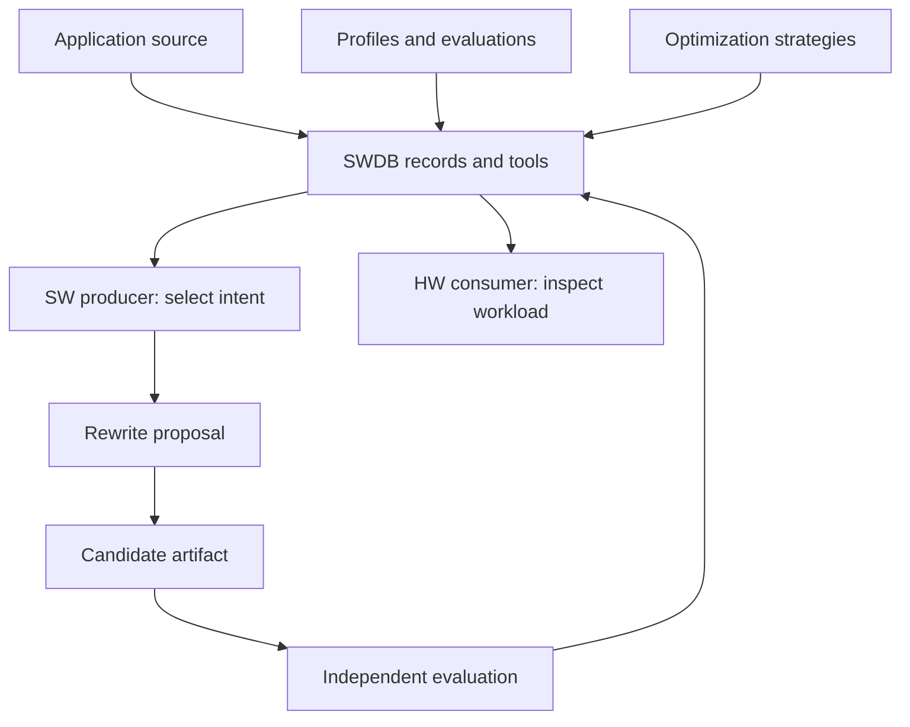
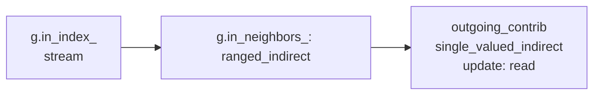
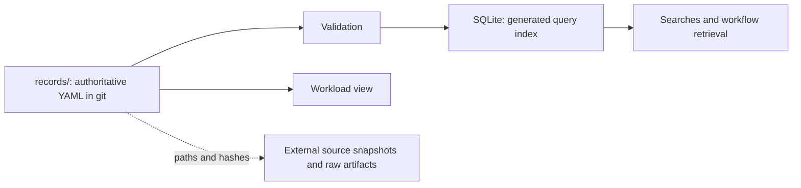

# 1. Understand EvolveSWDB in 10 minutes

Updated: 2026-09-30 (Eastern Time).

[Tutorial](README.md) · Next: [Records and queries](02-records-and-queries.md)

EvolveSWDB is ArchEvolve's Software Database: its `swdb` command validates and
queries records connecting code, memory behavior, optimization strategies, and
evaluation evidence. It exists so a proposed change can be traced to its source,
requirements, and results. Follow the PageRank example below, then continue to
[records and queries](02-records-and-queries.md).

## Follow the information flow



SW means software; HW means hardware. A producer selects the change; a rewrite
provider edits source; an evaluator checks the result. Breadth-first search
(BFS) has this workflow. Checked-in handoffs use labeled test clients; live
collaborator integration is not established by those examples.

## Five ideas to learn first

| Idea | Meaning | Example |
|---|---|---|
| **Application** | A program from a specific source version | The pinned GAPBS source |
| **Kernel** | A computation identified by what it computes and its correctness check | PageRank, `gapbs-pr` |
| **Implementation** | Code that realizes a kernel | `gapbs-pr-gs` and `gapbs-pr-jacobi` |
| **Access pattern** | A chain of array-access steps, ending at the array read or updated | Reading neighbors' PageRank contributions |
| **Optimization strategy** | A reusable change described by its target and effect | Packing indirect reads into a contiguous array |

Implementations of one kernel can have different memory behavior and still
pass its correctness check. A strategy holds no executable code. A **candidate
artifact** is proposed source whose correctness still needs evaluation.

## Follow one access through real code

The Jacobi PageRank implementation contains this loop, reproduced from
[`pr_spmv.cc`](../../records/implementations/gapbs-pr-jacobi/pr_spmv.cc):

```cpp
for (NodeID v : g.in_neigh(u))
  incoming_total += outgoing_contrib[v];
```

To read `outgoing_contrib[v]`, the program first finds vertex `u`'s neighbor
range, walks its neighbor IDs, then uses each ID to read a contribution:



This is one access pattern with three **steps**. Its pattern class is
`stream > ranged_indirect > single_valued_indirect : read`. The final array is
read; the local sum does not turn that array access into an add-update.

Packing can replace the final indirect read with a stream. It also adds a pass
to gather and store values. The query below checks recorded preconditions;
evaluation must establish whether the change works and repays that extra work.

## Try the first queries

Run commands inside `ArchEvolve/swdb-project/`. From the ArchEvolve root,
start with `cd swdb-project`. Python 3.12+, PyYAML 6+, and jsonschema 4.10+ are
required by [pyproject.toml](../../pyproject.toml). Optional setup:

```sh
python3 -m venv .venv
source .venv/bin/activate
python3 -m pip install -e .
```

Inspect stored records:

```sh
# Check record structure, references, source excerpts, and domain rules.
python3 -B -m swdb validate

# Find indirect reads in PageRank implementations.
python3 -B -m swdb find --kernel gapbs-pr --shape ranged_indirect --update read

# Ask which strategies fit the Jacobi gather.
python3 -B -m swdb strategies --pattern gapbs-pr-jacobi/gather-contrib

# Export the retained historical workload view from stored records.
python3 -B -m swdb view gapbs-pr-gs kron-g16-k16 mbit10
```

The strategy query includes `packing` with `outcome: legal` in the inspected
records. Read the accompanying `check_by_hand`: gathered values must remain
unchanged while the packed copy is used, and reuse must justify the extra work.
Here, `legal` means the encoded checks passed. It is not a speed prediction or
a completed correctness check of newly written code.

`view` joins source, patterns, input sizes, machine details, and a stored profile.
It preserves basis and unknowns. It exports the historical SPARTA 0.1 format
retained by [view.py](../../swdb/view.py); it does not establish a current HW
consumer contract or run PageRank.

## Where the information lives



Edit and review YAML, then regenerate the index. The default index is
`build/swdb.sqlite`; query commands refresh it when stale. The `view` command
validates and reads YAML directly. Large build outputs, graphs, and raw run data
stay outside git on their producing host; records retain their identities and
locations.

[`records/`](../../records/) holds facts; [`swdb/`](../../swdb/) implements
behavior. [`schemas/`](../../schemas/) and [`vocab/`](../../vocab/) define accepted
fields and terms. Chapter 3 maps the remaining components.

## Read results without losing their meaning

Every fact has a **basis**: measured, simulated, read from code, reported,
inferred, or unknown. Unknown stays `null`, never silently becomes false.
Cachegrind cache counts are simulated even when collected from a real process.

For BFS, a performance comparison additionally needs an explicit **comparison
baseline**, matching workload and hardware identities, a declared **region of
interest (ROI)**, passed correctness, and a frozen comparison policy. The source
you rewrote does not automatically select the baseline you compare against.
Compiling successfully and collecting a complete package are intermediate
outcomes, each with a narrower meaning than a qualified gain.

**Checkpoint:** A legal strategy satisfies recorded checks. A successful
implementation and a qualified gain need their own evaluation evidence.

**[Next: records, evidence, and queries →](02-records-and-queries.md)**
