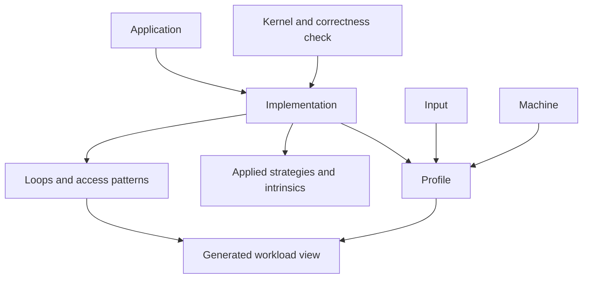

# 2. Read records and ask useful questions

Updated: 2026-10-07 (Eastern Time). Reading budget: 7 minutes.

[Tutorial](README.md) · [Previous](01-overview.md) · [Next](03-components.md)

## Records form a connected model

IDs connect records independently of filenames. Access patterns and loops are
nested inside implementation records. This diagram shows the catalog's main
relationships; an arrow means “describes or links to,” not a SQL foreign-key
declaration.



Learn record groups by purpose; optional references cover every field:

| Purpose | Record kinds | Question answered |
|---|---|---|
| Identify computation and code | `application`, `kernel`, `implementation` | What computes what, from which source? |
| Describe ordinary runs | `input`, `machine`, `profile` | What data, host, build, observations, and correctness? |
| Describe reusable changes | `strategy`, `intrinsic` | What could change, and which instruction set architecture (ISA) wrapper could implement it? |
| Bind proposed source | `source_snapshot`, `proposal`, `candidate` | What exact code was seen, requested, and produced? |
| Bind execution | `workload`, `protocol`, `evaluation`, `evaluation_pair` | Which graph/sources, policy, stage outcomes, and paired trial order? |
| Explain and assess execution | `region_profile`, `profile_package`, `comparison_result` | Where was work observed, what was handed off, and what comparison passed? |
| Describe a target interface | `hardware_target`, `operation` | Which model/backend and source-backed accelerator operations? |
| Estimate and qualify time | `workload_characterization`, `target_description`, `estimate`, CPU calibration/validation/error records | What work was counted, what model applies, and what error is established? |
| Retain research/evidence custody | `certification`, `review`, `campaign_summary`, `paired_estimate`, `agreement_policy`, `agreement_report`, `team_claim`, `retention` | Which tests, reviews, research comparisons, and artifacts support reuse? |

Typed-library entries live in `library/`, outside the record envelope. SQLite
indexes their normative content and derived evidence state separately. LANL's
main database is not connected; the [crosswalk](../compatibility/README.md) is
validated compatibility metadata, not an import.

A BFS `workload` binds graph representations and ordered traversal sources. A
**workload view** exports the retained historical SPARTA 0.1 format.
They serve different purposes.
Likewise, a `machine` identifies the physical host; a `hardware_target` can
identify the simulated system running on it.

## Read the envelope, then the evidence

The [envelope schema](../../schemas/envelope.schema.json) requires `kind`,
`schema_version`, `id`, `status`, creation/update dates, and `provenance`.
The envelope accepts versions `0.2`, `0.3`, and `0.4`; individual
kinds have additional restrictions. Version `0.3` adds strategy/intrinsic support,
and `0.4` adds explicit implementation source context and workflow records.
Historical records retain their version's interpretation.

For example, this is an abbreviated fragment of the
[Jacobi implementation](../../records/implementations/gapbs-pr-jacobi.yaml),
not a complete record to submit:

```yaml
loop_carried_dependencies:
  value: false
  basis: code_reading
  evidence_refs: [src-gapbs-pr-spmv]
```

The provenance ID resolves within that same record. The source explanation says
the contribution array is filled before the vertex loop and read during it.
Read-only sharing between threads remains sharing; it does not require atomic
updates. Record semantics for the actual access expression and loop context.

| Basis | How to interpret the value |
|---|---|
| `code_reading` | Supported by identified source |
| `measured` | Observed through real execution |
| `simulated` | Produced by a machine/cache model |
| `estimated` | Analytic time bound from counted work and target parameters |
| `reported` | Stated by a cited source |
| `inferred` | Derived using an explained rule |
| `unknown` | Not established; `value` must be `null` |

Also inspect units, threads, input, tool, and scope. Whole-run counts can include
setup that ROI counts exclude. `complete` does not replace correctness or
per-part outcomes. An estimate's `null` total leaves component bounds visible.
Functional-target correctness is distinct from hardware-target correctness.

## Query from broad to specific

Run inside `ArchEvolve/swdb-project/` (`cd swdb-project` from the monorepo root):

```sh
# Every access pattern in a returned implementation must meet this requirement.
python3 -B -m swdb implementations gapbs-pr \
  --require loop_carried_dependencies=false

# Loop strategies consider patterns in this loop and its children.
python3 -B -m swdb strategies --loop gapbs-pr-jacobi/vertex

# Input strategies describe changes such as vertex reordering.
python3 -B -m swdb strategies --input gapbs-pr-jacobi

# Retrieve the complete strategy record as JSON.
python3 -B -m swdb get packing --format json
```

The first query includes `gapbs-pr-jacobi` in the inspected catalog. Known
contradictions make a strategy `illegal`; missing required semantic facts make
it `undetermined`. `check_by_hand` survives even a `legal` result.
`find --strategy packing` omits illegal matches but can retain undetermined ones.

Use SQL when you need a custom projection. For example, inspect the exact
PageRank chain without printing the whole implementation:

```sh
python3 -B -m swdb sql "
  SELECT position, array_name, address_shape
  FROM steps
  WHERE implementation = 'gapbs-pr-jacobi' AND pattern = 'gather-contrib'
  ORDER BY position"
```

Expected rows are `g.in_index_`, `g.in_neighbors_`, and `outgoing_contrib`, in
that order. Dedicated tables support common catalog joins. The `records.json`
column also retains every record kind, including workflow records:

```sh
python3 -B -m swdb sql "
  SELECT id, json_extract(json, '$.outcome.state') AS state
  FROM records WHERE kind = 'evaluation' ORDER BY id LIMIT 5"
```

Some semantic/property columns contain JSON text, so compare `'false'`,
`'true'`, and `'null'` as documented, checking the associated basis. Use
[`database.md`](../reference/database.md) for exact columns.

The typed-library tables include `library_entries`, `library_dependencies`,
`library_clauses`, `library_pattern_keys`, and `library_pattern_key_steps`.
`get contract.bfs_read_offload --format json` returns normative content with its
hash, current tier/status, and review attribution. A shared tier is a review
decision; certification and target evaluation are separate evidence states.

## What the tools preserve

`get ID --chain` traverses supported relationships to expose linked source,
proposal, candidate, evaluation, and other records. It does not make remote raw
files available. Package queries separately report current evidence validation;
an old package can remain sealed while a later check finds unavailable evidence.

Extensa records carry `mode: extensa` and `campaign` from creation; tags cannot
be rewritten. Retrieval preserves historical records, while new team evidence
commands enforce their mode and provenance boundaries.

`implementations --applies STRATEGY` retains a historical ancestry-based pairing
interface. `compare` instead selects exact ordinary profiles and an explicit
baseline, but returns a diagnostic ratio with `gain_claim: false`. BFS's frozen
evaluation comparisons are covered in [chapter 4](04-bfs-workflow.md).

**Checkpoint:** Find the basis before using a value, and identify which input,
source, target, and timing scope make it meaningful.

**[Next: how the components work together →](03-components.md)**
