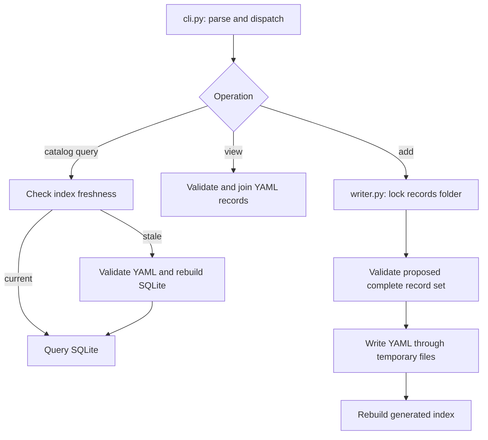

# 3. Find your way through the components

Updated: 2026-09-30 (Eastern Time). Reading budget: 7 minutes.

[Tutorial](README.md) · [Previous](02-records-and-queries.md) · [Next](04-bfs-workflow.md)

EvolveSWDB lives in `ArchEvolve/swdb-project/` and provides a Python CLI package.
A catalog query needs no database server. External compilers, profiling tools, rewrite providers, and
simulators enter through specific execution paths.

## Follow a query and a write

For `find`, `strategies`, and `implementations`, the CLI checks whether the
generated database matches the records directory, file fingerprint, and builder
code. A stale index triggers validation and rebuilding. Workflow retrieval uses
`db.query_store()` to load one indexed snapshot. `view` validates and loads YAML
directly for its historical SPARTA 0.1 export.

The writer validates the resulting record set before writing and replaces each
file through a temporary file. This is not a multi-file database transaction.
Workflow persistence commits metadata before indexing; if index generation
fails, it reports that the durable record survived. Rebuild the index after
fixing the cause rather than resubmitting an already-used record ID.

## Catalog components

Follow these links to verify behavior:

| Component | Responsibility and entry points |
|---|---|
| [CLI](../../swdb/cli.py), [module entry](../../swdb/__main__.py) | Parse commands, dispatch, emit results; [package metadata](../../pyproject.toml) defines dependencies |
| [Paths](../../swdb/paths.py), [YAML I/O](../../swdb/yamlio.py), [store](../../swdb/store.py) | Locate resources, reject duplicate YAML keys, keep dates as text, index IDs, resolve application/source context |
| [Validation](../../swdb/validate.py), [schemas](../../swdb/schemas.py), [vocabularies](../../swdb/vocab.py), [rules](../../swdb/rules.py), [problems](../../swdb/problems.py) | Check fields, terms, references, and source; report file/field/reason |
| [Database](../../swdb/db.py), [writer](../../swdb/writer.py) | Build/query SQLite; lock and validate record additions; preserve agent authorship |
| [Strategy](../../swdb/strategy.py), [ISA](../../swdb/isa.py) | Target/effect identity, three-state legality, intrinsic requirements, compiler flags, machine support |
| [Formulas](../../swdb/formula.py), [view](../../swdb/view.py), [profile comparison](../../swdb/comparison.py) | Evaluate array-size formulas, join HW output, compare exact ordinary profile pairs |
| [Machine capture](../../swdb/machine.py), [ordinary profiler](../../swdb/profile.py) | Capture host facts; build/check/time code, collect footprints/index features/Cachegrind, retain profile outcomes |

JSON Schema checks fields and types; vocabularies control terms. Python rules
check relationships, formulas, excerpts, and strategy identity.

## Source, rewrite, and native BFS components

| Component | Responsibility |
|---|---|
| [Artifacts](../../swdb/artifacts.py), [workflow](../../swdb/workflow.py) | Hash/copy/verify source, protect evaluator inputs, retain submissions and candidates, expose linked history |
| [Rewrite](../../swdb/rewrite.py), [capabilities](../../swdb/capabilities.py) | Interpret selected intent through bounded providers; check target operation requirements before accepting edits |
| [Provider adapters](../../swdb/provider_adapters.py), [workspace](../../swdb/provider_workspace.py), [guard](../../swdb/provider_guard.py), [audit](../../swdb/provider_audit.py) | Pin settings, derive visible inputs, confine sessions, audit actions, compute permitted edits |
| [Native evaluator](../../swdb/bfs_native.py), [paired collector](../../swdb/bfs_native_pair.py) | Build candidates, check timed results, retain trials and paired schedules |
| [Discovery](../../swdb/bfs_discovery.py), [profiling](../../swdb/bfs_profiling.py) | Discover functions/loops from compiler information, instrument regions, collect timing and modeled memory observations |
| [Protocol](../../swdb/bfs_protocol.py), [SG reader](../../swdb/sg_stream.py) | Identify graphs, freeze policies, check bindings, aggregate/compare evaluations |
| [Packages](../../swdb/profile_package.py), [region comparison](../../swdb/bfs_region_comparison.py) | Assemble exact-context handoffs, match strategies in both directions, compare diagnostic region observations |
| [Acceptance report](../../swdb/bfs_coverage.py), [handoff](../../swdb/handoff.py) | Reconstruct required evidence cells; render versioned messages from retained records |
| [Host observations](../../swdb/host_observation.py), [processes](../../swdb/processes.py) | Capture bounded host-condition receipts; terminate evaluator-owned process groups |

[`tools/bfs_native/`](../../tools/bfs_native/) supplies trusted drivers and graph
identity support. [`tools/bfs_profile/`](../../tools/bfs_profile/) supplies
instrumentation runtimes.

## DX100 components

DX100 adds a simulated hardware target, separate from the physical host.

| Component | Responsibility |
|---|---|
| [DX100 orchestration](../../swdb/dx100.py), [candidate adapter](../../swdb/dx100_candidate.py), [author adapter](../../swdb/dx100_author.py) | Run bounded stages, compile candidates, preserve the author's ROI |
| [Checkpoint](../../swdb/dx100_checkpoint.py), [inputs](../../swdb/dx100_inputs.py) | Bind checkpoint compatibility and verified serialized-input aliases |
| [Profile](../../swdb/dx100_profile.py), [diagnostics](../../swdb/dx100_diagnostic.py) | Read exact statistics intervals/clocks and collect source-region observations |
| [Coverage](../../swdb/dx100_coverage.py), [witness](../../swdb/dx100_witness.py) | Check observed accelerator traces and bounded completion/correctness evidence |
| [Resources](../../swdb/dx100_resources.py) | Observe owned process-group resident memory during bounded jobs |

`dx100_witness` evidence is not itself a normal-process-termination oracle.
Accelerator coverage needs observations from execution; source support alone
cannot establish that the accelerator ran.

## Supporting repository areas

| Area | Purpose |
|---|---|
| [`apps/`](../../apps/) | Pinned source copies; `PROVENANCE.md` explains their coverage |
| [`tools/index_features/`](../../tools/index_features/) | Graph index-stream features in a declared visit order; generator ordering needs a matching compiler/library |
| [`scripts/`](../../scripts/) | Campaign drivers, fixture checks, recovery helpers, and lane wrappers; dated requests have specific prerequisites |
| [`tests/`](../../tests/) | Software behavior and failure contracts; fixtures are not performance evidence |
| [`.scratch/`](../../.scratch/) | Specs, tickets, requests, and checkpoints |
| [Reference](../reference/README.md) / [archive](../archive/README.md) | Contracts / historical investigations |

## CLI map

| Task | Commands |
|---|---|
| Inspect/store catalog | `validate`, `build`, `sql`, `find`, `implementations`, `strategies`, `get`, `view`, `add` |
| Ordinary profiling | `capture-machine`, `profile`, `recompute-cachegrind`, `compare` |
| Prepare/rewrite source | `source-snapshot`, `baseline-candidate`, `fixture-package`, `submit`, `repair`, `capabilities` |
| Bind/evaluate BFS | `register-workload`, `freeze-protocol`, `evaluate`, `evaluate-pair`, `dx100-build`, `dx100-compile`, `dx100-execute` |
| Profile/package BFS | `bfs-profile`, `bfs-hotspots`, `dx100-profile`, `profile-package`, `profile-strategies`, `strategy-regions` |
| Assess/communicate | `aggregate-evaluations`, `compare-evaluations`, `bfs-coverage`, `handoff-message` |

Use `python3 -B -m swdb COMMAND --help` for arguments. Exit codes are 0 for
command success, 1 for a failed check/command, and 2 for usage errors. A
successful reporting command still requires reading the reported outcome.

**[Next: walk through BFS from source to comparison →](04-bfs-workflow.md)**
