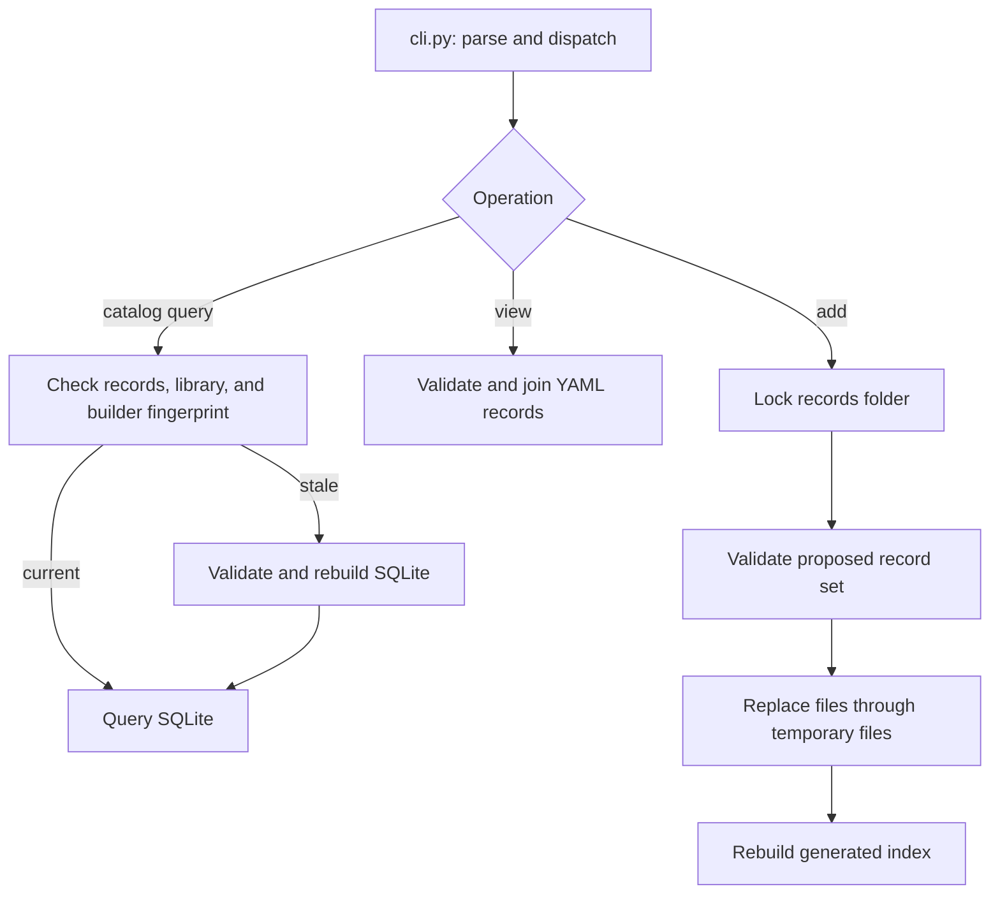

# 3. Find the component that owns your task

Updated: 2026-10-07 (Eastern Time). Reading budget: 7 minutes.

[Tutorial](README.md) · [Previous](02-records-and-queries.md) · [Next](04-bfs-workflow.md)

EvolveSWDB is a Python command-line interface (CLI) in `ArchEvolve/swdb-project/`.
Queries need no database server. This map locates code for inspection or extension.

## Follow a query and a write

`find`, `strategies`, and `implementations` refresh a stale index. Workflow
retrieval uses `db.query_store()` for a validated indexed snapshot. `view` reads
YAML directly. The fingerprint includes typed-library files as well as records.

The writer validates the resulting record set before writing. Replacement is
atomic per file, not a multi-file transaction. Workflow persistence writes
metadata before indexing; an index failure reports that the durable record
survived. Fix the cause and rebuild instead of resubmitting its ID.

## Catalog and access

| Owner | Responsibility |
|---|---|
| [CLI](../../swdb/cli.py), [entry point](../../swdb/__main__.py) | Parse, dispatch, emit results; [pyproject.toml](../../pyproject.toml) declares dependencies |
| [Access](../../swdb/access.py), [store](../../swdb/store.py), [YAML I/O](../../swdb/yamlio.py) | Read research records and read-only index connections; resolve IDs/source context; reject duplicate YAML keys |
| [Validation](../../swdb/validate.py), [rules](../../swdb/rules.py) | Combine [schemas](../../schemas/), [vocabularies](../../vocab/), and cross-record/source checks |
| [Database](../../swdb/db.py), [writer](../../swdb/writer.py) | Generate catalog/library tables; lock, validate, and persist record changes |
| [Strategy](../../swdb/strategy.py), [ISA](../../swdb/isa.py) | Check typed effects, three-state legality, intrinsic requirements, and machine support |
| [View](../../swdb/view.py), [formulas](../../swdb/formula.py), [comparison](../../swdb/comparison.py) | Historical workload export, size/count formulas, ordinary profile ratios |
| [Machine](../../swdb/machine.py), [profiler](../../swdb/profile.py) | Host capture, build/check/time, footprints, index features, separate Cachegrind diagnostics |

The [crosswalk validator](../../swdb/crosswalk.py) checks compatibility metadata
against a standalone schema. It does not connect to or import LANL's database.
That future adapter belongs behind `access.py`.

## Source, contracts, and execution

| Owner | Responsibility |
|---|---|
| [Artifacts](../../swdb/artifacts.py), [workflow](../../swdb/workflow.py) | Retain exact source/proposals/candidate artifacts, protect evaluator inputs, retrieve linked history |
| [Library](../../swdb/library.py), [certification](../../swdb/certification.py), [library operations](../../swdb/library_operations.py) | Validate normative entries and pins; derive tier/status from current receipts; test contracts and negative controls |
| [Rewrite](../../swdb/rewrite.py), [provider roles](../../swdb/provider_roles.py) | Interpret intent; launch role-specific inputs and closed output schemas |
| [Adapters](../../swdb/provider_adapters.py), [workspace](../../swdb/provider_workspace.py), [guard](../../swdb/provider_guard.py), [audit](../../swdb/provider_audit.py) | Pin settings, restrict visible inputs, confine and audit real sessions |
| [Kernel registry](../../swdb/kernels/), [native BFS](../../swdb/bfs_native.py), [native BC](../../swdb/bc_native.py) | Select supported kernel adapters and correctness checks; BC means betweenness centrality |
| [Paired collector](../../swdb/bfs_native_pair.py), [protocol](../../swdb/bfs_protocol.py) | Prospective trial order, graph/workload identity, frozen timed policy and comparisons |
| [Profiling](../../swdb/bfs_profiling.py), [packages](../../swdb/profile_package.py) | Source-region observations, exact-context package assembly and strategy queries |
| [Coverage](../../swdb/bfs_coverage.py), [handoff](../../swdb/handoff.py) | Evidence matrices and versioned messages from retained records |
| [Retention](../../swdb/retention.py), [preflight](../../swdb/dispatch_preflight.py) | Claims/pruning receipts and bounded execution resource admission |

Trusted drivers and instrumentation live in [`tools/`](../../tools/).
Normative contracts and pinned buildable code live in [`library/`](../../library/).
Certification is finite testing of exact content, not a formal proof.

## Estimates and research loops

| Owner | Responsibility |
|---|---|
| [Team policy](../../swdb/archevolve.py) | Reject gem5 execution dependencies and research estimator variants in new ArchEvolve operations |
| [Analytic entry](../../swdb/analytic.py), [LLVM pass](../../swdb/llvm/) | Compile source, count normalized operations/accesses, retain characterization, estimate time |
| [Mechanism models](../../swdb/analytic_models.py), [composition](../../swdb/analytic_composition.py) | Apply target-described resource bounds; preserve structural unknowns and explicit overlap premises |
| [Estimate protocol](../../swdb/estimate_protocol.py), [parameter filling](../../swdb/estimation_parameters.py) | Freeze exact identities; fill only supported numerical unknowns with separately labeled estimated facts |
| [Functional evaluation](../../swdb/functional_evaluation.py) | Join current strict-functional certification with a frozen estimate; record functional-target correctness |
| [CPU calibration](../../swdb/cpu_calibration.py), [service calibration](../../swdb/cpu_service_calibration.py), [error bands](../../swdb/cpu_error_band.py) | Native rate/service receipts, compatibility gates, held-out error qualification |
| [Campaign](../../swdb/campaign.py), [site finder](../../swdb/site_finder.py), [Extensa boundary](../../swdb/extensa_boundary.py) | Budgeted research iterations, contract/site selection, certification-first ranking and promotion boundaries |
| [DX100](../../swdb/dx100.py), [profiling](../../swdb/dx100_profile.py), [witness](../../swdb/dx100_witness.py) | Extensa simulated stages, clock/interval interpretation, accelerator/completion observations |
| [Paired estimates](../../swdb/extensa_pairing.py), [agreement](../../swdb/extensa_agreement.py) | Retain research estimates and timed-observation identities under a prospective policy; unsupported bridges stay unknown |

[`tests/`](../../tests/) establish software behavior; fixtures are not performance
evidence. [`scripts/`](../../scripts/) contain checks and dated campaign drivers.
[`.scratch/`](../../.scratch/) retains tickets and evidence receipts.

## Choose a CLI entry point

Run inside `ArchEvolve/swdb-project/`. These groups are a map, not a launch sequence.

| Task | Commands |
|---|---|
| Query/store | `validate`, `build`, `sql`, `find`, `strategies`, `implementations`, `get`, `view`, `add` |
| Propose source | `source-snapshot`, `baseline-candidate`, `submit`, `repair` |
| Check contracts | `certify`, `candidate-level`, `promote`, `correct-review` |
| Estimate | `characterize`, `fill-target-parameters`, `freeze-protocol`, `estimate`, `evaluate-functional` |
| Time/profile | `profile`, `evaluate`, `evaluate-pair`, `bfs-profile`, `profile-package` |
| Research | `campaign`, `campaign-export`, `agreement-freeze`, `agreement-report` |
| Report | `compare-evaluations`, `bfs-coverage`, `handoff-message` |

Use `python3 -B -m swdb COMMAND --help` for exact arguments. Exit codes are
0 for command success, 1 for failure, and 2 for usage errors. A successful report
query can still describe incomplete evidence or an inconclusive result.

**[Next: follow source through the supported workflows →](04-bfs-workflow.md)**
