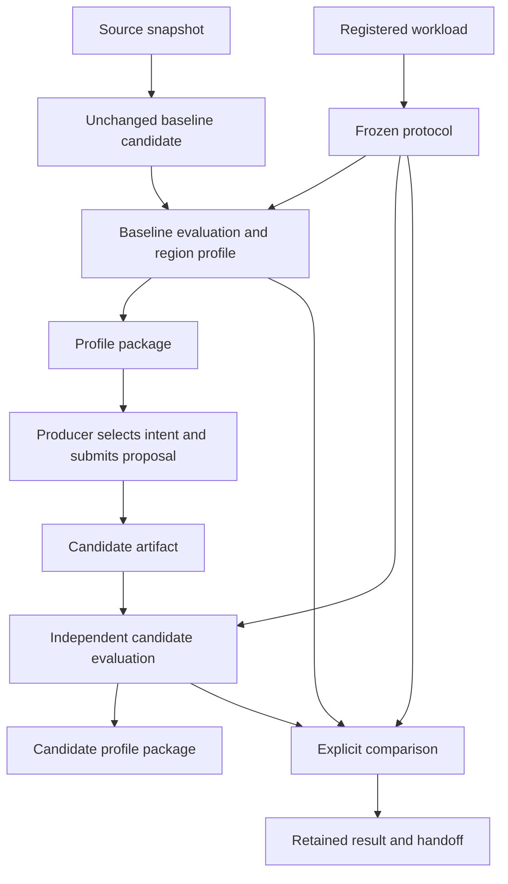
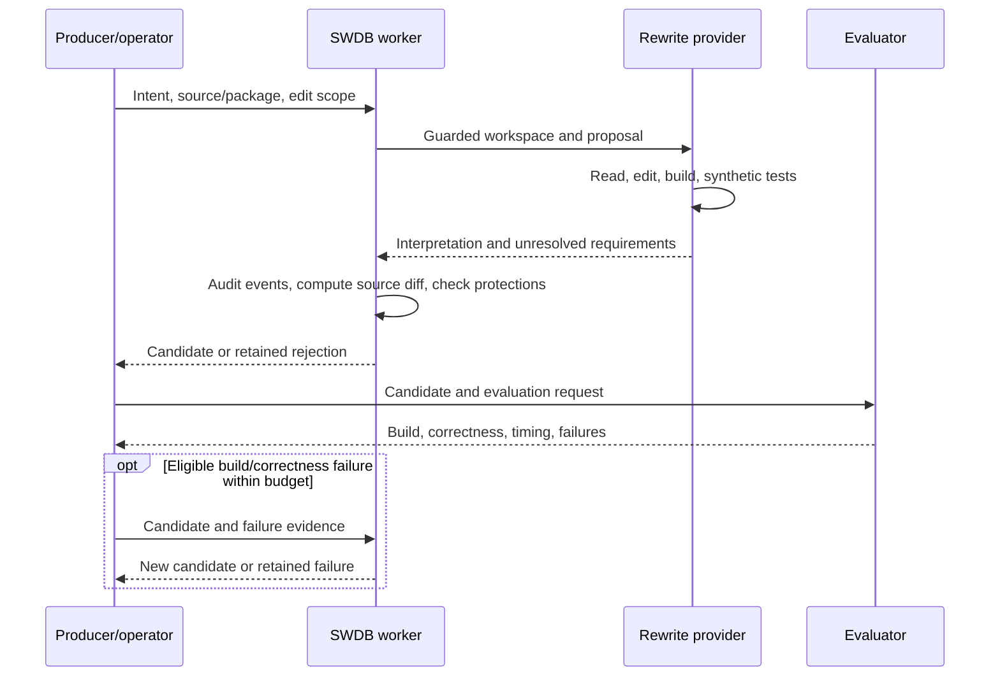

# 4. Follow BFS from source to comparison

Updated: 2026-09-29 (Eastern Time). Reading budget: 9 minutes.

[Tutorial](README.md) · [Previous](03-components.md) · [Next](05-contributing.md)

Breadth-first search (BFS) finds vertices reachable from a starting vertex and
their distance in graph edges. Its parent array identifies the traversal tree.
EvolveSWDB's BFS workflow tracks changes to this computation while keeping the
graph, correctness check, timing boundaries, and comparison policy explicit.

## One kernel, multiple source contexts

The upstream direction-optimizing implementation `gapbs-bfs-do` and DX100 scalar
top-down implementation `dx100-bfs-scalar` share kernel `gapbs-bfs`. Their
application source, build, and evaluator contexts differ. Format `0.4`
implementations name those contexts explicitly; older catalog records resolve
historical defaults through their kernel.

Three links answer three questions: `source_ancestor` identifies code ancestry,
`source_baseline` identifies the application's baseline implementation, and
`comparison_baseline` identifies the selected performance comparator. Keeping
them separate allows a candidate derived from one source to be assessed against
an independently selected implementation of the same computation.

## The evidence chain



The diagram shows a qualified comparison path. Diagnostic evaluations can also
run without a frozen protocol, but cannot establish a gain. Pilot measurements
inform protocol selection; subsequent comparison evidence must match the freeze.

1. **Identify source.** `source-snapshot` retains a buildable source manifest,
   hashes, context, regions, and evaluator protections. `baseline-candidate`
   materializes unchanged source without inventing a patch.
2. **Identify workload and policy.** `register-workload` checks graph
   representations against canonical adjacency. An ordered source-vertex list
   matters as well as graph identity. `freeze-protocol` seals workload and
   comparison settings; changing them requires a new protocol.
3. **Evaluate and profile.** Native evaluation retains the exact build, primary
   ROI timing, and independent parent-array checks. Discovery/profiling records
   functions, loops, diagnostic timing, and dynamic-memory observations.
4. **Assemble a package.** `profile-package` joins matching source, evaluation,
   regions, workload, target, threads, and ROI. Missing observations produce
   explicit incompleteness reasons. Assembly versions retain earlier handoffs.
5. **Rewrite selected intent.** A producer selects source regions and a change.
   The worker retains the original request and creates a candidate, rejection,
   or unresolved result. Rewritten source needs its own evaluation and package.
6. **Compare and report.** Exact baseline/candidate evaluations are compared
   under the frozen policy. The report distinguishes evidence availability,
   correctness, coverage, and profitability.

## Who controls a rewrite?

The proposal can carry natural language, structured instructions, annotated
source, or a supplied patch. Structured instructions still require interpretation;
they are not a deterministic rewrite language. A proposal names the snapshot,
package, selected regions, intent, permitted files, and required operations.



The operator must select `--provider-config` independently of proposal text.
Workspace mode is the default, with two pinned real providers:

| Kind | Model | Effort |
|---|---|---|
| Codex (default) | `gpt-5.6-sol` | `xhigh` |
| Claude | `claude-sonnet-5-5` | `high` |

A minimal provider configuration is `kind: codex`; `kind: claude` selects the
alternative. Model and effort overrides are rejected. Real sessions run on
mbit10 under SWDB's Landlock guard, using one CPU within a verified owned socket
lane. The provider
can explore and edit the derived source workspace, while evaluator inputs,
real workloads, records, and other candidates remain hidden. Its structured final
response contains only `interpretation` and `unresolved`. SWDB audits the events
and computes the source diff; it drops build outputs and rejects out-of-scope
files. The login copy is deleted after the attempt.

The provider tree, including the external tracer, is limited to 16 aggregate
threads and 32 GiB resident memory, with 120 seconds per tool command and a
5 GiB workspace. Claude shell commands receive an inner no-TCP guard. Codex
commands inherit the outer TCP-443 policy; connection and event audits enforce
model-API-only use. The [worker contract](../reference/bfs-rewrite-worker.md)
details Codex's verified native launch, read-only SQLite fallback, disabled
customizations, and the retained UDP/login-readability limitations. These controls
and a completed provider turn do not establish correctness or a gain.

DX100 from-scratch proposals use
`bfs-dx100-scalar-only-20260929-a1.source`, which omits the authors' accelerator
BFS functions. The full source remains available for declared author-code reuse.
Set `workspace: false` for the retained prompt-only patch or complete-file route.
Deterministic providers are labeled fixtures and establish contract behavior.
Generation/repair limits, actual model settings, guard policy, event audit, and
raw-log identity are retained with the proposal. Evaluator-owned verifier,
input, driver, and ROI protections remain enforced.

A valid regression does not trigger tuning. A bounded repair addresses eligible
build/correctness failures while preserving the submitted intent and first
attempt's provider settings. Usage limits become `provider_unavailable`, consume
elapsed time, and leave the repair count unchanged. Unsupported
requirements and exhausted budgets remain visible outcomes.

## Inspect a retained example locally

This example retrieves a real retained proposal record; it does not resubmit it
or invoke a provider:

```sh
python3 -B -m swdb get \
  bfs-campaign-preparation-20260925-a1.dx100-patch --chain --format json

python3 -B -m swdb handoff-message rewrite_proposal \
  bfs-campaign-preparation-20260925-a1.dx100-patch --format json
```

The [rendered example](../bfs-handoff-examples/rewrite-proposal.sw-patch.json)
records selected changes including dynamic scheduling with chunks of 64 vertices
and removal of a redundant parent store after successful compare-and-swap. Read
the original intent, `payload`, editable files, handling attempts, and candidate
link together. It is labeled a representative SW test-client submission.

Compare the [completed evaluation message](../bfs-handoff-examples/evaluation-result.dx100-patch-kronecker.json)
with the [interrupted evaluation message](../bfs-handoff-examples/evaluation-result.dx100-patch-uniform-interrupted.json).
An interrupted measurement is distinct from an incorrect candidate. The example
manifest describes the completed case's frozen comparison as inconclusive; a
completed run is not automatically a qualified gain.

## Native and simulated execution answer different questions

| Path | Primary evidence | Additional checks |
|---|---|---|
| Native BFS | Wall time for the declared computational ROI | Exact timed result, structural correctness, build/source/workload identities, lane/environment |
| Native region profiling | Diagnostic function/loop timing and modeled memory events | Attribution coverage, instrumentation, event consistency; these do not replace primary ROI timing |
| DX100 simulation | ROI ticks interpreted using recorded simulator frequency/configuration | Model/binary/checkpoint/input identity, verifier/completion evidence, observed accelerator work |

The native `bfs.complete_call.v1` boundary preserves the complete computation
call. The pinned DX100 author's internal ROI has different boundaries. Compare
only evidence admitted by the relevant protocol; do not divide durations from
different scopes or mix host execution cost with simulated target time.

DX100's pipeline includes model build, candidate compilation, compatible
checkpoint selection, bounded execution, and profile collection. A `.sg` suffix
alone does not make graph files interchangeable: the pinned sources use
different offset widths. A simulator exit also does not by itself establish that
the timed result passed its correctness check.

Accelerator assessment needs observed instructions and completed unit traces.
Full-tile, tail-tile, and competing-parent cases are separate coverage questions.
Hardware operation records describe support; they cannot substitute for these
observations.

## What makes a comparison admissible?

A frozen protocol binds workload/sources, repetitions, target configuration,
thread count, build/instrumentation, ROI, verifier, and profitability policy.
Simulator comparisons additionally bind model/runtime identities. Native paired
collection records prospective interleaved A/A or A/B trials, where A/A assesses
repeatability and A/B compares selected candidates. Simulator aggregation checks
the required trial coverage before comparison.

`compare-evaluations` retains the compatibility and decision evidence.
`bfs-coverage` reconstructs the requested evidence matrix and acceptance checks.
Keep package completeness, passed correctness, accelerator coverage, raw-file
verification, and a qualified performance decision separate. A remote artifact
that cannot be checked locally remains `remote_unverified`.

For a dated report regeneration command, use the
[BFS task guide](../bfs-handoff.md#final-report-regeneration--2026-09-27).
Its exit code reports whether the query succeeded; read `gain_gate`, per-cell
states, and reasons to assess the result. The campaign's dated
[resume checkpoint](../../.scratch/bfs-rewrite-evaluation-2026-09-25/resume.md)
is the place to review execution state before any continuation.

**[Next: contribute records and understand profiling →](05-contributing.md)**
