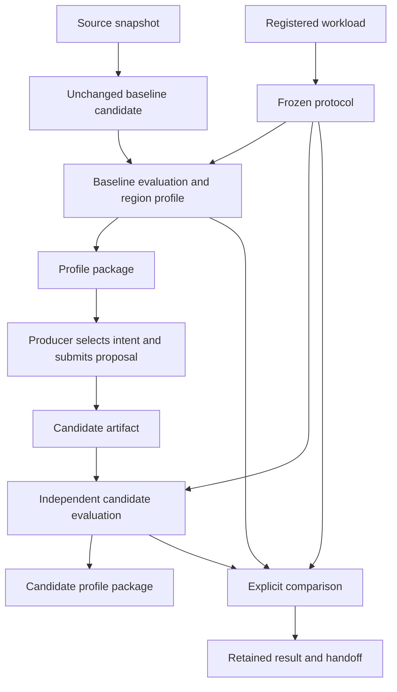
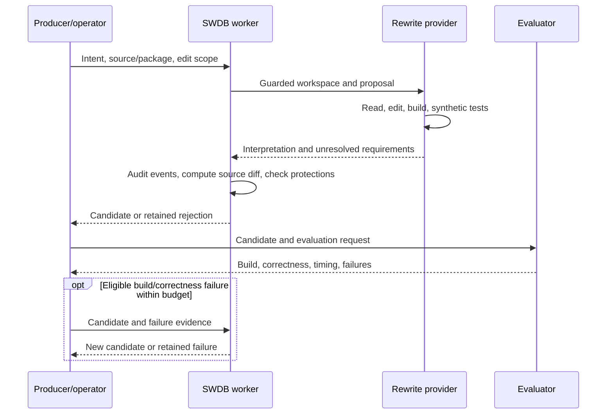

# 4. Follow BFS from source to comparison

Updated: 2026-09-30 (Eastern Time). Reading budget: 9 minutes.

[Tutorial](README.md) · [Previous](03-components.md) · [Next](05-contributing.md)

Breadth-first search (BFS) finds vertices reachable from a starting vertex and
their distance in graph edges. Its parent array identifies the traversal tree.
EvolveSWDB's BFS workflow tracks changes to this computation while keeping the
graph, correctness check, timing boundaries, and comparison policy explicit.

## One kernel, multiple source contexts

The upstream direction-optimizing implementation `gapbs-bfs-do` and DX100 scalar
top-down implementation `dx100-bfs-scalar` share kernel `gapbs-bfs`. Their
application source, build, and evaluator contexts differ. Format `0.4`
implementations name those contexts explicitly; older catalog records resolve
historical defaults through their kernel.

`source_ancestor` identifies ancestry; `source_baseline` identifies the application's
baseline; `comparison_baseline` selects the performance comparator. A candidate
can be compared against a different implementation of the same kernel.

## The evidence chain



The diagram shows a qualified comparison path. Diagnostic evaluations can also
run without a frozen protocol, but cannot establish a gain. Pilot measurements
inform protocol selection; subsequent comparison evidence must match the freeze.

1. **Identify source.** `source-snapshot` retains a buildable source manifest,
   hashes, context, regions, and evaluator protections. `baseline-candidate`
   materializes unchanged source without inventing a patch.
2. **Identify workload and policy.** `register-workload` checks graph
   representations against canonical adjacency. An ordered source-vertex list
   matters as well as graph identity. `freeze-protocol` seals workload and
   comparison settings; changing them requires a new protocol.
3. **Evaluate and profile.** Native evaluation retains the exact build, primary
   ROI timing, and independent parent-array checks. Discovery/profiling records
   functions, loops, diagnostic timing, and dynamic-memory observations.
4. **Assemble a package.** `profile-package` joins matching source, evaluation,
   regions, workload, target, threads, and ROI. Missing observations produce
   explicit incompleteness reasons. Assembly versions retain earlier handoffs.
5. **Rewrite selected intent.** A producer selects source regions and a change.
   The worker retains the original request and creates a candidate, rejection,
   or unresolved result. Rewritten source needs its own evaluation and package.
6. **Compare and report.** Exact baseline/candidate evaluations are compared
   under the frozen policy. The report distinguishes evidence availability,
   correctness, coverage, and profitability.

## Who controls a rewrite?

Proposals carry natural language, structured instructions, annotated source, or
a patch, plus source/package identity, regions, intent, editable files, and
required operations. Instructions still require provider interpretation.



The operator must select `--provider-config` independently of proposal text.
Workspace mode is the default, with two pinned real providers:

| Kind | Model | Effort |
|---|---|---|
| Codex (default) | `gpt-5.6-sol` | `xhigh` |
| Claude | `claude-sonnet-5-5` | `high` |

Use `kind: codex` or `kind: claude`; model/effort overrides are rejected. Real
sessions run on mbit10 under SWDB's Linux Landlock guard, using one CPU in an
owned socket lane. Evaluator inputs, workloads, records, and other candidates
are hidden. The final response contains `interpretation` and `unresolved`;
SWDB audits events, computes permitted source edits, discards build outputs,
and deletes the login copy.

The [guard](../../swdb/provider_guard.py) bounds the process tree and audits
connections. The [event audit](../../swdb/provider_audit.py) rejects forbidden
file access, package managers, network commands, and incomplete logs. Guards have
recorded limitations, including unrestricted UDP and a readable login copy during
the session. The optional [worker contract](../reference/bfs-rewrite-worker.md)
explains limits and enforcement. A completed provider turn still needs evaluation.

DX100 from-scratch proposals use the scalar-only snapshot
`bfs-dx100-scalar-only-20260929-a1.source`; full source supports declared author-code
reuse. `workspace: false` selects the retained prompt-only route. Deterministic
providers are fixtures. Proposals retain settings, budgets, guard/audit receipts,
and log identity; verifier, input, driver, and ROI protections still apply.

[Repair](../../swdb/workflow.py) addresses eligible build/correctness failures,
keeping the intent, provider kind/model/effort, and fixture-versus-real
classification. Missing historical model settings cannot be invented. A valid
regression does not trigger tuning. A failed provider session with usage-limit
evidence becomes `provider_unavailable`; it consumes elapsed time without using a
repair attempt. Unsupported requirements and exhausted budgets remain visible.

## Inspect a retained example locally

From `ArchEvolve/swdb-project/`, retrieve a retained test-client proposal:

```sh
python3 -B -m swdb get \
  bfs-campaign-preparation-20260925-a1.dx100-patch --chain --format json

python3 -B -m swdb handoff-message rewrite_proposal \
  bfs-campaign-preparation-20260925-a1.dx100-patch --format json
```

The [rendered example](../bfs-handoff-examples/rewrite-proposal.sw-patch.json)
requests dynamic scheduling and removal of a redundant parent store. Read its
intent, payload, editable files, attempts, and candidate link together.

Compare the [completed evaluation message](../bfs-handoff-examples/evaluation-result.dx100-patch-kronecker.json)
with the [interrupted evaluation message](../bfs-handoff-examples/evaluation-result.dx100-patch-uniform-interrupted.json).
Interruption differs from incorrectness. The completed example's comparison is
inconclusive; completion alone does not establish a gain.

## Native and simulated execution answer different questions

| Path | Primary evidence | Additional checks |
|---|---|---|
| Native BFS | Wall time for the declared computational ROI | Exact timed result, structural correctness, build/source/workload identities, lane/environment |
| Native region profiling | Diagnostic function/loop timing and modeled memory events | Attribution coverage, instrumentation, event consistency; these do not replace primary ROI timing |
| DX100 simulation | ROI ticks interpreted using recorded simulator frequency/configuration | Model/binary/checkpoint/input identity, verifier/completion evidence, observed accelerator work |

The native `bfs.complete_call.v1` boundary preserves the complete computation
call. The pinned DX100 author's internal ROI has different boundaries. Compare
only evidence admitted by the relevant protocol; do not divide durations from
different scopes or mix host execution cost with simulated target time.

DX100 needs model build, compilation, compatible checkpoints, execution, and
profiling. Its pinned sources use different serialized-graph offset widths;
a `.sg` suffix does not establish compatibility. Simulator exit alone does not
establish correctness.

Accelerator assessment needs observed instructions and completed unit traces.
Full-tile, tail-tile, and competing-parent cases are separate coverage questions.
Hardware operation records describe support; they cannot substitute for these
observations.

## What makes a comparison admissible?

A frozen protocol binds workload/sources, repetitions, target configuration,
thread count, build/instrumentation, ROI, verifier, and profitability policy.
Simulator comparisons additionally bind model/runtime identities. Native paired
collection records prospective interleaved A/A or A/B trials, where A/A assesses
repeatability and A/B compares selected candidates. Simulator aggregation checks
the required trial coverage before comparison.

`compare-evaluations` retains the compatibility and decision evidence.
`bfs-coverage` reconstructs the requested evidence matrix and acceptance checks.
Keep package completeness, passed correctness, accelerator coverage, raw-file
verification, and a qualified performance decision separate. A remote artifact
that cannot be checked locally remains `remote_unverified`.

For a dated report regeneration command, use the
[BFS task guide](../bfs-handoff.md#final-report-regeneration--2026-09-27).
Its exit code reports whether the query succeeded; read `gain_gate`, per-cell
states, and reasons to assess the result. Later T17 comparison records report
`gain` for [Kronecker](../../records/comparison_results/bfs-t17-handoff-20260929-a1.kronecker18.yaml)
and [uniform-random](../../records/comparison_results/bfs-t17-handoff-20260929-a1.uniform18.yaml)
workloads. Their attribution is `joint_hardware_software`: the candidate changes
both source and accelerator presence. These retained decisions have that scope;
this local documentation review does not reverify remote raw files. The dated
[resume checkpoint](../../.scratch/bfs-rewrite-evaluation-2026-09-25/resume.md)
describes the older campaign; consult newer requests before continuing execution.

**[Next: contribute records and understand profiling →](05-contributing.md)**
