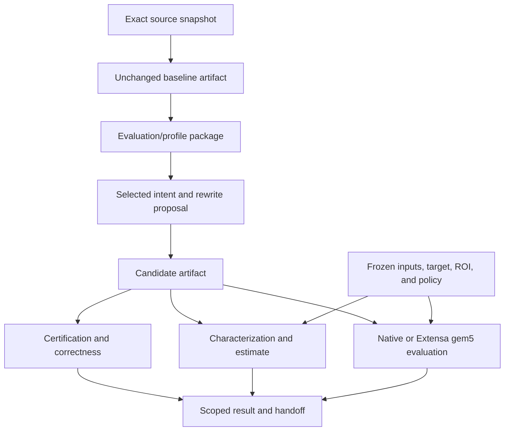

# 4. Follow BFS through rewrites and evidence

Updated: 2026-10-07 (Eastern Time). Reading budget: 9 minutes.

[Tutorial](README.md) · [Previous](03-components.md) · [Next](05-contributing.md)

Breadth-first search (BFS) finds reachable vertices and their distance from a
starting vertex. Its parent array describes the traversal tree. SWDB keeps source,
graph, traversal sources, correctness scope, and speed evidence bound together.

## Choose the mode before collecting evidence

| Mode | Speed evidence | Correctness and selection |
|---|---|---|
| ArchEvolve, the default | Analytic estimates; native CPU timing remains available for validation | One proposal with bounded build/correctness repair. Functional-target checks where hardware cannot execute; no gem5 execution/calibration dependencies |
| Extensa research | Native timing or gem5; paired estimates assess agreement | Budgeted rewrite/certify/evaluate iterations. Rank certification first, then qualified performance, separately per workload class |

[Team policy](../../swdb/archevolve.py) checks dependency records before new
operations. Explicit research commands use `--mode extensa --campaign ID`, with
a valid Extensa campaign ID; campaign execution sets these tags itself. Historical
simulator records remain valid and retrievable. They cannot become new team evidence
by omitting their mode or relabeling their basis.

## Bind source, workload, and policy

Upstream direction-optimizing `gapbs-bfs-do` and DX100 scalar top-down
`dx100-bfs-scalar` share kernel `gapbs-bfs`. Their application source, build, and
evaluator contexts differ. Format `0.4` names these explicitly; older records
resolve historical defaults through their kernel.

`source_ancestor` describes ancestry. `source_baseline` names the application's
baseline. `comparison_baseline` selects the comparator, which may be another
implementation of the same kernel. Rewriting one source does not select that
comparison automatically.



The last branches are alternatives according to mode, not a requirement to run
every evaluator. ROI means **region of interest**, the computation boundary whose
work or time is assessed. Diagnostic profiles do not replace that boundary.

1. **Retain source.** `source-snapshot` records buildable source, hashes, regions,
   context, and protections. `baseline-candidate` copies it unchanged.
2. **Identify input.** `register-workload` checks graph representations against
   canonical adjacency and retains an ordered source-vertex list.
3. **Freeze policy.** `freeze-protocol` seals identities and settings. Estimated
   protocols additionally pin the target description, input arguments, dependencies,
   and estimator source bundle. Changes require a fresh freeze.
4. **Assemble context.** `profile-package` joins matching source, evaluation,
   regions, workload, target, threads, and ROI. Missing observations leave explicit
   incompleteness reasons. Later versions retain earlier handoffs.
5. **Rewrite and check.** Submit intent, permitted files, required operations, and
   source/package identity. Retain the candidate artifact or rejection. Apply
   certification and the relevant kernel check before interpreting speed evidence.
6. **Assess.** Use explicit baseline identities and compatible evidence. Read the
   result's scope, unknowns, and verdict; command completion alone is not a gain.

## A contract gives a rewrite testable obligations

The typed library contains intrinsics, **lowerings** (code implementing an
intrinsic over a hardware interface), library operations, and rewrite contracts.
A contract matches access patterns by role and states applicability, legality,
preservation obligations, and tunable knobs.

Normative entries and code pins live in `library/`. Certification/review records
derive their state. Certification tests exact content and negative controls;
it does not prove arbitrary inputs correct or establish target performance.
Formal clauses currently have label `stated`; no formal verifier grants `proven`.

ArchEvolve proposals that cite a library contract must pin its dependencies and
use current shared certified entries. Experimental entries belong to Extensa.
Candidate certification level is derived from current receipts, not stored as a
mutable assertion. Inspect an existing contract without executing it:

```sh
# Run inside ArchEvolve/swdb-project/.
python3 -B -m swdb get contract.bfs_read_offload --format json
```

## The provider edits; the evaluator judges

The operator selects `--provider-config` independently of proposal text.
Real providers are pinned in [adapters](../../swdb/provider_adapters.py): Codex
`gpt-5.6-sol`/`xhigh` or Claude `claude-sonnet-5-5`/`high`; overrides are refused.
Real roles run on mbit10 in an owned socket lane, with evaluator inputs, workload
data, other candidate artifacts, and authors' accelerated code hidden.

The workspace route confines the process tree, audits events, computes permitted
source edits, writes refreshed same-account login state back under a session lock,
then removes build outputs and the login copy. Its guard has documented
limits, including unrestricted UDP and the readable login copy during a session;
see the optional [worker contract](../reference/bfs-rewrite-worker.md).
Deterministic providers are fixtures. Prompt-only mode is retained separately.

Repair handles eligible build/correctness failures and unavailable providers,
preserving intent and provider settings. A usage-limit failure consumes elapsed
time without a repair attempt. A valid regression triggers no ArchEvolve tuning.
Extensa's performance loop is a separate interface.

## Estimates retain unknowns

`characterize` compiles one C/C++ translation unit with LLVM 22 and runs an
instrumented binary to count work. Registered adapters verify source/input/trial
binding; arbitrary source hashes alone leave application binding unverified.
Counts are observations of work, not hardware-target time.

`estimate` combines the characterization with a **target description**, whose
mechanism models and parameters describe hardware behavior. It retains
`basis: estimated`, known component bounds, and missing facts. Unknown required
costs, unsupported access mechanisms, or unspecified resource overlap leave the
total `null`. For trial characterizations, it estimates each whole call and takes
the median; diagnostic region medians need not sum to that result.

`fill-target-parameters` can freeze supported numerical unknowns as estimated
facts. It cannot supply missing source coverage, mechanisms, or composition
premises. Estimates require a matching frozen protocol; a source-bundle change
requires a fresh one. Without applicable error qualification, a ratio does not
establish a qualified gain. See [analytic inputs](../reference/format-v0.4-analytic.md)
for the optional runnable fixture and supported adapters.

For source-only DX100 targets, `evaluate-functional` joins current strict-functional
execution certification with a frozen estimate. It retains
`correctness_scope: functional-target`, no performance timing, and
`hardware_correctness_claim: false`. Its handoff uses version 1.1.

## Timed research evidence has its own gates

Native evaluation retains exact timed results, independent parent-array checks,
build/source/input identities, trials, and environment. Paired collection orders
A/A repeatability or A/B comparisons prospectively. Native `bfs.complete_call.v1`
and the DX100 author's internal ROI have different boundaries.

Extensa gem5 needs compatible model/binary/checkpoint/input identities and observed
accelerator/completion evidence. Simulator exit and source-level operation support
do not establish correctness. Full-tile, tail-tile, and competing-parent cases
are separate coverage questions.

`campaign` applies declared iteration, lane-hour, provider-call, and disk budgets.
Native campaigns gate each workload class on an A/A pilot under their frozen
speed rule. Failed classes remain `baseline_unstable`; rules are not loosened
mid-run. Non-promoted evidence stays in the campaign store; the summary also
enters the repository record store. Export retains tags. Promotion requires a
recorded review and fresh evaluation under a derived team protocol; team policy
still applies to its dependencies.

Current campaign pairing has no verified complete-call application adapter;
real paired-estimate seconds stay `null`. Fixture agreement tests do not establish
measured application agreement or enable screening.

## Read a historical handoff without reinterpreting it

```sh
python3 -B -m swdb get \
  bfs-campaign-preparation-20260925-a1.dx100-patch --chain --format json
```

The [proposal example](../bfs-handoff-examples/rewrite-proposal.sw-patch.json)
requests dynamic scheduling and removal of a redundant store. Its completed
[evaluation example](../bfs-handoff-examples/evaluation-result.dx100-patch-kronecker.json)
is inconclusive. Later T17 [Kronecker](../../records/comparison_results/bfs-t17-handoff-20260929-a1.kronecker18.yaml)
and [uniform](../../records/comparison_results/bfs-t17-handoff-20260929-a1.uniform18.yaml)
records retain `gain` with attribution `joint_hardware_software`: both source
and accelerator presence changed. These historical decisions do not establish
hardware-only gain or authorize a new ArchEvolve gem5 handoff.

Package completeness, correctness, accelerator coverage, raw-file availability,
and profitability remain separate. Locally unavailable remote artifacts remain
`remote_unverified`; this reading path does not reverify them.

**[Next: contribute records and choose a profiling procedure →](05-contributing.md)**
